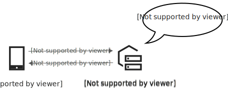
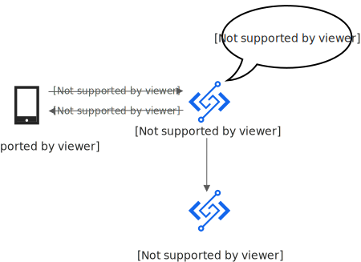
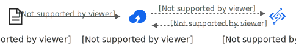
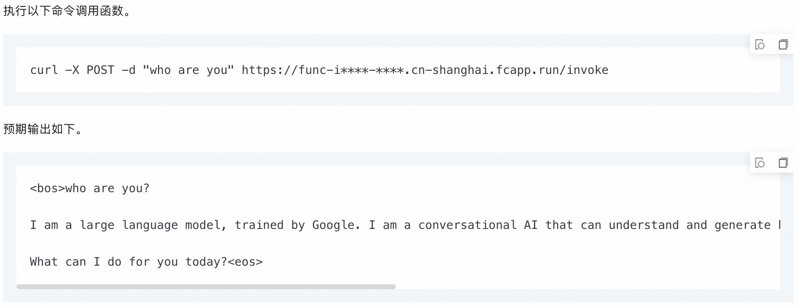
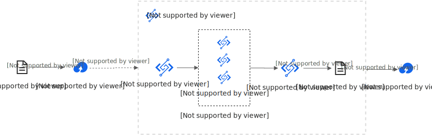

# 什么是函数计算

函数计算（Function Compute，简称FC）是一种事件驱动的全托管计算服务，开发者无需管理服务器等基础设施，只需编写并上传代码，函数计算便会自动准备计算资源，并以弹性、可靠的方式运行代码。

函数计算默认按照资源使用量计费，根据函数配置的规格与使用时长的乘积计算资源使用量，仅在需要时分配资源并能及时释放。更多关于计费的信息，请参见[计费概述](https://help.aliyun.com/zh/functioncompute/fc/product-overview/billing-overview-of-fc)。

## 视频介绍

### 什么是函数计算

函数计算可用于快速构建任何类型的应用和函数，且只需为任务实际消耗的资源付费。

<video controls src="https://help-static-aliyun-doc.aliyuncs.com/file-manage-files/zh-CN/20241017/hxfjuy/%E9%98%BF%E9%87%8C%E4%BA%91%E5%87%BD%E6%95%B0%E8%AE%A1%E7%AE%97.mp4" poster="../../../../assets/zh-CN/2511874-001-412c052845.jpg" title="什么是函数计算"></video>

### 什么是Serverless

相对于Serverful，Serverless可以让业务人员无需关注服务器，仅聚焦于业务逻辑代码，并支持按实际使用付费。

<video controls src="https://help-static-aliyun-doc.aliyuncs.com/file-manage-files/zh-CN/20240122/szwiwv/0530-serverless科普.mp4" poster="../../../../assets/zh-CN/2511874-002-412c052845.jpg" title="什么是函数计算"></video>

## **与传统计算资源的区别**

在一个传统的“客户端-服务器”模型中，不论是否有请求，服务器都始终开启并运行服务。

而函数计算遵循Serverless（无服务器）架构，只有在请求到达时才执行函数，并能及时释放函数实例。这样，只需为实际消耗的资源付费，且无需再管理服务器。

## **函数计算能做什么**

| **应用场景** | **为什么使用函数计算** | **示例** |
| --- | --- | --- |
| ### 构建Web应用 函数计算提供开箱可用的流行Web应用模板，可用于快速构建、迭代Web应用。随着业务进一步扩展，也可使用日志查询、性能监控和报警等功能，确保Web应用高效、可靠地运行。 | 函数计算具有高度的弹性，非常适合突发流量的Web应用场景，例如秒杀大促。 | 可使用Flask框架模板创建函数，在模板基础上高效地开发Web应用代码。或将现有Web应用迁移至Web函数。更多信息，请参见[使用Web函数快速创建一个Web应用](https://help.aliyun.com/zh/functioncompute/fc/web-function-quick-start)。 |
| ### 实时数据处理 基于事件驱动，函数计算可以通过HTTP请求、OSS、消息队列等自动触发。例如，使用OSS触发函数计算以实时处理上传的文件；或组织多个函数、消息队列和数据库来采集物联网的海量数据。当场景变化时，可通过修改事件触发、集成新的组件来适配应用，而无需大量更改业务代码。 | 函数计算可以与阿里云多个产品集成，轻松搭建事件驱动架构，适用于各种数据处理场景。 | 使用函数计算可自动对上传至OSS的ZIP文件进行解压。更多信息，请参见[使用函数计算实现自动解压上传到OSS的ZIP文件](https://help.aliyun.com/zh/functioncompute/fc/use-cases/use-function-compute-to-automatically-decompress-zip-files-uploaded-to)。  |
| ### AI模型服务 在AI模型训练完成后，对外提供推理服务时，可使用函数计算，通过将数据模型包装在调用函数中，在用户实际请求到达时再运行代码。 | 函数计算的GPU实例使开发者无需关心底层GPU基础设施，能完全聚焦于业务本身，极大地简化了业务的实现路径。 | 通过使用LLM容器镜像和GPU函数，快速部署一个对话机器人应用。更多信息，请参见[基于函数计算低成本部署Google Gemma模型服务](https://help.aliyun.com/zh/functioncompute/fc/use-cases/low-cost-deployment-of-google-gemma-model-service-based-on-function)。  |
| ### 音视频处理 通过结合函数计算和云工作流，在可视化界面上编排业务流程。 与传统方案相比，性能、成本和工程效率都有显著优势。 | 函数计算可在短时间内拉起大量计算资源，非常适合图片、音视频等重计算场景。 | 通过定义工作流，可实现多个函数的并行调度，从而构建一个高性能的视频转码系统。更多信息，请参见[构建基于Serverless架构的弹性高可用音视频处理系统](https://help.aliyun.com/zh/functioncompute/fc/use-cases/build-an-elastic-and-highly-available-audio-and-video-processing-system-in-a-serverless-architecture)。  |

## **如何使用函数计算**

可参考以下快速入门教程，了解[函数计算控制台](https://fcnext.console.aliyun.com)的操作以及函数计算的开发流程。

- [使用Web函数快速创建一个Web应用](https://help.aliyun.com/zh/functioncompute/fc/web-function-quick-start)
- [使用事件函数处理云服务产生的事件](https://help.aliyun.com/zh/functioncompute/fc/use-event-functions-to-handle-oss-file-upload-events)

除了控制台，也可通过下列方式使用函数计算。

- 通过Serverless Devs工具使用函数计算，更多信息，请参见[什么是Serverless Devs](https://help.aliyun.com/zh/functioncompute/fc-3-0/developer-reference/what-is-serverless-devs)。
- 通过[API](https://www.aliyun.com/getting-started/what-is/what-is-api)或[SDK](https://www.aliyun.com/getting-started/what-is/what-is-sdk)使用函数计算。更多信息，请参见[SDK参考](https://help.aliyun.com/zh/functioncompute/fc/developer-reference/sdk-reference-20230330)。
