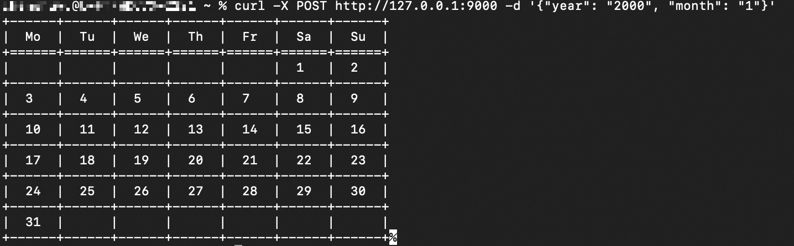
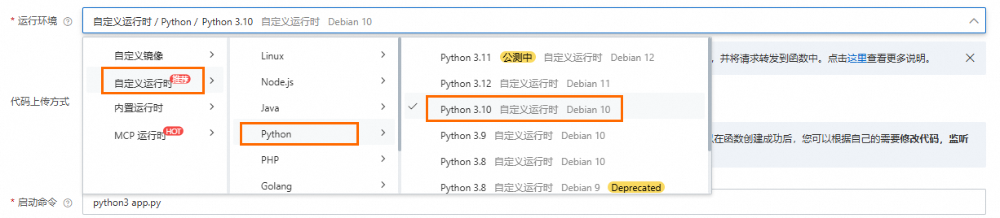
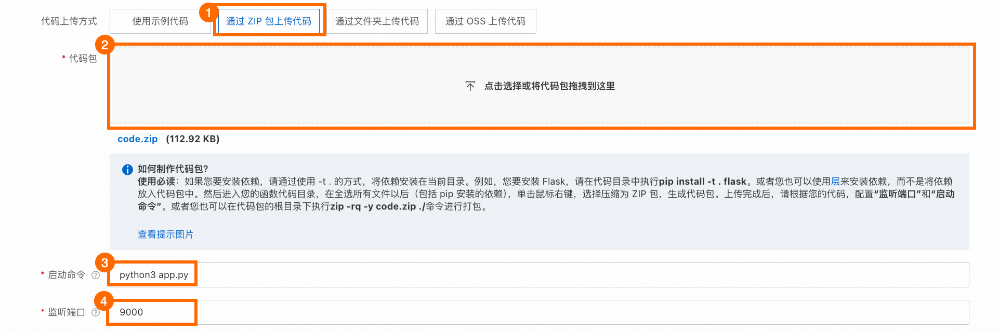
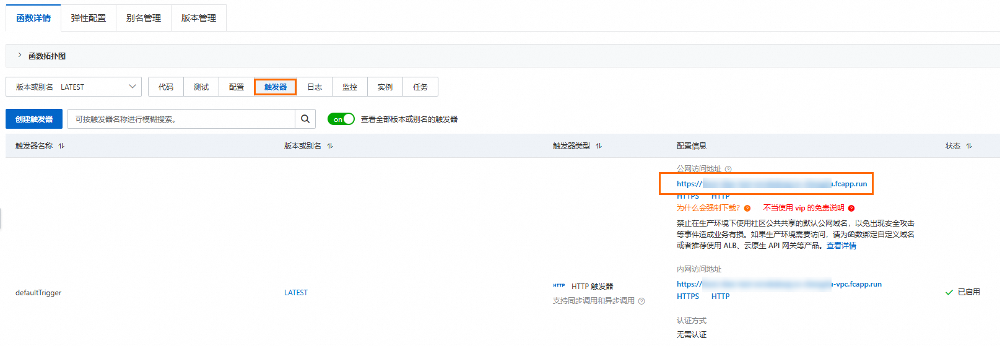
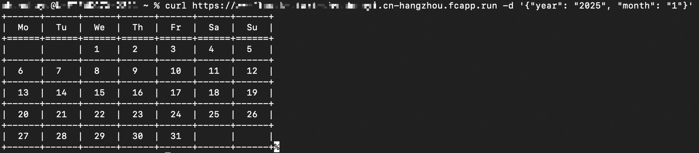

# 使用Web函数快速创建一个Web应用

您可以通过函数计算的Web函数轻松构建Web应用和API服务。Web函数兼容多种流行语言的Web框架（如Java SpringBoot、Python Flask和Node.js Express等），因此您可以快速迁移现有应用。函数计算会为您管理底层计算资源，当通过浏览器或URL访问服务时，系统将根据需求自动启动和扩展实例；无访问时则自动销毁实例，您只需为实际资源使用量付费。

## **创建Web函数操作概述**

通过本文您将了解如何使用函数计算的Web函数部署一个Flask应用，整体流程如下：

1. **开发及测试Web应用**：在本地使用示例代码创建项目，编辑并测试API代码，确保API功能正常。如果您希望迁移现有应用，可以跳过此步骤。
2. **生成代码包**：安装必要的依赖库到本地的项目目录，然后将项目打包为一个ZIP文件，用于部署至函数计算。
3. **上传并部署应用**：配置函数创建参数，然后上传代码包，完成函数创建。
4. **测试Web函数**：调用Web函数以验证Flask应用的运行情况。

## **前提条件**

注册阿里云账号

注册阿里云账号并完成实名认证。具体信息，请参见[账号注册（PC端）](https://help.aliyun.com/zh/account/ali-cloud-account-registration-process#topic-2149078)。

开通函数计算服务

如果您是2024年08月27日之后注册的阿里云账号并完成实名认证，无需开通可直接使用函数计算产品。首次登录[函数计算控制台](https://fcnext.console.aliyun.com/)，还可以根据界面提示领取一定额度的免费资源包，详情请参见[试用额度](https://help.aliyun.com/zh/functioncompute/fc/product-overview/trial-quota-1#3a513884ff9ve)。

2024年08月27日之前注册的阿里云账号请参见以下步骤开通服务。

1. 访问[函数计算首页](https://www.aliyun.com/product/fc)。
2. 单击管理控制台，跳转至开通服务页面，单击**立即开通**即可开通服务并进入[函数计算控制台](https://fcnext.console.aliyun.com/)。
  
  **
  
  **说明**
  
  - 建议您使用阿里云账号开通服务，并使用RAM用户管理函数等应用。您可以按照最小授权原则为RAM用户授予业务所需权限策略，具体请参见[权限策略及示例](https://help.aliyun.com/zh/functioncompute/fc/policies-and-sample-policies)。
3. （可选）首次登录[函数计算控制台](https://fcnext.console.aliyun.com)，需要在弹出的**阿里云服务授权**对话框单击**确定**创建[服务关联角色](https://help.aliyun.com/zh/functioncompute/fc/service-linked-role-of-function-compute)，便于后续使用函数计算访问相关云服务。
  
  创建成功后，函数计算即可访问您的VPC、ECS、SLS及容器镜像服务等云资源。

## **操作指引**

您可以使用以下方式创建Web函数并部署代码。

- 函数计算控制台创建：适用于构建轻量级应用或快速验证等场景，您可以快速创建单个函数。
- Serverless Devs命令行工具创建：适用于管理复杂的生产项目以及自动化部署等场景，您可以使用YAML配置文件管理多个函数及相关云资源，详细信息请参见[快速入门](https://help.aliyun.com/zh/functioncompute/fc/developer-reference/install-serverless-devs-and-docker)。

为了简化操作，本文将详细介绍使用函数计算控制台创建函数的步骤。

### **步骤一：开发及测试Web应用**

**

**说明**

如果您需要迁移现有的Flask应用，您可以跳过此步骤并参考[步骤2：生成代码包](#2fd211b437efx)。

1. 在本地打开一个新的命令行窗口，执行以下命令，将应用所需的`Flask`和`tabulate`依赖库安装到本地环境。
  
  ```
  pip install Flask tabulate
  ```
2. 创建一个名为`code`的文件夹，并在其中新建一个名为`app.py`的文件。将以下示例代码粘贴到该文件中。这段代码实现了一个简单的日历服务并封装成API接口，用户输入年月信息（如2025年1月），API将返回对应的日历表格。
  
  ```
  import calendar from flask import Flask, request from tabulate import tabulate import logging import json logger = logging.getLogger() app = Flask(__name__) @app.route("/", methods=["POST"]) def get_month_calendar(): # 获取请求ID并打印日志 requestId = request.headers.get('x-fc-request-id', '') logger.info("FC Invoke Start RequestId: " + requestId) # 获取请求内容并检查请求格式 data = json.loads(request.stream.read().decode('utf-8')) if not ('year' in data and 'month' in data): message = "Request must be in format like {'year': '1999', 'month': '12'}" return message # 获取日历表格 result = print_calendar(year=int(data['year']), month=int(data['month'])) # 返回前打印函数执行完成的日志 logger.info("FC Invoke End RequestId: " + requestId) return result def print_calendar(year, month): # 获取指定年份和月份的日历矩阵 cal = calendar.monthcalendar(year, month) # 将不属于该月的日期从0转为空字符 cal = list(map(lambda sublist: list(map(lambda x: '' if x == 0 else x, sublist)), cal)) # 创建表头 headers = ["Mo", "Tu", "We", "Th", "Fr", "Sa", "Su"] # 使用tabulate打印日历表格 return tabulate(cal, headers=headers, tablefmt="grid", stralign='center', numalign='center') if __name__ == "__main__": app.run(host='0.0.0.0', port=9000)
  ```
3. 执行`python3 app.py`命令以运行您创建的Flask应用。当输出为`Running on http://127.0.0.1:9000`，表示您的Flask应用成功启动，接下来可以使用cURL命令来测试应用。
  
  ```
  python3 app.py * Serving Flask app 'app' * Debug mode: off WARNING: This is a development server. Do not use it in a production deployment. Use a production WSGI server instead. * Running on http://127.0.0.1:9000 * Running on http://47.100.XX.XX:9000 Press CTRL+C to quit
  ```
4. 打开一个新的终端窗口，使用cURL发送示例请求。如果执行成功，您将得到一个日历表格。
  
  ```
  curl -X POST http://127.0.0.1:9000 -d '{"year": "2000", "month": "1"}'
  ```
  
  

至此本地项目创建和测试完成。

### **步骤二：生成代码包**

您将在本地构建一个适用于函数计算的代码包，代码包中需要包含以下内容：

- Web应用所需的项目文件。
- 如果应用所需的依赖库不在Web函数的运行环境中，则代码包也需要包含这些依赖库。关于Web函数运行环境的内置依赖库，请参见[内置依赖项](https://help.aliyun.com/zh/functioncompute/fc/user-guide/custom-runtime/#b13e42a4fe882)。

1. **安装依赖**：在Web应用的项目根目录，请您运行以下命令，将应用所需的依赖库（示例中为`tabulate`）安装到该目录。完成后，项目根目录下将包含项目文件以及依赖库。
  
  **
  
  **说明**
  
  Python Web函数的运行环境已经包含了`Flask`库，所以安装`tabulate`就可以满足示例应用的需求。
  
  ```
  pip install -t . tabulate
  ```
2. 打包项目根目录下的所有文件。
  
  ## Linux或macOS系统
  
  在项目根目录，执行`zip code.zip -r ./*`。通过此步骤，您将打包项目文件及依赖库至一个ZIP文件，完成代码包的构建。
  
  **
  
  **说明**
  
  请确保您具有该目录的读写权限。
  
  ## Windows系统
  
  进入项目目录，选中所有文件，单击鼠标右键，选择打包为ZIP包。通过此步骤，您将打包项目文件及依赖库至一个ZIP文件，完成代码包的构建。

### **步骤三：创建Web函数并部署代码包**

1. **选择Web函数类型**：登录[函数计算控制台](https://fcnext.console.aliyun.com)，选择**函数管理**>**函数列表**，在页面上方地域列表，选择您需要创建函数的地域，单击**创建函数**，然后根据界面提示选择并创建**Web 函数**。
2. **选择运行环境**：请根据图示选择**自定义运行时**，该运行时内置了Flask框架所需的依赖库。
  
  **
  
  **说明**
  
  - 对于Web函数推荐您搭配**自定义运行时**作为函数运行环境，这是因为**自定义运行时**可以自定义启动命令和监听端口，并且支持单实例多并发。而**内置运行时**则不具备这些特性，该环境更适合用于处理云产品产生的事件。
  - 如果您倾向于容器化部署，也可以使用**自定义镜像**创建Web函数，该环境同样支持单实例多并发，但您需要自行管理依赖。
  - 关于各种运行环境的详细对比，请参见[运行时环境选型](https://help.aliyun.com/zh/functioncompute/fc/user-guide/selection-of-method-to-create-functions#f22f5e9baeylk)。
3. **部署代码包**：请根据图示操作，上传您在[步骤二](#cda5c12efe3l9)中得到的ZIP格式的代码包，并配置启动命令为`python3 app.py`，监听端口为`9000`。如果您是迁移现有的Flask应用，请根据实际的启动命令和端口修改配置（例如Flask的默认端口配置为5000）。
  
  完成后单击**创建**，等待函数创建完成。

### 步骤四：测试函数

1. **获取函数URL**：在新创建函数的详情页面，单击**触发器**页签，然后在目标HTTP触发器的配置信息列获取公网访问地址。
  
  如您在测试环境中，无需鉴权访问，可在创建HTTP触发器时或创建后将其配置信息中**认证方式**改为**无需认证**。
  
  
2. **测试函数**：您可以使用cURL、Postman或任何HTTP客户端调用函数，验证Flask应用的功能。以cURL为例，请在命令行中执行以下示例命令（将地址替换为上一步复制的地址）。
  
  ```
  curl https://******.cn-hangzhou.fcapp.run -d '{"year": "2025", "month": "1"}'
  ```
  
  Web接口将打印2025年1月的日历信息，示例输出如下。
  
  
  
  **
  
  **说明**
  
  - 如果使用默认的HTTP触发器配置，直接执行以上示例命令会报错MissingRequiredHeader，此时如果是测试环境，可以修改触发器的**认证方式**为**无需认证**。
  - 此步骤的示例命令和输出仅适用于示例代码。如果您是迁移现有应用，请根据实际的接口名称和参数调用您的服务，详情请参见[使用cURL测试函数](https://help.aliyun.com/zh/functioncompute/fc/configure-an-http-trigger-for-a-function-and-invoke-the-function-by-using-http-requests#p-d72-t46-eni)。
3. **（可选）通过浏览器访问函数**：HTTP触发器提供的公网访问地址无法用浏览器打开（强制下载），并且只能用于测试环境。推荐您将函数绑定自定义域名，以支持浏览器访问及生产环境使用。详情请参见[配置自定义域名](https://help.aliyun.com/zh/functioncompute/fc/configure-custom-domain-names)。

### **（可选）步骤五：清理资源**

函数计算按照实际资源使用量进行计费，已创建的函数资源如果不使用不会产生费用。但请留意您创建函数资源时关联的其他云产品或资源，例如存储在OSS和NAS的数据、以及创建的触发器等。

如果您需要删除函数，请登录[函数计算控制台](https://fcnext.console.aliyun.com)，单击**函数管理**>**函数列表**，选择地域，在目标函数的**操作**列，单击**删除**，然后在弹出的对话框，确认要删除的函数已无任何触发器等绑定资源后，再次确认删除。

## **进阶操作**

现在您已经创建了一个Web应用并部署至Web函数。您可以根据需求，参考以下进阶操作。

- **通过控制台开发代码：**考虑到您可能希望迁移现有的Web应用到Web函数，本文介绍的是本地开发代码与代码包生成的流程。如果您希望简化部署流程，也可以通过函数计算控制台的WebIDE进行云上开发与实时调试，该方式无需本地生成代码包，适合快速迭代的开发需求，详情请参见[如何使用WebIDE](https://help.aliyun.com/zh/functioncompute/fc/developer-reference/how-to-use-webide)。
  
  **
  
  **说明**
  
  WebIDE仅支持Python、Node.js和PHP语言。对于其他语言（如Java、Go等），仅支持上传编译打包后的ZIP文件或二进制文件。
- **通过应用中心持续部署项目**：如果您希望在云上自动化构建并部署您的代码到函数计算，实现CI/CD，推荐您使用应用中心。具体请参见[将已有的函数计算工程通过应用中心部署实现持续部署](https://help.aliyun.com/zh/functioncompute/use-serverless-application-center-to-implement-ci-cd-on-existing-projects)。
- **配置日志：**为了便于对函数进行调试、排查问题或满足安全审计等需求，建议您为函数配置日志，详细步骤请参见[配置日志功能](https://help.aliyun.com/zh/functioncompute/fc/configure-the-logging-feature-1)。

## **相关文档**

- 推荐您参考以下实践教程，更深入地了解Web函数：
  
  - [使用函数计算部署千问大模型实现AI对话](https://help.aliyun.com/zh/functioncompute/fc/use-cases/use-function-compute-to-realize-ai-dialogue)
  - [使用函数计算快速搭建可视化NAS浏览器应用](https://help.aliyun.com/zh/functioncompute/fc/use-cases/use-function-compute-to-quickly-build-a-visual-nas-browser-application)
  - [0代码，2种方式，一键部署DeepSeek系列模型](https://help.aliyun.com/zh/functioncompute/fc-3-0/use-cases/two-ways-to-quickly-deploy-deepseek-series-models-with-zero-code)
- 关于各语言添加依赖包的步骤，请参见以下文档：
  
  ## Python
  
  [Python 部署代码包](https://help.aliyun.com/zh/functioncompute/fc/user-guide/deploy-a-code-package-1)
  
  ## Node.js
  
  [Node.js 部署代码包](https://help.aliyun.com/zh/functioncompute/fc/user-guide/deploy-a-code-package)
  
  ## Java
  
  [Java 编译部署代码包](https://help.aliyun.com/zh/functioncompute/fc/user-guide/compile-and-deploy-code-packages)
  
  ## Go
  
  [Go 编译部署代码包](https://help.aliyun.com/zh/functioncompute/fc/user-guide/compile-and-deploy-code-packages-in-a-go-runtime)
  
  ## C#
  
  [C# 编译部署代码包](https://help.aliyun.com/zh/functioncompute/fc/user-guide/compile-and-deploy-code-packages-1-2)
  
  ## PHP
  
  [PHP 部署代码包](https://help.aliyun.com/zh/functioncompute/fc/user-guide/deploy-a-code-package-in-a-php-runtime)
