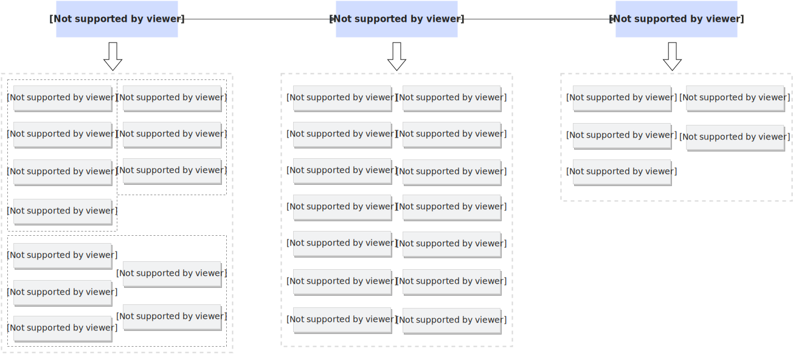

# 基本概念

本文以一个函数创建流程为例，为您介绍每个阶段涉及到的相关概念，方便您系统地了解函数计算。创建函数的具体操作，请参见[使用事件函数处理云服务产生的事件](https://help.aliyun.com/zh/functioncompute/fc/use-event-functions-to-handle-oss-file-upload-events)。

## FC函数创建流程

FC函数是函数计算的资源调度与运行的基本单位。FC函数由函数代码和函数配置构成。下图介绍创建FC函数流程中涉及的概念。

## 创建函数

在创建函数阶段，您可选择函数类型和匹配的运行环境，并上传函数代码到函数计算，其他参数都可在稍后的配置函数阶段根据具体情况配置。

- ### [技术选型指南](https://help.aliyun.com/zh/functioncompute/fc/user-guide/selection-of-method-to-create-functions)
  
  - #### **事件函数**
    
    选择事件触发如OSS触发器、Kafka触发器、SLS触发器等方式，按照函数计算定义的接口编写程序。更多信息，请参见[创建事件函数](https://help.aliyun.com/zh/functioncompute/fc/user-guide/creating-an-event-function)。
  - #### **Web函数**
    
    选择流行Web框架如Flask、ThinkPHP、Express、SpringBoot等，按照框架定义的接口编写程序。更多信息，请参见[创建Web函数](https://help.aliyun.com/zh/functioncompute/fc/user-guide/creating-a-web-function)。
  - #### **任务函数**
    
    选择任务模式处理异步请求，每个任务都将追踪状态且允许手动启停，推荐在定时任务、音视频处理、数据处理等离线场景使用。更多信息，请参见[创建任务函数](https://help.aliyun.com/zh/functioncompute/fc/user-guide/creating-a-task-function)。
  - #### **GPU函数**
    
    选择流行 AI 项目如 Stable Diffusion WebUI、ComfyUI、RAG、TensorRT等方式，推荐以镜像方式部署至函数计算。更多信息，请参见[创建GPU函数](https://help.aliyun.com/zh/functioncompute/fc/user-guide/creating-a-gpu-function/)。
- ### **运行环境**
  
  - #### **内置运行时**
    
    **内置运行时**是函数计算平台预定义的运行环境，必须按照函数计算定义的接口编写请求处理程序。**内置运行时**不支持单实例多并发场景，但冷启动最快，适合在基于事件触发的场景中使用，例如使用OSS 触发器、Kafka 触发器、SLS 触发器等方式。更多信息，请参见[函数计算运行时](https://help.aliyun.com/zh/functioncompute/fc/user-guide/code-development-overview#section-crb-wcw-8j4)。
    
    - ##### **事件（**`**event**`**）**
      
      **事件**数据以 JSON 格式文档的形式传递给您的函数。运行时将事件转换为一个对象，并将该对象传递给函数的入口参数`event`。如果事件由另一项阿里云服务生成，则事件格式取决于生成该事件的服务。更多信息，请参见[触发器event格式](https://help.aliyun.com/zh/functioncompute/fc/user-guide/formats-of-event-for-different-triggers-1#section-0nf-cw0-tzu)。
    - ##### **上下文（**`**context**`**）**
      
      当函数计算运行您的函数时，会将上下文对象传递函数的入口参数`context`。该对象包含有关调用、服务、函数和执行环境等信息。更多信息，请参见[上下文](https://help.aliyun.com/zh/functioncompute/fc/user-guide/context-1)。
  - #### **自定义运行时**
    
    **自定义运行时**支持Flask、ThinkPHP、Express、SpringBoot等主流Web框架，您只需按照框架定义的接口编写程序。针对自定义运行时，您的代码文件ZIP包是一个HTTP Server程序，您只需设置函数配置中的**启动命令**和**启动参数**完成HTTP Server的启动。更多信息，请参见[基本原理](https://help.aliyun.com/zh/functioncompute/fc/user-guide/principles-1#title-f4k-mvw-nly)。
  - #### **自定义镜像**
    
    函数计算提供自定义镜像功能，开发者可以将容器镜像作为函数的交付物。您可将自定义镜像上传至ACR然后使用镜像，或者使用示例镜像。具体操作，请参见[创建自定义镜像函数](https://help.aliyun.com/zh/functioncompute/fc/create-a-custom-container-function-in-a-container-runtime)。
    
    函数计算中，只有自定义镜像支持创建**GPU函数**。
- ### **常驻实例**
  
  购买常驻资源池后，您可以在创建GPU函数时，为函数绑定常驻资源池，[分配常驻实例](https://help.aliyun.com/zh/functioncompute/fc/configure-resident-resource-pool)，使用常驻实例处理请求。
  
  常驻资源池仅适用于GPU函数，采用按月预付费的方式，帮助用户提前锁定稀缺GPU资源，确保业务平稳运行，避免因资源不足而受到影响。
- ### **弹性实例**
  
  弹性实例是指函数计算根据函数的调用量自动进行实例扩缩容，在调用增加时创建实例，在请求减少后销毁实例。整个过程中，通过请求自动触发实例创建。首次发起调用时，需要等待实例冷启动。
- ### **弹性实例（浅休眠（原闲置））**
  
  设置最小实例数≥1后，系统将自动启用浅休眠（原闲置）功能。在此状态下，无请求实例的部分资源将被冻结，仅产生最低保活费用。请求到达时，实例会进入活跃状态，浅休眠（原闲置）状态下冻结的资源快速解冻，热启动效率通常大于2秒（具体时间因模型大小而异）。
  
  以下场景的弹性实例会自动进入弹性实例（浅休眠（原闲置））计费状态：
  
  - 设置最小实例数≥1，处于无请求状态的弹性实例。
  - 会话亲和场景下，实例保活期间的弹性实例。
  - 后台任务场景下，未处理后台任务的弹性实例。
- ### **弹性实例（活跃）**
  
  以下场景的弹性实例会自动进入弹性实例（活跃）计费状态：
  
  - 未设置最小实例数，即默认最小实例缩容到0时，随着请求自动启动的弹性实例。
  - 设置最小实例数≥1后，随着请求到达，进入活跃状态的弹性实例。
  - 会话亲和场景下，处理请求的弹性实例。
  - 后台任务场景下，处理后台任务的弹性实例。
- ### **最小实例数**
  
  通过设置最小实例数≥1可有效解决弹性实例首次处理请求时存在的冷启动问题，并能提前锁定弹性资源保证刚性交付。针对WebSocket、gRPC等业务强依赖会话亲和场景，设置最小实例数≥1能够实现Session亲和调度及长连接保持等，确保高实时交互的稳定性。
  
  还可以通过配置定时伸缩和水位伸缩动态调整最小实例数，即系统指定时间段或指定指标利用率达到一定阈值后提升最小实例数应对负载高峰，并在负载下降到指定值后降低最小实例数，实现资源利用率的最大化。更多信息，请参见[实例伸缩限制及弹性策略](https://help.aliyun.com/zh/functioncompute/fc/user-guide/instance-scaling-restrictions-and-rules)。

## **配置函数**

完成函数创建后，您可能需要根据业务需求调整以下配置项。

- ### 基础配置
  
  - #### **实例规格**
    
    函数计算提供丰富的函数实例规格，您可以根据业务的需要选择不同的规格。更多信息，请参见[实例规格](https://help.aliyun.com/zh/functioncompute/fc/product-overview/instance-types-and-specifications#title-55k-dg6-iou)。
  - #### **临时硬盘**
    
    函数实例提供临时存储磁盘，该磁盘挂载到实例根目录，数据随实例回收自动清除。为了实现文件系统的持久化，建议使用[配置NAS文件系统](https://help.aliyun.com/zh/functioncompute/fc-2-0/user-guide/configure-a-nas-file-system)或[配置OSS文件系统](https://help.aliyun.com/zh/functioncompute/fc-2-0/user-guide/configure-an-oss-file-system)等存储方案。这将确保数据在系统重启或故障后仍然能够被保留，并且可以方便地进行管理和扩展。
    
    **
    
    **说明**
    
    函数计算GPU显存规格整卡（Tesla 系列16GB、Ada 系列48GB）已支持配置30GB、60GB的磁盘规格，其他函数规格仅支持选择512MB 和10GB 两种规格的磁盘。512MB的磁盘规格不收费。
- ### **触发器**
  
  某些阿里云服务可以使用触发器直接调用FC函数。这些服务将事件推送到函数计算，并在指定事件发生时立即调用该函数。更多信息，请参见[触发器简介](https://help.aliyun.com/zh/functioncompute/fc/user-guide/trigger-overview)。
  
  一个函数可配置多个触发器。每个触发器都可以作为一个客户端独立调用您的函数，函数计算传递到您的函数的每个事件仅具有一个触发器的数据。函数计算将事件文档转换为一个对象，并将该对象传递给函数处理程序。
- ### **运行时**
  
  函数计算通过使用运行时支持多种语言。运行时系统提供在执行环境中运行的语言特定环境。运行时在函数计算与函数之间中继调用事件、上下文信息和响应。更多信息，请参见[运行时介绍](https://help.aliyun.com/zh/functioncompute/fc/user-guide/runtime-overview-3)。
- ### **环境变量**
  
  环境变量作为函数配置的一部分，以字符串键值对的方式存储，不同函数拥有独立的环境变量。您可以使用环境变量来调整函数的行为，而无需更新代码。更多信息，请参见[配置环境变量](https://help.aliyun.com/zh/functioncompute/fc/user-guide/environment-variables)。
- ### **层**
  
  层是可以包含其他代码或其他内容的`.zip`文件。层通常包含库、自定义运行时、数据或配置文件。函数计算提供[官方公共层](https://help.aliyun.com/zh/functioncompute/fc/user-guide/official-common-layer-usage-example)供您使用，同时也支持[创建自定义层](https://help.aliyun.com/zh/functioncompute/fc/user-guide/create-a-custom-layer-1)。一般来说，使用层具有以下优势：
  
  - 减小部署包的大小。
    
    将所有函数依赖项放在一个层中，有助于减少函数代码部署包的大小，并加快代码的部署速度。
  - 分离核心函数逻辑与依赖项。
    
    借助层，您无需更新函数代码即可更新函数依赖项，反之亦然。这有助于将二者分离，并帮助您专注于函数逻辑。
  - 在多个函数之间共享依赖项。
    
    您可以将公共函数或依赖项放在层中，并将其添加到账户中任意数量的函数中。如果没有层，则需要在每个单独的部署包中包含相同的依赖项。
  
  **
  
  **说明**
  
  使用[自定义镜像（Custom Container）](https://help.aliyun.com/zh/functioncompute/fc/user-guide/custom-container/)的函数不支持添加层，您可以在[创建自定义镜像函数](https://help.aliyun.com/zh/functioncompute/fc/create-a-custom-container-function-in-a-container-runtime)时打包首选运行时系统、库和其他依赖项到容器映像。
- ### **权限**
  
  为函数配置权限通过配置函数角色来实现，函数计算平台会使用这个RAM角色（Role）来生成访问您的阿里云资源的临时密钥，并传递给您的代码。更多信息，请参见[使用函数角色授予函数计算访问其他云服务的权限](https://help.aliyun.com/zh/functioncompute/fc/grant-function-compute-permissions-to-access-other-alibaba-cloud-services)。
- ### **日志**
  
  函数计算支持与日志服务 SLS（Simple Log Service）进行集成，为函数配置日志后，函数计算会自动收集日志，并把日志投递到指定的日志库。更多信息，请参见[配置日志功能](https://help.aliyun.com/zh/functioncompute/fc/configure-the-logging-feature-1)。
- ### **网络**
  
  创建的函数默认可以访问公网，但无法访问VPC内的资源。如果您需要函数能够访问VPC内的资源，或允许指定的VPC来调用函数，那么需要手动为函数配置网络和权限。更多信息，请参见[配置网络](https://help.aliyun.com/zh/functioncompute/fc/user-guide/configure-network-settings)。
- ### **存储**
  
  函数计算支持挂载挂NAS文件系统和OSS对象存储。更多信息，请参见[配置NAS文件系统](https://help.aliyun.com/zh/functioncompute/fc/configure-a-nas-file-system-for-fc)、[配置OSS对象存储](https://help.aliyun.com/zh/functioncompute/fc/user-guide/configure-an-oss-file-system-1)。
- ### **异步配置**
  
  函数计算支持以任务模式执行异步请求。在任务模式下，函数计算系统会记录您的每个任务在各个阶段的执行状态，提供任务状态查询，任务排队数指标，任务去重，任务主动终止等功能。异步任务适用于长时执行任务。如果您的异步请求处理延时敏感，要求在百毫秒以下，或者您需要持续的每秒数千甚至更高的任务提交速度，那么异步任务模式不太合适。更多信息，请参见[异步调用](https://help.aliyun.com/zh/functioncompute/fc/user-guide/asynchronous-invocation)。
- ### **生命周期**
  
  函数实例会根据实时请求量动态创建或销毁，每个函数实例的生命周期包括实例构建（Creating）、请求调用（Invoke）和实例销毁（Destroy）三个阶段。更多信息，请参见[配置实例生命周期](https://help.aliyun.com/zh/functioncompute/fc/function-instance-lifecycle)。
- ### **健康检查**
  
  函数计算支持为Web函数和GPU函数实例设置周期性健康检查，避免请求消息被分配至异常实例而导致请求失败。更多信息，请参见[配置实例健康检查](https://help.aliyun.com/zh/functioncompute/fc/user-guide/configure-a-custom-health-check-policy-for-instances-1)。
- ### **DNS**
  
  自定义DNS功能适用于加速站点访问等场景，**且只支持内置运行时和自定义运行时**。更多信息，请参见[配置自定义DNS](https://help.aliyun.com/zh/functioncompute/fc/user-guide/configure-custom-dns-settings-for-functions)。
- ### **自定义域名**
  
  您可以为函数或应用绑定自定义域名，实现通过固定的域名访问该函数或应用。您也可以将配置的自定义域名作为源站域名，为其添加CDN加速域名，使您的访问用户能够更加快速地读取所需内容，降低访问时延，提高服务质量。更多信息，请参见[配置自定义域名](https://help.aliyun.com/zh/functioncompute/fc/configure-custom-domain-names)。

## **调用函数**

部署FC函数后，可以通过多种方式调用函数。例如函数计算控制台快速创建测试事件来调用函数、使用SDK调用函数、调用API直接调用函数、函数URL HTTP(S)端点、事件源触发等。以下是函数调用过程中涉及到的一些概念。

- ### **同步调用**
  
  事件被函数处理完成后直接返回结果。更多信息，请参见[同步调用](https://help.aliyun.com/zh/functioncompute/fc/user-guide/synchronous-invocations)。
- ### **异步调用**
  
  事件被成功触发后立即返回响应结果，无需等待后台任务执行完成。函数计算系统会可靠地处理该消息，但不会返回具体的调用情况和函数执行状态。如您想获取异步调用结果，必须通过配置异步调用目标来实现。具体信息，请参见[功能概览](https://help.aliyun.com/zh/functioncompute/overview-34)。
- ### **调用分析**
  
  调用分析功能是函数请求级别的执行状态汇总，开启调用分析功能后，系统会收集函数每次执行的指标信息。更多信息，请参见[请求级别指标日志](https://help.aliyun.com/zh/functioncompute/fc/request-level-metric-logs)。
- ### **实例数上限**
  
  当前函数最大的实例数上限。阿里云账号（主账号）在单个地域内默认的实例数上限为100，实际数值以[配额中心](https://quotas.console.aliyun.com/products?spm=a2c4g.11186623.0.0.77dede53emWrrd)为准，如果您需要提高该限制，请前往[配额中心](https://quotas.console.aliyun.com/products?spm=a2c4g.11186623.0.0.77dede53emWrrd)申请。
- ### **单实例并发度**
  
  单实例并发度是指单个函数实例同时可以处理的请求数。通过自定义运行时和容器镜像创建函数时，支持配置单实例多并发，减少执行时长，降低总实例数从而提高资源利用率。更多信息，请参见[配置单实例并发度](https://help.aliyun.com/zh/functioncompute/fc/configure-the-concurrency-of-a-single-instance)。

## **其他相关概念**

- ### **版本**
  
  发布版本相当于将当前代码和配置固化为一个不可变更的基准版本，这个基准版本包括函数代码及函数配置，不包括触发器、异步任务配置及弹性配置等资源属性。版本类似于`Git`里的一个`commit`，该`commit`包含了一个或者多个代码文件及其配置变更，是当前仓库的一次快照。更多信息，请参见[版本管理](https://help.aliyun.com/zh/functioncompute/fc/user-guide/manage-versions)。
- ### **别名**
  
  **别名**可以理解为指向特定函数版本的指针，使用别名访问函数时，函数计算会将别名解析为其指向的版本，调用方无需了解别名指向的具体版本。您可以利用别名来轻松实现发布、回滚以及灰度发布等功能。别名类似于`Git`里的`tag`，可以将当前`commit`标记为`tag`，进而`release`为一次业务迭代。更多信息，请参见[别名管理](https://help.aliyun.com/zh/functioncompute/fc/user-guide/manage-aliases)。
- ### **标签**
  
  使用标签（Tag）对服务资源进行归类，便于搜索和资源聚合。您还可以通过标签功能将服务分组，实现不同角色对不同分组的服务拥有不同的操作权限。更多信息，请参见[配置标签](https://help.aliyun.com/zh/functioncompute/fc/user-guide/function-tags-management)。
