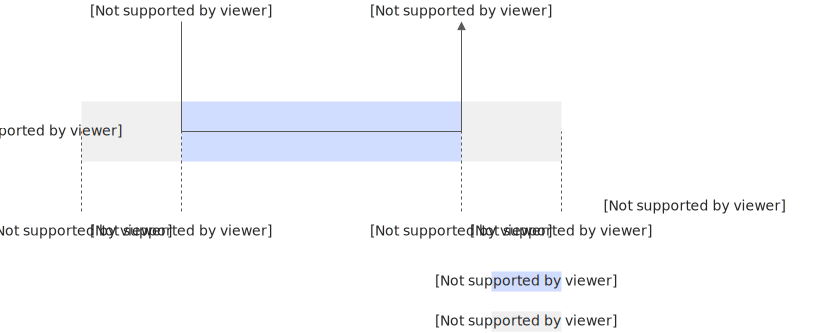
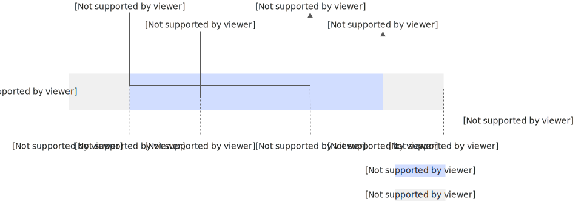

# 实例类型和规格

在通用计算场景中，例如 Web 服务和数据处理，函数计算通常只需使用基础的 CPU 实例即可满足需求。然而，在需要进行大规模并行计算或深度学习任务的场景下，如音视频处理、人工智能（AI）推理及图像处理等，GPU 实例则能够显著提升计算效率。

针对 GPU 实例，函数计算提供了三种实例类型：弹性实例、常驻实例和常驻实例+弹性实例（混合模式）。您可以根据具体的业务需求选择合适的实例类型与规格，在确保业务稳定运行的同时，最大限度地提升资源利用率和性能表现。

## **实例类型选型**

针对CPU函数，仅支持弹性实例。针对GPU函数，您可以根据业务资源利用率、对延时敏感程度和对费用的稳定性要求，选择适合的实例类型，支持在三种实例类型之间进行无损切换。

**

**说明**

仅支持为Ada、Ada.2、Ada.3、Hopper和Xpu.1系列卡型的GPU函数绑定常驻实例。

### **弹性实例**

如果设置函数的最小实例数为0，将按请求量自动弹性伸缩，无请求后实例自动回收，即按使用量计费，不使用不收费，能够做到最大程度降本。业务请求越频繁，资源利用率越高，相对虚拟机弹性的降本幅度越高。

### **是否存在冷启动**

是。针对时延敏感业务，为了解决冷启动问题，可以设置最小实例数≥1，提前锁定弹性资源，当请求到达时，迅速唤醒实例执行请求。

### **计费说明（**后付费**）**

函数的使用费用由弹性实例（活跃）和弹性实例（浅休眠（原闲置））费用构成，如果设置最小实例数≥1，建议开启浅休眠（原闲置）模式开关。弹性实例（浅休眠（原闲置））状态下vCPU资源使用不收费，GPU资源使用仅收1/5费用，使用费用远远小于弹性实例（活跃）状态的费用。

关于弹性实例（活跃）和弹性实例（浅休眠（原闲置））的场景划分，请参见[弹性实例](https://help.aliyun.com/zh/functioncompute/fc/product-overview/terms-of-fc#661cd1548a4rl)。

### **常驻实例**

仅适用于GPU函数。用户需提前购买[常驻资源池](https://help.aliyun.com/zh/functioncompute/fc/product-overview/resident-resource-pool)，然后基于常驻资源池为指定函数分配指定数量和卡型的常驻实例，从而实现使用成本的可控与固定。适用于业务资源利用率高、时延要求高或对费用稳定性有较高要求的场景。

### **是否存在冷启动**

否。使用常驻实例时，函数最多可以同时处理的请求数`=被分配的常驻实例数×实例并发数`，超出的请求将被流控，而未超出的请求，可以实现实时响应，彻底消除冷启动。

### **计费说明（**预付费**）**

函数费用包括已购买的所有常驻资源池的预付费费用。

### **常驻实例+弹性实例（混合模式）**

仅适用于GPU函数。结合了常驻实例和弹性实例的优势，适用于业务流量有明显峰谷波动的场景。系统优先使用常驻资源池承载稳态流量，当请求量超过常驻资源池的承载上限时，自动触发弹性实例扩展，从而在保证保底容量稳定性的同时，有效应对突发流量。

### **是否存在冷启动**

部分存在。在常驻资源池（最小实例数）覆盖的容量范围内，请求实现实时响应，无冷启动；当流量触发弹性扩展并弹出新实例时，弹出的弹性实例部分存在冷启动。

### **计费说明**

混合模式的费用由预付费和后付费两部分组成：

- **常驻部分**：通过已购买的常驻资源池额度进行抵扣。
- **弹性部分**：超出常驻资源池额度后自动弹出的实例按照后付费模式，和弹性实例活跃、浅休眠（原闲置）费用保持一致。

## 实例规格

- CPU实例
  
  | **vCPU（核）** | **内存规格（MB）** | **代码包大小上限（GB）** | **函数执行时长上限（s）** | **磁盘大小上限（GB）** | **带宽能力上限（Gbps）** |
  | --- | --- | --- | --- | --- | --- |
  | 0.05~16 取值说明：必须为0.05的倍数。 | 128~32768 取值说明：必须为64的倍数。 | 10 | 86400 | 10 取值说明： - 512 MB，默认值。 - 10 GB。 | 5 |
  
  **
  
  **说明**
  
  vCPU大小（单位为核）与内存大小（单位为GB）的比例必须设置在1∶1到1∶4之间。
- GPU实例硬件规格概览
  
  | **实例类型** | **显存容量** | **FP16 算力** | **FP32 算力** | **单实例最大卡数** |
  | --- | --- | --- | --- | --- |
  | **fc.gpu.tesla.1** | 16 GB | 65 TFLOPS | 8 TFLOPS | 4卡 |
  | **fc.gpu.ampere.1** | 24 GB | 125 TFLOPS | 31.2 TFLOPS | 8卡 |
  | **fc.gpu.ada.1** | 48 GB | 119 TFLOPS | 60 TFLOPS |  |
  | **fc.gpu.ada.2** | 24 GB | 166 TFLOPS | 83 TFLOPS |  |
  | **fc.gpu.ada.3** | 48 GB | 148 TFLOPS | 73.5 TFLOPS |  |
  | **fc.gpu.hopper.1** | 96 GB | 148 TFLOPS | 44 TFLOPS |  |
  | **fc.gpu.hopper.2** | 141 GB | 148 TFLOPS | 44 TFLOPS |  |
  | **fc.gpu.blackwell.1** | 32 GB | 104.8 TFLOPS | 104.8 TFLOPS |  |
  | **fc.gpu.xpu.1** | 96 GB | 123 TFLOPS | 61.5 TFLOPS | 16卡 |
- GPU实例的vCPU与内存配置规则
  
  **
  
  **说明**
  
  多卡资源计算公式：总 vCPU = 单卡 vCPU × 卡数，总内存 = 单卡内存 × 卡数。
  
  | **实例类型** | **vCPU（单卡）** | **内存可选范围（单卡）** | **内存调整步长** |
  | --- | --- | --- | --- |
  | **fc.gpu.tesla.1** | 4 核 | **4 ~ 16 GB**(4096 ~ 16384 MB) | 4GB (4096MB) |
  | 8 核 | **8 ~ 32 GB**(8192 ~ 32768 MB) |  |  |
  | 16 核 | **16 ~ 64 GB**(16384 ~ 65536 MB) |  |  |
  | **fc.gpu.ampere.1** | 8 核 | **8 ~ 32 GB**(8192 ~ 32768 MB) |  |
  | 16 核 | **16 ~ 32 GB**(16384 ~ 32768 MB) |  |  |
  | **fc.gpu.ada.1** **fc.gpu.ada.2** **fc.gpu.ada.3** | 4 核 | **16 ~ 32 GB**(16384 ~ 32768 MB) |  |
  | 8 核 | **32 ~ 64 GB**(32768 ~ 65536 MB) |  |  |
  | 16 核 | **64 ~ 120 GB**(65536 ~ 122880 MB) |  |  |
  | **fc.gpu.hopper.1** | 4 核 | **16 ~ 32 GB**(16384 ~ 32768 MB) |  |
  | 8 核 | **32 ~ 64 GB**(32768 ~ 65536 MB) |  |  |
  | 16 核 | **64 ~ 96 GB**(65536 ~ 98304 MB) |  |  |
  | 24 核 | **96 ~ 120 GB**(98304 ~ 122880 MB) |  |  |
  | **fc.gpu.hopper.2** | 4 核 | **16 ~ 32 GB**(16384 ~ 32768 MB) |  |
  | 8 核 | **32 ~ 64 GB**(32768 ~ 65536 MB) |  |  |
  | 16 核 | **64 ~ 128 GB**(65536 ~ 131072 MB) |  |  |
  | 24 核 | **96 ~ 248 GB**(98304 ~ 253952 MB) |  |  |
  | **fc.gpu.blackwell.1** | 4 核 | **16 ~ 32 GB**(16384 ~ 32768 MB) |  |
  | 8 核 | **32 ~ 64 GB**(32768 ~ 65536 MB) |  |  |
  | 16 核 | **64 ~ 120 GB**(65536 ~ 122880 MB) |  |  |
  | 24 核 | **96 ~ 184 GB**(98304 ~ 188416 MB) |  |  |
  | **fc.gpu.xpu.1** | 4 核 | **16 ~ 48 GB**(16384 ~ 49152 MB) |  |
  | 8 核 | **32 ~ 96 GB**(32768 ~ 98304 MB) |  |  |
  | 12 核 | **48 ~ 120 GB**(49152 ~ 122880 MB) |  |  |
- 函数计算GPU实例同时支持以下资源规格。
  
  | **镜像大小（GB）** | **函数执行时长上限（s）** | **磁盘大小** | **带宽能力上限（Gbps）** |
  | --- | --- | --- | --- |
  | ACR企业版（标准版）：15 ACR企业版（高级版）：15 ACR企业版（基础版）：15 ACR个人版（免费）：15 | 86400 | - 512MB - 10 ~ 200GB，步长为10GB | 5 |
  
  **
  
  **说明**
  
  - 实例规格设置为g1等同于设置为fc.gpu.tesla.1。
  - 目前支持Tesla系列GPU实例的地域包括华东1（杭州）、华东2（上海）、华北2（北京）、华北3（张家口）、华南1（深圳）、日本（东京）、美国（弗吉尼亚）和新加坡。
  - 目前支持Ada系列GPU实例的地域包括华北2（北京）、华东1（杭州）、华东2（上海）、华南1（深圳）、新加坡和美国（弗吉尼亚）。

### **GPU实例规格与实例并发度的关系**

Ada.1整卡显存为48GB，Tesla系列整卡显存为16GB，仅支持整卡显存，则单卡同时承载1个GPU容器，由于各地域的GPU卡数配额默认最大为30，地域级别最多可同时承载30个GPU容器。

- 当GPU函数实例并发度为1时，该函数在地域级别的推理并发度为30。
- 当GPU函数实例并发度为5时，该函数在地域级别的推理并发度为150。

## **单实例多并发**

如果您希望**提高实例资源利用率**，建议根据业务对资源的诉求，配置您的实例为**单实例多并发**。在这种方案下，当多个任务同时在一个实例上执行时，CPU或者内存将被抢占式共享，有效提高资源利用率。更多信息，请参见[配置单实例并发度](https://help.aliyun.com/zh/functioncompute/fc/configure-the-concurrency-of-a-single-instance)。

## 单实例单并发执行时长

一个实例执行一个请求时，执行时长的计量是从请求到达实例开始，到请求执行完毕为止。

## 单实例多并发执行时长

一个实例并发执行多个请求时，执行时长的计量是从第一个请求到达实例开始，到最后一个请求执行完毕为止。并发执行请求时，可以复用资源节省费用。

## 相关文档

- 关于函数计算的计费方式以及计费项等更多信息，请参见[计费概述](https://help.aliyun.com/zh/functioncompute/fc/product-overview/billing-overview-of-fc)。
- 使用API创建函数时可以通过`instanceType`参数指定实例类型，请参见[创建函数](https://help.aliyun.com/zh/functioncompute/fc/developer-reference/api-fc-2023-03-30-createfunction)。
- 关于如何通过控制台指定期望的实例类型和实例规格的具体操作，请参见[创建函数](https://help.aliyun.com/zh/functioncompute/fc/user-guide/function-instance-1/)。
