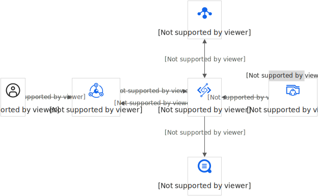
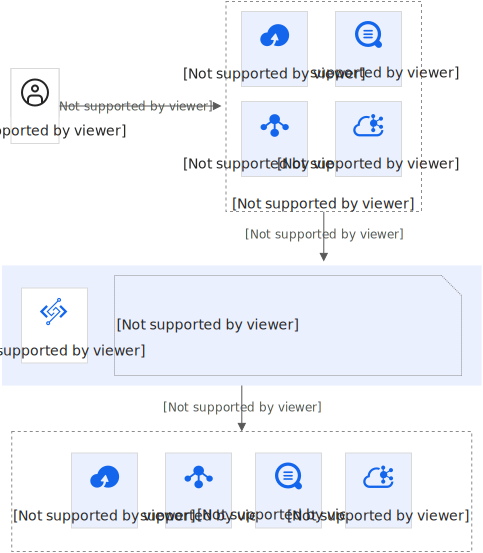
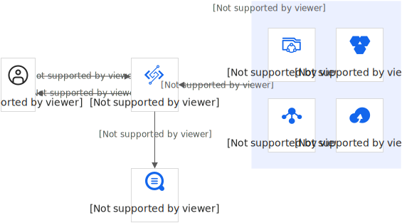
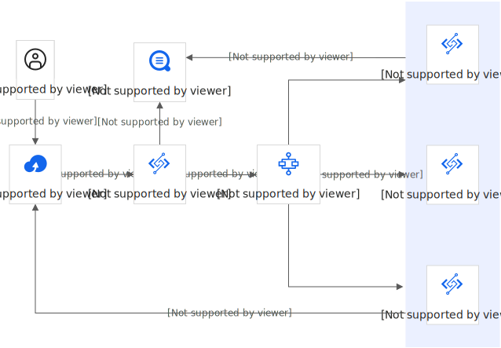

# 应用场景

本文介绍函数计算的典型应用场景，包括Web应用、数据ETL处理、AI推理、视频转码等。

## Web应用

函数计算和其他云产品搭配使用，可以让工程师只需编写业务代码即能够快速构建可弹性扩展的Web应用。同时这些程序可在多个数据中心高可用运行，不需要在可扩展性、备份冗余方面执行管理工作。

- 高效免运维：工程师专注于业务逻辑的开发，将集群的运维交予函数计算处理，有效提高开发运维效率。
- 弹性高可用：根据请求量自动进行毫秒级弹性扩容，快速调度计算资源，轻松应对业务洪峰。
- 高性能低成本：提供丰富的计量模式，帮助您在不同场景下获得显著的成本优势。
- 迁移更平滑：支持丰富的开发语言、自定义运行时，兼容传统应用框架，传统应用可以平滑迁移至函数计算。

## 数据ETL处理

函数计算支持丰富的事件源，通过事件触发机制，可以用几行代码和简单的配置对数据进行实时处理。例如：对OSS压缩包进行解压、对日志或者数据库中的数据进行清洗、对MNS消息进行自定义消费等。

- 配置简单：支持丰富的事件源类型，只需要简单的配置就可以对事件源数据进行处理。
- 灵活度高：可以根据业务场景的不同定义不同的处理逻辑，有很高的灵活度。

## AI推理

在AI模型训练完成后，对外提供推理服务时，可以使用函数计算，通过将数据模型包装在调用函数中，在用户实际请求到达时再运行代码。

- 高效免运维：AI工程师可以专注于算法模型的训练和业务逻辑的开发，将集群的运维交予函数计算处理，提高工作效率。
- 弹性高可用：根据请求量进行毫秒级弹性扩容，快速调动上万核的计算资源，计算力不再是瓶颈。
- 稳定高可靠：提供多版本功能，支持模型的灰度发布，轻松实现算法的A/B测试，降低模型上线风险。
- 简单更便捷：工具链全面升级，大幅提升TensorFlow、PyTorch等第三方库的安装体验。一键部署应用到云端，使用更便捷。

## 视频转码

函数计算和函数工作流结合可以轻松打造弹性高可用的Serverless视频处理系统。与传统方案相比，性能、成本和工程效率都有显著的优势。

- 灵活转码：视频转码函数完全由用户自定义，无缝支持自定义逻辑。
- 并行转码：根据视频文件数量，自动进行毫秒级的弹性伸缩，并行处理多个文件。
- 成本低廉：提供丰富的计量模式，在不同场景下有显著的成本优势。
- 快速迁移：FFmpeg相关命令可以直接移植到函数计算，在虚拟机上部署的基于FFmpeg的服务可以轻松切换到函数计算，迁移成本低。

