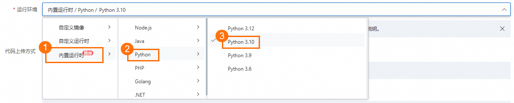
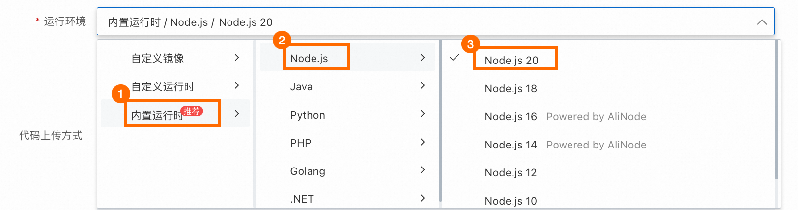
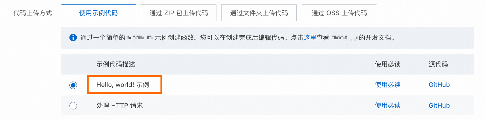
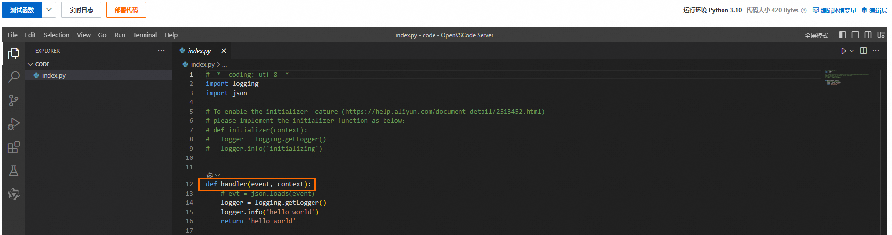
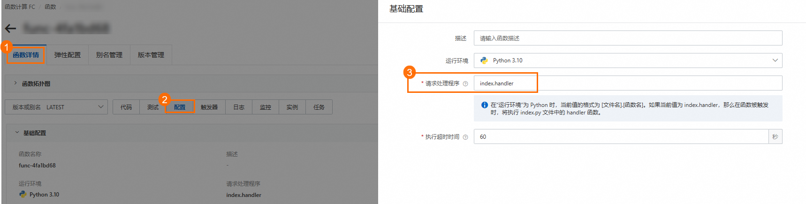
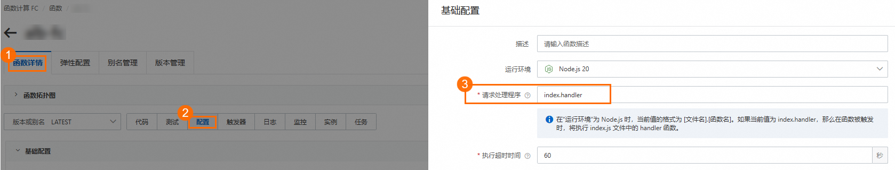
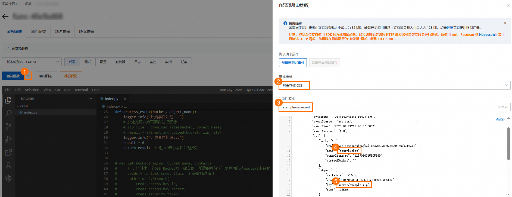
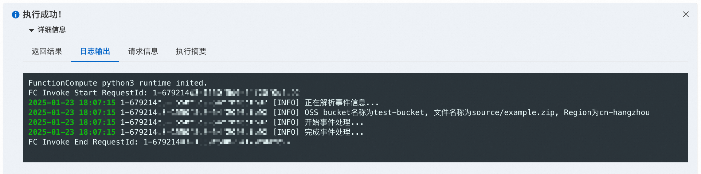

# 使用事件函数处理 OSS 文件上传事件

事件函数可以响应云服务产生的[各种事件](https://help.aliyun.com/zh/functioncompute/fc/user-guide/trigger-overview)（如文件上传至对象存储 OSS、监控产品触发的告警等）。使用事件函数时，您只需编写处理逻辑代码，无需关注额外的事件集成、也无需购买及管理底层计算资源。此外，函数计算仅在需要时运行实例并自动扩展，事件处理完毕后会自动销毁实例，您只需按照资源使用量付费。

## **场景示例**

您有一些文件需要保存到OSS。为了加速上传，您先将文件压缩为ZIP格式再上传，在使用时希望直接使用文件而不是ZIP包，因此需要一个自动化流程将文件解压并保存回OSS。

采用传统实现方法时，您需要构建并整合多个程序，以监控和处理OSS上的文件变动，同时还要考虑这些程序的部署和维护问题。而使用事件函数实现，您可以专注于文件处理程序。每当文件上传至OSS时都会产生事件，如果事件符合您设置的条件，函数将自动触发并运行您的处理程序，并在完成后自动释放计算资源，以节省开销。


考虑到您当前可能没有OSS Bucket，本文将通过下面的示例带您体验事件函数的实现流程：

创建一个模拟OSS文件上传的事件，该事件会调用一个事件函数来进行文件处理，并在控制台打印出文件名称、所在Bucket等信息。

通过实现这个示例，您将体验到以下内容：

1. 用控制台完成创建事件函数、编写请求处理程序、测试函数的完整流程；
2. 了解函数计算运行环境、内置运行时等关键概念；
3. 了解请求处理程序中的请求参数`event`和`context`。

## 前提条件

注册阿里云账号

注册阿里云账号并完成实名认证。具体信息，请参见[账号注册（PC端）](https://help.aliyun.com/zh/account/ali-cloud-account-registration-process#topic-2149078)。

开通函数计算服务

如果您是2024年08月27日之后注册的阿里云账号并完成实名认证，无需开通可直接使用函数计算产品。首次登录[函数计算控制台](https://fcnext.console.aliyun.com/)，还可以根据界面提示领取一定额度的免费资源包，详情请参见[试用额度](https://help.aliyun.com/zh/functioncompute/fc/product-overview/trial-quota-1#3a513884ff9ve)。

2024年08月27日之前注册的阿里云账号请参见以下步骤开通服务。

1. 访问[函数计算首页](https://www.aliyun.com/product/fc)。
2. 单击管理控制台，跳转至开通服务页面，单击**立即开通**即可开通服务并进入[函数计算控制台](https://fcnext.console.aliyun.com/)。
  
  **
  
  **说明**
  
  - 建议您使用阿里云账号开通服务，并使用RAM用户管理函数等应用。您可以按照最小授权原则为RAM用户授予业务所需权限策略，具体请参见[权限策略及示例](https://help.aliyun.com/zh/functioncompute/fc/policies-and-sample-policies)。
3. （可选）首次登录[函数计算控制台](https://fcnext.console.aliyun.com)，需要在弹出的**阿里云服务授权**对话框单击**确定**创建服务关联角色，便于后续使用函数计算访问相关云服务。
  
  创建成功后，函数计算即可访问您的VPC、ECS、SLS及容器镜像服务等云资源。关于服务关联角色的详细信息，请参见[服务关联角色](https://help.aliyun.com/zh/functioncompute/fc/service-linked-role-of-function-compute)。

## **操作指引**

### 1. 选择函数类型

1. 登录[函数计算控制台](https://fcnext.console.aliyun.com)，在左侧导航栏，选择**函数管理**>**函数列表**，在顶部菜单栏，选择您想要创建函数的地域，单击**创建函数**，然后根据界面提示选择并创建**事件函数**。

### 2. 选择运行环境

## Python

**运行环境**请选择**内置运行时-Python-Python 3.10。**



对于事件函数推荐您搭配**内置运行时**作为函数运行环境，这是因为**内置运行时**包括了响应其他云产品事件所必需的依赖（例如Python的oss2模块），更多信息请参见[环境说明](https://help.aliyun.com/zh/functioncompute/fc-3-0/user-guide/runtime-overview-2)。如果使用**自定义运行时**或**自定义镜像**作为函数运行环境，还需要自行安装所需依赖。关于各种运行环境的详细对比，请参见[运行时环境选型](https://help.aliyun.com/zh/functioncompute/fc/user-guide/selection-of-method-to-create-functions#f22f5e9baeylk)。

## Node.js

**运行环境**请选择**内置运行时-Node.js-Node.js 20**



对于事件函数推荐您搭配**内置运行时**作为函数运行环境，这是因为**内置运行时**包括了响应其他云产品事件所必需的依赖（例如Node.js的ali-oss模块），更多信息请参见[环境说明](https://help.aliyun.com/zh/functioncompute/fc-3-0/user-guide/runtime-overview-1)。如果使用**自定义运行时**或**自定义镜像**作为函数运行环境，还需要自行安装所需依赖。关于各种运行环境的详细对比，请参见[运行时环境选型](https://help.aliyun.com/zh/functioncompute/fc/user-guide/selection-of-method-to-create-functions#f22f5e9baeylk)。

### 3. 创建函数

选择**Hello, world！示例**创建函数，**高级配置**保持默认值，单击**创建**，然后等待函数创建完成。



创建完成后，可以在**代码**页签的WebIDE中查看生成的示例代码，下图以Python为例。



Hello, world示例代码会自动生成带有入口程序的函数模板，您可以直接在此模板基础上通过后续步骤构建您的业务代码。

### **4. 修改示例代码并部署**

Python、Node.js等解释性语言支持在WebIDE中直接修改代码并部署，而Java等编译性语言只支持本地编译代码包然后上传，不支持WebIDE。

## Python

在控制台的WebIDE中打开**index.py**，将当前代码替换为以下代码，然后单击**部署代码**使修改的代码生效。

**index.py**

```
# -*- coding: utf-8 -*- import logging import json # import oss2 # 如果您需要创建OSS客户端，请放开该注释 logger = logging.getLogger() def handler(event, context): # 请求处理程序是代码执行的入口 logger.info("正在解析事件信息...") input_events = json.loads(event) if not input_events.get('events'): # 检查传入event的格式 raise Exception("事件格式错误: events数组不存在或长度为0") event_obj = input_events['events'][0] bucket_name = event_obj['oss']['bucket']['name'] # 解析OSS Bucket名称 object_name = event_obj['oss']['object']['key'] # 解析文件名称 region = context.region # 解析函数所在地域 logger.info(f"OSS bucket名称为{bucket_name}, 文件名称为{object_name}, Region为{region}") # 如果您已经有OSS Bucket，可以放开下面的注释，创建一个OSS客户端实例 # bucket = get_bucket(region, bucket_name, context) bucket = None result = process_event(bucket, object_name) # 调用子程序执行事件处理逻辑 return result def process_event(bucket, object_name): logger.info("开始事件处理...") # 此处您可以编写事件处理逻辑 # zip_file = download_file(bucket, object_name) # result = extract_and_upload(bucket, zip_file) logger.info("完成事件处理...") result = 0 return result # 返回0表示事件处理成功 # def get_bucket(region, bucket_name, context): # # 此处创建一个OSS Bucket客户端实例，所需的身份认证信息可以从context中获取 # creds = context.credentials # 获取临时密钥 # auth = oss2.StsAuth( # creds.access_key_id, # creds.access_key_secret, # creds.security_token) # endpoint = f'oss-{region}-internal.aliyuncs.com' # bucket = oss2.Bucket(auth, endpoint, bucket_name) # return bucket # def download_file(bucket, object_name): # # 此处是从OSS下载文件的示例代码 # try: # file_obj = bucket.get_object(object_name) # return file_obj # except oss2.exceptions.OssError as e: # logger.error(f"文件下载失败 {e}") # def extract_and_upload(bucket, file_obj): # # 您可以在此定义解压并上传文件至OSS的逻辑 # return 0;
```

#### 了解函数代码

- `def handler(event, context):`
  
  - `handler`：这个Python函数是请求处理程序，您的代码中可能包含多个Python函数，但请求处理程序始终是代码执行的入口。修改代码时请保持请求处理程序的名称不变，函数计算才能够正确识别。详细信息，请参见[什么是请求处理程序](https://help.aliyun.com/zh/functioncompute/fc/user-guide/event-handlers-1-1#95f71f304crtj)。
    
    
  - `event`：当事件触发函数时，通过`event`参数传入事件相关信息（如OSS文件上传事件中的Bucket名称、文件名等）。该参数格式为JSON对象。如需了解各类事件的`event`包含哪些信息，请参见[触发器event格式](https://help.aliyun.com/zh/functioncompute/fc/user-guide/formats-of-event-for-different-triggers-1)。
  - `context`：函数运行的上下文对象通过`context`参数传递给函数，包含有关调用、函数配置和身份认证等信息。其中身份认证信息来源于函数配置的角色权限，为函数配置角色后，FC通过AssumeRole获取一个临时密钥（STS Token），然后通过`context`对象中的`credentials`字段将临时密钥传递给您的函数，详见[使用函数角色授予函数计算访问其他云服务的权限](https://help.aliyun.com/zh/functioncompute/fc/grant-function-compute-permissions-to-access-other-alibaba-cloud-services)。如需了解上下文对象包含哪些信息，请参见[上下文](https://help.aliyun.com/zh/functioncompute/fc/user-guide/context-1)。
- `logger.info()`：您可以使用编程语言的标准日志记录功能输出日志，例如Python语言中，使用`logging`模块等方法将信息输出到日志，本文示例使用语句打印Bucket名称、文件名称和Region地域名称。调用函数结束后，可以通过控制台查看日志输出。更多信息，请参见[日志](https://help.aliyun.com/zh/functioncompute/fc/user-guide/logging-2#section-6lq-hns-e32)。

## Node.js

在控制台的WebIDE中打开**index.mjs**，将当前代码替换为以下代码，然后单击**部署代码**使修改的代码生效。

**index.mjs**

```
'use strict'; // import OSSClient from 'ali-oss'; // 如果您需要创建OSS客户端，请放开该注释 export const handler = async (event, context) => { // 请求处理程序是代码执行的入口 console.log("正在解析事件信息..."); const inputEvents = JSON.parse(event); if (!Array.isArray(inputEvents.events) || inputEvents.events.length === 0) { // 检查传入event的格式 throw new Error("事件格式错误: events数组不存在或长度为0"); } const eventObj = inputEvents.events[0]; const bucketName = eventObj.oss.bucket.name; // 解析OSS Bucket名称 const objectName = eventObj.oss.object.key; // 解析文件名称 const region = context.region; // 解析函数所在地域 console.log(`OSS bucket名称为${bucketName}, 对象文件名称为${objectName}, Region为${region}`); // 如果您已经有OSS Bucket，可以放开下面的注释，创建一个OSS客户端实例 // const bucket = getBucket(region, context) const bucket = null; const result = processEvent(bucket, objectName); // 调用子程序执行事件处理逻辑 return result; }; async function processEvent (bucket, objectName) { console.log("开始处理事件..."); // 此处您可以编写事件处理逻辑 // const zipFile = downloadFile(bucket, objectName); // const result = extractAndUpload(bucket, zipFile); console.log("完成事件处理"); const result = 0; return result; } // function getBucket (region, context) { // // 此处创建一个OSS Bucket客户端实例，所需的身份认证信息可以从context中获取 // const bucket = new OSSClient({ // region: region, // accessKeyId: context.credentials.accessKeyId, // accessKeySecret: context.credentials.accessKeySecret, // securityToken: context.credentials.securityToken // }); // return bucket; // } // async function downloadFile (bucket, objectName) { // try { // // 从OSS下载文件的示例代码 // const result = await bucket.get(objectName, objectName); // console.log(result); // return result; // } catch (e) { // console.log(e); // } // } // async function extractAndUpload (bucket, zipFile) { // // 您可以在此定义解压并上传文件至OSS的逻辑 // return 0; // }
```

#### 了解函数代码

- `export const handler = async (event, context)`
  
  - `handler`：这个Node.js函数是请求处理程序，您的代码中可能包含多个Node.js函数，但请求处理程序始终是代码执行的入口。修改代码时请保持请求处理程序的名称不变，函数计算才能够正确识别。详细信息，请参见[什么是请求处理程序](https://help.aliyun.com/zh/functioncompute/fc/user-guide/request-handlers#fc5d11e04cbdg)。
    
    
  - `event`：当事件触发函数时，通过`event`参数传入事件相关信息（如OSS文件上传事件中的Bucket名称、文件名等）。该参数格式为JSON对象。如需了解各类事件的`event`包含哪些信息，请参见[触发器event格式](https://help.aliyun.com/zh/functioncompute/fc/user-guide/formats-of-event-for-different-triggers-1)。
  - `context`：函数运行的上下文对象通过`context`参数传递给函数，包含有关调用、函数配置和身份认证等信息。其中身份认证信息来源于函数配置的角色权限，为函数配置角色后，FC通过AssumeRole获取一个临时密钥（STS Token），然后通过`context`对象中的`credentials`字段将临时密钥传递给您的函数，详见[使用函数角色授予函数计算访问其他云服务的权限](https://help.aliyun.com/zh/functioncompute/fc/grant-function-compute-permissions-to-access-other-alibaba-cloud-services)。如需了解上下文对象包含哪些信息，请参见[上下文](https://help.aliyun.com/zh/functioncompute/fc/user-guide/context-1-1)。
- `console.log()`：您可以使用编程语言的标准日志记录功能输出日志，例如Node.js语言中，使用`console`模块将信息输出到日志，本文示例使用语句打印Bucket名称、文件名称和Region地域名称。调用函数结束后，可以通过控制台查看日志输出。更多信息，请参见[日志](https://help.aliyun.com/zh/functioncompute/fc/user-guide/logging)。

### **5. 测试函数**

为了模拟文件上传到OSS触发函数的场景，我们将定义一个模拟事件，并使用该事件触发函数。

除了使用模拟事件测试，您也可以使用真实的OSS事件触发函数来测试，详情请参见[进阶操作](#135cb52030t8h)。

1. **创建模拟事件**：在**函数详情**页面，单击**代码**页签，单击**测试函数**右侧的下拉框，选择**配置测试参数**。在**事件模版**中选择**对象存储OSS**，将自动生成一个模拟事件，该事件的格式与真实OSS事件的格式相同。
  
  您可以自定义**事件名称**和事件对象中的参数值（例如OSS Bucket名称和文件名称）。完成后单击**确定**。
  
  
  
  **OSS模拟事件示例**
  
  上方截图中的示例事件内容如下，您可以将其粘贴到测试参数的文本框中，然后进行后续操作。
  
  ```
  { "events": [ { "eventName": "ObjectCreated:PutObject", "eventSource": "acs:oss", "eventTime": "2024-08-13T06:45:43.000Z", "eventVersion": "1.0", "oss": { "bucket": { "arn": "acs:oss:cn-hangzhou:164901546557****:test-bucket", "name": "test-bucket", "ownerIdentity": "164901546557****" }, "object": { "deltaSize": 122539, "eTag": "688A7BF4F233DC9C88A80BF985AB****", "key": "source/example.zip", "size": 122539 }, "ossSchemaVersion": "1.0", "ruleId": "9adac8e253828f4f7c0466d941fa3db81161****" }, "region": "cn-hangzhou", "requestParameters": { "sourceIPAddress": "140.205.XX.XX" }, "responseElements": { "requestId": "58F9FF2D3DF792092E12044C" }, "userIdentity": { "principalId": "164901546557****" } } ] }
  ```
2. 在**代码**页签，单击**测试函数**，将立即触发函数执行。执行成功后查看**返回结果**，示例代码返回0代表事件处理成功。单击**日志输出**，查看函数执行过程中输出的日志信息。
  
  测试函数时，函数计算会将模拟事件的内容通过`event`参数传递给请求处理程序`handler`，并执行您在前一步骤中定义的代码，即解析`event`参数并处理文件。
  
  

### **6. （可选）清理资源**

函数计算按照实际资源使用量进行计费，已创建的函数资源如果不使用不会产生费用。但请留意您创建函数资源时关联的其他云产品或资源，例如存储在OSS和NAS的数据。

如果您希望删除函数，请登录[函数计算控制台](https://fcnext.console.aliyun.com)，选择**函数管理**>**函数列表**，选择地域，在目标函数的**操作**列，单击**删除**，然后在弹出的对话框，确认要删除的函数已无任何触发器等绑定资源后，再次确认删除。

## 进阶操作

现在您已经通过控制台创建了一个事件函数、修改了请求处理程序、并使用模拟`event`测试了函数。您可以根据业务需求，参考以下进阶操作：

- **添加触发器：**
  
  - 考虑到您可能没有OSS Bucket，本文中的示例采用模拟OSS文件上传事件的方式进行测试。如果您后续想要应用到您的实际业务中，您需要为函数添加一个OSS触发器，请参见[配置原生OSS触发器](https://help.aliyun.com/zh/functioncompute/fc/user-guide/configure-a-native-oss-trigger-1)。
  - 除了对象存储，许多阿里云服务（如多款消息队列、Tablestore、SLS等）的事件也可以触发函数计算。请参见[触发器简介](https://help.aliyun.com/zh/functioncompute/fc/user-guide/trigger-overview#section-qra-x4y-1vp)，了解支持的触发器列表。
- **添加依赖：**虽然内置运行时包含了事件处理过程中涉及的常用依赖库，但是在您的实际业务中可能仍然不满足要求，这时最简单的办法是将代码以及额外的依赖库打包到一个ZIP文件中作为代码包，上传并部署到函数计算，具体请参见[部署代码包](https://help.aliyun.com/zh/functioncompute/fc/user-guide/deploy-a-code-package-1)。如果您想减少代码包的体积以加速函数的冷启动，可以通过层来管理依赖，详情请参见[创建自定义层](https://help.aliyun.com/zh/functioncompute/fc/user-guide/create-a-custom-layer-1)。
- **配置日志：**为了便于对函数进行调试、排查问题或满足安全审计等需求，建议您为函数配置日志，详细步骤请参见[配置日志功能](https://help.aliyun.com/zh/functioncompute/fc/configure-the-logging-feature)。

## **相关文档**

- 除了使用控制台创建函数，您也可以使用Serverless Devs命令行工具来完成上述操作，请参见[快速入门](https://help.aliyun.com/zh/functioncompute/fc/developer-reference/install-serverless-devs-and-docker)。
- 关于本文中示例场景的完整实践教程，请参见[使用函数计算实现自动解压上传到OSS的ZIP文件](https://help.aliyun.com/zh/functioncompute/fc/use-cases/use-function-compute-to-automatically-decompress-zip-files-uploaded-to)。
- 推荐您参考以下实践教程，更深入地了解事件函数：
  
  - [使用函数计算对RocketMQ的消息数据进行清洗](https://help.aliyun.com/zh/functioncompute/fc/use-cases/use-function-compute-to-perform-message-cleansing)
  - [使用函数计算实现多个文件的打包下载](https://help.aliyun.com/zh/functioncompute/fc/use-cases/use-function-compute-to-download-multiple-objects-at-a-time)
