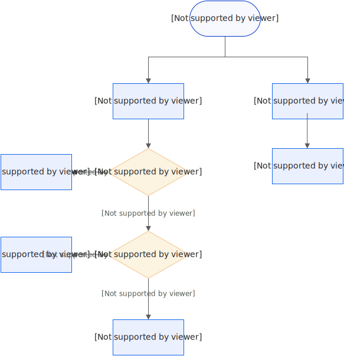

# 计费概述

本文介绍函数计算的计费方式、计费项、单价及计费示例。

**

**说明**

- 使用函数计算前，可通过[价格计算器](https://fcnext.console.aliyun.com/pricing)预估费用。
- 使用函数计算后，可在控制台[资源用量明细](https://fcnext.console.aliyun.com/usage)页面查看函数的CU使用量、各资源使用量和账单。

## **计费方式**

### [试用额度](https://help.aliyun.com/zh/functioncompute/fc/product-overview/trial-quota-1)

函数计算为首次开通服务的用户提供试用额度，即CU试用资源包。如果未购买其他类型的资源包，每个周期超出试用额度的部分均会计入按量付费。

### [按量付费](https://help.aliyun.com/zh/functioncompute/fc/product-overview/pay-as-you-go-billing-methods)

根据实际消耗的计算资源按量付费，未消耗则不计费。

### [资源包](https://help.aliyun.com/zh/functioncompute/fc/product-overview/resource-plans-fc)

函数计算提供不同档位的CU资源包年包和月包，购买资源包后，将优先使用资源包抵扣业务消耗，直至资源包耗尽自动转为按量付费。购买资源包让您可以以更优惠的价格享受等量资源，从而减少支出。

### [常驻资源池（包年包月）](https://help.aliyun.com/zh/functioncompute/fc/product-overview/resident-resource-pool)

通过购买常驻资源池，您可以提前锁定指定规格的算力资源，然后按需为函数分配特定数量和卡型的常驻实例，不仅能够保障业务的稳定性，还能实现使用成本的固定和可控。

## **计费项和单价**

### **计费项**

使用函数计算的费用由两部分组成：

- **CU使用量**：函数计算采用CU使用量作为统一计费项，所有资源使用量均需按照一定转换系数换算为CU使用量进行计费。本文重点介绍CU使用量的计量和计费。
- **公网出流量**：与阿里云其他公网类产品统一汇总后，在CDT产品侧进行计费，详见[CDT计费说明](https://help.aliyun.com/zh/cdt/billing-1)。

### **计费单价**

函数计算CU使用量实行按月阶梯累计计费，按地域独立计算（即每个地域的CU使用量单独累计，不跨地域合并）。更多信息，请参见[计费示例](#e444d84ac5uhl)。

| **阶梯** | **CU使用量（单位：CU）** | **单价** | **官网折扣单价** 活动时间：2024年08月27日~2026年08月27日 |
| --- | --- | --- | --- |
| 阶梯1 | (0,2亿] | 0.00011元/CU | 0.000088元/CU |
| 阶梯2 | (2亿,10亿] | 0.00010元/CU | 0.000080元/CU |
| 阶梯3 | >10亿 | 0.00009元/CU | 0.000072元/CU |

### **出账周期**

函数计算的出账周期为1小时，周期内每个函数计量得出的CU使用量向上取整，所有函数的CU使用量累加得出总CU使用量，总CU使用量在被资源包抵扣后（如果已购买资源包），用于计算当前出账周期内的总费用。

**

**重要**

针对单小时内调用次数 >0 或者持续占有计算资源的函数，每小时消耗CU折算金额若低于0.01元，将按0.01元计费，若实际使用费用高于此金额，则按实际消耗计算实际使用CU。

## **CU使用量的计算**

**

**说明**

下文介绍的CU使用量的计算均只针对于弹性实例。常驻实例采用按月预付费的方式，具体费用请参见[常驻资源池定价](https://help.aliyun.com/zh/functioncompute/fc/product-overview/resident-resource-pool#1d44d5c94floo)。

### **计算公式**

使用函数计算涉及的所有资源使用量按照一定转换系数换算为CU使用量后，求和得到总CU使用量。

CU使用量=∑(资源使用量×CU转换系数)

### **资源使用量**

**

**说明**

资源使用量是记录实际资源消耗的原始计量，不直接用于计费。

弹性实例区分活跃状态和浅休眠（原闲置）状态。无请求或无后台任务运行时，实例自动转为浅休眠（原闲置）状态。两种状态的场景区分如下：

| **弹性实例（活跃）** | **弹性实例（浅休眠（原闲置））** |
| --- | --- |
| - 未设置最小实例数，即默认最小实例缩容到0时，随着请求自动启动的弹性实例。 - 设置最小实例数≥1后，未开启浅休眠（原闲置）开关的最小实例数或开启浅休眠（原闲置）开关，随着请求达到，进入活跃状态的弹性实例。 - 会话亲和场景下，处理请求的弹性实例。 - 后台任务场景下，处理后台任务的弹性实例。 | - 设置最小实例数≥1且开启浅休眠（原闲置）开关后，处于无请求状态的实例。 - 会话亲和场景下，实例保活期间的弹性实例。 - 后台任务场景下，未处理后台任务的弹性实例。 |

`资源使用量=弹性实例（活跃）使用量+弹性实例（浅休眠（原闲置））使用量`。浅休眠（原闲置）状态下，系统自动冻结部分资源，按最低保活费用计费，具体如下：

- vCPU资源：不收费。
- GPU资源：根据不同卡型，按活跃状态费用的 11.7%～23% 计费，具体如下：
  
  | **Ada.1系列** | **Ada.2系列** | **Ada.3系列** | **Tesla系列** | **Hopper系列** | **Hopper.1系列** | **Hopper.2系列** | **Ampere系列** | **Blackwell.1系列** | **Xpu.1系列** |
  | --- | --- | --- | --- | --- | --- | --- | --- | --- | --- |
  | 11.7% | 11.7% | 11.7% | 23% | 13% | 14% | 14% | 16% | 13% | 19% |

配置最小实例数 ≥ 1 适用于时延敏感业务（会话亲和、长连接等）和后台任务场景，提供以下保障：

- 热启动：实现毫秒级热启动，保障服务不中断。
- 刚性交付：锁定弹性资源，保障刚性交付。
- 忙闲时智能计费：无请求或无后台任务处理时自动进入浅休眠（原闲置）计费，更进一步降本。

### **CU转换系数**

#### CPU业务

| **计费项** | **vCPU使用量** | **内存使用量** | **函数调用次数** | **磁盘使用量** |
| --- | --- | --- | --- | --- |
| **单位** | **CU/（vCPU*秒）** | **CU/（GB*秒）** | **CU/万次** | **CU/（GB*秒）** |
| 弹性实例（活跃）CU转换系数 | 1.0 | 0.15 | 75 | 0.05 |
| 弹性实例（浅休眠（原闲置））CU转换系数 | 0 | 0.15 | 0 | 0.05 |

#### GPU业务

| **资源/计费项** | **单位** | **弹性实例（活跃）CU转换系数** | **弹性实例（浅休眠）CU转换系数** |
| --- | --- | --- | --- |
| 函数调用次数 | CU/万次 | 75 | — |
| vCPU使用量 | CU/（vCPU*秒） | 1 | 0 |
| 内存使用量 | CU/（GB*秒） | 0.15 | 0.10 |
| 磁盘使用量 | CU/（GB*秒） | 0.05 | 0.05 |
| tesla.1 GPU使用量 | CU/（GB-GPU显存*秒） | 2.1 | 0.5 |
| ampere.1 GPU使用量 | CU/（GB-GPU显存*秒） | 1.8 | 0.3 |
| ada.1 GPU使用量 | CU/（GB-GPU显存*秒） | 1.7 | 0.2 |
| ada.2 GPU使用量 | CU/（GB-GPU显存*秒） | 1.95 | 0.23 |
| ada.3 GPU使用量 | CU/（GB-GPU显存*秒） | 1.95 | 0.23 |
| blackwell.1 GPU使用量 | CU/（GB-GPU显存*秒） | 2.1 | 0.28 |
| hopper.1 GPU使用量 | CU/（GB-GPU显存*秒） | 2.31 | 0.315 |
| hopper.2 GPU使用量 | CU/（GB-GPU显存*秒） | 2.31 | 0.315 |
| xpu.1 GPU使用量 | CU/（GB-GPU显存*秒） | 1.2 | 0.23 |

## **计费示例**

可通过[价格计算器](https://fcnext.console.aliyun.com/pricing)测算费用，或参考以下示例。

**

**重要**

vCPU使用量、内存使用量、磁盘使用量和GPU使用量均根据配置函数时配置的规格 × 时长进行计算，而不是根据函数执行时实际使用的资源规格进行计算。

函数计算价格计算器

## CPU业务计费示例

某用户创建CPU函数实例，规格为 vCPU 0.35 核、内存 512 MB、临时磁盘 512 MB。当月设置最小实例数为1，总时长50小时，其中函数执行请求时长10小时、无请求时长40小时，函数调用100万次。各资源使用量、CU使用量和计费总额如下：

| **资源使用项** | **使用量** | **转换系数** | **转换后CU使用量** |
| --- | --- | --- | --- |
| **函数调用次数** | 1,000,000次 | 0.0075 CU/次 | 7,500 CU |
| **弹性实例（活跃）vCPU使用量** | vCPU规格 × 执行时长（秒）= 0.35 vCPU × 36,000秒=12,600 vCPU*秒 | 1 CU/（vCPU*秒） | 12,600 CU |
| **弹性实例（活跃）内存使用量** | 内存规格× 执行时长（秒）= 0.5 GB × 36,000秒 = 18,000 GB*秒 | 0.15 CU/（GB*秒） | 2,700 CU |
| **磁盘占用量** | 磁盘规格 × 设置最小实例数总时长（秒）= 0.5 GB × 180,000秒 = 90,000 GB*秒 | 0.05 CU/（GB*秒） | 0 CU 说明：512 MB规格的磁盘使用免费。 |
| **弹性实例（浅休眠（原闲置））vCPU使用量** | vCPU规格 × 浅休眠（原闲置）时长（秒）= 0.35 vCPU × 144,000秒=50,400 vCPU*秒 | 0 CU/（vCPU*秒） 说明：设置的最小实例数在未处理请求期间vCPU资源使用免费。 | 0 CU |
| **弹性实例（浅休眠（原闲置））内存使用量** | 内存规格× 浅休眠（原闲置）时长（秒）= 0.5 GB × 144,000秒 = 72,000 GB*秒 | 0.15 CU/（GB*秒） | 10,800 CU |
| **CU使用量** | 33,600 CU |  |  |
| **计费总额=阶梯1单价×使用量=0.00011元/CU×33,600 CU=3.7元** |  |  |  |

## GPU业务计费示例（Tesla系列）

某用户创建GPU函数实例（Tesla系列），规格为 GPU 16 GB、vCPU 8 核、内存 32 GB、临时磁盘 512 MB。当月设置最小实例数为1，总时长50小时，其中函数执行请求时长10小时、无请求时长40小时，函数调用100万次。各资源使用量、CU使用量和计费总额如下：

| **资源使用项** | **使用量** | **转换系数** | **转换后CU使用量** |
| --- | --- | --- | --- |
| **函数调用次数** | 1,000,000次 | 0.0075 CU/次 | 7,500 CU |
| **弹性实例（活跃）vCPU使用量** | vCPU规格 × 执行时长（秒）= 8 vCPU × 36,000秒=288,000 vCPU*秒 | 1 CU/（vCPU*秒） | 288,000 CU |
| **弹性实例（活跃）内存使用量** | 内存规格 × 执行时长（秒）= 32 GB × 36,000秒 = 1,152,000 GB*秒 | 0.15 CU/（GB*秒） | 172,800 CU |
| **弹性实例（活跃）GPU使用量** | GPU规格 × 执行时长（秒）= 16 GB × 36,000秒 = 576,000 GB*秒 | 2.1 CU/（GB*秒） | 1,209,600 CU |
| **磁盘占用量** | 磁盘规格 × 设置最小实例数总时长（秒）= 0.5 GB × 180,000秒 = 90,000 GB*秒 | 0.05 CU/（GB*秒） | 0 CU 说明：512 MB规格的磁盘使用免费。 |
| **弹性实例（浅休眠（原闲置））vCPU使用量** | vCPU规格 × 浅休眠（原闲置）时长（秒）= 8 vCPU × 144,000秒=1,152,000 vCPU*秒 | 0 CU/（vCPU*秒） 说明：设置的最小实例数在未处理请求期间vCPU资源使用免费。 | 0 CU |
| **弹性实例（浅休眠（原闲置））内存使用量** | 内存规格× 浅休眠（原闲置）时长（秒）= 32 GB × 144,000秒 = 4,608,000 GB*秒 | 0.1 CU/（GB*秒） | 460,800 CU |
| **弹性实例（浅休眠（原闲置））GPU使用量** | GPU规格× 浅休眠（原闲置）时长（秒）= 16 GB × 144,000秒 = 2,304,000 GB*秒 | 0.5 CU/（GB*秒） | 1,152,000 CU |
| **CU使用量** | 3,290,700 CU |  |  |
| **计费总额=阶梯1单价×使用量=0.00011元/CU×3,290,700 CU=361.977元** |  |  |  |

## GPU业务计费示例（Blackwell.1系列）

某用户创建GPU函数实例（Blackwell.1系列），规格为 GPU 32 GB、vCPU 8 核、内存 64 GB、临时磁盘 512 MB。当月设置最小实例数为1，总时长50小时，其中函数执行请求时长10小时、无请求时长40小时，函数调用100万次。各资源使用量、CU使用量和计费总额如下：

| **资源使用项** | **使用量** | **转换系数** | **转换后CU使用量** |
| --- | --- | --- | --- |
| **函数调用次数** | 1,000,000次 | 0.0075 CU/次 | 7,500 CU |
| **弹性实例（活跃）vCPU使用量** | vCPU规格 × 执行时长（秒）= 8 vCPU × 36,000秒 = 288,000 vCPU*秒 | 1 CU/（vCPU*秒） | 288,000 CU |
| **弹性实例（活跃）内存使用量** | 内存规格 × 执行时长（秒）= 64 GB × 36,000秒 = 2,304,000 GB*秒 | 0.15 CU/（GB*秒） | 345,600 CU |
| **弹性实例（活跃）GPU使用量** | GPU规格 × 执行时长（秒）= 32 GB × 36,000秒 = 1,152,000 GB*秒 | 2.1 CU/（GB*秒） | 2,419,200 CU |
| **磁盘占用量** | 磁盘规格 × 设置最小实例数总时长（秒）= 0.5 GB × 180,000秒 = 90,000 GB*秒 | 0.05 CU/（GB*秒） | 0 CU 说明：512 MB规格的磁盘使用免费。 |
| **弹性实例（浅休眠（原闲置））vCPU使用量** | vCPU规格 × 浅休眠（原闲置）时长（秒）= 8 vCPU × 144,000秒 = 1,152,000 vCPU*秒 | 0 CU/（vCPU*秒） 说明：设置的最小实例数在未处理请求期间vCPU资源使用免费。 | 0 CU |
| **弹性实例（浅休眠（原闲置））内存使用量** | 内存规格 × 浅休眠（原闲置）时长（秒）= 64 GB × 144,000秒 = 9,216,000 GB*秒 | 0.10 CU/（GB*秒） | 921,600 CU |
| **弹性实例（浅休眠（原闲置））GPU使用量** | GPU规格 × 浅休眠（原闲置）时长（秒）= 32 GB × 144,000秒 = 4,608,000 GB*秒 | 0.28 CU/（GB*秒） | 1,290,240 CU |
| **CU使用量** | 5,272,140 CU |  |  |
| **计费总额=阶梯1单价×使用量=0.00011元/CU×5,272,140 CU=579.94元** |  |  |  |

## **更多信息**

如果在函数计算内使用其他云产品时，除本产品费用外，还需关注对应云产品的计费。

## 常见问题

- [怎样清除函数资源避免欠费?](https://help.aliyun.com/zh/functioncompute/fc/how-to-terminate-unused-resources-to-avoid-unexpected-charges#d4072047c4sk8)
- [购买了试用套餐后就是免费使用吗？是否还会收费？](https://help.aliyun.com/zh/functioncompute/fc/product-overview/faq-about-billing#7622db1183jeh)
- [购买了试用套餐后，账号欠费了，如何查看欠费，以及哪些信息可能会造成欠费？](https://help.aliyun.com/zh/functioncompute/fc/product-overview/faq-about-billing#9a3b941283phr)
- [为什么停止函数计算服务后，查看账单却发现仍在消费？](https://help.aliyun.com/zh/functioncompute/fc/product-overview/faq-about-billing#title-p4n-cyw-qq1)
- [使用GPU实例运行的过程中，会涉及到哪些资源使用项？](https://help.aliyun.com/zh/functioncompute/fc/product-overview/faq-about-billing#b1b36be083bpj)
- [资源包是否支持跨地域抵扣？](https://help.aliyun.com/zh/functioncompute/fc/product-overview/faq-about-billing#section-2ob-xg7-2cy)
- [账号欠费了不想继续使用这个产品，如何退订服务？如何补交费用？](https://help.aliyun.com/zh/functioncompute/fc/product-overview/faq-about-billing#31395d301edta)
- [产品发送的短信、邮件等消息是否支持退订？](https://help.aliyun.com/zh/functioncompute/fc/product-overview/faq-about-billing#3e26156af8t96)
