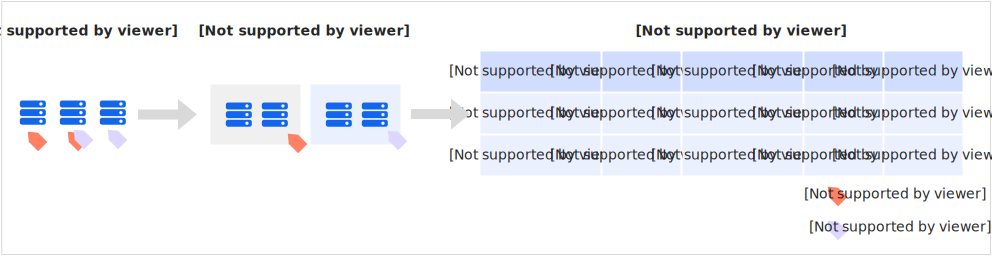

# 企业分账

函数计算为函数提供了标签功能，便于搜索和分组管理函数。为函数创建标签后，您还可以通过标签的分类实现企业分账管理。本文介绍如何通过标签进行函数分账。

## 使用场景

企业分账适用于以下场景。

- 环境隔离
  
  为不同环境（例如生产环境和测试环境）、Runtime（例如Java、Python或Node.js等）或者客户端平台（例如iOS和Android）绑定不同的标签，实现开发者操作环境的隔离。
- 项目管理
  
  在团队或者项目管理中，添加群组、项目或部门维度的标签（例如team:ops），实现分项目或者分团队的账务管理。

## 使用流程

## 前提条件

已创建函数并为其创建标签。具体操作，请参见[创建函数](https://help.aliyun.com/zh/functioncompute/fc/user-guide/function-instance-1/)和[配置标签](https://help.aliyun.com/zh/functioncompute/fc/user-guide/function-tags-management)。

**

**说明**

- 针对函数计算2.0控制台创建的函数（名称中含有$符号），标签会绑定到2.0的服务，而不是函数。
- 本文示例包括了函数计算2.0和3.0的函数，分别为2.0的服务和3.0的函数绑定标签`2.0：dev`、`3.0：dev`、`team：dev`以及`2.0：ops`、`3.0：ops`、`team：ops`。

## **操作指引**

### **启用标签**

登录[费用与成本](https://billing-cost.console.aliyun.com)，在左侧导航栏，选择**费用标签**，在[费用标签](https://billing-cost.console.aliyun.com/finance/tags)页面，根据需求启用费用标签。

- 从未启用过
  
  1. 在**费用标签**页面，单击**下一步**。
  2. 在**请选择启用标签**区域，根据界面提示搜索并添加目标标签，然后单击**下一步**。
  3. 单击**确认启用**，在弹出的**提示**对话框，单击**确定**。
- 曾经启用过
  
  1. 在**费用标签**页面的**标签key**文本框，输入目标标签，然后单击**搜索**。
  2. 在下方搜索结果区域，单击目标标签**操作**列的**启用**。
    
    您也可以选中多个标签，然后单击**批量启用**同时启用多个标签。

**

**说明**

- 为函数新建标签后，T+1同步至费用标签列表，然后才能启用此标签。
- 只有启用状态的标签，才能在费用中心体现。

### **创建财务单元**

在费用与成本[财务单元](https://billing-cost.console.aliyun.com/finance/finance-unit/list)页，单击财务单元后的按钮，新增财务单元。在财务单元管理页面，左侧导航栏包含**总览**、**所有资源**、**未分配资源**菜单项，下方展示财务单元树形结构，单击**+**可添加财务单元。右侧总览区域显示财务单元数量，**设置**区域包含**自动分配规则对全部资源生效**和**金额按财务单元层级汇总**两个开关，以及**ECS关联资源跟随分配设置**的**编辑规则**入口。

### **设置财务单元规则**

通过财务单元自动分配规则，可以将符合条件的资源实例自动分配至指定的财务单元，解决用户手动分配过于繁琐耗时的问题。

1. 单击新创建的财务单元，选择**自动分配规则**页签，单击**添加规则**，或选择指定的财务单元，在**自动分配规则**页签下，单击**编辑**。
2. 开始设置条件和公式。
  
  为财务单元"生产环境"设置了3个条件，3个条件之间是**或**的关系，满足任意一个条件时，例如标签等于`2.0：dev`、`3.0：dev`或`team：dev`，该资源分配至财务单元"生产环境"。

### **（可选）设置自动分配资源到财务单元**

建议您启用自动分配规则对全部资源生效，启用后如果您对财务单元的自动分配规则进行了调整，新规则将对全部非手动分配的云产品资源实例生效。否则，财务单元自动分配规则仅对新创建和未分配的资源生效。

此外，您也可以手动分配资源到财务单元，手动分账规则是指手动将资源分配到财务单元下。手动分配的优先级高于自动分配。具体操作，请参见[财务单元](https://help.aliyun.com/zh/user-center/cost-center-1#5d67a34000y49)。

### **分账结果验证**

在左侧导航栏，选择**分账明细**，在[分账明细](https://billing-cost.console.aliyun.com/finance/split-bill)页面，查看分账信息。

在**财务单元**列筛选目标财务单元，例如"生产环境"，然后在列表中查看分配至此财务单元的资源是否准确，可以通过**资产/资源实例ID**列核对。

同时可关注**实例标签**列，确认各资源实例的标签（如`key:team value:dev`）与预期一致。

## 相关文档

- 关于分账管理的更多信息，请参见以下文档。
  
  - [费用标签](https://help.aliyun.com/zh/user-center/cost-label)
  - [财务单元](https://help.aliyun.com/zh/user-center/cost-center-1)
  - [分账明细](https://help.aliyun.com/zh/user-center/splitting-bill)
- 关于通过标签分组管理函数的最佳实践，请参见[授予不同RAM用户不同分组函数的操作权限](https://help.aliyun.com/zh/functioncompute/fc/grant-different-grouping-function-operation-permissions-to-different-ram-roles)。
