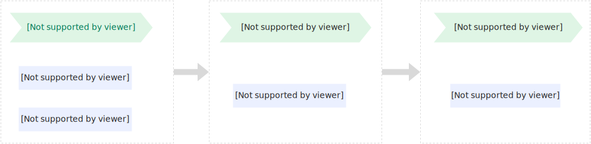

# 常驻资源池（包年包月）

通过购买常驻资源池，您可以提前锁定指定规格的算力资源，然后按需为函数分配特定数量和卡型的常驻实例，不仅能够保障业务的稳定性，还能实现使用成本的固定和可控。

## **常驻资源池简介**

常驻资源池仅适用于GPU函数，采用按月预付费的方式，帮助用户提前锁定稀缺GPU资源，确保业务平稳运行，避免因资源不足而受到影响。购买常驻资源池并为函数绑定指定数量和卡型的常驻实例后，函数可以使用常驻实例处理请求。

使用常驻实例的函数无法同时使用弹性实例，最多可以同时处理的请求数`=被分配的常驻实例数×实例并发数`，超出的请求将被流控，而未超出的请求，可以实现实时响应，彻底消除冷启动。

## **适用场景**

如果您的业务具有如下特征，推荐购买常驻资源池：

- **资源利用率高**：业务对资源的需求较为持续且稳定。
- **时延要求高**：需要快速响应，确保高性能和低时延。
- **费用可控**：希望费用固定且可预测。

## **计费说明**

常驻资源池采用按月预付费，需要预先支付一个月、数月或一年的费用，具体价格参见[常驻资源池额度和定价](#b3b58f10b8778)。使用常驻资源池分配的常驻实例时，函数将无法同时使用弹性实例，这种情况下，除了预付费部分，不会产生其他额外费用。

## **常驻资源池额度和定价**

### **计费项**

常驻资源池费用包括GPU卡费用和磁盘费用：

- **GPU卡费用**
  
  包含GPU显存、vCPU和内存三部分资源费用，目前仅支持整卡购买，详见[GPU整卡规格额度和单月定价](#5848635ef8gc0)。
- **磁盘费用**
  
  常驻资源池中磁盘购买额度最小是10 GB，最大是60 GB，步长为10 GB。不同地域磁盘定价不同：
  
  - 地域：华东1（杭州）、华东2（上海）、华北2（北京）、华北6（乌兰察布）和华南1（深圳）
    
    磁盘定价：1.2元/GB/月
  - 地域：美国（弗吉尼亚）、德国（法兰克福）和新加坡
    
    磁盘定价：1.44元/GB/月

### **GPU整卡规格额度和单月定价**

购买常驻资源池后，平台会基于您购买的资源总规格，转换为可供函数使用、灵活分配的可用容量，您可以基于此容量创建常驻实例。

| **地域** | **GPU卡型** | **整卡规格** | **单月定价（单位：元）** |
| --- | --- | --- | --- |
| 华东1（杭州）、华东2（上海）、华北2（北京）、华南1（深圳） | Tesla系列（tesla.1） | - 显存：16 GB - vCPU：24 - 内存：96 GB - 磁盘：10 GB | 5,903.36 |
| Ampere系列（ampere.1） | - 显存：24 GB - vCPU：16 - 内存：64 GB - 磁盘：10 GB | 5,777.76 |  |
| Ada系列（ada.1） | - 显存：48 GB - vCPU：16 - 内存：128 GB - 磁盘：10 GB | 8,229.75 |  |
| Ada.2系列（ada.2） | - 显存：24 GB - vCPU：16 - 内存：128 GB - 磁盘：10 GB | 7,878 |  |
| Ada.3系列（ada.3） | - 显存：48 GB - vCPU：16 - 内存：64 GB - 磁盘：10 GB | 9,341.40 |  |
| Blackwell系列（blackwell.1） | - 显存：32 GB - vCPU：24 - 内存：192 GB - 磁盘：10 GB | 11,191.36 |  |
| Hopper系列（hopper.1） | - 显存：96 GB - vCPU：24 - 内存：128 GB - 磁盘：10 GB | 21,532.68 |  |
| Hopper.2系列（hopper.2） | - 显存：141 GB - vCPU：24 - 内存：256 GB - 磁盘：10 GB | 30,844.50 |  |
| Xpu.1系列（xpu.1） | - 显存：96 GB - vCPU：12 - 内存：128 GB - 磁盘：10 GB | 13,757.76 |  |
| 华北6（乌兰察布） | Ada系列（ada.1） | - 显存：48 GB - vCPU：16 - 内存：128 GB - 磁盘：10 GB | 8,229.75 |
| Ada.2系列（ada.2） | - 显存：24 GB - vCPU：16 - 内存：128 GB - 磁盘：10 GB | 7,878 |  |
| Ada.3系列（ada.3） | - 显存：48 GB - vCPU：16 - 内存：128 GB - 磁盘：10 GB | 10,263 |  |
| Blackwell系列（blackwell.1） | - 显存：32 GB - vCPU：24 - 内存：192 GB - 磁盘：10 GB | 10,145.60 |  |
| Hopper系列（hopper.1） | - 显存：96 GB - vCPU：24 - 内存：128 GB - 磁盘：10 GB | 21,532.68 |  |
| Hopper.2系列（hopper.2） | - 显存：141 GB - vCPU：24 - 内存：256 GB - 磁盘：10 GB | 28,854.71 |  |
| Xpu.1系列（xpu.1） | - 显存：96 GB - vCPU：12 - 内存：128 GB - 磁盘：10 GB | 13,803.84 |  |
| 美国（弗吉尼亚） | Ada系列 | - 显存：48 GB - vCPU：16 - 内存：128 GB - 磁盘：10 GB | 8,923.90 |
| Hopper系列 | - 显存：96 GB - vCPU：24 - 内存：128 GB - 磁盘：10 GB | 22,825.84 |  |
| 德国（法兰克福） | Ada系列 | - 显存：48 GB - vCPU：16 - 内存：128 GB - 磁盘：10 GB | 12,577.17 |
| Hopper系列 | - 显存：96 GB - vCPU：24 - 内存：128 GB - 磁盘：10 GB | 30,118.96 |  |
| Hopper.2系列（hopper.2） | - 显存：141 GB - vCPU：24 - 内存：256 GB - 磁盘：10 GB | 46,276.04 |  |
| 新加坡 | Ada系列 | - 显存：48 GB - vCPU：16 - 内存：128 GB - 磁盘：10 GB | 10,593.23 |
| Hopper系列 | - 显存：96 GB - vCPU：24 - 内存：128 GB - 磁盘：10 GB | 26,529.52 |  |
| Hopper.2系列（hopper.2） | - 显存：141 GB - vCPU：24 - 内存：256 GB - 磁盘：10 GB | 44,720.81 |  |

**

**说明**

具体价格请以实际[购买页](https://common-buy.aliyun.com/?spm=a2c4g.11186623.0.0.53672083df2OUp&commodityCode=fc_prepay_public_cn)为准。

## **管理常驻资源池**

### **购买常驻资源池**

1. 登录[函数计算控制台](https://fcnext.console.aliyun.com/)，在左侧导航栏，选择**弹性管理**>**常驻资源池**，然后在上方菜单栏，选择地域。
2. 在**常驻资源池**页面，单击**购买常驻资源池**，在购买页面，选择地域、GPU卡型、卡数、单卡磁盘规格和购买时长等，然后单击**立即购买**。
  
  购买参数说明如下：
  
  | **地域** | 选择常驻资源池部署的地域。不同地域的GPU卡型和定价可能不同。 |
  | --- | --- |
  | **GPU卡型** | 选择GPU卡型系列，如Tesla、Ampere、Ada、Blackwell、Hopper等。 |
  | **卡数** | 选择购买的GPU卡数量。 |
  | **单卡磁盘规格** | 选择单张GPU卡对应的磁盘容量，范围为10 GB～60 GB，步长为10 GB。 |
  | **购买时长** | 选择购买时长，支持按月或按年购买。 |

### **查看常驻资源池**

您可以在常驻资源池列表查看和筛选已购买的所有常驻资源池，并详细了解常驻资源池的函数分配情况、剩余额度和到期时间等，合理分配资源以防造成资源浪费。

### **常驻资源池扩容（升配）**

您可以基于[查看常驻资源池](#68b498f2b6vqo)的结果，单击目标常驻资源池右侧的**扩容**，然后根据界面提示操作，完成扩容。需要注意的是，已过期的资源池，需要先续费激活才能扩容。

当前仅支持对卡数和单卡磁盘规格进行扩容，GPU卡型和规格等不支持调整。GPU卡数和单卡磁盘规格仅支持调大，不支持调小，因此请谨慎扩容，以免造成资源浪费或配置不合理。

## **到期及续费说明**

常驻资源池到期和资源耗尽前，建议尽快续费。

### **到期提醒**

阿里云消息中心会在常驻资源池到期前7天、3天和1天提醒及时续费。

### **到期后影响**

常驻资源池到期后自动停机，相关函数的常驻实例被释放，如果未及时修改函数实例类型为弹性实例，函数将不可用。停机90天后资源池彻底释放，自动和相关函数解绑，如果后期恢复需重新购买资源池。

阿里云消息中心会在资源池释放前30天、7天和1天提醒。

### **续费操作指引**

#### **自动续费**

购买常驻资源池时，可以选择勾选**到期自动续费**复选框，确保资源过期时自动完成续费。也可以登录[费用与成本-资源续订](https://billing-cost.console.aliyun.com/renew/manual)，在资源列表找到目标资源，然后开通或关闭自动续订。

#### **手动续费**

未开通自动续费的资源，可以基于[查看常驻资源池](#68b498f2b6vqo)结果，单击目标常驻资源池右侧的**续费**，然后根据界面提示操作，完成续费。

## **查看账单**

资源出账后，可以在[费用与成本-账单详情](https://billing-cost.console.aliyun.com/finance/expense-report/expense-detail-by-instance?BillingCycle=2025-07)查看消费明细，并查询对应资源账单。更多信息，请参见[账单查询](https://help.aliyun.com/zh/functioncompute/fc/product-overview/view-bills)。

## **退订说明**

购买常驻资源池后，如果想终止服务，函数计算将基于阿里云退订规则回收资源并退还相应款项。可以在充分了解退订影响和退订规则后发起退订，退订成功后，按照指定的日期查看退订资金流向。

### **退订前须知**

发起退订前，请先解除常驻资源池和函数的绑定，可以登录[函数计算控制台](https://fcnext.console.aliyun.com/)，将绑定目标常驻资源池的函数的常驻实例数调整为0。

- 退订影响
  
  退订成功后无法撤销，请仔细核对订单信息，避免误操作。若订单参加了优惠活动，退订后将无法再次参加且退订后代金券和优惠券等将作废清零。
- 退订规则
  
  退订金额=订单实付金额-已消费金额
  
  订单实付金额指以现金方式支付的订单款项，不包含通过代金券、优惠券抵扣的部分；已消费金额根据常驻资源池使用情况，计费规则有所不同，详见下表：
  
  | **使用时长** | **已消费金额计算规则** |
  | --- | --- |
  | ＜ 30天 | （日单价 * 已使用时长）* 1.2 |
  | ≥ 30天 | 日单价 * 已使用时长 |
  
  **
  
  **说明**
  
  续费订单生效前，如果对该常驻资源池发起退订，只能退订资源，不允许退订续费订单。

### **发起退订**

退订入口：使用阿里云主账号登录[资源退订](https://billing-cost.console.aliyun.com/refund/refund?commodityType=NORMAL_CLOUD_COMMODITY&refundType=NOREASON_REFUND)页面，单击目标资源行右侧**操作**列的**退订资源**，然后根据界面提示完成退订。更多信息，请参见[发起退订](https://help.aliyun.com/zh/user-center/initiate-unsubscribe#86ec354b9bukv)。

发起退订前，请确保待退订常驻资源池绑定的函数的常驻实例数已置为0。

### **查看退订明细**

发起退订成功后，退款一般在2～3个工作日内到账（退款仅指以现金或储值卡方式支付的订单款项，通过代金券、优惠券抵扣的部分不支持退回），请自行跟踪[退款流向](https://help.aliyun.com/zh/user-center/refund-flow)。

## **欠费说明**

如果账号内存在欠费账单，可以正常使用已购买常驻资源池的资源，但不能进行新购常驻资源池、资源池升级和续费等操作。更多信息，请参见[欠费说明](https://help.aliyun.com/zh/functioncompute/fc/product-overview/overdue-payments-1)。

## **常见问题**

### **如何使用常驻资源池？**

购买常驻资源池后，可以在创建GPU函数时，设置实例类型为常驻实例，为函数绑定常驻资源池，分配常驻实例，详见[配置常驻实例](https://help.aliyun.com/zh/functioncompute/fc/configure-resident-resource-pool)。

### **常驻资源池支持缩容吗？**

为避免对线上业务造成影响，暂不支持常驻资源池缩容操作。GPU卡数和单卡磁盘规格仅支持调大，不支持调小。

### **购买常驻资源池时单卡的磁盘规格如何合理设置才能满足**所需磁盘容量？

单卡的磁盘规格和函数配置中的磁盘规格无直接关联，函数计算会根据购买的磁盘总规格，转换为可用的磁盘总容量，供函数分配。例如，函数1配置的磁盘规格为30GB，需要4个实例，函数2配置的磁盘规格为60GB，需要2个实例，总计需要磁盘容量为`30GB*4+60GB*2=240GB`，这种情况下，需要购买6张卡，需要总磁盘规格240GB，可以在购买常驻资源池时单卡磁盘规格选择为`240GB÷6=40GB`。
