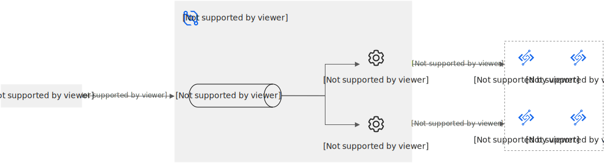

# 云产品事件触发器概述

除了函数计算普通类型的触发器用于实现特定场景，例如定时任务、API服务等，函数计算还提供一种系统间自动集成、实时响应和应用场景更加灵活的云产品事件触发器。云产品事件触发器是通过事件总线EventBridge服务来实现的触发方式，提供集中化的事件管理系统，便于统一管理来自不同云产品的事件。您可以根据需要选择合理的触发器类型。

## 什么是云产品事件触发器

在事件驱动模型中，事件源是事件的生产者，函数是事件的处理者，而触发器提供了一种集中、统一的方式来管理不同的事件源。事件总线EventBridge不是单一的事件源，而是作为阿里云官方事件源的事件中心，支持包括弹性计算、存储服务、数据库、容器、大数据处理、可观测性服务及中间件服务在内的几乎所有阿里云官方事件源。事件总线EventBridge支持阿里云官方事件源作为触发源触发相关函数执行，形成云产品事件触发器。实现原理如下图。

## 优势

- 自动集成
  
  事件总线EventBridge与函数计算集成之后，事件总线EventBridge和函数计算的触发源将会同步。当事件总线EventBridge侧增加事件源后，函数计算同步更新触发器的触发源，降低后续对接成本。
- 可扩展性
  
  原生触发器的配置相对比较简单，如果需要处理更复杂的逻辑，例如为OSS触发器设置多个文件前缀和后缀过滤条件或者在一个Bucket中关联10个以上的触发器时，可以使用云产品事件触发器类型中的OSS触发器。更多信息，请参见[OSS触发器概述](https://help.aliyun.com/zh/functioncompute/fc/user-guide/overview-of-oss-trigger)。
- 实时可靠
  
  事件总线EventBridge用于低延迟、高吞吐量的事件传递，确保事件能够及时且准确地送达目标函数，同时提供了事件重试和死信队列机制，增强了系统的稳定性和可靠性。

## **示例场景**

- 数据处理与分析
  
  例如，当对象存储OSS中新增文件时，触发函数自动进行图片压缩、格式转换或内容审核。
- 资源管理和优化
  
  例如，当云服务器 ECS实例状态改变，例如启动、停止或重启时，触发函数自动调整关联资源。

更多使用场景，请参见[云产品事件触发器包含的云服务及其事件类型](#section-zbd-kx3-i4a)。

## 云产品事件触发器包含的云服务及其事件类型

云产品事件触发器是云监控触发器、云服务器ECS触发器、阿里云物联网IoT触发器等多种云服务类型的触发器的统称。其中包含的云服务及其事件类型如下所示。

## 弹性计算

| [云服务器ECS事件](https://help.aliyun.com/zh/eventbridge/user-guide/ecs-events) 云服务器事件类型包括保留云盘、挂载或者卸载数据盘和块存储欠费释放等。 | [弹性容器实例事件](https://help.aliyun.com/zh/eventbridge/user-guide/eci-events) 弹性容器实例事件类型包括阿里云平台对资源执行的操作事件、API调用和控制台的操作事件。 | [弹性高性能计算E-HPC事件](https://help.aliyun.com/zh/eventbridge/user-guide/e-hpc-events) 弹性高性能计算事件类型包括阿里云平台对资源执行的操作事件、API调用和控制台的操作事件。 |
| --- | --- | --- |
| [批量计算事件](https://help.aliyun.com/zh/eventbridge/user-guide/batch-compute-events) 批量计算事件类型包括Job已取消事件、Instance已经Ready事件和Project创建事件等。 | [弹性伸缩事件](https://help.aliyun.com/zh/eventbridge/user-guide/auto-scaling-events) 弹性伸缩事件类型包括阿里云平台对资源执行的操作事件、API调用和控制台的操作事件等。 | [资源编排事件](https://help.aliyun.com/zh/eventbridge/user-guide/ros-events) 资源编排事件类型包括资源栈创建完成、资源栈删除完成和资源栈回滚完成等。 |
| [系统运维管理 OOS（CloudOps Orchestration Service）事件](https://help.aliyun.com/zh/eventbridge/user-guide/oos-events) 系统运维管理事件类型包括阿里云平台对资源执行的操作事件、API调用和控制台的操作事件。 | [函数计算事件](https://help.aliyun.com/zh/eventbridge/user-guide/function-compute-events) 函数计算事件类型包括阿里云平台对资源执行的操作事件、API调用和控制台的操作事件。 | [弹性加速计算实例EAIS事件](https://help.aliyun.com/zh/eventbridge/user-guide/eais-events) 弹性加速计算实例EAIS事件类型仅包括网络变更。 |
| [Serverless应用引擎事件](https://help.aliyun.com/zh/eventbridge/user-guide/sae-events) Serverless应用引擎事件类型包括阿里云平台对资源执行的操作事件、API调用和控制台的操作事件。 |  |  |

## 存储

| [对象存储OSS事件](https://help.aliyun.com/zh/eventbridge/user-guide/oss-events) 对象存储OSS事件类型包括阿里云平台对资源执行的操作事件、API调用和控制台的操作事件等。 | [表格存储Tablestore事件](https://help.aliyun.com/zh/eventbridge/user-guide/tablestore-events) 表格存储Tablestore事件类型包括阿里云平台对资源执行的操作事件、API调用和控制台的操作事件。 | [文件存储NAS事件](https://help.aliyun.com/zh/eventbridge/user-guide/nas-events) 文件存储NAS事件类型包括阿里云平台对资源执行的操作事件、API调用和控制台的操作事件。 |
| --- | --- | --- |
| [数据库文件存储事件](https://help.aliyun.com/zh/eventbridge/user-guide/dbfs-events) 数据库文件存储事件类型包括阿里云平台对资源执行的操作事件、API调用和控制台的操作事件。 | [智能媒体管理IMM事件](https://help.aliyun.com/zh/eventbridge/user-guide/imm-events) 智能媒体管理事件类型包括索引文件元信息、更新文件元信息和删除文件元信息等。 | [块存储事件](https://help.aliyun.com/zh/eventbridge/user-guide/block-storage-events) 块存储事件类型包括阿里云平台对资源执行的操作事件、API调用和控制台的操作事件。 |

## 数据库

| [云原生关系型数据库PolarDB事件](https://help.aliyun.com/zh/eventbridge/user-guide/polardb-events) 云原生数据库PolarDB事件类型包括实例主备切换（故障切换）、实例故障结束和实例故障开始等。 | [云原生分布式数据库PolarDB-X事件](https://help.aliyun.com/zh/eventbridge/user-guide/polardb-x-events) 云原生分布式数据库事件类型包括阿里云平台对资源执行的操作事件、API调用和控制台的操作事件。 | [云数据库RDS事件](https://help.aliyun.com/zh/eventbridge/user-guide/apsaradb-rds-events) 云数据库RDS事件类型包括阿里云平台对资源执行的操作事件、API调用和控制台的操作事件。 |
| --- | --- | --- |
| [云数据库HBase事件](https://help.aliyun.com/zh/eventbridge/user-guide/apsaradb-for-hbase-events) 云数据库HBase事件类型包括阿里云平台对资源执行的操作事件、API调用和控制台的操作事件。 | [云数据库Cassandra事件](https://help.aliyun.com/zh/eventbridge/user-guide/apsaradb-for-cassandra-events) 云数据库Cassandra事件类型包括阿里云平台对资源执行的操作事件、API调用和控制台的操作事件。 | [云原生数据仓库AnalyticDB MySQL事件](https://help.aliyun.com/zh/eventbridge/user-guide/analyticdb-for-mysql-events) 云原生数仓事件类型包括阿里云平台对资源执行的操作事件、API调用和控制台的操作事件。 |
| [数据传输服务DTS事件](https://help.aliyun.com/zh/eventbridge/user-guide/dts-events) 数据传输服务事件类型包括迁移任务异常、迁移任务恢复和迁移任务出错等。 | [云原生数据仓库 AnalyticDB PostgreSQL 版事件](https://help.aliyun.com/zh/eventbridge/user-guide/analyticdb-for-postgresql-events) 云原生数据仓库 AnalyticDB PostgreSQL 版事件类型包括计算组CPU水位超过90%、计算组内存水位超过85%和最大计算组存储水位超过80%等。 | [数据灾备事件](https://help.aliyun.com/zh/eventbridge/user-guide/data-disaster-recovery-events) 数据灾备事件类型包括关闭增量日志备份、增量备份异常和数据恢复异常等。 |
| [云数据库 Tair（兼容 Redis）事件](https://help.aliyun.com/zh/eventbridge/user-guide/tair-redis-oss-compatible-events) 云数据库 Tair（兼容 Redis）事件类型包括实例主备切换（故障切换）、实例故障结束和实例故障开始。 | [云数据库MongoDB事件](https://help.aliyun.com/zh/eventbridge/user-guide/apsaradb-for-mongodb-events) 云数据库MongoDB事件类型包括实例主备切换（故障切换）、实例故障结束和实例故障开始。 | [云数据库MySQL事件](https://help.aliyun.com/zh/eventbridge/user-guide/apsaradb-rds-for-mysql-events) 云数据库MySQL事件类型包括资源弹性计划执行延迟和资源弹性计划执行失败。 |
| [时间序列数据库TSDB事件](https://help.aliyun.com/zh/eventbridge/user-guide/time-series-database-tsdb-events) 时间序列数据库TSDB事件类型包括资源变更投递和资源评估不合规通知。 |  |  |

## 安全

| [云安全中心事件](https://help.aliyun.com/zh/eventbridge/user-guide/security-center-events) 云安全中心事件类型包括阿里云平台对资源执行的操作事件、API调用和控制台的操作事件。 | [Web应用防火墙事件](https://help.aliyun.com/zh/eventbridge/user-guide/waf-events) Web应用防火墙事件类型包括访问控制事件、CC攻击事件和Web攻击事件等。 | [操作审计事件](https://help.aliyun.com/zh/eventbridge/user-guide/actiontrail-events) 操作审计事件类型包括阿里云平台对资源执行的操作事件、API调用和控制台中的操作事件等。 |
| --- | --- | --- |
| [访问控制事件](https://help.aliyun.com/zh/eventbridge/user-guide/ram-events) 访问控制事件类型包括阿里云平台对资源执行的操作事件、API调用和控制台的操作事件。 | [数据库审计事件](https://help.aliyun.com/zh/eventbridge/user-guide/dbaudit-events) 数据库审计事件类型包括阿里云平台对资源执行的操作事件、API调用和控制台的操作事件。 | [密钥管理服务事件](https://help.aliyun.com/zh/eventbridge/user-guide/kms-events) 密钥管理服务事件类型包括阿里云平台对资源执行的操作事件、API调用和控制台的操作事件。 |
| [风险识别事件](https://help.aliyun.com/zh/eventbridge/user-guide/fraud-detection-events) 风险识别事件类型包括阿里云平台对资源执行的操作事件、API调用和控制台的操作事件。 | [安骑士事件](https://help.aliyun.com/zh/eventbridge/user-guide/server-guard-events) 安骑士事件类型包括阿里云平台对资源执行的操作事件、API调用和控制台的操作事件。 | [DDoS防护事件](https://help.aliyun.com/zh/eventbridge/user-guide/anti-ddos-events) DDoS防护事件类型包括黑洞事件、清洗事件和黑洞解除事件等。 |
| [云防火墙事件](https://help.aliyun.com/zh/eventbridge/user-guide/cfw-events) 云防火墙事件类型包括互联网流量峰值超过购买带宽规格和安全事件告警通知。 |  |  |

## 大数据

| [E-MapReduce事件](https://help.aliyun.com/zh/eventbridge/user-guide/emr-events) E-MapReduce事件类型包括阿里云平台对资源执行的操作事件、API调用和控制台的操作事件等。 | [阿里云Elasticsearch事件](https://help.aliyun.com/zh/eventbridge/user-guide/elasticsearch-events) 阿里云Elasticsearch事件类型包括阿里云平台对资源执行的操作事件、API调用和控制台的操作事件。 | [交互式分析事件](https://help.aliyun.com/zh/eventbridge/user-guide/hologres-events) 交互式分析事件类型包括阿里云平台对资源执行的操作事件、API调用和控制台的操作事件。 |
| --- | --- | --- |
| [开放搜索事件](https://help.aliyun.com/zh/eventbridge/user-guide/open-search-events) 开放搜索事件类型包括阿里云平台对资源执行的操作事件、API调用和控制台的操作事件。 | [Quick BI事件](https://help.aliyun.com/zh/eventbridge/user-guide/quick-bi-events) Quick BI事件类型包括阿里云平台对资源执行的操作事件、API调用和控制台的操作事件。 | [DataV数据可视化事件](https://help.aliyun.com/zh/eventbridge/user-guide/datav-events) DataV数据可视化事件类型包括阿里云平台对资源执行的操作事件、API调用和控制台的操作事件。 |
| [智能推荐事件](https://help.aliyun.com/zh/eventbridge/user-guide/airec-events) 智能推荐事件类型包括阿里云平台对资源执行的操作事件、API调用和控制台的操作事件。 | [数据湖构建事件](https://help.aliyun.com/zh/eventbridge/user-guide/dlf-events) 数据湖构建事件类型包括入湖任务已失败、入湖任务已取消和入湖任务已重新启动。 |  |

## 人工智能

| [城市视觉智能引擎事件](https://help.aliyun.com/zh/eventbridge/user-guide/city-visual-intelligence-engine-events) 城市视觉智能引擎事件类型包括阿里云平台对资源执行的操作事件、API调用和控制台的操作事件。 | [多媒体AI事件](https://help.aliyun.com/zh/eventbridge/user-guide/multimedia-ai-events) 多媒体AI事件类型包括阿里云平台对资源执行的操作事件、API调用和控制台的操作事件。 | [视觉智能开放平台事件](https://help.aliyun.com/zh/eventbridge/user-guide/visual-intelligence-api-events) 视觉智能开放平台事件类型包括阿里云平台对资源执行的操作事件、API调用和控制台的操作事件。 |
| --- | --- | --- |

## 网络和CDN

| [专有网络VPC事件](https://help.aliyun.com/zh/eventbridge/user-guide/vpc-events) 专有网络VPC事件类型包括阿里云平台对资源执行的操作事件、API调用和控制台的操作事件。 | [负载均衡事件](https://help.aliyun.com/zh/eventbridge/user-guide/slb-events) 负载均衡事件类型包括阿里云平台对资源执行的操作事件、API调用和控制台的操作事件等。 | [云企业网事件](https://help.aliyun.com/zh/eventbridge/user-guide/cloud-enterprise-network-events) 云企业网事件类型包括阿里云平台对资源执行的操作事件、API调用和控制台的操作事件等。 |
| --- | --- | --- |
| [智能接入网关事件](https://help.aliyun.com/zh/eventbridge/user-guide/smart-access-gateway-events) 智能接入网关事件类型包括接入点切换事件、网络连接断开事件和设备被攻击事件等。 | [CDN事件](https://help.aliyun.com/zh/eventbridge/user-guide/cdn-events) CDN事件类型包括阿里云平台对资源执行的操作事件、API调用和控制台的操作事件。 | [边缘安全加速ESA事件](https://help.aliyun.com/zh/eventbridge/user-guide/esa-events) 全站加速事件类型包括阿里云平台对资源执行的操作事件、API调用和控制台的操作事件。 |
| [边缘节点服务ENS事件](https://help.aliyun.com/zh/eventbridge/user-guide/ens-events) 边缘节点服务事件类型包括阿里云平台对资源执行的操作事件、API调用和控制台的操作事件等。 | [VPN网关事件](https://help.aliyun.com/zh/eventbridge/user-guide/vpn-gateway-events) VPN网关事件类型包括证书到期、健康检查失败和健康检查成功等。 | [私网连接事件](https://help.aliyun.com/zh/eventbridge/user-guide/privatelink-events) 私网连接事件类型包括终端节点连接被接受、终端节点连接被拒绝和终端节点新增zone建立连接等。 |
| [云解析PrivateZone事件](https://help.aliyun.com/zh/eventbridge/user-guide/alibaba-cloud-dns-privatezone-events) 云解析PrivateZone事件类型仅包括当前账号下DNS请求QPS超限。 | [云解析DNS事件](https://help.aliyun.com/zh/eventbridge/user-guide/alibaba-cloud-dns-events) 云解析DNS事件类型包括远程控制-高级、挖矿-高级和恶意软件-高级等。 |  |

## 视频服务

| [视频直播事件](https://help.aliyun.com/zh/eventbridge/user-guide/apsaravideo-live-events) 视频直播事件类型包括阿里云平台对资源执行的操作事件、API调用和控制台的操作事件。 | [音视频通信事件](https://help.aliyun.com/zh/eventbridge/user-guide/real-time-communication-events) 音视频通信事件类型包括阿里云平台对资源执行的操作事件、API调用和控制台的操作事件。 | [视频点播事件](https://help.aliyun.com/zh/eventbridge/user-guide/apsaravideo-vod-events) 视频点播事件类型包括阿里云平台对资源执行的操作事件、API调用和控制台的操作事件。 |
| --- | --- | --- |
| [云会议事件](https://help.aliyun.com/zh/eventbridge/user-guide/cloud-video-conferencing-events) 云会议事件类型包括会议状态、成员状态和会员操作等。 | [媒体处理事件](https://help.aliyun.com/zh/eventbridge/user-guide/apsaravideo-for-media-processing-events) 媒体处理事件类型包括阿里云平台对资源执行的操作事件、API调用和控制台的操作事件。 | [视频边缘智能服务事件](https://help.aliyun.com/zh/eventbridge/user-guide/linkvisual-events) 视频边缘智能服务事件类型包括阿里云平台对资源执行的操作事件、API调用和控制台的操作事件。 |

### 容器和中间件

| [容器服务事件](https://help.aliyun.com/zh/eventbridge/user-guide/ack-events) 容器服务事件类型包括通过ARMS采集的K8s事件、Node相关的K8s事件和Pod相关的K8s事件。 | [容器镜像服务事件](https://help.aliyun.com/zh/eventbridge/user-guide/container-registry-events) 容器镜像服务事件类型包括阿里云平台对资源执行的操作事件、API调用和控制台的操作事件。 | [微服务引擎事件](https://help.aliyun.com/zh/eventbridge/user-guide/mse-events) 微服务引擎事件类型包括优雅下线、离群摘除和离群摘除恢复等。 |
| --- | --- | --- |
| [企业级分布式应用服务事件](https://help.aliyun.com/zh/eventbridge/user-guide/edas-events) 企业级分布式应用服务事件类型包括应用变更。 | [消息队列Kafka版事件](https://help.aliyun.com/zh/eventbridge/user-guide/apsaramq-for-kafka-events) 云消息队列 Kafka 版事件类型包括阿里云平台对资源执行的操作事件、API调用和控制台的操作事件。 | [消息队列RocketMQ版事件](https://help.aliyun.com/zh/eventbridge/user-guide/apsaramq-for-rocketmq-events) 消息队列RocketMQ版事件类型包括阿里云平台对资源执行的操作事件、API调用、控制台的操作事件、资源变更投递和资源评估不合规通知。 |

### 开发和运维

| [应用实时监控事件](https://help.aliyun.com/zh/eventbridge/user-guide/arms-events) 应用实时监控事件类型包括agent启动、死锁和内存溢出等。 | [云监控事件](https://help.aliyun.com/zh/eventbridge/user-guide/cloudmonitor-events) 云监控事件类型包括阿里云平台对资源执行的操作事件、API调用和控制台的操作事件等。 | [性能测试PTS事件](https://help.aliyun.com/zh/eventbridge/user-guide/pts-events) 性能测试事件类型包括阿里云平台对资源执行的操作事件、API调用和控制台的操作事件。 |
| --- | --- | --- |
| [配置审计事件](https://help.aliyun.com/zh/eventbridge/user-guide/cloud-config-events) 配置审计事件类型包括阿里云平台对资源执行的操作事件、API调用、控制台的操作事件和配置项变更。 | [资源管理事件](https://help.aliyun.com/zh/eventbridge/user-guide/resource-management-events) 资源管理事件类型包括资源变更投递和资源评估不合规通知事件。 |  |

### 域名和网站

[域名事件](https://help.aliyun.com/zh/eventbridge/user-guide/domains-events)

域名事件类型包括阿里云平台对资源执行的操作事件、API调用和控制台的操作事件。

### 物联网

[阿里云物联网平台事件](https://help.aliyun.com/zh/eventbridge/user-guide/iot-platform-events)

阿里云物联网平台事件类型包括阿里云平台对资源执行的操作事件、API调用和控制台的操作事件等。

### 企业应用与服务

[区块链服务BaaS事件](https://help.aliyun.com/zh/eventbridge/user-guide/baas-events)

区块链服务BaaS事件类型包括阿里云平台对资源执行的操作事件、API调用和控制台的操作事件。

## 企业服务与云通信

[邮件推送事件](https://help.aliyun.com/zh/eventbridge/user-guide/events-of-the-direct-mail-type)

邮件推送事件类型包括邮件投递失败、邮件投递成功、点击事件和打开事件。

## **相关文档**

云产品事件触发器不支持通过Serverless Devs工具创建。您可以通过调用API或通过[函数计算控制台](https://fcnext.console.aliyun.com/)创建。更多信息，请参见以下文档：

- [CreateTrigger - 创建触发器](https://help.aliyun.com/zh/functioncompute/fc/developer-reference/api-fc-2023-03-30-createtrigger)
- [通过控制台配置云产品事件触发器](https://help.aliyun.com/zh/functioncompute/fc/user-guide/configure-event-triggers-for-alibaba-cloud-services)
