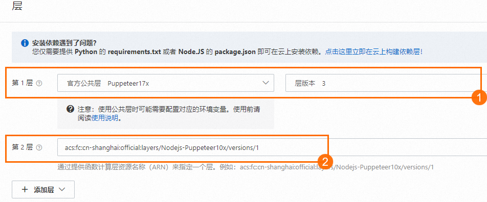

# 为函数安装第三方依赖

函数计算的各运行环境中已内置常用的依赖，供您直接在函数中引用。如果这些内置依赖不能满足您的项目需求，可以安装额外的第三方依赖。本文介绍如何为函数安装第三方依赖。

## 背景信息

您可以在以下文档的内置模块章节，查看函数计算内置的常用依赖。

- [Node.js内置模块](https://help.aliyun.com/zh/functioncompute/fc-3-0/user-guide/runtime-overview-1#section-72g-u4c-26d)
- [Python内置模块](https://help.aliyun.com/zh/functioncompute/fc-3-0/user-guide/runtime-overview-2#section-kiq-3ri-pzj)
- [PHP内置库](https://help.aliyun.com/zh/functioncompute/fc-3-0/user-guide/overview-php#section-uet-o0g-h85)
- [Java环境说明](https://help.aliyun.com/zh/functioncompute/runtime-overview-3)
- [C#环境说明](https://help.aliyun.com/zh/functioncompute/overview-31)
- [Go环境说明](https://help.aliyun.com/zh/functioncompute/fc-3-0/user-guide/overview-of-runtimes-1)
- [Custom Runtime环境说明](https://help.aliyun.com/zh/functioncompute/fc-3-0/user-guide/overview-10-2)

## 通过层安装依赖

函数计算已经发布的官方公共层预装了常见的依赖库，可以直接使用，您也可以构建自定义层安装所需依赖。如您想获取更多的公开层，请参见[awesome-layers](https://github.com/awesome-fc/awesome-layers)。

### 使用公共层安装依赖

- **官方公共层**
  
  登录[函数计算控制台](https://fcnext.console.aliyun.com)，找到目标函数，选择**配置**页签，单击**高级配置**右侧的**编辑**，在**高级配置**面板，选择**添加自定义层**。效果如图示中①。
- **非官方公共层**
  
  在[awesome-layers](https://github.com/awesome-fc/awesome-layers)找到目标层，获取层ARN。在函数详情页面，选择**配置**页签，单击**高级配置**右侧的**编辑**，在**高级配置**面板，选择**通过 ARN 添加层**。效果如图示中②。



### 构建自定义层安装依赖

- **通过控制台在线构建层**
  
  登录[函数计算控制台](https://fcnext.console.aliyun.com)，在左侧导航栏，选择**高级功能**>**层**。具体操作，请参见[创建自定义层](https://help.aliyun.com/zh/functioncompute/fc/user-guide/create-a-custom-layer-1)。
  
  **
  
  **说明**
  
  此方式不支持包含系统动态链接库（.so）的依赖，例如Node.js的依赖库Puppeteer。如果依赖包含动态链接库（.so），推荐**使用Dockerfile文件构建层**。
- **本地构建层**
  
  您可以在本地直接构建自定义层。具体操作，请参见[构建层的ZIP包](https://help.aliyun.com/zh/functioncompute/fc/user-guide/create-a-custom-layer-1#section-jos-h78-3xb)。使用此方式需要确保本地的操作系统和处理器架构与函数计算运行时环境完全一致，即架构为x86_64的Linux系统，或者安装的依赖库不依赖底层环境和处理器架构。否则，推荐您**使用控制台在线构建层**或者**使用Dockerfile方式构建层**。
  
  例如，Python的科学计算库[numpy](https://numpy.org/?spm=a2c4g.11186623.0.0.56e5417cDTnWes)对底层环境有依赖，如果使用M1芯片的Mac系统，不能使用本地构建方式安装依赖。
- **使用Dockerfile文件构建层**
  
  如果依赖包含底层动态链接库，或者在本地安装依赖失败，可以使用Dockerfile的方式安装。具体操作，请参见[如何基于Dockerfile构建层](https://help.aliyun.com/zh/functioncompute/fc/user-guide/use-a-dockerfile-to-build-a-layer-1)。

## 通过函数计算控制台安装依赖

### 打包依赖并上传到控制台

1. 将第三方依赖与代码文件打包。
  
  **
  
  **重要**
  
  - 您需要进入代码目录，打包所有文件。打包完成后，入口函数文件需要位于包内的根目录。
  - 不同系统下打包方式不同，请您根据实际情况选择合适的打包方式。
2. 登录[函数计算控制台](https://fcnext.console.aliyun.com)，找到目标函数，在函数详情页面，选择通过**上传 ZIP 包**、**上传文件夹**或**通过 OSS 上传**的方式上传代码包，然后单击**部署代码**。

### 通过控制台Web IDE终端安装依赖

1. 登录[函数计算控制台](https://fcnext.console.aliyun.com)，找到目标函数。
2. 在函数详情页面，单击**代码**页签，然后在Web IDE界面，选择，在终端窗口，执行命令`pip install -t . <PackageName>`安装依赖。
  
  ```
  pip install -t . <PackageName> # PackageName为依赖包的名称 -t 表示指定安装路径 .为安装到当前路径下
  ```
3. 单击**部署代码**，使上一步安装的依赖生效。

## 使用Serverless Devs安装依赖

通过函数计算的Serverless Devs，创建并部署函数。具体操作，请参见[Serverless Devs常用命令](https://help.aliyun.com/zh/functioncompute/fc/developer-reference/serverless-devs-commands-1)。

## **更多信息**

关于函数计算安装第三方依赖的总结，请参见[函数计算安装依赖库方法小结](https://yq.aliyun.com/articles/602147?spm=a2c4g.11186623.2.17.5c1615706QhnrV)。
