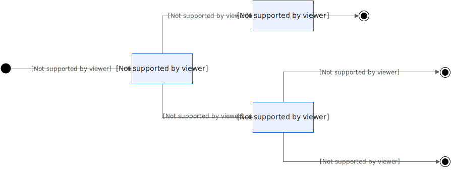
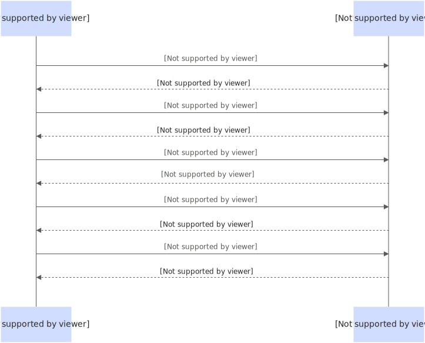

# 会话生命周期管理

在 AI 推理、在线游戏、多租户 SaaS 等需要保持状态的场景中，管理持久化状态与多租户数据隔离是一项核心挑战。函数计算将会话（Session）升级为显式资源，提供完整的生命周期管理 API，以实现实例预热和精细化的资源控制。针对多租户场景，您还可以在创建会话时动态挂载专属的持久化存储，从文件系统层面确保数据的严格隔离。

## **使用场景**

### **场景一：AI Sandbox 智能算力服务**

- 模型与数据预加载：通过`CreateSession`API 预创建会话并预热实例，在初始化阶段加载大模型权重，显著提升首次推理的响应速度。
- 安全的数据隔离与挂载：在创建会话时，为不同租户动态挂载其专属的 NAS 目录，并指定独立的 POSIX 用户身份（UID/GID）。这确保了各租户的数据集、模型分片在物理共享的存储上逻辑完全隔离，按需安全加载。
- 生命周期自主管控：通过 API 主动销毁空闲会话以释放算力资源，或延长高优先级任务的会话存活时间，实现成本与性能的平衡。

### **场景二：在线游戏服务**

- 会话状态保持：利用会话亲和性，将玩家的实时状态（如位置、装备）缓存在特定实例中，确保高频交互的低延迟。会话专属的持久化存储可用于可靠地保存关键游戏存档。
- TTL 精准管理：为匹配队列、战斗房间等不同场景的玩家会话设置独立的浅休眠（原闲置）超时（TTL）策略，避免“僵尸会话”持续占用资源。

## **功能说明**

| **功能列表** | **行为说明** |
| --- | --- |
| [创建会话资源](https://help.aliyun.com/zh/functioncompute/fc/developer-reference/api-fc-2023-03-30-createsession) | 1. 创建一个显式会话资源，并预分配绑定函数实例，会话 ID 有两种生成方式：<br>1. 客户端自定义会话ID，并通过请求传入。（仅适用于HeaderField亲和）<br>1. 长度限制[1,64]。<br>2. id规范：必须以字母（大写或小写）、数字或下划线开头。非首字符可以是字母（大写或小写）、数字、下划线或连字符。<br>2. 客户端不自定义，服务端生成全局唯一的会话ID并通过响应返回。（同时适用于HeaderField、Cookie亲和）<br>2. 支持在创建时通过`nas_config`参数为会话动态挂载专属的持久化存储目录，并指定其在文件系统中的用户与组ID（UID/GID）。<br>3. 支持指定会话浅休眠过期时间SessionIdleTimeoutInSeconds和会话生命周期参数SessionTTLInSeconds，未指定时使用函数默认配置。<br>4. 适用于HeaderField和Cookie亲和类型。<br>5. 若未提前调用 CreateSession，也可通过InvokeFunction携带会话ID实现亲和。<br>6. 可通过`DisableSessionIDReuse`参数指定会话过期后是否复用：<br>1. `DisableSessionIDReuse`值为 false（默认行为）：复用会话。当会话过期后，请求携带会话继续发起请求，系统会作为一个新的会话继续提供服务，并重新计算会话生命周期，但不保证和历史会话绑定相同实例。<br>2. `DisableSessionIDReuse`值为 true：不复用会话。当会话过期后，请求携带会话继续发起请求，系统将拒绝服务，并返回明确错误提示信息。此能力仅对会话过期后 3 天内有效。如会话过期 3 天后携带会话ID再次发起请求，系统不会拒绝服务，并作为新会话提供服务。<br>3. 如果用户通过 deleteSession API 显示删除会话，则不复用会话失效。 |
| [获取会话配置信息](https://help.aliyun.com/zh/functioncompute/fc/developer-reference/api-fc-2023-03-30-getsession) | 1. 获取指定会话的详细信息，包括 SessionID、关联函数、亲和类型、生命周期配置、状态及实例信息。<br>2. 支持按 functionName 和 qualifier 精确定位。<br>3. 返回指定Active会话的完整配置信息，无法获取过期或 DeleteSession 主动删除的会话信息。 |
| [查询会话信息列表](https://help.aliyun.com/zh/functioncompute/fc/developer-reference/api-fc-2023-03-30-listsessions) | 列举指定函数下的会话列表，支持按 qualifier、状态、sessionID 过滤，并支持分页查询。<br>1. 单次最多返回 100 条记录，默认 20 条。<br>2. 未传 qualifier 或为 LATEST时，返回所有版本下的会话。<br>3. 未传状态时，默认返回 Active 与 Expired 两种状态的会话。 |
| [更新会话配置](https://help.aliyun.com/zh/functioncompute/fc/developer-reference/api-fc-2023-03-30-updatesession) | 更新会话的浅休眠（原闲置）过期时间SessionIdleTimeoutInSeconds和会话生命周期参数SessionTTLInSeconds，更新后立即生效，lastModifiedTime自动刷新。可用于动态延长或缩短会话有效期。<br>注意：更新 TTL 后，时间仍从Session的创建时间计时，而非重新计时。 |
| [删除会话资源](https://help.aliyun.com/zh/functioncompute/fc/developer-reference/api-fc-2023-03-30-deletesession) | 1. 删除指定会话，系统清除相关数据，删除后无法通过 GetSession 或 ListSessions 查询。<br>2. 删除后，携带相同 SessionID 的请求将被视为新会话。<br>3. 删除时若存在正在运行的请求：<br>- 会话隔离场景：相关资源立即释放，正在执行的请求被终止。<br>- 非会话隔离场景：请求继续执行至完成，实现优雅退出。 |

## **工作原理：会话状态转换和生命周期**



### **创建会话**

- 主动创建：调用API[创建会话资源](https://help.aliyun.com/zh/functioncompute/fc/developer-reference/api-fc-2023-03-30-createsession)，成功后状态为Active；
- 被动创建：执行[InvokeFunction](https://help.aliyun.com/zh/functioncompute/fc/developer-reference/api-fc-2023-03-30-invokefunction)首次调用函数时携带自定义SessionID，调用成功后自动创建会话，会话状态为Active。

### **会话销毁**

- 被动销毁：会话生命周期超时或浅休眠（原闲置）过期超时，系统自动将其状态置为Expired。
- 主动销毁：调用API[删除会话资源](https://help.aliyun.com/zh/functioncompute/fc/developer-reference/api-fc-2023-03-30-deletesession)，成功后会话状态为Deleted。
  
  - 隔离模式：会话删除，请求结束并自动释放关联的资源。
  - 非隔离模式：会话删除、运行中的请求优雅结束。包含以下三种情况：
    
    1. 资源释放。
    2. 资源继续处理其他未过期或未删除的会话。
    3. 资源被新会话绑定复用。

**

**说明**

状态流转为单向不可逆：Active → Expired / Deleted，且 Expired 与 Deleted 之间不可相互转换。

### **TTL 与 IdleTimeout 的区别与工作原理**

在会话管理中，系统通常使用两个时间参数来控制会话的有效期：

| 参数 | 含义 |
| --- | --- |
| **sessionTTLInSeconds** | 会话从创建开始的最长**存活时间**，无论是否活跃。 |
| **sessionIdleTimeoutInSeconds** | 会话在**无请求**状态下的最长等待时间；一旦有新请求，计时器重置。 |

关键区别在于：

- **sessionTTLInSeconds**是“硬性上限”：即使一直有请求，超过 TTL 也会被强制销毁。
- **sessionIdleTimeoutInSeconds**是“软性限制”：只要有活动，就能不断延长（但不能超过 TTL）。

## **操作步骤**

### **核心流程概览**

1. 创建函数并开启会话亲和功能；
2. 调用`CreateSession`API 创建会话，如需为会话挂载持久化存储，可以在请求中继续添加`nas_config`参数进行配置；
3. 在调用`InvokeFunction`时携带`sessionId`，将请求路由到已绑定存储的会话实例；
4. 根据需要调用`UpdateSession`或`DeleteSession`管理会话生命周期。



### **步骤一：开启会话亲和功能**

在[创建函数](https://help.aliyun.com/zh/functioncompute/fc/user-guide/function-instance-1/)或更新函数配置时，开启[配置会话亲和](https://help.aliyun.com/zh/functioncompute/fc/user-guide/configure-session-affinity/)。以 HeaderField 亲和为例，需指定一个 Header Key（例如：`x-affinity-header-v1`）用于传递 SessionID。下面以**更新已有函数配置**为例：

1. 登录[函数计算控制台](https://fcnext.console.aliyun.com/us-west-1/functions?resourceGroupId=rg-acfmxoiz32ifgaa)，点击**函数管理**>**函数列表**
2. 在**函数列表**页，点击需要配置的函数名称，进入函数详情页
3. 在**配置**页，找到**高级配置**，点击
4. 打开**会话亲和**开关，选择**HeaderField 亲和**并配置**Header Name**，例如：`x-affinity-header-v1`
  
  **
  
  **说明**
  
  不能以`x-fc-`前缀开头，以字母开头，非首字符可包含数字、中划线、下划线、字母，长度大于等于5个字符并且不超过40个字符。
5. 点击**部署**完成配置更新。

### **步骤二：创建会话资源**

本文以Python SDK为例，调用API[创建会话资源](https://help.aliyun.com/zh/functioncompute/fc/developer-reference/api-fc-2023-03-30-createsession)，创建会话。

1. 安装SDK依赖包
  
  ## macOS / Linux
  
  ```
  # 使用 pip3 安装 pip3 install alibabacloud_fc20230330 alibabacloud_credentials alibabacloud_tea_openapi alibabacloud_tea_util # 如遇权限问题，使用 --user 参数 pip3 install --user alibabacloud_fc20230330 alibabacloud_credentials alibabacloud_tea_openapi alibabacloud_tea_util # macOS Homebrew Python 环境需使用 --break-system-packages pip3 install --break-system-packages alibabacloud_fc20230330 alibabacloud_credentials alibabacloud_tea_openapi alibabacloud_tea_util
  ```
  
  ## Windows
  
  ```
  # 使用 pip 安装 pip install alibabacloud_fc20230330 alibabacloud_credentials alibabacloud_tea_openapi alibabacloud_tea_util # 或使用 Python 3 指定 py -3 -m pip install alibabacloud_fc20230330 alibabacloud_credentials alibabacloud_tea_openapi alibabacloud_tea_util
  ```
2. 编写创建会话核心代码
  
  创建python代码文件（如：`creatSession.py`），将下列代码复制到文件中并替换核心参数。
  
  **核心方法及核心参数说明：**
  
  - `config.endpoint`：
    
    - <账号ID>：替换为阿里云账号ID；
    - <Endpoint>：请参考[函数计算3.0 服务区域列表](https://api.aliyun.com/product/FC)，规则为`fcv3.[region_id].aliyuns.com`；
  - `CreateSessionInput`：
    
    - session_ttlin_seconds：会话总生命周期（单位：秒）；
    - session_idle_timeout_in_seconds：会话浅休眠（原闲置）过期时间（单位：秒）；
  - `client.create_session_with_options`：将<函数名称>替换为创建Session的函数名称；
  
  ```
  # -*- coding: utf-8 -*- from alibabacloud_fc20230330.client import Client as FC20230330Client from alibabacloud_credentials.client import Client as CredentialClient from alibabacloud_tea_openapi import models as open_api_models from alibabacloud_fc20230330 import models as fc20230330_models from alibabacloud_tea_util import models as util_models # 1. 创建账号Client credential = CredentialClient() config = open_api_models.Config(credential=credential) config.endpoint = f'<账号ID>.<Endpoint>' client = FC20230330Client(config) # 2. 构造 CreateSession 请求 create_session_input = fc20230330_models.CreateSessionInput( session_ttlin_seconds=3600, session_idle_timeout_in_seconds=600 ) create_session_request = fc20230330_models.CreateSessionRequest( body=create_session_input ) # 3. 发起请求 runtime = util_models.RuntimeOptions() response = client.create_session_with_options('<函数名称>', create_session_request, {}, runtime) # 4. 从响应中获取 sessionId print(response.body.to_map()) session_id = response.body.session_id print(f"Session created successfully. Session ID: {session_id}")
  ```

### **步骤三：（可选）配置动态存储**

**

**说明**

配置会话隔离动态挂载前，请注意不同存储协议的地域支持情况：

- OSS 挂载： 适用于华南1（深圳）、中国香港、新加坡及美西（硅谷）地域。
- NAS 挂载： 已实现全地域覆盖，如需使用请联系 FC 团队配置白名单。
- PolarFS 挂载： 目前支持中国香港、美西（硅谷）地域。使用前需由 FC 和 PolarFS 侧共同完成白名单加白。
  
  注：PolarFS 存储侧目前已在美西、北京、上海、乌兰察布、中国香港开服。

1. **配置函数：**如需对会话配置动态存储，函数需要进行如下配置：
  
  1. **实例隔离**：开启**配置**>**高级配置**>**实例隔离**，并选择**会话隔离**；
  2. **允许访问 VPC**：
    
    - 开启**配置**>**高级配置**>**网络**>**允许访问 VPC**；
    - **配置方式**选择**自定义配置**；
    - **专有网络**选择挂载点所在的 VPC。
2. **添加**`**nas_config**`**配置：**在[步骤二：创建会话资源](#615b34f7ade1v)的代码中，参考如下代码加入配置`nas_config`对象来指定挂载信息和用户身份。
  
  **核心方法及参数说明：**
  
  **
  
  **重要**
  
  会话动态挂载NAS和在函数**配置**>**高级配置**>**存储**中挂载NAS可以同时配置，但是需要注意：
  
  - 下文`NASConfig`中定义的`User ID/Group ID`必须与函数挂载配置中使用的用户（`User ID`）/用户组（`Group ID`）保持一致
  - 同一个挂载路径 (`mount_dir`) 不能同时用于会话动态挂载和函数挂载
  
  - `NASConfig`：配置 NAS 和用户身份（为租户A分配独立UID/GID）
    
    - `NASMountConfig`：NAS 挂载配置
      
      - `mount_dir`：实例内的挂载路径，如：`/home/test`
      - `server_addr`：NAS 文件系统地址及租户专属子目录
    - `user_id`：为此会话指定独立的 POSIX User ID
    - `group_id`：为此会话指定独立的 POSIX Group ID

```
# -*- coding: utf-8 -*- from alibabacloud_fc20230330.client import Client as FC20230330Client from alibabacloud_credentials.client import Client as CredentialClient from alibabacloud_tea_openapi import models as open_api_models from alibabacloud_fc20230330 import models as fc20230330_models from alibabacloud_tea_util import models as util_models # 1. 创建账号Client credential = CredentialClient() config = open_api_models.Config(credential=credential) config.endpoint = f'<账号ID>.<Endpoint>' client = FC20230330Client(config) # 2. 准备 NAS 挂载配置 nas_mount_config = fc20230330_models.NASMountConfig( mount_dir='/mnt/data', # 实例内的挂载路径 server_addr='<YOUR-NAS-SERVER-ADDR>:/<tenant-a-path>' # NAS 文件系统地址及租户专属子目录 ) # 3. 配置 NAS 和用户身份（为租户A分配独立UID/GID） nas_config = fc20230330_models.NASConfig( mount_points=[nas_mount_config], user_id=1001, # 为此会话指定独立的 POSIX User ID group_id=1001 # 为此会话指定独立的 POSIX Group ID ) # 4. 构造 CreateSession 请求 create_session_input = fc20230330_models.CreateSessionInput( nas_config=nas_config, session_ttlin_seconds=3600, session_idle_timeout_in_seconds=600 ) create_session_request = fc20230330_models.CreateSessionRequest( body=create_session_input ) # 5. 发起请求 runtime = util_models.RuntimeOptions() response = client.create_session_with_options('<函数名称>', create_session_request, {}, runtime) # 6. 从响应中获取 sessionId print(response.body.to_map()) session_id = response.body.session_id print(f"Session created successfully. Session ID: {session_id}")
```

### **步骤四：运行代码创建会话**

1. 执行如下命令，运行代码
  
  ```
  export ALIBABA_CLOUD_ACCESS_KEY_ID=LTAI**************** export ALIBABA_CLOUD_ACCESS_KEY_SECRET=<yourAccessKeySecret> python3 creatSession.py
  ```
  
  **参数说明：**
  
  - ALIBABA_CLOUD_ACCESS_KEY_ID：阿里云账号或 RAM 用户的[AccessKey ID](https://help.aliyun.com/zh/ram/user-guide/create-an-accesskey-pair)；
  - ALIBABA_CLOUD_ACCESS_KEY_SECRET：阿里云账号或 RAM 用户的[AccessKey Secret](https://help.aliyun.com/zh/ram/user-guide/create-an-accesskey-pair)。
2. 查看返回结果
  
  - 控制台打印结果：
    
    ```
    { 'containerId': 'c-********-********-************', 'createdTime': '2025-10-30T06:38:10Z', 'functionName': '****', 'lastModifiedTime': '2025-10-30T06:38:10Z', 'nasConfig': { 'groupId': 0, 'mountPoints': [ { 'enableTLS': False, 'mountDir': '/home/test', 'serverAddr': '*-*.*.nas.aliyuncs.com:/test' } ], 'userId': 0 }, 'qualifier': 'LATEST', 'sessionAffinityType': 'HEADER_FIELD', 'sessionId': '******************', 'sessionIdleTimeoutInSeconds': 600, 'sessionStatus': 'Active', 'sessionTTLInSeconds': 3600 } Session created successfully. Session ID: ************
    ```

### **步骤五：使用会话调用函数**

调用API[InvokeFunction- 调用函数](https://help.aliyun.com/zh/functioncompute/fc/developer-reference/api-fc-2023-03-30-invokefunction)，使用会话调用函数。

**核心代码示例及说明：**

`InvokeFunctionHeaders`：构造请求头，在请求Header中携带上一步返回的`sessionId`，`Header Key`的值与[步骤一：开启会话亲和功能](#724dc3c6c4q15)设置的值（如：`x-affinity-header-v1`）保持一致，实现会话绑定路由。

```
# -*- coding: utf-8 -*- from alibabacloud_fc20230330.client import Client as FC20230330Client from alibabacloud_credentials.client import Client as CredentialClient from alibabacloud_tea_openapi import models as open_api_models from alibabacloud_fc20230330 import models as fc20230330_models from alibabacloud_tea_util import models as util_models # 1. 创建账号Client credential = CredentialClient() config = open_api_models.Config(credential=credential) config.endpoint = f'<账号ID>.<Endpoint>' client = FC20230330Client(config) # 2. 构造请求头。Header Key ("x-affinity-header-v1") 必须与函数配置的会话亲和 Key 一致。 headers = fc20230330_models.InvokeFunctionHeaders( common_headers={ "x-affinity-header-v1": 'session_id' } ) # 3. 构造调用请求（可根据需要传入 body） invoke_request = fc20230330_models.InvokeFunctionRequest( body='your_request_payload'.encode('utf-8') # 示例 payload ) runtime = util_models.RuntimeOptions() try: # 4. 发起调用 invoke_response = client.invoke_function_with_options( 'your_function_name', invoke_request, headers, runtime ) # 4. 处理响应 print(f"Status Code: {invoke_response.status_code}") print(f"Response Body: {invoke_response.body.decode('utf-8')}") except Exception as error: print(error.message)
```

### **后续步骤：更新与删除会话**

1. 根据业务需要，可调用[更新会话配置](https://help.aliyun.com/zh/functioncompute/fc/developer-reference/api-fc-2023-03-30-updatesession)延长会话有效期等
  
  **
  
  **说明**
  
  在 CreateSession 传入 nas_config 后，不可通过 UpdateSession 进行更新
2. 调用[获取会话配置信息](https://help.aliyun.com/zh/functioncompute/fc/developer-reference/api-fc-2023-03-30-getsession)，获取当前会话的最新配置信息，确认更新结果。
3. 在任务完成后调用[删除会话资源](https://help.aliyun.com/zh/functioncompute/fc/developer-reference/api-fc-2023-03-30-deletesession)，释放会话资源。

## **生产环境建议**

- **UID/GID 规划**：为确保隔离性，必须为每个租户分配唯一的 POSIX UID；
- **目录配额**：为防止单个租户耗尽共享存储空间，建议在 NAS 侧为每个租户的根目录配置目录配额（Directory Quotas）；
- **数据垃圾回收 (GC)**：`[删除会话资源](https://help.aliyun.com/zh/functioncompute/fc/developer-reference/api-fc-2023-03-30-deletesession)`操作不会自动删除 NAS 上的文件数据。需建立配套的异步垃圾回收机制，定期扫描并清理无主的文件目录，以回收存储空间。

## **计费说明**

- 计费从[创建会话资源](https://help.aliyun.com/zh/functioncompute/fc/developer-reference/api-fc-2023-03-30-createsession)成功起开始，按实例运行时长计费。
- 即使会话处于空闲状态，只要未过期或删除，将持续产生费用。
- [删除会话资源](https://help.aliyun.com/zh/functioncompute/fc/developer-reference/api-fc-2023-03-30-deletesession)后计费行为分以下两种情况：
  
  - 非隔离模式下，DeleteSession 不终止正在进行的调用，Session 关联的实例资源费用将持续计费至执行结束。
  - 隔离模式下，DeleteSession终止运行中的请求，销毁绑定的实例资源，终止计费。

会话Active期间，如果有请求，需要按照弹性实例（活跃）单价进行计费，如果无请求，则按照弹性实例（浅休眠（原闲置））单价进行计费。

## **更多示例**

本文以Go SDK为例，更多示例，请参见[OpenAPI Explorer](https://api.aliyun.com/api/FC/2023-03-30/CreateSession?tab=DEMO)。

```
package main import ( "fmt" openapi "github.com/alibabacloud-go/darabonba-openapi/v2/client" fc20230330 "github.com/alibabacloud-go/fc-20230330/v4/client" util "github.com/alibabacloud-go/tea-utils/v2/service" "github.com/alibabacloud-go/tea/tea" ) func main() { config := &openapi.Config{ AccessKeyId: tea.String("xxx"), // 配置 akid 信息 AccessKeySecret: tea.String("xxx"), // 配置 ak secret 信息 Protocol: tea.String("http"), Endpoint: tea.String("xxx"), // 配置 endpoint 信息 } fcClient, err := fc20230330.NewClient(config) if err != nil { panic(err) } funcName := "test-session-function1" qualifier := "LATEST" sessionID, err := createSession(fcClient, funcName, qualifier) if err != nil { panic(err) } err = invokeFunctionWithSession(fcClient, funcName, qualifier, sessionID) if err != nil { panic(err) } err = updateSession(fcClient, funcName, sessionID, qualifier) if err != nil { panic(err) } err = getSession(fcClient, funcName, sessionID, qualifier) if err != nil { panic(err) } err = deleteSession(fcClient, funcName, sessionID, qualifier) if err != nil { panic(err) } return } // 创建 Session 资源 func createSession(fcClient *fc20230330.Client, functionName string, qualifier string) (string, error) { body := fc20230330.CreateSessionInput{ SessionTTLInSeconds: tea.Int64(21500), // 时间可自定义 SessionIdleTimeoutInSeconds: tea.Int64(2000), // 时间可自定义 } req := fc20230330.CreateSessionRequest{ Body: &body, Qualifier: tea.String(qualifier), } resp, err := fcClient.CreateSession(&functionName, &req) if err != nil { return "", err } fmt.Printf("create session success %+v \n", resp.Body.String()) return *resp.Body.SessionId, nil } // 请求会话 func invokeFunctionWithSession(fcClient *fc20230330.Client, functionName string, qualifier string, sessionId string) error { commonHeaders := map[string]*string{ "x-affinity-header-v1": tea.String(sessionId), // key 需和创建函数时指定的 Header Field 一致。 } header := &fc20230330.InvokeFunctionHeaders{ CommonHeaders: commonHeaders, } invokeReq := &fc20230330.InvokeFunctionRequest{ Qualifier: tea.String(qualifier), } _, err := fcClient.InvokeFunctionWithOptions(tea.String(functionName), invokeReq, header, &util.RuntimeOptions{}) return err } // 更新 Session 资源 func updateSession(fcClient *fc20230330.Client, functionName string, sessionId string, qualifier string) error { body := fc20230330.UpdateSessionInput{ SessionTTLInSeconds: tea.Int64(21501), // 时间可更新 SessionIdleTimeoutInSeconds: tea.Int64(2001), // 时间可更新 } req := fc20230330.UpdateSessionRequest{ Body: &body, Qualifier: tea.String(qualifier), } resp, err := fcClient.UpdateSession(&functionName, &sessionId, &req) if err != nil { return err } fmt.Printf("update session success %+v\n ", resp.Body.String()) return nil } // 获取 Session 资源 func getSession(fcClient *fc20230330.Client, functionName string, sessionId string, qualifier string) error { req := &fc20230330.GetSessionRequest{} if qualifier != "" { req.Qualifier = tea.String(qualifier) } getSession, err := fcClient.GetSession(tea.String(functionName), tea.String(sessionId), req) if err != nil { return err } fmt.Printf("get session success %+v ", getSession.Body.String()) return nil } // 删除 Session 资源 func deleteSession(fcClient *fc20230330.Client, functionName string, sessionId string, qualifier string) error { req := fc20230330.DeleteSessionRequest{ Qualifier: tea.String(qualifier), } resp, err := fcClient.DeleteSession(&functionName, &sessionId, &req) if err != nil { return err } fmt.Printf("delete session success %+v\n ", *resp.StatusCode) return nil }
```

## **错误**码

| API | 错误码 | 错误信息 | 错误原因 | 指导建议 |
| --- | --- | --- | --- | --- |
| 通用错误码 | 400 | function has no session affinity config | 函数未配置亲和类型 | 需将函数的亲和类型设置为HeaderField和Cookie亲和类型 |
| 400 | the sessionAffinity of function is invalid, only supports GENERATED_COOKIE and HEADER_FIELD | 函数亲和类型不支持 Session API | 需将函数亲和类型更改为支持的会话亲和类型。 |  |
| 400 | session storage mounts are only supported for session exclusive function | 动态挂载仅支持会话隔离 | 需将函数隔离类型设置为会话隔离 |  |
| 500 | an internal error has occurred. Please retry | 服务端系统错误 | 建议适当重试 |  |
| CreateSession | 400 | sessionId {xxx} already exists | 会话 ID 已经存在，如使用自定义会话ID，传入一个Active状态的会话ID。 | 可核实会话ID是否已经存在。如果希望复用，可通过 DeleteSession API 先删除，再创建。 |
| 400 | SessionID exceeds the maximum allowed length (max: 64, actual: 'xx') | 自定义会话 ID 过长，最大 64。 | 缩短自定义会话ID长度，控制在64个有效字符内。 |  |
| 400 | The provided sessionID is invalid (allowed:'^[a-zA-Z0-9_][a-zA-ZO-9_-]*$') | 自定义会话 ID未遵循正则匹配规则。 | 请按提示的正则规则设置合理的SessionID。 |  |
| GetSession/DeleteSession/UpdateSession | 400 | session %s does not exist, deleted by the user or expired and removed by the system | 会话无效、过期或被删除，无法返回信息。 | 确认会话ID是否有效。 |
