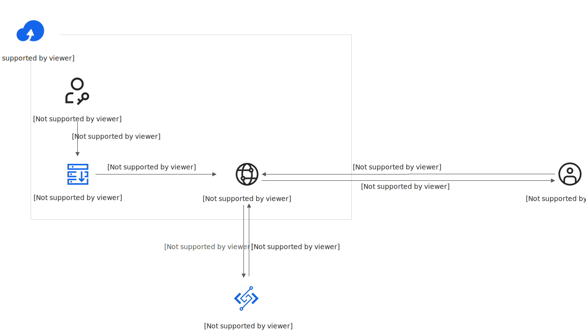

# 创建对象FC接入点通过GetObject请求触发函数

您可以在对象存储 OSS中创建对象FC接入点，实现OSS和函数计算 FC集成。通过对象FC接入点，OSS的`GetObject`事件能自动触发函数执行，并将结果返回给应用程序，实现自动化数据处理和业务流程。

## 方案概览

对象FC接入点的调用原理如下图所示：



1. 创建对象FC接入点，根据业务需求编写特定的FC函数，将该函数与OSS的对象FC接入点关联。
2. Bucket会根据预设配置自动构建对象FC接入点。
3. 用户向对象FC接入点发出GETObject请求时，OSS将自动调用相应的FC函数，并将处理后的数据返回给用户。

## 使用限制

| 限制项 | 说明 |
| --- | --- |
| 创建方式 | 支持通过OSS控制台和API的方式创建对象FC接入点。不支持通过SDK、ossutil等方式创建对象FC接入点。 |
| 数量 | - 单个阿里云账号支持创建1000个对象FC接入点。<br>- 单个Bucket支持创建100个对象FC接入点。 |
| 修改规则 | 创建对象FC接入点后，仅支持修改接入点策略，不支持修改接入点基础信息，例如接入点名称、接入点别名等。 |
| 访问方式 | 不支持匿名访问。 |

## **前提条件**

- 对象存储 OSS
  
  [创建OSS Bucket](https://help.aliyun.com/zh/oss/user-guide/create-a-bucket-4)，并在Bucket所在地域[创建接入点](https://help.aliyun.com/zh/oss/create-access-point)。
- 函数计算 FC
  
  1. 创建服务关联角色[AliyunServiceRoleForFC](https://help.aliyun.com/zh/functioncompute/fc/service-linked-role-of-function-compute)。首次登录[函数计算3.0控制台](https://fcnext.console.aliyun.com/)的用户，需根据界面提示完成创建。
  2. [创建FC函数](https://help.aliyun.com/zh/functioncompute/fc/user-guide/function-instance-1/)。本文以事件函数为例。支持通过Java、Python、Go SDK调用GetObject接口时触发函数计算，通过这几种语言SDK部署函数代码时，您需要创建符合运行环境要求的函数。
    
    - 通过Java SDK部署函数代码时，需要创建**运行环境**为Java 11的函数。
    - 通过Python SDK部署函数代码时，需要创建**运行环境**为Python 3.10的函数。
    - 通过Go SDK部署函数代码时，需要创建**运行环境**为Go 1的函数。
  3. 为已创建的FC函数绑定角色，角色需授予`oss:WriteGetObjectResponse`权限。具体步骤，请参见[管理RAM角色的权限](https://help.aliyun.com/zh/ram/user-guide/grant-permissions-to-a-ram-role)。权限策略内容如下：
    
    ```
    { "Statement": [ { "Action": "oss:WriteGetObjectResponse", "Effect": "Allow", "Resource": "*" } ], "Version": "1" }
    ```

## **操作步骤**

### **步骤一：创建对象FC接入点**

1. 登录[OSS管理控制台](https://oss.console.aliyun.com/)，在左侧导航栏，单击**对象FC接入点列表**。
2. 在**对象FC接入点列表**页面，单击**创建对象FC接入点**，然后在**创建对象FC接入点**面板，设置以下参数，最后单击**确定**。
  
  | **配置项** | **说明** |
  | --- | --- |
  | **地域** | 选择需要关联的接入点所在地域，同时也是OSS Bucket所在地域。 |
  | **对象FC接入点名称** | 为对象FC接入点命名。 |
  | **支持的接入点** | 选择已创建的接入点。 |
  | **OSS API** | 选中**GetObject**。 |
  | **调用 FC 函数** | 选择目标FC函数，并勾选**FC 函数支持使用 Range GetObject 请求**复选框。 |
  | **FC 函数版本** | 选择已创建函数对应的版本，默认使用LATEST版本。 |
3. 完成角色授权。
  
  **
  
  **重要**
  
  首次使用对象 FC 接入点功能的用户，单击**接入点权限委派**完成角色授权，否则无法通过对象FC接入点访问函数。
  
  对象 FC 接入点进入创建中状态，预计10分钟左右生效，状态变为**创建成功**后才能正常使用。单击**前往 RAM 授权**完成授权，然后单击**完成**。

**

**重要**

仅当通过对象FC接入点别名访问GetObject接口时会触发函数计算。当使用对象FC接入点别名访问非GetObject接口时，后台将自动切换为OSS接入点，并遵循OSS接入点的权限策略。

### **步骤二：编写函数代码**

1. 登录[函数计算控制台](https://fcnext.console.aliyun.com)，在左侧导航栏，选择**函数管理**>**函数列表**。
2. 在顶部菜单栏，选择地域，然后在**函数列表**页面，单击目标函数。
3. 选择**函数详情**>**代码**，在代码编辑器中修改`index.py`文件的代码为以下示例代码，本文以创建的运行环境为Python 3.10的函数为例，更多示例代码，请参见[编写请求函数](https://help.aliyun.com/zh/oss/user-guide/use-function-compute-to-process-get-object-requests)。
  
  ```
  # -*- coding: utf-8 -*- import io from PIL import Image import oss2 import json # Endpoint以华北1（青岛）为例。 endpoint = 'http://oss-cn-qingdao.aliyuncs.com' fwd_status = '200' # Fc function entry def handler(event, context): evt = json.loads(event) creds = context.credentials # do not forget security_token auth = oss2.StsAuth(creds.access_key_id, creds.access_key_secret, creds.security_token) headers = dict() event_ctx = evt["getObjectContext"] route = event_ctx["outputRoute"] token = event_ctx["outputToken"] print(evt) endpoint = route service = oss2.Service(auth, endpoint) # 通过调用Image方法创建200*200像素的对象，并为该对象绘制红色的矩形框。 # 完成以上调整后，将内容写入write_get_object_response请求的主体中。 image = Image.new('RGB', (200, 200), color=(255, 0, 0)) transformed = io.BytesIO() image.save(transformed, "png") resp = service.write_get_object_response(route, token, fwd_status, transformed.getvalue(), headers) print('status: {0}'.format(resp.status)) print(resp.headers) return 'success'
  ```
4. 在**代码**页签，选择，打开终端窗口，执行以下命令更新OSS Python SDK版本。
  
  ```
  pip install oss2 "pyopenssl>=23.0.0" "urllib3==1.26.15" "charset-normalizer==2.1.1" -t .
  ```
5. 单击**部署代码**。

### **步骤三：**使用对象FC接入点

对象FC接入点创建完成后，OSS会自动生成对象FC接入点别名，您可以使用对象FC接入点别名调用`GetObject`接口。

1. 登录[OSS管理控制台](https://oss.console.aliyun.com/)，在左侧导航栏，单击**对象FC接入点列表**。
2. 在对象FC接入点列表，找到目标对象FC接入点，在**对象FC接入点别名**列中获取对应的别名。
3. 使用以下方式通过对象FC接入点别名调用`GetObject`接口，测试是否能自动触发函数执行。
  
  ## 使用SDK
  
  1. 安装OSS Python SDK。仅Python SDK 2.18.3及以上版本支持通过对象FC接入点别名的方式访问OSS资源。
    
    ```
    pip3 install oss
    ```
  2. 在本地运行以下Python示例脚本。
    
    请先按照实际替换以下示例中的`endpoint`、`bucketname`和`bucket.get_object_to_file`字段内容。
    
    - `endpoint`：OSS的接入点名称。
    - `bucketname`：您上一步获取的目标对象FC接入点别名。
    - `bucket.get_object_to_file`：`yourObjectName`替换为您的OSS Bucket中的对象名称，`yourLocalFile`替换为您本地要获取的对象的文件路径。
    
    ```
    # -*- coding: utf-8 -*- import oss2 from oss2.credentials import EnvironmentVariableCredentialsProvider # 从环境变量中获取访问凭证。运行本代码示例之前，请确保已设置环境变量OSS_ACCESS_KEY_ID和OSS_ACCESS_KEY_SECRET。 auth = oss2.ProviderAuth(EnvironmentVariableCredentialsProvider()) # 使用对象FC接入点的外网Endpoint进行访问。 endpoint = "https://oss-cn-qingdao.aliyuncs.com" # 使用对象FC接入点的内网Endpoint进行访问。 # endpoint = "https://oss-cn-qingdao-internal.aliyuncs.com" # 填写对象FC接入点别名。 bucket_name = "****-d54843759613953fe5b17b6f16d7****-opapalias" bucket = oss2.Bucket(auth, endpoint=endpoint, bucket_name=bucket_name) # yourObjectName填写Object完整路径，完整路径中不包含Bucket名称。 # yourLocalFile填写本地文件路径。如果指定的本地文件存在会覆盖，不存在则新建。 bucket.get_object_to_file('yourObjectName', 'yourLocalFile')
    ```
  
  ## **使用命令行工具ossutil**
  
  [安装ossutil](https://help.aliyun.com/zh/oss/install-ossutil2)，然后执行以下命令进行测试。
  
  ```
  ossutil cp oss://****-d54843759613953fe5b17b6f16d7****-opapalias/demo.txt /Users/demo/Desktop/demo.txt
  ```
  
  ## **使用REST API**
  
  通过GetObject请求OSS资源时，您需要在Host中使用上一步获取的对象FC接入点别名，示例如下：
  
  ```
  GET /ObjectName HTTP/1.1 Host: fc-ap-01-3b00521f653d2b3223680ec39dbbe2****-opapalias.oss-cn-qingdao.aliyuncs.com Date: GMT Date Authorization: SignatureValue
  ```
