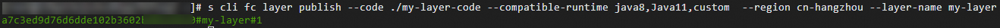

# 创建自定义层

层可以为您提供公共依赖库、运行时环境及函数扩展等发布与部署能力。您可以将函数依赖的公共库提炼到层或者使用函数计算官方公共层，以减少部署或更新函数时的代码包体积。本文介绍层的功能原理、各运行时使用层说明、如何构建层的ZIP包以及如何创建、删除自定义层。

## 功能原理

- 构建层时，需要将所有内容打包到ZIP文件中。函数计算运行时会将层的内容解压并部署在/opt目录下。
- 当函数配置多个层时，这些层的内容将被合并至`/opt`目录，多个层按照层配置的逆序合并。如果某一文件与其他层中的文件同名，则先配置层中的该文件会覆盖后配置层中的该同名文件。
  
  例如，为某函数配置了第1层和第2层，函数实例启动时，会先加载第2层，后加载第1层，并将其解压至`/opt`目录。在`/opt`目录中，第1层的内容在前，第2层的内容在后，如果第1层和第2层中存在同名文件，那么第1层中的该文件会覆盖第2层中的该文件内容。
- 如果层中的代码依赖二进制的库或可执行文件，则需要使用Linux系统编译构建层，推荐使用Debian 9。
- 函数计算运行时基于x86_64架构，如果层中的依赖库对指令集有依赖，则需要使用x86_64架构的机器，或者通过交叉编译的方式确保依赖库与函数计算运行时兼容。

## 各运行时使用层说明

如果运行时支持层功能，函数计算会将特定的目录添加到运行时语言的依赖包搜索路径中，如下表所示。建议您在层ZIP包中定义与下方列举的特定目录相同的文件夹结构，使得函数代码无需指定路径即可访问层。具体构建层的ZIP包的方法，请参见[构建层的ZIP包](#section-jos-h78-3xb)。如您想自定义层的目录结构，需要在代码中显式添加依赖库搜索地址。具体操作，请参见[如何在自定义运行时中引用层中的依赖](https://help.aliyun.com/zh/functioncompute/fc/user-guide/how-to-reference-dependencies-in-a-layer-in-a-custom-runtime)。

### **各运行时支持添加的特定目录**

| **运行时** | **特定的目录** |
| --- | --- |
| Python | /opt/python |
| Node.js | /opt/nodejs/node_modules |
| Java | /opt/java/lib |
| PHP | /opt/php |
| 除自定义运行时和自定义镜像之外的运行时 | /opt/bin (PATH) |
| /opt/lib (LD_LIBRARY_PATH) |  |
| 自定义运行时和自定义镜像 | 无 |

### **各运行时的层ZIP包文件结构**

关于各运行时打包上传的文件结构与解压部署后的路径的对应关系，分别举例说明如下。

Python

```
使用requests依赖打包后的文件结构 my-layer-code.zip └── python └── requests ZIP包解压部署后的路径 / └── opt └── python └── requests
```

Node.js

```
使用uuid依赖打包后的文件结构 my-layer-code.zip └── nodejs ├── node_modules │ └── uuid ├── package-lock.json └── package.json ZIP包解压部署后的路径 / └── opt └── nodejs ├── node_modules │ └── uuid ├── package-lock.json └── package.json
```

Java

```
使用jackson-core依赖打包后的文件结构 my-layer-code.zip └── java └── lib └── commons-lang3-3.12.0.jar ZIP包解压部署后的路径 / └── opt └── java └── lib └── commons-lang3-3.12.0.jar
```

PHP

```
使用composer依赖打包后的文件结构 my-layer-code.zip └── php ├──composer.json ├──composer.lock └──vendor ZIP包解压部署后的路径 / └── opt └── php ├──composer.json ├──composer.lock └──vendor
```

## 构建层的ZIP包

创建层时，需要将所有内容打包到ZIP文件中。函数计算运行时会将层的内容解压并部署在/opt目录下。

构建层的ZIP包的方式和构建代码包的方式类似，为使函数在运行时能正确加载使用层发布的库，库的代码目录结构需遵从各个语言标准的目录规范，具体信息，请参见[各运行时使用层说明](#section-2fj-h95-ymw)。对于部署于层的函数依赖库，如果按照规范的方式打包，函数计算运行时会为您自动添加各语言的依赖库搜索路径，您无需指定全路径。如您想自定义层的目录结构，需要在代码中显式添加依赖库搜索地址。具体操作，请参见[如何在自定义运行时中引用层中的依赖](https://help.aliyun.com/zh/functioncompute/fc/user-guide/how-to-reference-dependencies-in-a-layer-in-a-custom-runtime)。

各运行时构建层ZIP包的操作步骤如下所示：

**

**说明**

- 在本地构建层时，使用的编程语言版本需要和在函数计算选择的运行时的编程语言版本保持一致。
- 下面创建的工作目录my-layer-code仅为示例，您在实际操作过程中可以按需替换目录名称。

## Python Runtime

**

**说明**

在本地构建层时，使用的Python版本需要和在函数计算选择的Python运行时版本保持一致。

1. 执行以下命令创建工作目录。
  
  ```
  mkdir my-layer-code
  ```
2. 进入已创建的工作目录。
  
  ```
  cd my-layer-code
  ```
3. 执行以下命令安装依赖库到my-layer-code/python。
  
  ```
  pip install --target ./python ${PackageName}
  ```
  
  ${PackageName}是您要安装的依赖包的名称，`pip install`命令的详细使用方法，请参见[pip install](https://pip.pypa.io/en/stable/cli/pip_install/)。
  
  代码示例如下：
  
  ```
  pip install --target ./python numpy
  ```
  
  安装完成后，目录结构如下：
  
  ```
  my-layer-code └── python ├── bin ├── numpy ├── numpy-1.22.4.dist-info └── numpy.libs
  ```
4. 在my-layer-code目录，执行以下命令打包依赖。
  
  ```
  zip -r my-layer-code.zip python
  ```

## Node.js Runtime

**

**说明**

在本地构建层时，使用的Node.js版本需要和在函数计算选择的Node.js运行时版本保持一致。

1. 执行以下命令创建工作目录。
  
  ```
  mkdir my-layer-code
  ```
2. 进入已创建的工作目录。
  
  ```
  cd my-layer-code
  ```
3. 执行以下命令安装依赖库到my-layer-code/nodejs。
  
  ```
  npm install --prefix ./nodejs --save ${PackageName}
  ```
  
  `${PackageName}`是您要安装的依赖包的名称，`npm install`命令的详细使用方法，请参见[npm-install](https://docs.npmjs.com/cli/v6/commands/npm-install)。
  
  代码示例如下：
  
  ```
  npm install --prefix ./nodejs --save uuid
  ```
  
  安装完成后，目录结构如下：
  
  ```
  my-layer-code └── nodejs ├── node_modules │ └── uuid ├── package-lock.json └── package.json
  ```
4. 在my-layer-code中执行以下命令打包依赖。
  
  ```
  zip -r my-layer-code.zip nodejs
  ```

## Java Runtime

1. 执行以下命令创建工作目录。
  
  ```
  mkdir my-layer-code/java
  ```
2. 进入已创建的工作目录。
  
  ```
  cd my-layer-code/java
  ```
3. 通过Maven安装依赖。
  
  1. 在my-layer-code/java目录下创建一个pom.xml文件。
    
    示例如下：
    
    ```
    <?xml version="1.0" encoding="UTF-8"?> <project xmlns="http://maven.apache.org/POM/4.0.0" xmlns:xsi="http://www.w3.org/2001/XMLSchema-instance" xsi:schemaLocation="http://maven.apache.org/POM/4.0.0 http://maven.apache.org/maven-v4_0_0.xsd"> <modelVersion>4.0.0</modelVersion> <groupId>maven.util</groupId> <artifactId>install-layer</artifactId> <version>1.0</version> <!-- 要下载的maven依赖 --> <dependencies> <!-- https://mvnrepository.com/artifact/org.apache.commons/commons-lang3 --> <dependency> <groupId>org.apache.commons</groupId> <artifactId>commons-lang3</artifactId> <version>3.12.0</version> </dependency> </dependencies> <build> <plugins> <!-- maven相关下载插件 --> <plugin> <artifactId>maven-dependency-plugin</artifactId> <configuration> <!-- 是否排除间接依赖。默认false，不排除 --> <excludeTransitive>false</excludeTransitive> <!-- 是否消除依赖jar包后缀的版本信息。默认是false，不取消版本信息 --> <stripVersion>false</stripVersion> <!-- 输出文件路径 --> <outputDirectory>./lib</outputDirectory> </configuration> </plugin> </plugins> </build> </project>
    ```
    
    示例解析如下：
    
    - 要安装的依赖包为`org.apache.commons.lang3`。
    - 使用`maven-dependency-plugin`将需要安装的依赖包拷贝到/java/lib目录下。
  2. 在my-layer-code/java目录下执行以下命令安装依赖。
    
    ```
    mvn dependency:copy-dependencies
    ```
  
  安装完成后，目录结构如下：
  
  ```
  my-layer-code └── java └── lib └── commons-lang3-3.12.0.jar
  ```
4. 在my-layer-code目录，执行以下命令打包依赖。
  
  ```
  zip -r my-layer-code.zip java
  ```

## PHP Runtime

1. 执行以下命令创建工作目录。
  
  ```
  mkdir -p my-layer-code/php
  ```
2. 进入已创建的工作目录。
  
  ```
  cd my-layer-code/php
  ```
3. 通过Composer安装依赖。
  
  1. 在my-layer-code/php目录下，创建一个composer.json文件。
    
    示例如下：
    
    ```
    { "require": { "aliyunfc/fc-php-sdk": "~1.2", "alibabacloud/fnf": "^1.7" } }
    ```
  2. 执行以下命令安装依赖。
    
    ```
    composer install
    ```
  
  安装完成后，目录结构如下：
  
  ```
  my-layer-code └─php ├──composer.json ├──composer.lock └──vendor
  ```
4. 在my-layer-code目录，执行以下命令打包依赖。
  
  ```
  zip -r my-layer-code.zip php
  ```

## **创建自定义层**

## 通过控制台创建自定义层

### 前提条件

已完成函数的创建，具体操作请参见[创建函数](https://help.aliyun.com/zh/functioncompute/fc/user-guide/function-instance-1/)。

### **操作步骤**

1. 登录[函数计算控制台](https://fcnext.console.aliyun.com)，在左侧导航栏，选择**函数管理**>**层管理**。
2. 在顶部菜单栏，选择地域，然后在**层管理**页面，单击**创建层**。
3. 在**创建层**页面，设置相关参数，然后单击**创建。**
  
  | **参数** | **描述** |
  | --- | --- |
  | **名称** | 设置层的名称，支持自定义。 |
  | **描述** | 设置层的描述信息，便于区分各层。 |
  | **兼容运行时** | 选择与该层兼容的运行时环境。 |
  | **层上传方式** | 按需选择上传层依赖的方式。包含以下几种上传方式：<br>- **通过 ZIP 包上传层**<br>选择或直接上传已构建的层的ZIP文件。上传的ZIP文件不能超过500 MB。<br>- **通过文件夹上传层**<br>选择或上传已构建层的ZIP文件所在的文件夹。上传的文件夹压缩后不能超过500 MB。<br>- **通过 OSS 上传层**<br>选择上传构建层的ZIP文件的**Bucket 名称**和**文件名称**。选择的OSS中的文件不能超过500 MB。<br>**<br>**说明**<br>如果 OSS 中的文件开启了 KMS 加密，函数计算默认服务角色（AliyunServiceRoleForFC）可能没有该 KMS 密钥的访问权限，导致上传层时出现无权限访问 OSS 文件的报错，如下图所示。<br>要解决此问题，请在 KMS 控制台中为该 KMS 密钥调整密钥策略，授予 AliyunServiceRoleForFC 服务角色的访问权限。具体操作，请参见[修改密钥策略](https://www.alibabacloud.com/help/zh/kms/key-management-service/security-and-compliance/modify-a-key-policy)。<br>配置完成后，重新尝试上传层文件以确认权限已生效。<br>- **在线构建依赖层**<br>如果您的函数应用是基于Python和Node.js语言开发，或需要安装部分轻量级系统库，可以选择在线构建依赖层，并在下方输入框输入构建层的依赖文件`package.json`或`requirements.txt`的内容，提交创建层后系统会自动安装这些语言级别的依赖包和系统库，简化层依赖管理过程。 |
  | **构建环境** | 当您选择**在线构建依赖层**时，需设置此参数选择构建依赖层所使用的运行环境。<br>**<br>**说明**<br>目前仅Python和Node.js运行时支持在线构建依赖层。 |
  | **apt 命令** | 当您选择**在线构建依赖层**，且需要安装部分软件包到层中，可以在`apt install`后面的输入框直接输入依赖的名称在线安装。 |
  
  层创建成功后，将自动生成层的版本，版本号从1开始递增。
4. 创建新版本。
  
  **
  
  **说明**
  
  已创建的层或相关层版本暂不支持修改，如果您需要修改层的相关配置，可以创建新的层或创建新版本。需要注意的是，如果引用的层版本已删除，在更新层配置时，必须先删除该引用。
  
  1. 在**层管理**页面，单击目标层名称。
  2. 在**版本管理**区域，单击**创建版本**。
  3. 在创建新的版本页面，选择运行环境并上传新的层代码，然后单击**创建**。

## 通过Serverless Devs创建自定义层

### **前提条件**

- [快速入门](https://help.aliyun.com/zh/functioncompute/fc/developer-reference/install-serverless-devs-and-docker)
- [配置Serverless Devs](https://help.aliyun.com/zh/functioncompute/fc-3-0/developer-reference/configure-serverless-devs-1)

### **操作步骤**

1. 执行以下命令创建层。
  
  ```
  s cli fc layer publish --code ./my-layer-code --compatible-runtime java8,Java11,custom --region cn-hangzhou --layer-name my-layer
  ```
  
  代码解析如下：
  
  - `--code`：用于指定代码包路径。
  - `--compatible-runtime`：用于指定创建层兼容的运行时环境。
  - `--layer-name`：用于指定创建层的名称。
  
  创建完成后提示成功并返回层的ARN，ARN通过`#`号分为三个部分，第一部分为账号ID的标识符，第二部分为层的名称，第三部分为层的版本，如下图所示。您也可以登录[函数计算控制台](https://fcnext.console.aliyun.com)查看创建的层信息。
2. 重复执行以下命令为已创建的层创建新版本。
  
  ```
  s cli fc layer publish --code ./my-layer-code --compatible-runtime java8,java11,custom --region cn-hangzhou --layer-name my-layer
  ```
  
  **
  
  **说明**
  
  已创建的层或相关层版本暂不支持修改，如果您需要修改层的相关配置，可以创建新的层或创建新版本。需要注意的是，如果引用的层版本已删除，在更新层配置时，必须先删除该引用。

## 删除层与层版本

您可以根据提示删除不需要的层或者层版本。已删除的层不能再被查看或被函数配置引用，但已配置引用该层的函数执行不受影响。

1. 登录[函数计算控制台](https://fcnext.console.aliyun.com)，在左侧导航栏，选择**函数管理**>**层管理**。
2. 在顶部菜单栏，选择地域。
3. 在**层管理**页面，按需选择删除层或层版本。
  
  - 删除层
    
    单击目标层**操作**列的**删除**，在弹出的对话框中选中确认删除层中的复选框，然后单击**删除**。
  - 删除层版本
    
    单击目标层名称，在层详情页面的**版本管理**区域，单击目标层版本**操作**列的**删除**，在弹出的**确认**对话框中单击**删除**。

## **相关文档**

- 您还可以在通过OpenAPI/SDK创建函数或更新函数时，配置参数`layers`来管理层和配置层。更多信息，请参见[创建函数](https://help.aliyun.com/zh/functioncompute/fc/developer-reference/api-fc-2023-03-30-createfunction)和[更新函数](https://help.aliyun.com/zh/functioncompute/fc/developer-reference/api-fc-2023-03-30-updatefunction)。
- 如果要安装的层依赖中包含动态链接库，或者本地环境与函数计算的运行时环境不兼容时，不支持通过控制台或本地构建的方式构建层，只能基于Dockerfile构建层。具体操作，请参见[如何基于Dockerfile构建层](https://help.aliyun.com/zh/functioncompute/fc/user-guide/use-a-dockerfile-to-build-a-layer-1)。
- 自定义层创建完成后，您可以通过[函数计算控制台](https://fcnext.console.aliyun.com)或Serverless Devs将其绑定到函数，以便函数访问层中提供的资源。具体操作，请参见[配置自定义层](https://help.aliyun.com/zh/functioncompute/fc/user-guide/configure-custom-layers-for-a-function-1)。
