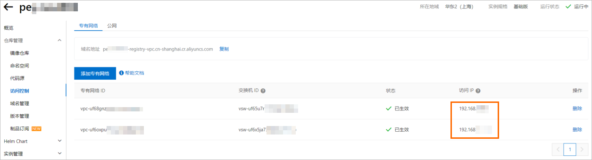
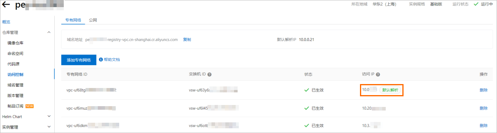
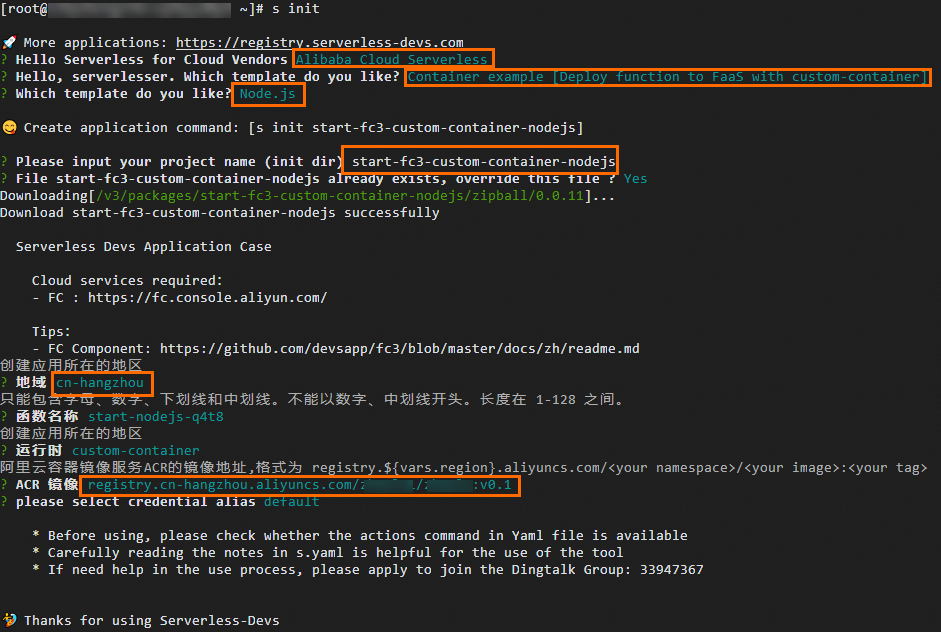

# 创建自定义镜像函数

当函数计算平台的内置运行时无法满足您的业务需求时，可以选择自定义镜像函数。本文介绍如何在函数计算控制台或使用Serverless Devs工具创建自定义镜像函数。

## **注意事项**

- 在函数计算中，创建自定义镜像函数必须使用同一账号下相同地域内[阿里云镜像服务仓库](https://cr.console.aliyun.com/cn-hangzhou/instances)中的镜像。针对搭载Apple芯片的Mac电脑（或其他ARM架构的机器），构建镜像时需要指定镜像的编译平台为Linux/Amd64，示例命令如`docker build --platform linux/amd64 -t $IMAGE_NAME .`。
- 函数计算在解析ACR企业版镜像域名时，使用镜像仓库实例配置的专有网络默认解析或[云解析PrivateZone](https://help.aliyun.com/zh/acr/user-guide/configure-access-over-vpcs#task1305)自动解析的访问IP地址。具体场景如下：
  
  - 场景一：如果ACR企业版实例的**访问控制**页面的**访问 IP**中不存在**默认解析**标识时，该列表下的所有IP地址均为云解析PrivateZone自动解析的IP地址，任意一个VPC配置均可使用。
    
    
  - 场景二：如果ACR企业版实例的**访问控制**页面的**访问 IP**中存在**默认解析**标识的IP地址为专有网络默认解析的IP地址，以下图为例，只能选择第一个VPC。
    
    
- 使用企业版实例时只能选择非加速镜像，并且每次更新函数的镜像配置时，都会基于最新选择的原始镜像生成最新的加速镜像（如果加速镜像已存在会覆盖生成）。请不要删除原始镜像以及加速镜像，否则会影响函数调用。
- 请确保您在函数配置中的镜像在发生任何变化后，及时更新您的函数，否则函数调用会失败。
  
  - 请确保原始镜像存在，否则函数会进入Failed状态，并且无法调用。函数计算虽然对您的函数做了缓存以加速冷启动速度，但是在调用过程中依然依赖您的原始镜像的存在。
  - 请确保您在任何函数中使用的镜像不要被覆盖，如果被覆盖为其他的Digest，请及时使用最新的镜像信息重新部署您的函数。函数计算会同时记录您在创建和更新配置时所选择的镜像版本Tag和Digest，如果您的镜像版本在别的地方被更新为其他的Digest，函数将调用失败。

## 前提条件

- 容器镜像服务
  
  - [创建实例](https://help.aliyun.com/zh/acr/user-guide/create-a-container-registry-enterprise-edition-instance#task488)
    
    **
    
    **说明**
    
    - 容器镜像个人版ACR面向个人开发者，公测限额免费试用，无SLA承诺和受损赔偿，且有使用限制。关于使用限制说明，请参见[创建个人版实例注意事项](https://help.aliyun.com/zh/acr/user-guide/create-a-container-registry-personal-edition-instance#section-rsx-587-kea)。
  - [创建命名空间](https://help.aliyun.com/zh/acr/getting-started/build-images-on-container-registry-enterprise-edition-instances#section-m0h-3y9-s89)
  - [创建镜像仓库](https://help.aliyun.com/zh/acr/getting-started/build-images-on-container-registry-enterprise-edition-instances#section-7ek-3k0-l1n)
- Serverless Devs（仅选择使用Serverless Devs创建函数时需要）
  
  [安装并配置Serverless Devs](https://help.aliyun.com/zh/functioncompute/fc/developer-reference/install-serverless-devs-and-docker#502f24e9fevmy)

## 在控制台创建函数

1. 登录[函数计算控制台](https://fcnext.console.aliyun.com)，在左侧导航栏，选择**函数管理**>**函数列表**。
2. 在顶部菜单栏，选择地域，然后在**函数列表**页面，单击**创建函数**。
3. 在弹出的对话框，根据提示和实际场景，选择**GPU 函数**类型，然后单击**创建GPU函数**。
4. 在**创建GPU函数**页面，设置以下配置项，然后单击**创建**。
  
  - **基础配置**：输入**函数名称**，唯一用于标识函数的符号，在同一账号及地域下，函数名称必须唯一且符合命名规范。
  - **弹性策略**：选择实例类型，常驻实例和弹性实例无法同时使用，且函数创建完成后，实例类型不支持切换。
    
    - **弹性实例**
      
      | **配置项** | **说明** | **示例** |
      | --- | --- | --- |
      | **实例类型** | 选择**弹性实例**，按请求量自动弹性伸缩，无请求后实例自动回收，即按使用量计费，不使用不收费。 | 弹性实例 |
      | **GPU 卡型** | 选择GPU卡型。关于各种卡型支持的规格，请参见[实例类型和规格](https://help.aliyun.com/zh/functioncompute/fc/product-overview/instance-types-and-specifications)。 | Ada 系列 |
      | **规格方案** | 根据您的业务情况，设置函数的**显存**、**vCPU**、**内存**及**磁盘**规格。设置规格后，实际调用函数产生的各资源使用量均按照规格乘以占用时长计量，详情请参见[计费概述](https://help.aliyun.com/zh/functioncompute/fc/product-overview/billing-overview-of-fc)。<br>**<br>**说明**<br>- 磁盘中所有目录可写，共享磁盘的空间。<br>- 磁盘大小与底层执行函数的实例生命周期一致，实例被系统回收后，磁盘上的数据也会消失。如您需要对文件进行持久化保存，可以选择挂载NAS或OSS。具体操作，请参见[配置NAS文件系统](https://help.aliyun.com/zh/functioncompute/fc/configure-a-nas-file-system-for-fc)和[配置OSS对象存储](https://help.aliyun.com/zh/functioncompute/fc/user-guide/configure-an-oss-file-system-1)。 | - 显存：48 GB<br>- vCPU：8 vCPU<br>- 内存：64 GB<br>- 磁盘：512 MB（不计费，函数计算提供10GB的磁盘免费使用额度） |
      | **最小实例数** | 如果您的业务对延迟敏感，选择**弹性实例**后，建议设置最小实例数≥1，提前锁定资源，降低冷启动延迟。<br>**<br>**说明**<br>设置最小实例数≥1后，如果未配置最小实例数弹性策略或某段时间内，无有效的弹性策略，则当前最小实例数为此处设置的最小实例数。<br>如果配置了多条弹性策略，系统会计算每条策略触发时的**最小实例数**，并取当前时间有效的弹性策略中最小实例数的最大值作为当前**最小实例数**。<br>更多信息，请参见[如何计算当前最小实例数？](https://help.aliyun.com/zh/functioncompute/fc/user-guide/instance-scaling-restrictions-and-rules#62f2f7beb3nay)。 | 1 |
      | **单实例并发度** | 您可以为GPU函数配置单实例多并发，即单个函数实例可以同时处理多个请求。具体操作，请参见[配置单实例并发度](https://help.aliyun.com/zh/functioncompute/fc/configure-the-concurrency-of-a-single-instance)。 |  |
    - **常驻实例**
      
      | **配置项** | **说明** | **示例** |
      | --- | --- | --- |
      | **实例类型** | 选择**常驻实例**，即从已购买的常驻资源池分配实例给函数。<br>希望成本可预测、业务时延敏感、资源利用率高的场景，推荐您使用常驻实例，保障业务稳定性。 | 常驻实例 |
      | **常驻资源池** | 常驻资源池是可以为目标函数分配的常驻实例池，如果您的常驻资源池剩余额度不足，请单击**操作**列的**扩容**，然后按照界面提示进行扩容。更多信息，请参见[常驻资源池（包年包月）](https://help.aliyun.com/zh/functioncompute/fc/product-overview/resident-resource-pool)。 | - **常驻资源池**：fc-pool-****<br>- **GPU卡型**：Ada |
      | **规格方案** | 根据您的业务情况，设置函数的**显存**、**vCPU**、**内存**及**磁盘**规格。设置规格后，实际调用函数产生的各资源使用量均按照规格乘以占用时长计量，详情请参见[计费概述](https://help.aliyun.com/zh/functioncompute/fc/product-overview/billing-overview-of-fc)。<br>**<br>**说明**<br>- 磁盘中所有目录可写，共享磁盘的空间。<br>- 磁盘大小与底层执行函数的实例生命周期一致，实例被系统回收后，磁盘上的数据也会消失。如您需要对文件进行持久化保存，可以选择挂载NAS或OSS。具体操作，请参见[配置NAS文件系统](https://help.aliyun.com/zh/functioncompute/fc/configure-a-nas-file-system-for-fc)和[配置OSS对象存储](https://help.aliyun.com/zh/functioncompute/fc/user-guide/configure-an-oss-file-system-1)。 | 显存：48 GB<br>vCPU：8 vCPU<br>内存：64 GB<br>磁盘：512 MB（不计费，函数计算提供10GB的磁盘免费使用额度） |
      | **常驻实例数** | 根据常驻资源池的资源情况为目标函数分配常驻实例数。 | 1 |
      | **单实例并发度** | 您可以为GPU函数配置单实例多并发，即单个函数实例可以同时处理多个请求。具体操作，请参见[配置单实例并发度](https://help.aliyun.com/zh/functioncompute/fc/configure-the-concurrency-of-a-single-instance)。 | 20 |
  - **函数代码**：配置函数的运行环境和代码相关信息。
    
    | **配置项** | **说明** | **示例** |
    | --- | --- | --- |
    | **运行环境** | - **使用示例镜像**：选择函数计算提供的示例镜像，快速体验部署镜像函数。您需要从配置项**容器镜像**下方镜像列表中选择目标镜像。<br>- **使用ACR中的镜像**：单击配置项**容器镜像**下方的**选择 ACR 中的镜像**，在弹出的**选择容器镜像**面板，选择已创建的**容器镜像实例**和**ACR 镜像仓库**，然后在下方选择镜像区域找到目标镜像并在其右侧**操作**列单击**选择**。<br>**<br>**说明**<br>- 不支持使用跨账户ACR中的公开镜像创建函数。<br>- 请确保您在函数配置中的镜像在发生任何变化后，及时更新您的函数，否则函数调用会失败。具体请参见[注意事项](#0ccccc5ee69zx)。<br>- 使用企业版实例时，只能选择非加速镜像，请不要删除原始镜像以及加速镜像，否则会影响函数调用。具体请参见[注意事项](#0ccccc5ee69zx)。<br>- 使用企业版实例时，不支持自定义域名格式的镜像地址。<br>- 不支持使用ACR企业版（标准版和高级版）实例中开启**仅索引模式**镜像加速的仓库中的镜像创建函数。<br>- 自ACR新增**仅索引模式**功能起，企业版（基础版）实例中新建的开启镜像加速开关的镜像仓库中的镜像不支持用来创建函数，存量企业版（基础版）实例中存量镜像加速仓库中的镜像仍然支持用来创建函数。关于**仅索引模式**，请参见[按需加载容器镜像](https://help.aliyun.com/zh/acr/user-guide/load-resources-of-a-container-image-on-demand)。 | **自定义镜像** |
    | **容器镜像** | 选择目标镜像。 | SpringBoot Web 应用示例镜像 |
    | **启动命令** | 程序的启动命令。如果不配置启动命令，则默认使用镜像中的Entrypoint/CMD。 | 无 |
    | **监听端口** | 您的代码中的HTTP Server所监听的端口。 | 9000 |
    | **执行超时时间** | 设置超时时间。**执行超时时间**默认为60秒，最长为86400秒。 | 60 |
  - **实例预热**：AI推理场景，配置实例预热实现模型预热，解决模型初次请求耗时较长的问题。
    
    | **配置项** | **说明** | **示例** |
    | --- | --- | --- |
    | **实例预热** |  |  |
    | **实例预热** | 通过配置Initializer回调程序，在函数实例启动成功之后，处理请求之前，通过运行指定脚本或调用接口进行模型加载，提前预热，优化冷启动。<br>更多关于Initializer回调程序的介绍，请参见[配置实例生命周期](https://help.aliyun.com/zh/functioncompute/fc/function-instance-lifecycle)。 | 开启 |
    | **超时时间** | 设置Initializer回调程序超时时间。 | 60 |
    | **预热程序类型** | 支持配置**执行指令**和**调用代码**两种类型的Initializer回调程序实现模型预热。 | 执行指令 |
    | **指令内容** | 配置执行指令内容。支持用户自定义Shell实现方式，例如`/bin/bash`、`/bin/sh`、`/bin/csh`和`/bin/zsh`等，需要确保函数运行时环境支持对应的Shell实现方式。 | 参见[回调方法实现](https://help.aliyun.com/zh/functioncompute/fc/lifecycle-hooks-for-gpu-function#section-hkb-d0f-u93) |
  - **权限、网络、存储**：配置函数访问角色、网络和存储挂载等。
    
    | **配置项** | **说明** | **示例** |
    | --- | --- | --- |
    | **函数角色** | 函数计算平台会使用这个RAM角色来生成访问的阿里云资源的临时密钥，并传递给代码。更多信息，请参见[使用函数角色授予函数计算访问其他云服务的权限](https://help.aliyun.com/zh/functioncompute/fc/grant-function-compute-permissions-to-access-other-alibaba-cloud-services)。 | mytestrole |
    | **允许访问 VPC** | 用于开启允许函数访问VPC内资源。更多信息，请参见[配置网络](https://help.aliyun.com/zh/functioncompute/fc/user-guide/configure-network-settings)。 | 开启 |
    | **专有网络** | **允许访问 VPC**选择**是**时必填。创建新的VPC或在下拉列表中选择要访问的VPC ID。 | fc.auto.create.vpc.1632317**** |
    | **交换机** | **允许访问 VPC**选择**是**时必填。创建新的交换机或在下拉列表中选择交换机ID。 | fc.auto.create.vswitch.vpc-bp1p8248**** |
    | **安全组** | **允许访问 VPC**选择**是**时必填。创建新的安全组或在下拉列表中选择安全组。 | fc.auto.create.SecurityGroup.vsw-bp15ftbbbbd**** |
    | **允许函数默认网卡访问公网** | 是否允许函数通过默认网卡访问公网。<br>**<br>**重要**<br>使用固定公网IP地址功能时，必须关闭**允许函数默认网卡访问公网**，否则配置的固定公网IP地址不生效。更多信息，请参见[配置固定公网IP地址](https://help.aliyun.com/zh/functioncompute/fc/user-guide/configure-static-public-ip-addresses)。 | 开启 |
    | **挂载 NAS 文件系统** | 为函数[配置NAS文件系统](https://help.aliyun.com/zh/functioncompute/fc/configure-a-nas-file-system-for-fc)，用于持久化存储函数间共享数据，例如多个推理函数共享的模型。<br>如果选择自动配置，系统默认使用已有名称为Alibaba-Fc-V3-Component-Generated的通用型NAS文件系统，如果当前账号下没有符合条件的NAS，系统会自动创建。 | 开启 |
    | **挂载 OSS 对象存储** | 为函数挂载OSS对象存储，用于持久化存储日志、业务文件等。具体操作，请参见[配置OSS对象存储](https://help.aliyun.com/zh/functioncompute/fc/user-guide/configure-an-oss-file-system-1)。 | 开启 |
  - **日志、链路追踪**
    
    | **配置项** | **说明** | **示例** |
    | --- | --- | --- |
    | **日志功能** | 用于设置将函数的执行日志持久化保存到日志服务，方便您进行代码调试、故障分析和数据分析等。更多信息，请参见[配置日志功能](https://help.aliyun.com/zh/functioncompute/fc/configure-the-logging-feature-1)。<br>- **自动配置**：自动选择以`serverless-<region_id>`开头的日志项目。<br>该日志项目每个地域仅创建一个，不会重复创建，如系统查询到当前地域下已有此日志项目，将直接使用。<br>- **自定义配置**：需手动指定目标**日志项目**和**日志库**。 | 开启 |
  - **更多配置**
    
    | **配置项** | **说明** | **示例** |
    | --- | --- | --- |
    | **时区** | 选择函数的时区。此处设置函数的时区后，将自动为函数添加一条环境变量**TZ**，其值为设置的目标时区。 | UTC |
    | **标签** | 为函数设置[标签](https://help.aliyun.com/zh/functioncompute/fc/user-guide/function-tags-management)便于分组管理函数，需同时设置标签键和标签值。 | key : value |
    | **资源组** | 选择函数所在[配置资源组](https://help.aliyun.com/zh/functioncompute/fc/resource-group)，使用资源组对函数进行分组管理。 | 默认资源组 |
    | **环境变量** | 通过环境变量，在不修改代码的前提下灵活调整函数的行为，详见[配置环境变量](https://help.aliyun.com/zh/functioncompute/fc/user-guide/environment-variables)。 | ```<br>{ "BUCKET_NAME": "MY_BUCKET", "TABLE_NAME": "MY_TABLE" }<br>``` |
  
  创建完成后，您可以在函数列表中查看和更新已创建的函数。

**

**说明**

更新函数时，只能变更已设置的监听端口，不能删除或添加额外的监听端口。如果创建函数时，配置了监听端口，更新该函数时，不指定监听端口，将保留创建函数时的监听端口。

## 使用Serverless Devs创建函数

使用Serverless Devs可以一键构建、推送容器镜像并部署函数。

1. 执行以下命令，初始化项目。
  
  ```
  sudo s init
  ```
  
  根据界面提示，依次选择阿里云账号、自定义镜像模板和具体的语言（本文以Node.js为例），设置工程名称、选择项目部署地域并输入您的ACR镜像等。
  
  
2. 执行以下命令，进入项目目录。
  
  ```
  cd start-fc3-custom-container-nodejs
  ```
3. 编辑`s.yaml`文件。关于YAML文件的参数解释，请参见[YAML规范](https://docs.serverless-devs.com/user-guide/aliyun/fc3/spec/)。
  
  示例如下。
  
  示例中`image`为您的ACR镜像，需要分别将<your namespace>、<your image>和<your tag>替换为实际的命名空间名称、镜像仓库名称和镜像版本。如果您在[步骤1](#step-la5-cm7-h96)初始化项目时已填入正确的ACR镜像，此处无需修改。
  
  ```
  edition: 3.0.0 name: hello-world-app # access 是当前应用所需要的密钥信息配置： # 密钥配置可以参考：https://www.serverless-devs.com/serverless-devs/command/config # 密钥使用顺序可以参考：https://www.serverless-devs.com/serverless-devs/tool#密钥使用顺序与规范 access: "default" vars: # 全局变量 region: "cn-hangzhou" resources: hello_world: # 如果只想针对 hello_world 下面的业务进行相关操作，可以在命令行中加上 hello_world，例如： # 只对 hello_world 进行构建：s hello_world build # 如果不带有 hello_world ，而是直接执行 s build，工具则会对当前Yaml下，所有和 hello_world 平级的业务模块（如有其他平级的模块，例如下面注释的next_function），按照一定顺序进行 build 操作 component: fc3 # 组件名称 actions: # 自定义执行逻辑 pre-deploy: # 在deploy之前运行 - component: fc3 build --dockerfile ./code/Dockerfile # 要运行的组件，格式为“component: 组件名 命令 参数” props: region: ${vars.region} # 关于变量的使用方法，可以参考：https://docs.serverless-devs.com/serverless-devs/yaml#%E5%8F%98%E9%87%8F%E8%B5%8B%E5%80%BC functionName: "start-nodejs-ufrz" runtime: "custom-container" description: 'hello world by serverless devs' timeout: 30 memorySize: 512 cpu: 0.5 diskSize: 10240 code: ./code customContainerConfig: image: 'registry.${vars.region}.aliyuncs.com/<your namespace>/<your image>:<your tag>' # 您的ACR镜像，需要分别将<your namespace>、<your image>和<your tag>替换为实际的命名空间名称、镜像仓库名称和镜像版本 # triggers: # - triggerName: httpTrigger # 触发器名称 # triggerType: http # 触发器类型 # description: 'xxxx' # qualifier: LATEST # 触发服务的版本 # triggerConfig: # authType: anonymous # 鉴权类型，可选值：anonymous、function # disableURLInternet: false # 是否禁用公网访问 URL # methods: # HTTP 触发器支持的访问方法，可选值：GET、POST、PUT、DELETE、HEAD # - GET # - POST
  ```
4. 执行以下命令，部署项目。
  
  ```
  sudo s deploy
  ```
  
  输出示例：
  
  ```
  Steps for [deploy] of [hello-world-app] ==================== DEPRECATED: The legacy builder is deprecated and will be removed in a future release. BuildKit is currently disabled; enable it by removing the DOCKER_BUILDKIT=0 environment-variable. Sending build context to Docker daemon 5.12kB Step 1/7 : FROM node:14-buster 14-buster: Pulling from library/node 2ff1d7c41c74: Already exists b253aeafeaa7: Already exists 3d2201bd995c: Already exists 1de76e268b10: Already exists d9a8df589451: Already exists 6f51ee005dea: Already exists 5f32ed3c3f27: Already exists 0c8cc2f24a4d: Already exists 0d27a8e86132: Already exists Digest: sha256:a158d3b9b4e3fa813fa6c8c590b8f0a860e015ad4e59bbce5744d2f6fd8461aa Status: Downloaded newer image for node:14-buster ---> 1d12470fa662 Step 2/7 : WORKDIR /usr/src/ ---> Running in 70a8e2e4d1ea Removing intermediate container 70a8e2e4d1ea ---> 0d67b8fa2901 Step 3/7 : COPY package*.json ./ ---> 09eb15f8770a Step 4/7 : RUN npm install ---> Running in 8ae492be973b Step 5/7 : COPY . . ---> 7560c7b14431 Step 6/7 : EXPOSE 9000 ---> Running in 66b38e54ced0 Removing intermediate container 66b38e54ced0 ---> f73cce48d2ae Step 7/7 : ENTRYPOINT [ "node", "server.js" ] ---> Running in 2fb2f83fd6c0 Removing intermediate container 2fb2f83fd6c0 ---> fe51ae71448c Successfully built fe51ae71448c Successfully tagged registry.cn-hangzhou.aliyuncs.com/z****/z****:latest [2024-01-29 16:33:06][INFO][hello_world] get instanceName= and region=cn-hangzhou from registry.cn-hangzhou.aliyuncs.com/z****/z**** [2024-01-29 16:33:06][INFO][hello_world] try to docker push registry.cn-hangzhou.aliyuncs.com/z****/z**** ... WARNING! Your password will be stored unencrypted in /root/.docker/config.json. Configure a credential helper to remove this warning. See https://docs.docker.com/engine/reference/commandline/login/#credentials-store Login Succeeded Using default tag: latest The push refers to repository [registry.cn-hangzhou.aliyuncs.com/z****/z****] 85c1ec915b45: Pushed 37c36543a431: Pushed e4afd7f70434: Pushed 0d5f5a015e5d: Layer already exists 3c777d951de2: Layer already exists f8a91dd5fc84: Layer already exists cb81227abde5: Layer already exists e01a454893a9: Layer already exists c45660adde37: Layer already exists fe0fb3ab4a0f: Layer already exists f1186e5061f2: Layer already exists b2dba7477754: Layer already exists latest: digest: sha256:6bf1ed4119d197a46c99082577632957056cb625f2ee0276d2af53f60d22837d size: 2841 [hello_world] completed (688.45s) Result for [deploy] of [hello-world-app] ==================== region: cn-hangzhou cpu: 0.5 customContainerConfig: image: registry.cn-hangzhou.aliyuncs.com/z****/z**** resolvedImageUri: registry.cn-hangzhou.aliyuncs.com/z****/z****@sha256:6bf1ed4119d197a46c99082577632957056cb625f2ee0276d2af53f60d22837d description: hello world by serverless devs diskSize: 10240 functionName: start-nodejs-ufrz handler: handler instanceConcurrency: 1 internetAccess: true lastUpdateStatus: Successful memorySize: 512 role: runtime: custom-container state: Active timeout: 30 A complete log of this run can be found in: /root/.s/logs/0129162246
  ```
5. 执行以下命令，调试函数。
  
  ```
  sudo s invoke -e "{\"key\":\"val\"}"
  ```
  
  输出示例：
  
  ```
  Steps for [invoke] of [hello-world-app] ==================== ========= FC invoke Logs begin ========= FC Invoke Start RequestId: 1-65b764db-15eb737f-0c67ab5cd968 FC Invoke Start RequestId: 1-65b764db-15eb737f-0c67ab5cd968 hello world! FC Invoke End RequestId: 1-65b764db-15eb737f-0c67ab5cd968 Duration: 42.27 ms, Billed Duration: 43 ms, Memory Size: 512 MB, Max Memory Used: 47.77 MB ========= FC invoke Logs end ========= Invoke instanceId: c-65b764db-15fa2aa8-bc50f7839399 Code Checksum: undefined Qualifier: LATEST RequestId: 1-65b764db-15eb737f-0c67ab5cd968 Invoke Result: OK [hello_world] completed (4.96s) A complete log of this run can be found in: /root/.s/logs/0129164202
  ```

## **相关文档**

- 使用自定义镜像函数，容器镜像依赖的基础环境会带来额外的数据下载和解压的时间，为了降低冷启动时间，请参见[函数计算冷启动优化最佳实践](https://help.aliyun.com/zh/functioncompute/fc/use-cases/best-practice-for-reducing-cold-start-latencies)。
- 您也可以调用API来创建函数，更多信息，请参见[创建函数](https://help.aliyun.com/zh/functioncompute/fc/developer-reference/api-fc-2023-03-30-createfunction)。
- 关于函数计算提供的内置运行时、自定义运行时和自定义镜像运行时适用场景及差异，请参见[函数运行时选型](https://help.aliyun.com/zh/functioncompute/fc/user-guide/selection-of-method-to-create-functions)。
