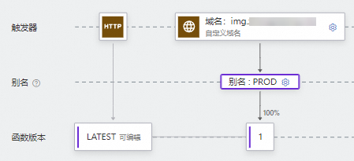
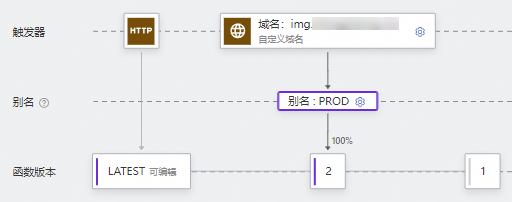
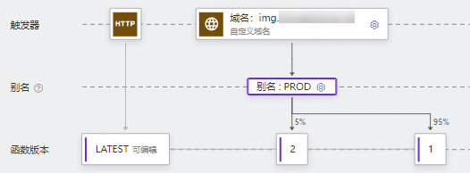

# 别名管理

函数计算支持为函数版本创建别名。结合别名和版本功能，实现软件开发生命周期中的持续集成和发布。本文介绍别名的含义以及如何通过函数计算控制台管理别名。

## 什么是别名

在函数计算中，别名可以理解为指向特定版本的指针。通过别名，您可以轻松实现版本发布、回滚以及灰度发布等功能。别名无法脱离函数或版本单独存在，使用别名访问函数时，函数计算会将别名解析为其指向的版本，调用方无需了解别名指向的具体版本。

以HTTP触发器为例，如果没有别名，每次新版本上线，您需要手动修改HTTP触发器关联的版本号，在修改的过程中会影响客户端的使用。使用别名后，可以实现版本的平滑升级。例如，将别名PROD指向稳定的版本1，客户端通过别名PROD调用版本1下的函数（如图1），当发布版本2时，只需将别名PROD指向版本2，客户端即可通过别名PROD调用版本2下的函数（如图2）。

### **平滑升级版本**

图 1.发布版本1

版本1发布后，您可以继续在LATEST版本上开发新功能。由于客户端是通过别名调用对应版本下的函数，当需要发布新版本2时，只需要将别名PROD更新为指向版本2，此时，客户端通过别名PROD调用函数时解析出的版本即为版本2，这样就可以完成版本的更新迭代。

图 2.发布版本2

### **快速回滚**

如果版本2出现异常，只需将别名PROD重新指向版本1，回滚到之前的版本，此操作不会影响客户端的使用。

### **灰度发布**

您还可以通过别名来控制流量灰度，例如，将5%的线上流量通过别名发送到新版本2进行灰度验证，然后逐步切换流量到版本2，从而降低部署新版本的风险,。

图3.灰度发布

## **别名支持的配置项**

别名支持的配置项与函数代码和函数主配置等无关，仅与函数触发和函数执行相关，例如触发器、弹性策略和任务模式。别名代表不同的环境，通过在别名上设置配置项，方便切换版本时无需修改函数代码和函数配置。例如，别名上配置触发器后，别名指向的版本的函数可以通过此触发器调用。

关于版本和别名上可以绑定的配置项对比如下表所示，表示当前配置项支持绑定到该项目，表示当前配置项不支持绑定到该项目。

| **配置类型** | **版本** | **别名** |
| --- | --- | --- |
| 代码逻辑 |  |  |
| [运行环境](https://help.aliyun.com/zh/functioncompute/fc/user-guide/code-development-overview#title-8xj-dda-k86) |  |  |
| [实例规格](https://help.aliyun.com/zh/functioncompute/fc/product-overview/instance-types-and-specifications#section-mfv-5fb-ehw)、[单实例并发度](https://help.aliyun.com/zh/functioncompute/fc/configure-the-concurrency-of-a-single-instance)、[实例生命周期回调配置](https://help.aliyun.com/zh/functioncompute/fc/function-instance-lifecycle) |  |  |
| [弹性策略](https://help.aliyun.com/zh/functioncompute/fc/configure-launch-snapshot-and-auto-scaling-rules) |  |  |
| [触发器](https://help.aliyun.com/zh/functioncompute/fc/user-guide/trigger-overview) |  |  |
| [异步任务](https://help.aliyun.com/zh/functioncompute/fc/user-guide/asynchronous-task) |  |  |
| [层](https://help.aliyun.com/zh/functioncompute/fc/layer-management-1/)、[环境变量](https://help.aliyun.com/zh/functioncompute/fc/user-guide/environment-variables)、[日志配置](https://help.aliyun.com/zh/functioncompute/fc/configure-the-logging-feature-1)、[网络配置](https://help.aliyun.com/zh/functioncompute/fc/user-guide/configure-network-settings)、[存储配置](https://help.aliyun.com/zh/functioncompute/fc/user-guide/function-storage-configuration/)、[健康检查配置](https://help.aliyun.com/zh/functioncompute/fc/user-guide/configure-a-custom-health-check-policy-for-instances-1)、[DNS配置](https://help.aliyun.com/zh/functioncompute/fc/user-guide/configure-custom-dns-settings-for-functions)、权限（角色）配置 |  |  |

## 前提条件

- [创建函数](https://help.aliyun.com/zh/functioncompute/fc/user-guide/function-instance-1/)
- [发布版本](https://help.aliyun.com/zh/functioncompute/fc/user-guide/manage-versions#section-jdg-qkr-9xv)

## 创建别名

1. 登录[函数计算控制台](https://fcnext.console.aliyun.com)，在左侧导航栏，选择**函数管理**>**函数列表**。
2. 在顶部菜单栏，选择地域，然后在**函数列表**页面，单击目标函数。
3. 在函数详情页，选择**别名管理**页签，在别名页面，单击**创建别名**。
4. 在创建函数别名面板，填写别名的相关信息，然后单击**确定**。
  
  相关配置项说明如下。
  
  | **配置项** | **说明** |
  | --- | --- |
  | **名称** | 要创建的别名的名称。 |
  | **描述** | 别名的描述信息。 |
  | **主版本** | 设置别名的主版本。 |
  | **启用灰度版本** | 是否启用灰度版本。如需启用灰度发布，需设置以下配置项。 |
  | **灰度版本** | 设置别名的灰度版本。 |
  | **灰度版本权重** | 表示切换流量至灰度版本的百分比。例如，设置该配置项的值为5%，将分配5%的流量到灰度版本，95%的流量到主版本。 |
  
  在别名页面，您可以看到刚才创建的别名。您还可以根据界面提示对已创建的别名进行编辑、删除不需要的别名。

**

**说明**

删除一个别名只会删除别名本身，不会删除别名指向的版本，也不会删除指向此别名的触发器。

## 更多信息

- 您可以配置函数的最小实例数≥1，提前锁定弹性资源，确保别名指向的版本拥有足够的预热资源。具体操作，请参见[配置最小实例数弹性策略](https://help.aliyun.com/zh/functioncompute/fc/configure-launch-snapshot-and-auto-scaling-rules)。
- 除了通过控制台，您还可以使用Serverless Devs为函数配置别名。更多操作，请参见[Serverless Devs常用命令](https://help.aliyun.com/zh/functioncompute/fc/developer-reference/serverless-devs-commands-1)。
