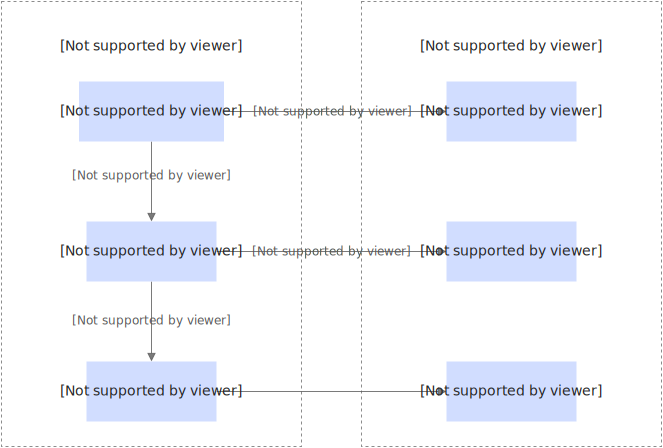

# 版本管理

函数计算支持版本管理功能，帮助您更高效地管理函数以及触发器。您可以通过版本管理功能发布多个版本的函数，实现软件开发生命周期中的持续集成和发布，确保函数的稳定性和可靠性。

## 什么是版本

函数计算提供函数级别的版本控制功能，支持您为自己的函数发布一个或多个版本。发布版本相当于将当前代码和配置固化为一个不可变更的基准版本，这个基准版本不包括触发器、异步任务配置及弹性策略等资源属性。您可以在版本上独立配置触发器和异步任务，而弹性策略需通过别名进行管理。

如果没有版本功能，您在函数上的每次改动都会影响到生产环境，无法控制发布的时机。有了版本功能，您可以在测试稳定后发布函数版本，用稳定的版本来服务线上请求，并且可以继续在LATEST版本上开发测试。实现原理，如下图所示。

已发布的版本中包含的函数配置项包括函数基本信息（如运行环境、请求处理程序、启动命令等）、实例配置信息（如实例规格、并发度、生命周期回调程序）以及函数层、环境变量、日志配置、网络配置、存储配置、DNS配置、健康检查和权限配置等。切换版本后无需修改函数代码和以上配置。

关于版本和别名上可以绑定的配置项对比如下表所示，表示当前配置项支持绑定到该项目，表示当前配置项不支持绑定到该项目。

| **配置类型** | **版本** | **别名** |
| --- | --- | --- |
| 代码逻辑 |  |  |
| [运行环境](https://help.aliyun.com/zh/functioncompute/fc/user-guide/code-development-overview#title-8xj-dda-k86) |  |  |
| [实例规格](https://help.aliyun.com/zh/functioncompute/fc/product-overview/instance-types-and-specifications#section-mfv-5fb-ehw)、[单实例并发度](https://help.aliyun.com/zh/functioncompute/fc/configure-the-concurrency-of-a-single-instance)、[实例生命周期回调配置](https://help.aliyun.com/zh/functioncompute/fc/function-instance-lifecycle) |  |  |
| [弹性策略](https://help.aliyun.com/zh/functioncompute/fc/configure-launch-snapshot-and-auto-scaling-rules) |  |  |
| [触发器](https://help.aliyun.com/zh/functioncompute/fc/user-guide/trigger-overview) |  |  |
| [异步任务](https://help.aliyun.com/zh/functioncompute/fc/user-guide/asynchronous-task) |  |  |
| [层](https://help.aliyun.com/zh/functioncompute/fc/layer-management-1/)、[环境变量](https://help.aliyun.com/zh/functioncompute/fc/user-guide/environment-variables)、[日志配置](https://help.aliyun.com/zh/functioncompute/fc/configure-the-logging-feature-1)、[网络配置](https://help.aliyun.com/zh/functioncompute/fc/user-guide/configure-network-settings)、[存储配置](https://help.aliyun.com/zh/functioncompute/fc/user-guide/function-storage-configuration/)、[健康检查配置](https://help.aliyun.com/zh/functioncompute/fc/user-guide/configure-a-custom-health-check-policy-for-instances-1)、[DNS配置](https://help.aliyun.com/zh/functioncompute/fc/user-guide/configure-custom-dns-settings-for-functions)、权限（角色）配置 |  |  |

## 注意事项

- 新创建的函数，默认只有一个LATEST版本，在未发布任何版本前，LATEST版本是您拥有的唯一函数版本，LATEST版本不能被删除。
- 版本发布后，已发布的版本不可更改。且版本号单调递增，不会被重复使用。

## 前提条件

- [创建函数](https://help.aliyun.com/zh/functioncompute/fc/user-guide/function-instance-1/)

## 发布版本

1. 登录[函数计算控制台](https://fcnext.console.aliyun.com)，在左侧导航栏，选择**函数管理**>**函数列表**。
2. 在顶部菜单栏，选择地域，然后在**函数列表**页面，单击目标函数。
3. 选择**版本管理**页签，在版本页面，单击**发布版本**，在发布函数的新版本面板，填写版本描述，然后单击**确定**。
  
  发布版本完成后，您可以在版本管理页面的版本列表查看刚才发布的版本。您还可以根据提示删除不需要的版本，以及将指定版本设置为别名的主版本或灰度版本。

**

**说明**

删除一个版本只会删除该版本中的函数及配置，并不会删除指向此版本的别名或者触发器。因此，删除版本前请先移除指向此版本的别名和触发器，否则，如果调用指向当前版本的别名会提示错误。

## **相关文档**

- 您如果想将指定版本设置为别名的主版本或灰度版本，可以参考[别名管理](https://help.aliyun.com/zh/functioncompute/fc/user-guide/manage-aliases)和[使用版本和别名实现灰度发布](https://help.aliyun.com/zh/functioncompute/fc/user-guide/use-versions-and-aliases-to-implement-canary-release)。
- 除了通过控制台，您还可以通过Serverless Devs为函数配置版本。具体操作，请参见[函数版本操作](https://manual.serverless-devs.com/user-guide/aliyun/fc3/version/)。
