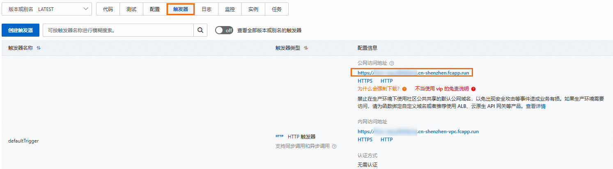
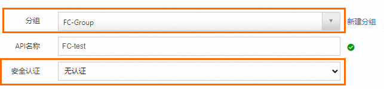
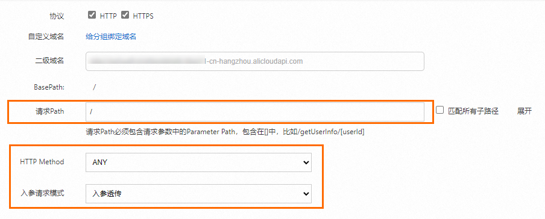
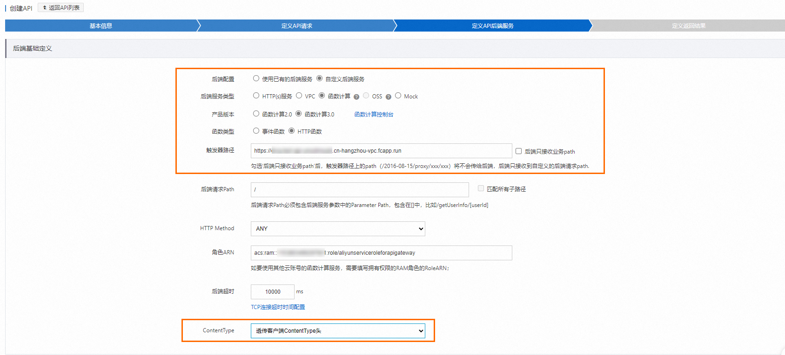
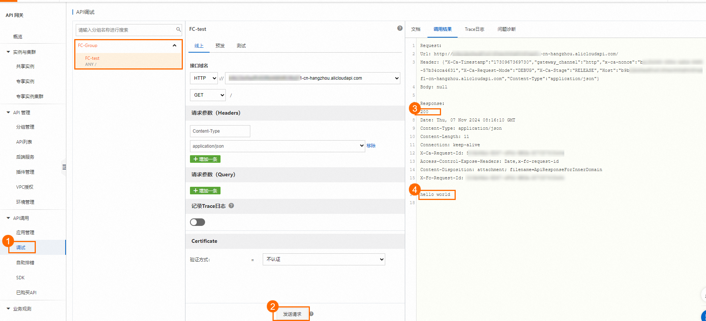
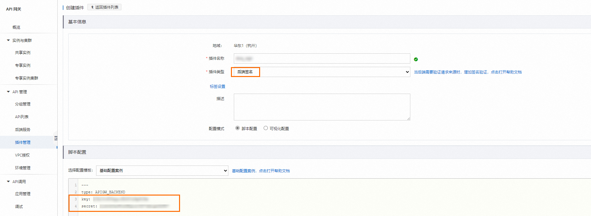
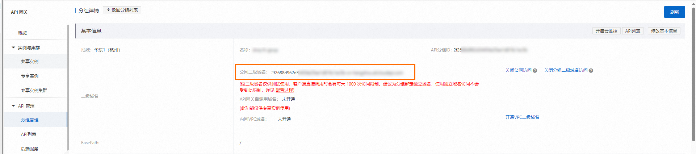
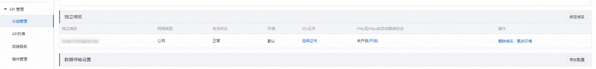

# 配置HTTP触发器

函数计算支持HTTP触发器，配置HTTP触发器的函数可以通过HTTP请求被触发执行。函数对HTTP请求进行处理，并将处理结果返回给调用端。本文介绍如何在函数计算控制台配置HTTP触发器并使用HTTP请求触发。

## 前提条件

[创建函数](https://help.aliyun.com/zh/functioncompute/fc/user-guide/function-instance-1/)

## 步骤一：创建触发器

1. 登录[函数计算控制台](https://fcnext.console.aliyun.com)，在左侧导航栏，选择**函数管理**>**函数列表**。
2. 在顶部菜单栏，选择地域，然后在**函数列表**页面，单击目标函数。
3. 在函数详情页面，选择**触发器**页签，然后单击**创建触发器**。
4. 在创建触发器面板，填写相关信息，然后单击**确定**。
  
  | **配置项** | **操作** | **本文示例** |
  | --- | --- | --- |
  | **触发器类型** | 选择**HTTP 触发器**。 | HTTP 触发器 |
  | **名称** | 填写自定义的触发器名称。 | http-trigger |
  | **版本或别名** | 默认值为**LATEST**，如果您需要创建其他版本或别名的触发器，需先在函数详情页的**版本或别名**下拉列表选择该版本。关于版本和别名的简介，请参见[版本管理](https://help.aliyun.com/zh/functioncompute/fc/user-guide/manage-versions)和[别名管理](https://help.aliyun.com/zh/functioncompute/fc/user-guide/manage-aliases)。 | LATEST |
  | **请求方法** | 指定可以通过哪些方法触发该HTTP触发器。 | GET, POST, PUT, DELETE |
  | **禁用公网访问 URL** | 默认不开启，即允许公网域名访问该触发器。<br>如果选择开启，创建的HTTP触发器将不提供默认的公网域名。此时，如果通过公网域名来调用函数，将会提示错误`access denied due to function internet URL is disable`。通过自定义域名的访问，则不受影响。 | 否 |
  | **认证方式** | 选择函数计算对HTTP请求的认证方式。取值说明如下：<br>- **无需认证**：无需对HTTP请求进行身份认证，支持匿名访问，任何人可发起HTTP请求调用您的函数。<br>- **签名认证**：需要对HTTP请求进行身份认证。关于签名认证的示例代码，请参见[通过签名访问HTTP触发器地址](https://help.aliyun.com/zh/functioncompute/fc/user-guide/configure-signature-authentication-for-http-triggers#0c9ec7a734i6n)。<br>- **Bearer 认证**：需要对HTTP请求进行身份认证。关于Basic认证的示例代码，请参见[为HTTP触发器配置Basic认证鉴权](https://help.aliyun.com/zh/functioncompute/fc/user-guide/configure-basic-authentication-for-an-http-trigger)。<br>- **JWT 认证**：需要对HTTP请求进行JWT认证。更多信息，请参见[为HTTP触发器配置JWT认证鉴权](https://help.aliyun.com/zh/functioncompute/fc/user-guide/configure-jwt-authentication-for-an-http-trigger)。<br>- **Bearer 认证**：需要对HTTP请求进行Bearer认证。更多信息，请参见[为HTTP触发器开启Bearer认证鉴权](https://help.aliyun.com/zh/functioncompute/fc/user-guide/enable-bearer-authentication-for-an-http-trigger)。 | 无需认证 |
  
  创建完成后，您可以根据情况对HTTP触发器的配置项进行修改，包括**版本或别名**、**请求方法**和**认证方式**等。

## 步骤二：编写并部署代码

完成创建HTTP触发器后，您可以开始编写函数代码。

在函数详情页面，单击**代码**页签，在代码编辑器中编写代码，然后单击**部署代码**。关于示例代码，请参见函数计算文档中不同运行时的请求处理程序文档。

## 步骤三：测试函数

### 方式一：使用控制台测试函数

在**函数详情**页面，单击**代码**页签。

- 同步调用
  
  单击**测试函数**。
- 异步调用
  
  单击**测试函数**右侧的图标，选择**异步调用**，然后单击**测试函数**。

执行完成后，在**代码**页签，您可以查看执行结果。

### 方式二：使用cURL测试函数

1. 在函数详情页面，选择**触发器**页签，在目标HTTP触发器的**配置信息**列获取公网访问地址。
  
  
2. 在命令行执行Curl命令测试函数。
  
  ## 同步调用
  
  示例如下，请将`https://example.cn-shenzhen.fcapp.run`替换为您上一步获取的HTTP触发器公网访问地址，将`$path`替换为您需要调用的API接口名称。
  
  ```
  curl -v https://example.cn-shenzhen.fcapp.run/$path
  ```
  
  **
  
  **说明**
  
  - **调用Web函数**：以Flask为例，假设您要测试一个路由定义为`@app.route('/test')`的Python函数，请将`$path`替换为`test`。当测试路由定义为`@app.route('/')`的Python函数时，请您直接调用HTTP触发器公网访问地址。
  - **调用事件函数**：请您直接调用HTTP触发器公网访问地址。
  
  执行完成后，函数计算会返回代码的执行结果。
  
  ## 异步调用
  
  示例如下，请将`https://example.cn-shenzhen.fcapp.run`替换为您的HTTP触发器公网访问地址，将`$path`替换为您需要调用的API接口名称。
  
  ```
  curl -v -H "X-Fc-Invocation-Type: Async" https://example.cn-shenzhen.fcapp.run/$path
  ```
  
  **
  
  **说明**
  
  - **调用Web函数**：以Flask为例，假设您要测试一个路由定义为`@app.route('/test')`的Python函数，请将`$path`替换为`test`。当测试路由定义为`@app.route('/')`的Python函数时，请您直接调用HTTP触发器公网访问地址。
  - **调用事件函数**：请您直接调用HTTP触发器公网访问地址。
  
  执行完成后，函数计算会返回接收请求的结果。其中状态码`202`表示请求成功提交，其他状态码则表示调用出现了错误。如需了解错误码对应的具体错误原因，请参见[常见问题（错误排查）](#section-dpz-eqk-lmv)。

### **方式三：（不推荐）使用浏览器测试函数**

1. 在函数详情页面，选择**触发器**页签，然后在目标HTTP触发器的**配置信息**列获取公网访问地址，将此访问地址输入浏览器地址栏，按回车键执行。
2. 执行完成后，浏览器中会返回执行结果文件。

## （可选）使用API网关保护函数

函数计算支持对HTTP请求进行匿名访问，即任何人都可以发送HTTP请求调用您的函数。为防止非法用户访问您的函数，引起不必要的资源浪费或安全隐患，您可以开启身份认证的同时将HTTP函数与API网关进行对接，利用API网关的IP访问控制插件、JWT认证插件或BasicAuth插件等保护您的HTTP函数。

1. 在[函数计算控制台](https://fcnext.console.aliyun.com)找到目标函数，在函数详情页面选择**触发器**页签，单击目标HTTP触发器右侧**操作**列的**编辑**。
2. 在编辑触发器面板，开启**禁用公网访问 URL**开关。
3. 登录[API网关控制台](https://apigateway.console.aliyun.com/)，切换至HTTP函数所在地域。
4. 创建分组和API。
  
  创建API使得外部应用能够按照指定的方式调用内部的函数服务，使用API分组组织和管理多个相关的API接口，便于实施统一的安全策略和流量控制措施。
  
  1. 在[API网关控制台](https://apigateway.console.aliyun.com/)，左侧导航栏选择**API 管理**>**分组管理**，单击**创建分组**。
  2. 在**创建分组**弹框页面，选择**实例：**，输入**分组名称**为`FC-Group`，**BasePath**为`/`，然后单击**确定**。
  3. 单击目标分组右侧**操作**列的**API 管理**，然后单击**创建 API**，在**基本信息**栏，配置如下信息，并单击**下一步**。
    
    
  4. 在**定义API请求**栏，配置**请求Path**为`/`，其他信息保持默认，单击**下一步**。
    
    
  5. 在**定义API后端服务**栏，配置**触发器路径**为函数计算触发器的内网访问地址`https://example.cn-hangzhou-vpc.fcapp.run`，如图所示进行配置，并单击**下一步**。
    
    
  6. 在**定义返回结果**栏，保持系统默认配置，单击**创建**，在创建成功之后，单击API操作列中的**发布**。
5. 调试API，利用API网关提供的在线调试工具，可以在正式发布前测试API的功能是否按预期工作，及时发现并解决问题。调试通过表示网关API与函数计算已连通。
  
  1. 在[API网关控制台](https://apigateway.console.aliyun.com/)左侧导航栏选择**API调用**>**调试**。
  2. 在调试页面选择，所创建的`FC-test`API，然后单击**发送请求**，看到下图信息说明配置成功。
    
    
6. 创建一个类型为**后端签名**的插件，`key`和`secret`分别配置为您的阿里云账号的`AccessKey ID`和`AccessKey Secret`。然后绑定您刚才创建的API。具体操作，请参见[插件概述](https://help.aliyun.com/zh/api-gateway/traditional-api-gateway/user-guide/overview-3#topic-1867677)。
  
  
7. 将您的域名通过CNAME方式解析到API网关提供的二级域名上。
  
  1. 在[API网关控制台](https://apigateway.console.aliyun.com/)，左侧导航栏选择**API 管理**>**分组管理**，选择公网二级域名复制。
  2. 进入自己的域名解析管理页面，阿里云的域名解析管理页面入口在：[https://dns.console.aliyun.com](https://dns.console.aliyun.com)，在域名列表页面找到要管理的域名，点击域名上的链接进入域名的管理页面。
    
    **
    
    **说明**
    
    中国内地Region的独立域名需要在[阿里云备案](https://beian.aliyun.com/?spm=a2c4g.11186623.2.11.6d32705aW2kRpu)或者将备案接入阿里云。
  3. 在[API网关控制台](https://apigateway.console.aliyun.com/)，左侧导航栏选择**API 管理**>**分组管理**，进入**独立域名**区域。在页面右下方看到绑定域名的按钮，点击按钮，填写您的域名，点击确定后域名绑定成功。
    
    

完成以上步骤后，您可以通过自己的域名访问HTTP函数。您还可以创建以下插件，并将其绑定到您的API，保护您的HTTP函数。

- [IP访问控制插件](https://help.aliyun.com/zh/api-gateway/traditional-api-gateway/user-guide/plug-ins-of-the-ip-access-control-type#topic-1867680)
- [JWT认证插件](https://help.aliyun.com/zh/api-gateway/traditional-api-gateway/user-guide/jwt-authentication#topic-1867682)
- [BasicAuth插件](https://help.aliyun.com/zh/api-gateway/traditional-api-gateway/user-guide/plug-ins-of-the-basic-authentication-type#topic-2103548)

## 错误排查

错误主要分为以下两种。

- 请求错误是指发送的Request不符合标准，在Response里报错状态码为4xx。
- 函数错误即编写的函数有问题，会报5xx状态码。

下表描述请求错误和函数错误可能出现的场景，以便您迅速排查问题。

| **错误类型** | **HTTP状态码** | **原因分析** | **是否计费** |
| --- | --- | --- | --- |
| 请求错误 | 400 | 您的请求超过Request限制项的限制。更多信息，请参见[HTTP触发器概述](https://help.aliyun.com/zh/functioncompute/fc/user-guide/http-triggers-overview)。 | 否 |
| 400 | 调用需要身份认证的函数的Request没有传入Date信息或Authorization信息。 | 否 |  |
| 403 | 调用需要身份认证的函数的Request的签名错误，即Authorization不正确。由于Date参与签名计算，且超过15 min，签名失效，一种常见的原因是使用需要访问认证的HTTP触发器，Request header中发送的Date据当前时间超过15 min，导致签名失效。 | 否 |  |
| 403 | 您的Request请求使用HTTP触发器中未配置的请求方法。例如，HTTP触发器中的请求方法只配置GET方法，却发送POST方法的HTTP请求。 | 否 |  |
| 404 | 向没有设置HTTP触发器的函数发送HTTP请求。 | 否 |  |
| 用户流控 | 429 | 用户被流控，可减小并发量或者联系函数计算开发团队提高并发度。 | 否 |
| 函数错误 | 502 | 函数的返回值超过Response限制项的限制。更多信息，请参见[HTTP触发器概述](https://help.aliyun.com/zh/functioncompute/fc/user-guide/http-triggers-overview)。 | 是 |
| 502 | 函数代码有语法错误或者异常。 | 是 |  |
| 502 | 向未使用HTTP入口函数的函数发送HTTP请求。 | 是 |  |
| 系统错误 | 500 | 函数计算系统错误，可重试解决。 | 否 |
| 系统流控 | 503 | 函数计算系统流控。可用指数退避方式重试。 | 否 |

如果问题还未能解决，请加入钉钉用户群（钉钉群号：**64970014484**），联系函数计算工程师及时沟通处理。。
