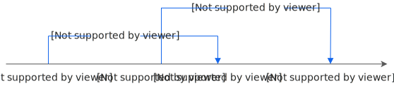
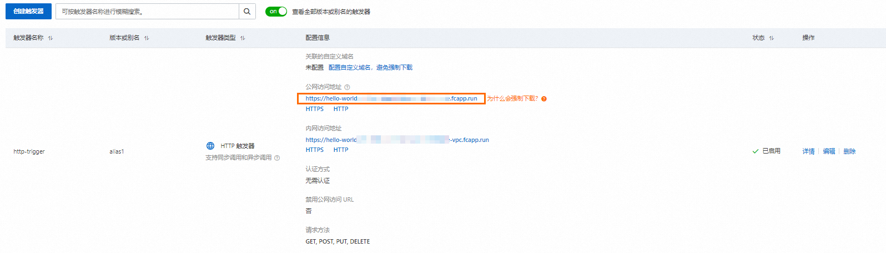

# 配置HTTP触发器并使用gRPC触发

函数计算支持gRPC协议，允许通过HTTP触发器直接触发gRPC服务。此时函数可以看做一个gRPC Server，处理客户端流式/非流式请求，同时享受Serverless架构的弹性扩缩容与免运维能力。

## 使用说明

### **调用方式**

- 域名：支持使用子域名`fcapp.run`或自定义域名调用gRPC函数。
  
  **
  
  **说明**
  
  如果需要使用自定义域名，自定义域名需要配置请求路径与函数的映射关系。建议您将请求的路径配置为`/*`，可以让所有gRPC请求都转发到对应的gRPC函数中，gRPC函数会将请求路由到客户端定义的gRPC方法。
- 端口：gRPC请求端口为`8089`。

### **传输安全性**

- 为保证gRPC请求的安全性，函数计算线上环境仅支持使用TLS协议的客户端。否则，请求会报错`rpc error: code = Unavailable desc = connection closed before server preface received`。
- 自定义域名支持使用自定义HTTPS证书，gRPC服务端不需要定义TLS证书验证，函数计算网关层会进行TLS验证。

### **请求超时控制**

gRPC请求的最长超时时间不得超过函数的**执行超时时间**。**执行超时时间**默认为60秒，最长为86400秒。

### **请求并发度控制**

gRPC请求受函数计算并发度的控制。一个gRPC请求被视为占用一个并发度。gRPC的协议基于HTTP/2，在函数计算中，对于一个函数实例而言，分配到这个函数实例的gRPC请求会复用同一条HTTP/2连接，则这条HTTP/2连接上的并发流就等于实例的并发度。您可以设置函数的单实例并发度来控制一个实例上的并发流数量。具体操作，请参见[配置单实例并发度](https://help.aliyun.com/zh/functioncompute/fc/configure-the-concurrency-of-a-single-instance)。

### **负载均衡**

函数计算支持将gRPC请求分发到不同的实例上，自动为gRPC请求做负载均衡。

## 计费方式

gRPC有以下四种请求类型：

- 普通gRPC请求
- 客户端流式请求
- 服务端流式请求
- 双向流式请求

在函数计算中，**资源使用量=规格 × 计费时间**，普通gRPC请求和流式gRPC请求的计费时间不同，具体如下：

- **普通gRPC请求**：
  
  - 对于并发度设置为1的函数，计费时间从请求开始到请求结束。
  - 对于并发度大于1的函数，计费时间从第一个请求开始，到最后一个请求结束。一个实例如果同时处理多个请求，不会被重复计费。
    
    如下图所示，一个函数的并发度设置为2，第一个请求到达的时间为T1，结束时间为T3，第二个请求到达时间为T2，结束时间为T4，计费时间为T1-T4，其中T2到T3这段时间只会被计费一次，不会被重复计费。
    
    
- **客户端流式、服务端流式和双向流式请求**：计费时间从第一个gRPC连接开始，到最后一个gRPC连接断开结束。

## **前提条件**

- 在本地安装[Go](https://go.dev/)语言环境。函数计算已支持Go 1.x版本，推荐使用最新版本。
- 在本地安装并配置Serverless Devs工具。具体操作，请参见[快速入门](https://help.aliyun.com/zh/functioncompute/fc/developer-reference/install-serverless-devs-and-docker)。

## 操作步骤

1. 在本地执行以下命令，初始化项目。
  
  ```
  sudo s init fc-custom-golang-grpc -d fc-custom-golang-grpc
  ```
2. 执行以下命令，进入项目目录`fc-custom-golang-grpc`。
  
  ```
  cd fc-custom-golang-grpc
  ```
3. 在当前项目目录下，编辑s.yaml文件。
  
  示例如下：
  
  ```
  edition: 3.0.0 name: hello-world-app # access 是当前应用所需要的密钥信息配置： # 密钥配置可以参考：https://www.serverless-devs.com/serverless-devs/command/config # 密钥使用顺序可以参考：https://www.serverless-devs.com/serverless-devs/tool#密钥使用顺序与规范 access: default # 密钥别名，请根据实际情况修改 resources: helloworld: # 业务名称/模块名称 component: fc3 actions: # 自定义执行逻辑，关于actions 的使用，可以参考：https://www.serverless-devs.com/serverless-devs/yaml#行为描述 pre-deploy: # 在deploy之前运行 - run: go mod tidy path: ./code - run: GOOS=linux GOARCH=amd64 CGO_ENABLED=0 go build -o target/main main.go path: ./code props: region: cn-shanghai # 应用部署地域，请根据实际情况修改 functionName: "fc-custom-golang-grpc" handler: index.handler role: '' description: 'hello world by serverless devs' timeout: 60 diskSize: 512 internetAccess: true layers: - acs:fc:cn-shanghai:official:layers/Go1/versions/1 customRuntimeConfig: port: 8089 command: - ./main runtime: custom.debian10 cpu: 0.35 instanceConcurrency: 2 memorySize: 512 environmentVariables: PATH: >- /opt/Go1/bin:/usr/local/bin/apache-maven/bin:/usr/local/bin:/usr/local/sbin:/usr/local/bin:/usr/sbin:/usr/bin:/sbin:/bin:/usr/local/ruby/bin:/opt/bin:/code:/code/bin LD_LIBRARY_PATH: >- /code:/code/lib:/usr/local/lib:/opt/lib:/opt/php8.1/lib:/opt/php8.0/lib:/opt/php7.2/lib code: ./code/target
  ```
4. 执行`sudo s deploy -y`部署函数。
  
  执行完成后，函数将部署至函数计算。此外，函数计算会生成一个可直接访问的URL地址，您可以使用该URL地址调用函数进行测试。
5. 创建HTTP触发器，并获取触发器的公网访问地址。具体操作，请参见[创建触发器](https://help.aliyun.com/zh/functioncompute/fc/configure-an-http-trigger-for-a-function-and-invoke-the-function-by-using-http-requests#section-11e-t95-jq7)。
  
  
6. 在本地执行以下命令，安装运行gRPC客户端所需的依赖。
  
  ```
  go mod vendor
  ```
7. 执行以下命令调用gRPC客户端，发起gRPC调用，测试函数的正确性。
  
  `fc-custang-grpc-*****.cn-shanghai.fcapp.run`为您在[步骤5](#step-le2-gbf-8ae)获取的触发器公网访问地址。
  
  ```
  go run ./greeter_client -addr fc-custang-grpc-*****.cn-shanghai.fcapp.run:8089
  ```

**

**说明**

您也可以为您创建的gRPC函数配置自定义域名，并通过自定义域名发起gRPC请求，详见[自定义域名支持gRPC协议](https://help.aliyun.com/zh/functioncompute/fc/custom-domain-name-support-grpc-protocol)。

## 更多示例

### Custom Runtime

- [Golang gRPC示例](https://github.com/devsapp/start-fc/tree/V2/custom-function/golang/fc-custom-golang-grpc)
- [Python gRPC示例](https://registry.serverless-devs.com/details/fc3-custom-python-grpc?type=Project)
- [JAVA gRPC示例](https://registry.serverless-devs.com/details/fc3-custom-java-grpc?type=Project)

### **Custom Container**

- [Golang gRPC示例](https://github.com/devsapp/start-fc/tree/V2/custom-container-function/fc-custom-container-grpc-golang)
- [Python gRPC示例](https://registry.serverless-devs.com/details/fc3-custom-container-python-grpc?type=Project)
- [JAVA gRPC示例](https://registry.serverless-devs.com/details/fc3-custom-container-java-grpc?type=Project)

## 常见问题

### **函数错误**

客户端报错`rpc error: code = Internal desc = server closed the stream without sending trailers`，表示函数计算服务端提前异常关闭gRPC请求。这种错误属于函数错误，例如函数超时、函数进程异常退出或函数出现内存溢出OOM错误等。您可以从函数日志中查询具体的错误原因并排查处理。更多信息，请参见[查看调用日志](https://help.aliyun.com/zh/functioncompute/fc-2-0/user-guide/configure-the-logging-feature#section-z06-gdf-7c9)。

### **gRPC请求未使用TLS协议客户端**

需使用TLS协议客户端调用gRPC请求，否则会报错`rpc error: code = Internal desc = server closed the stream without sending trailers`。例如，Golang语言可以使用如下示例代码：

```
var opts []grpc.DialOption cred := credentials.NewTLS(&tls.Config{ InsecureSkipVerify: false, }) opts = append(opts, grpc.WithTransportCredentials(cred)) conn, err := grpc.Dial(*addr, opts...)
```

InsecureSkipVerify的值可以设置为true，即跳过TLS证书验证，或者设置为false，即不跳过TLS证书验证。
