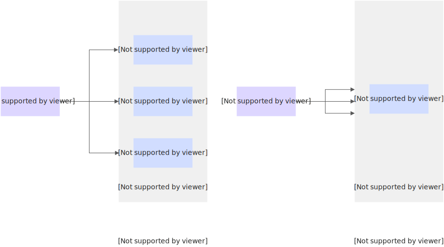
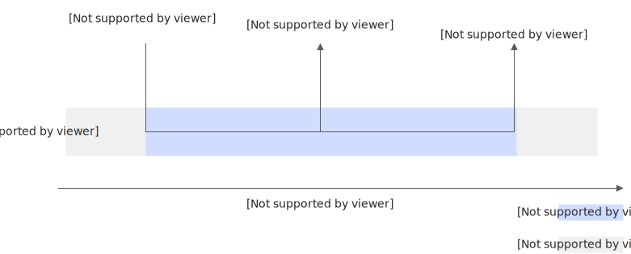
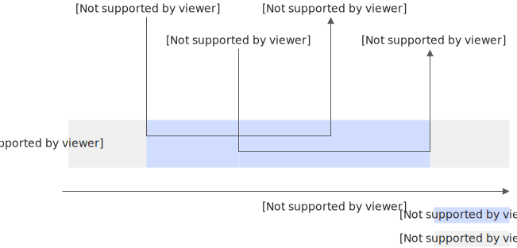

# 配置单实例并发度

实例并发度指定了每个函数实例可以同时处理的最大并发请求数。通过在函数计算中设置实例并发度，您可以在流量高峰期有效管理资源使用，降低冷启动影响，从而达到提升性能和控制成本的目的。

## **背景信息**

函数计算按实例规格乘以执行时长来计量资源使用量，从而得到资源使用的总费用，因此，函数执行时长越长，相应的使用成本越高。

假设同时有3个请求需要处理，每个请求需要10秒，并发度不同执行时长也不同。

- 当实例并发度设置为1时，每个实例同时只能处理1个请求，函数计算需要创建3个实例来处理这3个请求，总的执行时长是30秒。
- 当实例并发度设置为10时，如果不超过单个实例最大能承受的QPS范围，理论上每个实例可以同时处理10个请求，函数计算只需要创建1个实例就能处理这3个请求，总的执行时长是10秒。

**

**说明**

- 函数实例并发度为1时，一个实例同时只会处理一个请求。当您设置单实例并发度大于1后，函数计算在弹性伸缩时，充分利用完一个实例的并发度后才会创建新的实例。
- 函数实例并发度通常要和实例规格同时进行评估，能更好地优化函数的性能和成本。

实例并发度设置为不同的值时，请求执行的区别如下图所示。



## **功能优势**

- 减少执行时长，节省费用。
  
  例如，偏I/O的函数可以在一个实例内并发处理，减少实例数从而减少总的执行时长。
- 请求之间状态可共享。
  
  多个请求可以在一个实例内共用数据库连接池，从而减少和数据库之间的连接数。
- 降低冷启动概率。
  
  由于多个请求可以在一个实例内处理，创建新实例的次数会变少，冷启动概率降低。
- 减少VPC IP地址的占用。
  
  在相同负载下，单实例多并发可以降低总的实例数，从而减少VPC IP地址的占用。
  
  **
  
  **重要**
  
  您的VPC绑定的vSwitch中至少需要两个可用的IP地址，否则可能会导致服务不可用，造成请求失败。

## **应用场景**

单实例多并发功能适用于函数中有较多时间在等待下游服务响应的场景。等待响应一般不消耗资源，在一个实例内并发处理，不仅可以节省费用，还能提高应用响应能力和吞吐量。

## **使用限制**

| **限制项** | **描述** |
| --- | --- |
| 支持的运行环境 | - 自定义运行时<br>- 自定义镜像 |
| 单实例并发度取值范围 | 1~200 |
| 调用响应中的函数日志（X-Fc-Log-Result） | 实例并发数>1时不支持 |

## **操作步骤**

您可以在创建函数时，指定函数的单实例并发度。函数创建完成后，您可以在**函数详情**页面，选择**配置**页签，单击**实例配置**右侧的**编辑**，然后在**实例配置**面板调整单实例并发度。

## **设置单实例多并发的影响**

设置了单实例多并发（实例并发数>1）之后，与单实例单并发（实例并发数=1）在以下几个方面有区别。

## **计费**

单实例单并发与单实例多并发在执行时长上会不同，从而费用也不同。更多计费详情，请参见[计费概述](https://help.aliyun.com/zh/functioncompute/fc/product-overview/billing-overview-of-fc)。

- 单实例单并发
  
  函数实例在同一时间只能处理1个请求，1个请求处理完了再处理下一个请求。计费时长从处理第一个请求开始，到最后一个请求结束为止。
  
  
- 单实例多并发
  
  多个请求在一个实例并发处理时，以实例的实际占用时间作为计费的执行时长，即从第一个请求开始，到最后一个请求结束期间的时长。
  
  

## **并发度流控**

函数计算在一个地域中可用实例数的上限默认值为100，一个地域可以同时处理的最大请求数为“100×实例并发数”。例如，设置实例并发数=10时，则一个地域最多允许同时处理1000个并发请求。当并发请求数超过函数计算可以处理的最大请求数时，会收到流控错误提示ResourceExhausted。

**

**说明**

如您需要扩大某个地域的实例数上限，请[联系我们](https://help.aliyun.com/zh/functioncompute/fc/support/contact-us-1)。

## **日志**

- 在单并发模式下，在调用函数时指定HTTP头`X-Fc-Log-Type: Tail`，函数计算会在响应头`X-Fc-Log-Result`中包含本次调用所产生的函数日志。在多并发模式下，由于多个请求并发执行，无法获取某个特定请求的日志，响应头中不再包含本次调用的函数日志。
- 针对Node.js Runtime，原来的日志方式是使用`console.info()`函数，该方式会把当前请求的Request ID包含在日志内容中。当多请求在同一个实例并发处理时，当前请求可能有很多个，继续使用`console.info()`打印日志会导致Request ID错乱，Request ID都会变成`req 2`。打印日志示例如下。
  
  ```
  2019-11-06T14:23:37.587Z req1 [info] logger begin 2019-11-06T14:23:37.587Z req1 [info] ctxlogger begin 2019-11-06T14:23:37.587Z req2 [info] logger begin 2019-11-06T14:23:37.587Z req2 [info] ctxlogger begin 2019-11-06T14:23:40.587Z req1 [info] ctxlogger end 2019-11-06T14:23:40.587Z req2 [info] ctxlogger end 2019-11-06T14:23:37.587Z req2 [info] logger end 2019-11-06T14:23:37.587Z req2 [info] logger end
  ```
  
  此时应该使用`context.logger.info()`函数打印日志，该方式仍保留了请求的独立Request ID。代码示例如下。
  
  ```
  exports.handler = (event, context, callback) => { console.info('logger begin'); context.logger.info('ctxlogger begin'); setTimeout(function() { context.logger.info('ctxlogger end'); console.info('logger end'); callback(null, 'hello world'); }, 3000); };
  ```

## **错误处理**

多个请求在一个实例并发处理时，由于一个请求处理不当导致进程退出或者崩溃，会导致正在并发处理的其他请求也收到错误信息。这要求您在编写函数时，尽量捕获请求级别的异常，不影响其他请求。Node.js代码示例如下。

```
exports.handler = (event, context, callback) => { try { JSON.parse(event); } catch (ex) { callback(ex); } callback(null, 'hello world'); };
```

## **共享变量**

多个请求在一个实例并发处理时，同时修改一个共享的变量，可能会导致错误。这要求您在编写函数时，对于非线程安全的变量修改要进行互斥保护。Java代码示例如下。

```
public class App implements StreamRequestHandler { private static int counter = 0; @Override public void handleRequest(InputStream inputStream, OutputStream outputStream, Context context) throws IOException { synchronized (this) { counter = counter + 1; } outputStream.write(new String("hello world").getBytes()); } }
```
