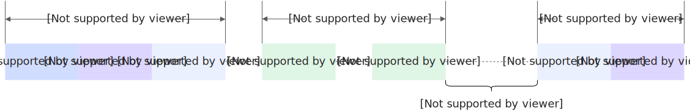
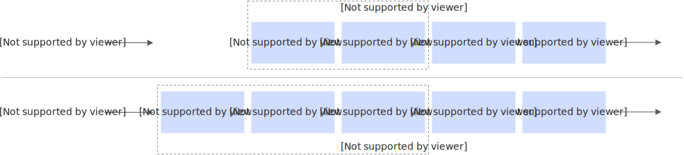
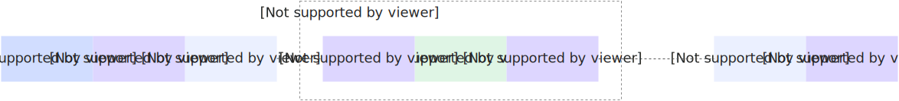
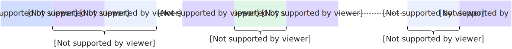

# 配置实例生命周期

函数计算在处理用户请求时，自动分配一个或多个实例，每个实例提供一个安全和隔离的运行时环境。传统应用迁移至Serverless架构时，由于函数实例的创建和销毁具有瞬态性，可能导致监控数据更新不及时、指标数据延迟或丢失等问题，为了解决以上痛点，函数计算基于实例生命周期增加多种回调操作，确保监控数据的实时性和完整性。

## **函数实例的生命周期**

函数实例会根据函数当前的请求调用量动态地按需构建与销毁，每个函数实例的生命周期包括**实例构建（Creating）**、**请求调用（Invoke）**和**实例销毁（Destroy）**三个阶段，如下图所示。



### 实例构建（Creating）

实例构建是指函数计算根据您的函数配置为您创建函数实例。在实例构建阶段，函数计算会按照顺序执行以下三项任务：

1. 实例创建（Instance Create），包括加载代码、层加载或拉取镜像和启动实例。
2. 运行时启动（Runtime Init）。
3. 执行函数配置的Initializer回调（Init Hook）。更多信息，请参见[Initializer回调](https://help.aliyun.com/zh/functioncompute/fc/basics#p-p69-h0q-wee)。



实例构建一般在以下两种情况下发生。

- 弹性扩容
  
  收到调用请求时，若当前的函数实例已经满载，会构建新的实例来处理请求，并立即执行实例构建流程，紧接着就会执行请求调用流程。弹性扩容可能会造成冷启动，解决方法请参见[函数计算冷启动优化最佳实践](https://help.aliyun.com/zh/functioncompute/fc/use-cases/best-practice-for-reducing-cold-start-latencies)。
- 最小实例数调整
  
  如果函数设置的最小实例数由0变更为≥1的其他值，函数计算会立即启动实例构建流程。如果当前未收到调用请求，则后续的请求调用流程会与实例构建流程相隔较长时间。更多信息，请参见[配置最小实例数弹性策略](https://help.aliyun.com/zh/functioncompute/fc/configure-launch-snapshot-and-auto-scaling-rules)。

### 请求调用（Invoke）

实例运行期间，会调用您的函数处理程序以处理来自内外部的函数调用请求。在调用阶段，对于函数计算支持的内置运行时，一个实例在同一时间只会处理一个请求；对于自定义运行时或自定义容器运行时，一个实例在同一时间可以处理多个请求。您可以通过设置单实例多并发实现，具体操作，请参见[配置单实例并发度](https://help.aliyun.com/zh/functioncompute/fc/configure-the-concurrency-of-a-single-instance)。

函数计算只在实际请求和回调程序执行时计费，在请求以外的时间段内实例会被冷冻，因此不计费，详情请参见[计费说明](#section-t95-ow2-tuf)。

### 实例销毁（Destroy）

如果函数实例在一段时间内没有收到任何调用，则触发此阶段。在销毁阶段，函数计算会先执行PreStop回调方法。您可以在PreStop回调方法中执行一些清理任务。

实例销毁一般在以下三种情况下发生。

- 实例浅休眠（原闲置）：如果实例在一段时间内没有收到任何调用请求，函数计算会自动回收该实例。
- 最小实例数调整：当您缩容最小实例数时，函数计算会立即为您销毁多余的实例。
- 实例异常：如果实例在构建或运行阶段出现了异常，函数计算会销毁该实例。

### **实例冻结机制**

在没有调用请求时，函数计算会将实例冻结（Freeze）**，**当新的请求来到时，函数计算会将实例解冻（Thaw）。如下图所示。



实例冻结主要发生在以下两种情况。

- 实例初始化阶段完成后，调用阶段前。
- 函数某一次调用阶段结束后，下一次调用阶段前。

在一次调用阶段完成后，函数计算将冻结函数实例，程序中的后台进程、线程或协程无法继续运行，异步日志也可能没有写入成功。

## 使用限制

- 针对GPU函数，Initialize回调程序支持**调用代码**和**执行指令**两种类型，两种类型不允许同时配置，同时只能有一个生效。
- 针对事件函数、Web函数和任务函数，Initialize回调程序仅支持**调用代码**类型，系统默认启用该模式，无需手动选择。
- PreStop回调程序仅支持**调用代码**类型，且所有运行时均支持PreStop回调程序.
- PreStop回调方法的输入参数没有event参数。
- PreStop回调函数无返回值，在函数末尾增加返回逻辑无效。
- 如果使用Java Runtime，您需要将fc-java-core更新至1.4.0及以上版本，否则无法使用PreStop回调函数。
- 当函数执行返回时，函数计算将冻结函数实例，用户不可假设调用返回时所有异步进程、线程、协程等执行完成，也不可假设本次异步写入的日志被刷新。
- 对于**调用代码**类型的回调程序，不同运行时的配置方式不同。针对内置运行时，配置生命周期回调时，需要自定义回调程序入口，例如配置Initializer回调程序为`index.initialize`，此时需要在代码中增加`initialize`回调函数。针对自定义运行时和自定义镜像，配置调用Initializer和PreStop回调程序后，函数实例启动或停止时，系统会向您的函数发送HTTP请求POST /initialize或GET /pre-stop，您需要在业务代码中响应该请求。

## 计费说明

实例生命周期回调方法的请求数不计费，其他费用与实例调用阶段的计费逻辑相同。计费时长的统计如下图所示。关于计费方式的具体信息，请参见[计费概述](https://help.aliyun.com/zh/functioncompute/fc/product-overview/billing-overview-of-fc#section-dxs-bo7-gjv)。



## 前提条件

已完成函数的创建，具体请参见[创建函数](https://help.aliyun.com/zh/functioncompute/fc/user-guide/creating-a-web-function#section-b9y-zn1-5wr)。

## **配置**实例生命周期回调方法

## 通过控制台配置回调

1. 登录[函数计算控制台](https://fcnext.console.aliyun.com)，在左侧导航栏，选择**函数管理**>**函数列表**。
2. 在顶部菜单栏，选择地域，然后在**函数列表**页面，单击目标函数。
3. 在函数详情页，选择**配置**页签，然后单击**实例配置**区域右侧的**编辑**。
4. 在**实例配置**面板，设置Initializer回调程序和回调超时时间。
  
  本文以GPU函数配置Initializer回调程序为例进行说明，事件函数、Web函数和任务函数的Initialize回调程序仅支持**调用代码**类型，可参考本文介绍的**调用代码**类型相关操作。
  
  - 选择**调用代码**类型
    
    开启**Initializer 回调程序**开关，将**Initializer 回调超时时间**设置为`300`秒。开启后，函数计算在启动实例时会向函数发送 HTTP POST /initialize 请求，返回 200 表示成功，返回 4xx/5xx 将导致错误或实例重启。
  - 选择**执行指令**类型
    
    开启**Initializer 回调程序**开关，将**Initializer 回调超时时间**设置为`300`秒，**指令内容**选择`>/bin/sh`。在代码编辑区编写 shell 脚本：设置 URL 为`http://localhost:7860`，REQUEST_PATH 为`sdapi/v1/txt2img`，构造包含`prompt`、`steps`、`height`、`width`字段的 JSON 数据，通过 curl 向本地 Stable Diffusion API 发送 POST 健康检查请求。
5. 在**实例配置**面板，继续设置PreStop回调程序和回调超时时间，然后单击**部署**。
6. 如果配置了**调用代码**类型的Initializer回调或PreStop回调，您需要在代码执行中实现对应的函数。
  
  1. 单击**代码**页签，在代码编辑区域，增加回调程序函数逻辑。
    
    例如，您配置的PreStop回调程序为`index.preStop`，则需要实现preStop函数。不同语言运行时实现函数实例生命周期回调的方法请参见[函数实例生命周期回调方法](#0d087cb035snb)。
    
    **
    
    **说明**
    
    在线IDE支持PHP、Python、Node.js和自定义运行时；但不支持Java、Go和.NET这类编译性语言，以及自定义镜像。
  2. 单击代码编辑器上方的**部署代码**，然后单击**测试函数**。

## 通过Serverless Devs配置回调

使用Serverless Devs配置initializer回调程序时，`s.yaml`配置文件示例代码片段如下所示：

```
codeUri: './code.zip' ...... instanceLifecycleConfig: initializer: timeout: 60 command: - /bin/sh - -c - echo "hello"
```

如果您需要关闭某个回调程序，需要将回调函数的handler参数以及command显示置空，否则后端默认不更新。例如关闭initializer回调程序时，您需要按照以下配置进行部署更新，此时initializer回调程序的超时时间和执行命令已无效。

```
codeUri: './code.zip' ...... instanceLifecycleConfig: initializer: handler: "" timeout: 60 command: ""
```

不同语言运行时实现函数实例生命周期回调的方法请参见[函数实例生命周期回调方法](#0d087cb035snb)。

## 通过SDK配置回调

您可以通过SDK部署和更新回调程序。本文介绍如何获取在创建函数时配置回调函数的SDK示例代码。

1. 进入[创建函数](https://help.aliyun.com/zh/functioncompute/fc/developer-reference/api-fc-2023-03-30-createfunction)页面，单击**调试**，进入OpenAPI门户。
2. 在**参数配置**页签，根据需要创建函数的基本信息填写**输入参数**。
  
  **
  
  **说明**
  
  preStop回调暂不支持配置command参数。
  
  展开**instanceLifecycleConfig**（实例生命周期回调方法配置），在**initializer**中将**timeout**设为`300`，在**command**列表第 0 项填入`curl -X POST 'http://localhost:9000/preWarm`；在**preStop**中将**handler**设为`index.preStop`，**timeout**设为`3`。
3. 参数配置完成后，单击**SDK 示例**页签，获取对应语言的SDK示例代码。

不同语言运行时实现函数实例生命周期回调的方法请参见[函数实例生命周期回调方法](#0d087cb035snb)。

### **函数实例生命周期回调方法**

函数计算中所有运行时均支持Initialize和PreStop两种回调方法。运行时实现函数实例生命周期回调的方法请参考以下内容。

| **运行时** | **描述** | **参考文档** |
| --- | --- | --- |
| Node.js | 通过Node.js实现并应用函数实例生命周期回调方法。 | [函数实例生命周期回调](https://help.aliyun.com/zh/functioncompute/fc/user-guide/lifecycle-hooks-for-function-instances) |
| Python | 通过Python实现并应用函数实例生命周期回调方法。 | [函数实例生命周期回调](https://help.aliyun.com/zh/functioncompute/fc/user-guide/lifecycle-hooks-for-function-instances-1) |
| PHP | 通过PHP实现并应用函数实例生命周期回调方法。 | [函数实例生命周期回调](https://help.aliyun.com/zh/functioncompute/fc/user-guide/lifecycle-hooks-for-function-instances-in-a-php-runtime) |
| Java | 通过Java运行时实现函数实例生命周期回调的方法。 | [函数实例生命周期回调](https://help.aliyun.com/zh/functioncompute/fc/user-guide/lifecycle-hooks-for-function-instances-4-1) |
| C# | 通过C#运行时实现函数实例生命周期回调的方法。 | [函数实例生命周期回调](https://help.aliyun.com/zh/functioncompute/fc-2-0/user-guide/lifecycle-hooks-for-function-instances-1) |
| Go | 通过Go实现函数实例生命周期回调的方法。 | [函数实例生命周期回调](https://help.aliyun.com/zh/functioncompute/fc-2-0/user-guide/lifecycle-hooks-for-function-instances-3) |
| 自定义运行时 | 通过自定义运行时实现函数实例生命周期回调的方法。 | [函数实例生命周期回调](https://help.aliyun.com/zh/functioncompute/fc-2-0/user-guide/lifecycle-hooks-for-function-instances-2) |
| 自定义镜像 | 通过自定义镜像运行时实现函数实例生命周期回调的方法。 | [函数实例生命周期回调](https://help.aliyun.com/zh/functioncompute/fc-2-0/user-guide/lifecycle-hooks-for-function-instances-7) |

## 查询回调函数相关日志

配置函数实例生命周期回调并执行代码实现对应的回调函数后，您可以查询实例生命周期回调函数的相关日志。

**

**说明**

目前执行指令类型回调产生的日志暂不支持写入函数日志。

1. 登录[函数计算控制台](https://fcnext.console.aliyun.com)，在左侧导航栏，选择**函数管理**>**函数列表**。
2. 在顶部菜单栏，选择地域，然后在**函数列表**页面，单击目标函数。
3. 在函数详情页，选择**日志**页签，然后在**调用请求**页签，单击目标请求行右侧**操作**列的**高级日志**。
  
  您可以使用复制的实例ID，查询所有生命周期回调函数的Start/End日志；还可以使用`实例ID+函数实例生命周期回调关键字`查询指定回调函数的Start/End日志，例如，`c-62833f38-20f1629801fa4bd***** and PreStop`。
  
  此外，您还可以根据Start/End日志中的RequestId查询请求的日志信息。如果用户日志中没有RequestId，可以单击该日志中的图标获取上下文日志。
