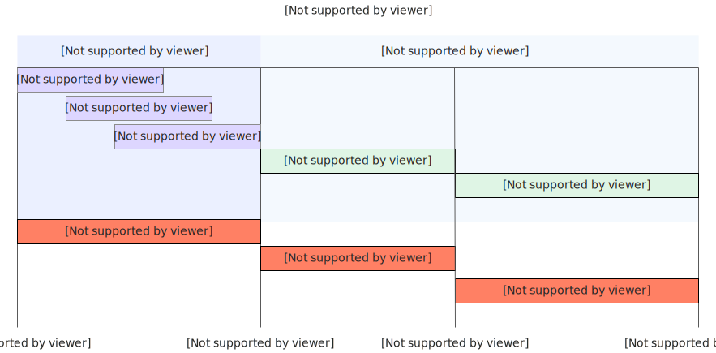
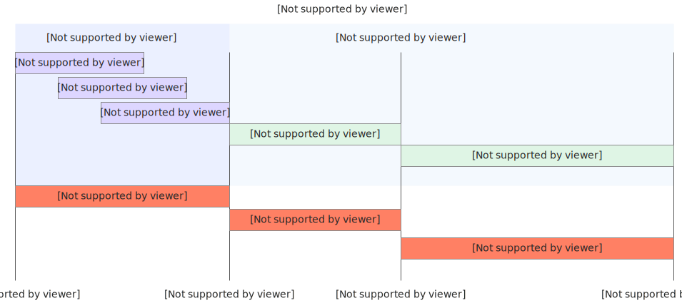

# 配置弹性实例延迟释放

在处理后台异步任务等场景时，例如实例在每次处理完请求后需要执行日志上传、数据同步等收尾工作，推荐您使用实例延迟释放功能。该功能可以避免因实例在任务完成前被立即销毁而导致的任务中断和数据丢失。

开启该功能后，函数计算会在实例处理完最后一个请求后，按照您设置的“延迟释放时间”继续保留实例。在此期间，系统会根据实例的资源利用率，自动在不同状态间转换，以平衡运行性能与使用成本：

- 维持活跃：当实例的vCPU利用率或GPU（流处理器、编解码器）的利用率高于系统阈值时，实例将保持活跃，以便后台任务可以继续处理。
- 转为闲置：当实例的vCPU和GPU利用率均低于系统阈值时，实例将自动转为闲置状态，以降低成本。
- 快速唤醒：处于闲置状态的实例在接收到新请求时，能够被快速唤醒，实现毫秒级热启动，有效避免了冷启动的延迟。

持续延迟释放时间没有请求，实例将被自动销毁，停止计费。实例销毁以后，如果[设置最小实例数](https://help.aliyun.com/zh/functioncompute/fc/configure-launch-snapshot-and-auto-scaling-rules#e5cd40eacddj7)为0，会存在冷启动，如果[设置最小实例数](https://help.aliyun.com/zh/functioncompute/fc/configure-launch-snapshot-and-auto-scaling-rules#e5cd40eacddj7)＞0，则可以消除冷启动。

## **实例延迟释放方案对比**

| **对比项** | **延迟释放** | **会话亲和** | **延迟释放+会话亲和** |
| --- | --- | --- | --- |
| **适用场景** | 后台业务 | 长生命周期会话业务 | 后台业务+会话长连接业务 |
| **实例保活时长限制** | 5分钟 ≤ 设置延迟释放时长 ≤ 60分钟 | 单个实例最晚过期的Session时间 | 以下两个时长取最大值： - 弹性实例延迟释放时长，详见[如何在函数计算中进行配置？](#c2a96b07c1t7s)。 - 单个实例上所有Session设置的Session Idle时长的最大值，详见[配置会话亲和](https://help.aliyun.com/zh/functioncompute/fc/user-guide/configure-session-affinity/)。 |

## **如何在函数计算中进行配置？**

### **使用说明**

- 延迟释放功能仅适用于为响应请求而动态创建的弹性实例。
- 该功能不影响您已配置的最小实例数。最小实例拥有其独立的生命周期管理和计费规则，不受延迟释放配置的影响。

### **步骤一：配置弹性实例延迟释放**

支持在新建函数时配置弹性实例延迟释放功能，或按照以下步骤为已有函数进行配置。

1. 登录[函数计算控制台](https://fcnext.console.aliyun.com)，在左侧导航栏，选择**函数管理**>**函数列表**。
2. 在顶部菜单栏，选择地域，然后在**函数列表**页面，单击目标函数。
3. 选择**函数详情**>**配置**页签，单击下方**高级配置**右侧的**编辑**。
4. 在**高级配置**面板，单击展开**延时释放弹性实例**区域，开启**延时释放弹性实例**功能开关，设置**延迟释放时间**，然后单击**部署**。

### **（可选）步骤二：配置会话亲和**

本文以HeaderField亲和功能为例，具体操作，请参见[配置会话亲和](https://help.aliyun.com/zh/functioncompute/fc/user-guide/configure-session-affinity/)。

### **步骤三：验证结果**

1. 在目标函数的详情页面，选择**代码**页签，然后单击**测试函数**。
2. 函数执行成功后，选择**实例**页签，通过观察实例的**运行周期**判断延迟释放功能是否已生效。

## **计费说明**

开启延迟释放功能后，计费主体为响应请求而动态创建的实例。下文描述的计费规则仅适用于这些实例，与您配置的**最小实例数**的计费相互独立。

- **最小实例数**：无论是否有请求，都会持续存在。在无请求时按“弹性实例（闲置）”计费，在处理请求时按“弹性实例（活跃）”计费。
- **延迟释放的实例**：在请求处理完毕后，根据本文描述的规则进入活跃、闲置或销毁状态。

### **场景一：仅设置延时释放功能**

#### **示例**

设置实例延迟释放时间为9分钟

#### **计费时段**

如下图所示，根据执行请求的情况，分以下三个计费时段；14分钟之后，由于已经持续9分钟没有请求，此实例被释放。

- 00:00~00:05：处理请求期间，按照弹性实例（活跃）单价计费
- 00:05~00:09：请求结束，系统监测到vCPU或GPU利用率＞系统阈值，按照弹性实例（活跃）单价计费
- 00:09~00:14：请求结束，系统监测到vCPU和GPU利用率均＜系统阈值，按照弹性实例（闲置）单价计费

### **场景二：设置延时释放+会话亲和功能**

#### **示例**

- 设置实例延迟释放时间为9分钟
- 开启HeaderField亲和，且**Session Idle时长值**为15分钟
  
  本文以HeaderField亲和为例，关于会话亲和的类型、功能介绍和计费说明，请参见[配置会话亲和](https://help.aliyun.com/zh/functioncompute/fc/user-guide/configure-session-affinity/)。

#### **计费时段**

取实例延迟释放时间9分钟与HeaderField亲和功能设置的**Session Idle时长**二者中的最大值15分钟。根据执行请求的情况，分三个计费时段（同[场景一：仅设置延时释放功能](#qCyqx)场景），20分钟之后，无新请求时，此实例被释放。

