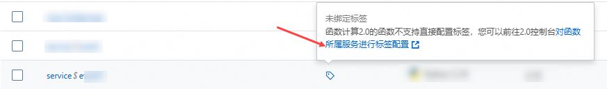

# 配置标签

函数计算支持将相同作用的函数资源通过标签Tag归类，便于搜索和资源聚合。您还可以通过标签功能将函数进行分组，可以实现不同角色对不同分组的函数拥有不同的操作权限。本文介绍标签功能的使用说明、使用限制以及如何在函数计算控制台操作标签等。

## 使用说明

- 标签与函数资源之间是多对多的关系。
- 每个标签都由一对键值对组成。
- 标签可以是授权的一个条件，为一个确定范围内的资源做精细粒度授权。
- 函数下的资源，包括版本、别名和触发器均继承函数的标签。
  
  - 只要API的调用上填写了函数，都支持标签鉴权。
  - 函数的不同版本使用相同的标签，即标签修改影响的标签鉴权针对的是所有版本和别名的函数。

## 使用限制

- 标签键（Key）的最大长度为64个Unicode字符，区分大小写。
- 标签值（Value）的最大长度为128个Unicode字符，区分大小写。
- 每个资源的标签数不得超过20个。
- 标签键（Key）支持ASCII、数字、中文字符和特殊字符`-\.!@#$%?/^&*)(+={}[\\]",'<>~·`:;|_`。不支持中文标点符号，不支持以`aliyun`或`acs:`开头，不允许包含`http://`和`https://`，不允许为空字符串。
- 标签值（Value）支持ASCII、数字、中文字符和特殊字符`-\.!@#$%?/^&*)(+={}[\\]",'<>~·`:;|_`。不支持中文标点符号，不允许包含`http://`和`https://`，允许为空字符串。
- 各地域间的标签信息不互通。例如，在华东1（杭州）地域创建的标签在华东2（上海）地域不可见。

## 为函数绑定标签

支持在新创建函数时，绑定标签，也可以为已有函数配置标签，详见下文。

1. 登录[函数计算控制台](https://fcnext.console.aliyun.com)，在左侧导航栏，选择**函数管理**>**函数列表**。
2. 在顶部菜单栏，选择地域，然后在**函数列表**页面，找到目标函数。
3. 光标移至目标函数**标签**列的图标，在气泡中单击**绑定**，在**编辑标签**对话框，填写**标签键**和**标签值**，然后单击**确认**。
  
  添加成功后，光标再次移至目标函数**标签**列的图标，您可以看到刚才添加的标签。您还可以根据需要，参考控制台界面提示，更新或删除标签。

**

**重要**

如果目标函数是在函数计算2.0控制台创建的函数（函数名称中含有$符号），则不支持在3.0控制台为其绑定标签，请根据界面提示单击超链接跳转至2.0控制台的目标服务下，为服务[绑定标签](https://help.aliyun.com/zh/functioncompute/fc-2-0/user-guide/tag-management)。

## **功能使用实践**

某企业的阿里云主账号创建了多个函数，需要按业务分组将不同的函数授权给不同的团队，企业希望每个团队只能查看和管理被授权的函数，未被授权的函数不允许查看和管理。针对以上场景，您可以[使用标签功能对函数进行分组授权管理](https://help.aliyun.com/zh/functioncompute/fc/grant-different-grouping-function-operation-permissions-to-different-ram-roles)。
