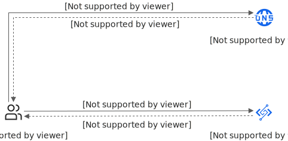

# 配置自定义域名

如果您希望在生产环境中通过固定域名访问函数计算中创建的应用或函数，或者解决访问HTTP触发器时强制下载行为，可以参见本文为应用或函数绑定自定义域名。

## 典型应用场景

在以下示例场景中，您需要为函数或应用绑定自定义域名。

- 您创建了一个Web应用，并将该应用迁移到函数计算，希望通过固定的域名访问该应用。
- 您通过[函数计算控制台](https://fcnext.console.aliyun.com)搭建了一个Web应用，希望通过一个域名的不同路径触发不同的函数处理。
- 您通过函数计算的应用中心创建了应用，例如Stable Diffusion应用，希望通过固定的域名访问该应用。

## **使用限制**

- 为函数绑定自定义域名时，必须选择函数所在的地域。
- 配置的自定义域名区分大小写，请按实际备案的域名填写。
- 支持配置泛域名和标准域名，不支持配置中文域名。

## **通过自定义域名访问应用的实现原理**

## **前提条件**

- 已创建函数或应用。具体操作，请参见[创建函数](https://help.aliyun.com/zh/functioncompute/fc/user-guide/function-instance-1/)和[创建应用](https://help.aliyun.com/zh/functioncompute/manage-applications#section-yc4-zlk-gl8)。
  
  为应用绑定自定义域名，就是为应用创建的函数绑定自定义域名，您可以在应用的**环境详情**页面的**资源信息**区域找到创建应用时自动创建的函数资源，单击函数名称即可跳转到函数页面。
- 准备一个已在阿里云接入**网站**备案的自定义域名。
  
  根据域名所属的服务提供商和所属账号，参考以下对应的操作指导进行域名备案。您可以登录中国国家工业和信息化部（简称工信部）确认域名是否备案成功。
  
  - 当前阿里云账号注册的域名
    
    登录[阿里云ICP代备案管理系统](https://bsn.console.aliyun.com/#/bsnApply/fc)备案自定义域名。具体操作，请参见[个人网站备案快速入门](https://help.aliyun.com/zh/icp-filing/basic-icp-service/getting-started/quick-start-for-icp-filing-for-personal-websites)。
  - 其他阿里云账号注册的域名
    
    建议您使用注册域名的阿里云账号完成域名备案。如果您需要使用当前阿里云账号进行域名备案，则需要根据情况完成[域名转移至其他阿里云账号](https://help.aliyun.com/zh/dws/user-guide/transfer-the-domain-name-to-another-alibaba-cloud-account)或者[域名持有者信息修改（过户）](https://help.aliyun.com/zh/dws/user-guide/modify-registrant-contact-information-or-transfer-domain-name-ownership)。然后登录[阿里云ICP代备案管理系统](https://bsn.console.aliyun.com/#/bsnApply/fc)备案自定义域名。具体操作，请参见[个人网站备案快速入门](https://help.aliyun.com/zh/icp-filing/basic-icp-service/getting-started/quick-start-for-icp-filing-for-personal-websites)。
  - 非阿里云账号注册的域名
    
    如果您的域名不是在阿里云备案，需要在阿里云接入备案。登录[阿里云ICP代备案管理系统](https://bsn.console.aliyun.com/#/bsnApply/fc)备案自定义域名。具体操作，请参见[接入备案流程](https://help.aliyun.com/zh/icp-filing/access-to-the-registration-process)。
  
  **
  
  **说明**
  
  - 中国香港和海外地域的函数绑定的自定义域名不需要备案。
  - 单次购买函数计算资源包订单金额100元及以上，即可获得免费的ICP备案服务码。您可以登录[ICP备案服务控制台](https://bsn.console.aliyun.com/?spm=5176.27176505.commonbuy2container.5.4e81778b8kmDBw#/bsnApply/fc)，在**可备案实例管理**页面的**函数计算套餐包**页签查看可用的免费备案数量[并使用资源包的服务码进行备案](https://help.aliyun.com/zh/functioncompute/fc/how-to-obtain-service-identification-number-after-i-buy-resource-plans)，可备案服务器列表，请参见[阿里云可备案服务器列表](https://help.aliyun.com/zh/icp-filing/basic-icp-service/user-guide/icp-filing-server-access-information-check#cd5bf02ba6uk9)。
  - 如果您不确定域名所属服务提供商，您可以在[域名信息查询（WHOIS）](https://whois.aliyun.com/?spm=a2c4g.11186623.0.0.74d235aflWBJZ8)页面进行查询。
  - 如果您不确定域名是否属于当前阿里云账号，您可以在[云解析DNS控制台](https://dns.console.aliyun.com/#/dns/domainList)进行查询。

## **1.开始添加自定义域名**

1. 登录[函数计算控制台](https://fcnext.console.aliyun.com)，在左侧导航栏，选择**函数管理**>**域名管理**，选择地域，然后单击**添加自定义域名**。
  
  **
  
  **重要**
  
  为函数绑定自定义域名时，必须选择与函数相同的地域。
2. 在**添加自定义域名**页面，填写已在阿里云备案或接入备案的自定义域名。支持**单域名**（例如`www.aliyun.com`）或**通配符域名**（例如`*.aliyun.com`）。
  
  获取**公网 CNAME**或**内网 CNAME**，用于下一步配置域名解析。关于CNAME的格式，说明如下：
  
  | **CNAME类型** | **格式** | **示例** |  |
  | --- | --- | --- | --- |
  | 公网CNAME | `<account_id>.<region_id>.fc.aliyuncs.com` | 您的阿里云账号（主账号）ID为1413397765****，函数或应用所在地域为华东1（杭州）。 | 公网CNAME为`1413397765****.cn-hangzhou.fc.aliyuncs.com`。 |
  | 内网CNAME | `<account_id>.<region_id>-internal.fc.aliyuncs.com` | 内网CNAME为`1413397765****.cn-hangzhou-internal.fc.aliyuncs.com`。 |  |

## **2. 配置域名解析**

登录[云解析 DNS控制台](https://dnsnext.console.aliyun.com/)，将已备案的域名解析到函数计算的CNAME。具体操作，请参见[配置域名解析](https://help.aliyun.com/zh/dns/novice-guide-dns)。

如图所示，配置域名解析时，**记录值**需要填写为[上一步](#fab095d0aaiqq)获取的函数计算的CNAME。如果您希望通过公网访问该域名，需要将**记录值**配置为函数计算公网CNAME。

配置域名解析时，**记录类型**选择**CNAME**，**主机记录**填写`@`，**解析请求来源**保持**默认**。

## **3. 继续完成自定义域名的添加**

返回至步骤[1.开始添加自定义域名](#fab095d0aaiqq)的**添加自定义域名**页面，根据需求，配置以下选项后，单击**创建**完成自定义域名的添加。

### **3.1 路由配置**

如果您的应用包含多个函数，可以设置路径与函数的对应关系，不同的请求路径可以触发不同的函数执行。更多信息，请参见[路由匹配规则](#f6c4491609qgi)。

如果需要将匹配指定路径的请求的URI根据规则进行重写，请参见[配置重写策略（公测中）](https://help.aliyun.com/zh/functioncompute/fc/configure-a-rewrite-policy)。

路由设置页面以表格形式管理路由规则，每条规则包含**路径**、**函数名称**、**版本或别名**和**重写策略**字段。例如，可将路径`/test1`映射到函数`test-renwu`，将`/*`作为兜底路径映射到默认函数，版本均可选择**LATEST**。

### **3.2（可选）HTTPS设置**

如果需要启用HTTPS协议访问自定义域名的功能，请参见以下步骤配置。

| **配置项** | **操作** |
| --- | --- |
| **HTTPS** | 启用后支持使用HTTP或HTTPS协议访问该自定义域名，如果不启用，则仅支持使用HTTP协议访问该自定义域名。 ** **说明** 您还可以选中**强制 HTTPS**复选框，此时仅支持使用HTTPS协议访问该自定义域名，函数计算会将所有使用HTTP协议访问该自定义域名的请求重定向至HTTPS协议。 |
| **证书类型** | 选择要上传的证书类型。取值说明如下： - **阿里云 SSL 证书**：选择您的阿里云SSL证书。如果**证书名称**下拉列表为空，则说明您尚未购买阿里云SSL证书，您可以登录[SSL证书管理控制台](https://yundun.console.aliyun.com/)购买。具体步骤，请参见[购买正式证书](https://help.aliyun.com/zh/ssl-certificate/purchase-an-ssl-certificate#task-q3j-zfp-ydb)。 - **手动上传**：手动输入**证书名称**，并填写**PEM 证书内容**和**PEM 证书密钥**。 ** **说明** 上传的证书的大小不能超过20 KB，证书密钥的大小不能超过4 KB。 |
| **TLS 协议版本** | 选择函数使用的TLS协议版本。 ** **说明** 选择以上TLS协议版本后，您还可以选中**开启支持 TLS1.3**复选框，表示同时支持TLS 1.3协议。 |
| **加密套件** | 选择TLS加密算法套件，如果不配置，默认选择全部加密套件。取值说明如下： - **全部加密套件，兼容性较高，安全性较低**：选择全部加密套件。函数计算支持的加密套件列表请参见[强加密和弱加密套件列表](#ef589767a4pwa)。 - **协议版本的自定义加密套件、请谨慎选择，避免影响业务**：选择部分支持的加密套件。下拉列表中显示所有加密套件，您可以单击加密套件右侧的图标，删除安全性较弱的弱加密套件，保留您选择的TLS协议版本支持的加密套件。 ** **重要** - 请谨慎选择自定义加密套件，确保服务端和客户端套件的正确匹配。 - 关于TLS协议版本和其支持的加密套件，请参见[TLS协议版本与加密套件对应关系](#8892fce989w69)。 - 函数计算对加密套件的命名使用RFC命名规范。同一个加密套件，使用不同命名规范的命名会存在差异。关于RFC和OpenSSL命名的加密套件名称差异点，请参见[RFC与OpenSSL加密套件命名对照表](#4a8d14ff82tff)。 |

### **3.3（可选）认证设置**

- 无需认证：不需要对HTTP请求进行身份验证，支持匿名访问，任何人都可以发起HTTP请求调用您的函数。
- 签名认证：对HTTP请求进行签名认证，具体请参见[为自定义域名配置签名认证](https://help.aliyun.com/zh/functioncompute/fc/user-guide/configure-signature-authentication-for-custom-domain-names)。
- Basic认证：HTTP基本认证方式，在函数计算控制台上配置用户名和密码，客户端在发起访问时，通过Authorization Header携带有效的身份信息，仅当请求中的用户信息与配置的用户名密码匹配时，可成功访问函数，详见[为自定义域名配置Basic认证鉴权](https://help.aliyun.com/zh/functioncompute/fc/user-guide/configure-basic-authentication-for-custom-domain-names)。
- JWT认证：对HTTP请求进行JWT认证，确保仅持有有效JWT的客户端才能访问函数，详见[为自定义域名配置JWT认证鉴权](https://help.aliyun.com/zh/functioncompute/fc/user-guide/configure-jwt-authentication-for-custom-domain-names)。
- Bearer认证：对HTTP请求进行Bearer认证，通过在函数计算控制台上配置允许访问函数的token信息，客户端在发起访问时，通过Authorization Header携带有效的token信息，仅当访问请求中的token数据与配置的token数据匹配时，可成功访问函数，详见[为自定义域名配置Bearer认证鉴权](https://help.aliyun.com/zh/functioncompute/fc/user-guide/configure-bearer-authentication-for-custom-domain-names)。

### 3.4（可选）Web 应用防火墙设置

启用后支持对函数或者应用的业务流量进行恶意特征识别，对流量进行清洗和过滤后，将正常和安全的流量回源至后端函数，避免函数被恶意侵入。更多信息，请参见[开启Web应用防火墙](https://help.aliyun.com/zh/functioncompute/fc/user-guide/enable-waf-protection)。

### 3.5（可选）CDN设置

为Web应用绑定自定义域名后，您可以将该自定义域名作为源站域名为其添加加速域名，然后为加速域名配置CNAME，即为域名设置CDN加速功能。将部署在函数计算的应用作为源站，将源内容发布到边缘节点，使终端用户能快速读取所需内容，有效降低访问时延，提高服务质量。

1. 启用CDN加速，填写自定义的**CDN 加速域名**，然后单击**创建**完成加速域名的添加。
  
  完成加速域名添加后，您需要手动进行 DNS 配置，才能使加速域名生效。阿里云 CDN 服务会为您输入的加速域名生成相应的 CNAME 值，您需要将该 CNAME 配置到对应的加速域名上。
  
  **
  
  **重要**
  
  - CDN加速功能会消耗公网流量，需要收取流量费用。更多信息，请参见[计费概述](https://help.aliyun.com/zh/functioncompute/fc/product-overview/billing-overview-of-fc)。
  - 自定义域名和加速域名不能使用同一个域名。为了不占用更多域名资源，可以将CDN加速域名配置为您的自定义域名的二级域名（即子域名），例如，配置自定义域名为`example.com`，配置CDN加速域名为`fast.example.com`。
2. 单击刚才配置的自定义域名，在自定义域名详情页面的**CDN 加速配置**区域，单击**操作**列的**CDN 配置管理**跳转到[CDN控制台](https://cdn.console.aliyun.com/)获取CDN为加速域名分配的CNAME。
  
  CNAME的格式为`加速域名.w.kunlun**.com`，例如`fast.example.com.w.kunlunle.com`。
3. 登录[云解析 DNS控制台](https://dns.console.aliyun.com/)，找到您的自定义域名，将加速域名的DNS解析记录指向分配的CNAME域名，从而实现加速效果。具体操作，请参见[配置域名解析](https://help.aliyun.com/zh/dns/novice-guide-dns)。
  
  **记录类型**选择**CNAME - 将域名指向另外一个域名**。
  
  其中，**主机记录**填写为加速域名即子域名的第一层，本文示例为`fast`，**记录值**填写为您上一步设置的加速域名。

### **3.6（可选）CORS配置**

为自定义域名配置CORS可通过[更新自定义域名](https://help.aliyun.com/zh/functioncompute/fc/developer-reference/api-fc-2023-03-30-updatecustomdomain)接口进行配置，详见**：**[CORS请求处理](https://help.aliyun.com/zh/functioncompute/fc/user-guide/http-triggers-overview#section-s91-v5a-lqw)。

## **4. 验证自定义域名**

### **4.1 验证自定义域名访问效果**

- 方法一：通过命令行`curl URL`测试。例如`curl example.com/login`。
- 方法二：通过浏览器测试。
  
  在浏览器地址栏中输入请求URL，然后按回车键可以验证是否调用了目标函数。

### **4.2（可选）验证加速域名访问效果**

在浏览器中使用您在步骤[3.5（可选）CDN设置](#42e99e1e50rb5)配置的CDN加速域名访问应用，然后打开开发者工具通过观察返回响应中X-Cache字段返回值来判断加速域名是否生效。

**

**说明**

表示CDN缓存策略实际效果的X-Cache字段返回值以MISS开头，表明首次访问未命中CDN节点缓存，需要向源站请求资源。后续访问命中CDN节点缓存后，X-Cache字段返回值将以HIT开头，表明源站的资源已缓存到CDN节点。

| **首次访问未命中** | **后续访问命中** |
| --- | --- |
| 在浏览器 DevTools 的**Network**面板中，选中目标请求并查看**Headers**选项卡，确认**Status Code**为`200 OK`，**X-Cache**字段值包含`MISS TCP_MISS`。 | 在浏览器开发者工具的**Network**面板中查看第二次请求的**Headers**信息，**Status Code**为`200 OK`，**X-Cache**字段值包含`HIT`，表明 CDN 缓存已命中。 |

## **加密套件相关信息**

### **强加密和弱加密套件列表**

函数计算支持的强加密和弱加密套件列表如下。

| **强加密套件** | **弱加密套件** |
| --- | --- |
| - TLS_RSA_WITH_AES_128_CBC_SHA - TLS_RSA_WITH_AES_256_CBC_SHA - TLS_RSA_WITH_AES_128_GCM_SHA256 - TLS_RSA_WITH_AES_256_GCM_SHA384 - TLS_ECDHE_ECDSA_WITH_AES_128_CBC_SHA - TLS_ECDHE_ECDSA_WITH_AES_256_CBC_SHA - TLS_ECDHE_RSA_WITH_AES_128_CBC_SHA - TLS_ECDHE_RSA_WITH_AES_256_CBC_SHA - TLS_ECDHE_ECDSA_WITH_AES_128_GCM_SHA256 - TLS_ECDHE_ECDSA_WITH_AES_256_GCM_SHA384 - TLS_ECDHE_RSA_WITH_AES_128_GCM_SHA256 - TLS_ECDHE_RSA_WITH_AES_256_GCM_SHA384 - TLS_ECDHE_RSA_WITH_CHACHA20_POLY1305 - TLS_ECDHE_ECDSA_WITH_CHACHA20_POLY1305 | - TLS_RSA_WITH_RC4_128_SHA - TLS_RSA_WITH_3DES_EDE_CBC_SHA - TLS_RSA_WITH_AES_128_CBC_SHA256 - TLS_ECDHE_ECDSA_WITH_RC4_128_SHA - TLS_ECDHE_RSA_WITH_RC4_128_SHA - TLS_ECDHE_RSA_WITH_3DES_EDE_CBC_SHA - TLS_ECDHE_ECDSA_WITH_AES_128_CBC_SHA256 - TLS_ECDHE_RSA_WITH_AES_128_CBC_SHA256 |

### TLS协议版本与加密套件对应关系

下表展示了各TLS协议版本与其支持的加密套件之间的对应关系。函数计算系统默认配置列表中所有加密套件。

**

**说明**

下表中表示TLS协议版本支持该加密套件，表示TLS协议版本不支持该加密套件。

展开查看TLS协议版本与加密套件对应关系。

| **加密套件** | **TLS 1.0** | **TLS 1.1** | **TLS 1.2** | **TLS 1.3** |
| --- | --- | --- | --- | --- |
| TLS_RSA_WITH_3DES_EDE_CBC_SHA |  |  |  |  |
| TLS_RSA_WITH_AES_128_CBC_SHA |  |  |  |  |
| TLS_RSA_WITH_AES_256_CBC_SHA |  |  |  |  |
| TLS_RSA_WITH_AES_128_GCM_SHA256 |  |  |  |  |
| TLS_RSA_WITH_AES_256_GCM_SHA384 |  |  |  |  |
| TLS_ECDHE_ECDSA_WITH_AES_128_CBC_SHA |  |  |  |  |
| TLS_ECDHE_ECDSA_WITH_AES_256_CBC_SHA |  |  |  |  |
| TLS_ECDHE_RSA_WITH_3DES_EDE_CBC_SHA |  |  |  |  |
| TLS_ECDHE_RSA_WITH_AES_128_CBC_SHA |  |  |  |  |
| TLS_ECDHE_RSA_WITH_AES_256_CBC_SHA |  |  |  |  |
| TLS_ECDHE_RSA_WITH_AES_128_GCM_SHA256 |  |  |  |  |
| TLS_ECDHE_ECDSA_WITH_AES_128_GCM_SHA256 |  |  |  |  |
| TLS_ECDHE_RSA_WITH_AES_256_GCM_SHA384 |  |  |  |  |
| TLS_ECDHE_ECDSA_WITH_AES_256_GCM_SHA384 |  |  |  |  |
| TLS_ECDHE_RSA_WITH_CHACHA20_POLY1305 |  |  |  |  |
| TLS_ECDHE_ECDSA_WITH_CHACHA20_POLY1305 |  |  |  |  |
| TLS_RSA_WITH_RC4_128_SHA |  |  |  |  |
| TLS_RSA_WITH_AES_128_CBC_SHA256 |  |  |  |  |
| TLS_ECDHE_ECDSA_WITH_RC4_128_SHA |  |  |  |  |
| TLS_ECDHE_RSA_WITH_RC4_128_SHA |  |  |  |  |
| TLS_ECDHE_ECDSA_WITH_AES_128_CBC_SHA256 |  |  |  |  |
| TLS_ECDHE_RSA_WITH_AES_128_CBC_SHA256 |  |  |  |  |
| TLS_AES_128_GCM_SHA256 |  |  |  |  |
| TLS_AES_256_GCM_SHA384 |  |  |  |  |
| TLS_CHACHA20_POLY1305_SHA256 |  |  |  |  |

### RFC与OpenSSL加密套件命名对照表

| **RFC命名** | **OpenSSL命名** |
| --- | --- |
| TLS_RSA_WITH_3DES_EDE_CBC_SHA | DES-CBC3-SHA |
| TLS_RSA_WITH_AES_128_CBC_SHA | AES128-SHA |
| TLS_RSA_WITH_AES_256_CBC_SHA | AES256-SHA |
| TLS_RSA_WITH_AES_128_GCM_SHA256 | AES128-GCM-SHA256 |
| TLS_RSA_WITH_AES_256_GCM_SHA384 | AES256-GCM-SHA384 |
| TLS_ECDHE_ECDSA_WITH_AES_128_CBC_SHA | ECDHE-ECDSA-AES128-SHA |
| TLS_ECDHE_ECDSA_WITH_AES_256_CBC_SHA | ECDHE-ECDSA-AES256-SHA |
| TLS_ECDHE_RSA_WITH_3DES_EDE_CBC_SHA | ECDHE-RSA-DES-CBC3-SHA |
| TLS_ECDHE_RSA_WITH_AES_128_CBC_SHA | ECDHE-RSA-AES128-SHA |
| TLS_ECDHE_RSA_WITH_AES_256_CBC_SHA | ECDHE-RSA-AES256-SHA |
| TLS_ECDHE_RSA_WITH_AES_128_GCM_SHA256 | ECDHE-RSA-AES128-GCM-SHA256 |
| TLS_ECDHE_ECDSA_WITH_AES_128_GCM_SHA256 | ECDHE-ECDSA-AES128-GCM-SHA256 |
| TLS_ECDHE_RSA_WITH_AES_256_GCM_SHA384 | ECDHE-RSA-AES256-GCM-SHA384 |
| TLS_ECDHE_ECDSA_WITH_AES_256_GCM_SHA384 | ECDHE-ECDSA-AES256-GCM-SHA384 |
| TLS_ECDHE_RSA_WITH_CHACHA20_POLY1305 | 不涉及 |
| TLS_ECDHE_ECDSA_WITH_CHACHA20_POLY1305 | 不涉及 |
| TLS_RSA_WITH_RC4_128_SHA | RC4-SHA |
| TLS_RSA_WITH_AES_128_CBC_SHA256 | AES128-SHA256 |
| TLS_ECDHE_ECDSA_WITH_RC4_128_SHA | ECDHE-ECDSA-RC4-SHA |
| TLS_ECDHE_RSA_WITH_RC4_128_SHA | ECDHE-RSA-RC4-SHA |
| TLS_ECDHE_ECDSA_WITH_AES_128_CBC_SHA256 | ECDHE-ECDSA-AES128-SHA256 |
| TLS_ECDHE_RSA_WITH_AES_128_CBC_SHA256 | ECDHE-RSA-AES128-SHA256 |
| TLS_AES_128_GCM_SHA256 | TLS_AES_128_GCM_SHA256 |
| TLS_AES_256_GCM_SHA384 | TLS_AES_256_GCM_SHA384 |
| TLS_CHACHA20_POLY1305_SHA256 | TLS_CHACHA20_POLY1305_SHA256 |

## **匹配规则**

### **路由匹配规则**

您需要在绑定自定义域名过程中设置路径和函数的对应关系，来自不同路径的请求就可以触发不同的函数执行。函数计算支持精确匹配和模糊匹配，具体规则如下：

- 精确匹配：请求的路径和设置的路径完全一致才可以触发对应的函数。
  
  假设，设置路径为/a，对应函数为f1，对应的版本为1。那么只有来自路径/a的请求才能触发版本1下的f1函数执行，来自路径/a/的请求无法触发版本1下的f1函数执行。
- 模糊匹配：支持使用通配符（*）设置路径，且通配符（*）只能放到路径的最后。
  
  假设，设置路径为/login/*，对应函数为f2，对应版本为1。那么路径前缀为/login/（例如/login/a、/login/b/c/d）的请求都会触发版本1下的f2函数执行。

**

**说明**

- 若一个自定义域名下配置了多个路由，则精确匹配的优先级大于模糊匹配的优先级。
- 模糊匹配时满足最长前缀匹配原则。
  
  假设，配置了/login/a/*和/login/*两个路径，自定义域名为`example.com`，请求URL为example.com/login/a/b。此时，该请求URL满足设置的路径。但是根据最长前缀匹配原则，最终匹配的路径应该是/login/a/*。

#### **示例**

假设自定义域名为`example.com`，根据本文的操作步骤，设置了以下5条路由规则。

| **路由规则** | **路径** | **函数名称** | **版本** |
| --- | --- | --- | --- |
| 路由规则1 | / | f1 | 1 |
| 路由规则2 | /* | f2 | 2 |
| 路由规则3 | /login | f3 | 3 |
| 路由规则4 | /login/a | f4 | 4 |
| 路由规则5 | /login/* | f5 | 5 |

最终匹配结果如下。

| **请求URL** | **匹配的函数名称** | **匹配的版本** | **匹配的路径** |
| --- | --- | --- | --- |
| example.com | f1 | 1 | / |
| example.com/user | f2 | 2 | /* |
| example.com/login | f3 | 3 | /login |
| example.com/login/a | f4 | 4 | /login/a |
| example.com/login/a/b | f5 | 5 | /login/* |
| example.com/login/b | f5 | 5 | /login/* |

### **域名匹配规则**

函数计算会根据您请求中的域名信息匹配合适的域名，并将请求转发给匹配到的域名对应的函数。函数计算支持域名的精确匹配和模糊匹配，具体规则如下。

- 精确匹配：请求的域名与您创建的自定义域名完全一致时，才能触发该域名对应的函数。
- 模糊匹配：支持匹配通配符域名（泛域名），即请求的域名与您创建的自定义域名匹配就可以触发该域名对应的函数。通配符（*）最多只能有一个，且只能放到域名的最前面。

**

**说明**

- 如果一个请求同时匹配了单域名和通配符域名，单域名的优先级大于通配符域名的优先级。
- 模糊匹配时，通配符域名只能匹配同级域名。例如，现有域名`*.aliyun.com`，可以匹配`fc.aliyun.com`，但是不能匹配`cn-hangzhou.fc.aliyun.com`。因为`*.aliyun.com`和`fc.aliyun.com`均为三级域名，而`cn-hangzhou.fc.aliyun.com`为四级域名。

#### **示例**

假设现有自定义域名`fc.aliyun.com`、`*.aliyun.com`和`*.fc.aliyun.com`，不同域名的请求匹配到的域名如下所示。

| **请求域名** | **匹配到的域名** |
| --- | --- |
| fc.aliyun.com | fc.aliyun.com |
| fnf.aliyun.com | *.aliyun.com |
| cn-hangzhou.fc.aliyun.com | *.fc.aliyun.com |
| accountID.cn-hangzhou.fc.aliyun.com | 无匹配 |

## **常见问题**

### **HTTP触发器的公网访问地址可以用于生产环境吗？**

对外提供网站类型服务只能通过已备案域名来实现。即通过配置自定义域名，将域名与函数进行绑定，使用自己的域名对外提供服务。

### **配置了自定义域名，访问域名时一直报错502 Bad Gateway，怎么处理？**

请检查在配置域名解析时设置的**记录值**，如果您要通过公网访问，需要将**记录值**设置为函数计算的公网Endpoint。具体见[2. 配置域名解析](#3f5864fd259m6)。

### **配置自定义域名时，使用中文域名一直报错，怎么处理？**

函数计算自定义域名不支持中文域名。

### **如何解决通过浏览器访问域名时会触发强制下载的问题？**

HTTP触发器默认生成的公网访问地址没有经过域名备案，在通过浏览器访问时会触发强制下载。具体解决方案请参见[如何解决通过浏览器访问HTTP函数时，返回结果强制下载的问题？](https://help.aliyun.com/zh/functioncompute/fc/return-results-forcibly-downloaded-when-i-access-an-http-function-through-a-browser)。

### **访问加速域名时出现301重定向，如何处理？**

请检查在配置自定义域名时是否开启了强制HTTPS跳转，如果您不希望出现301重定向，可关闭该配置。

### **在路由配置时无法选择已创建的函数，怎么办？**

请确保自定义域名与所在的函数是同地域。

### **通过路由配置的路径无法触发函数执行，怎么处理？**

您需要检查配置的路由在函数中是否有对应的实现，在函数没有对应路径的实现时请求会失败。

## 问题诊断

在绑定自定义域名过程中如果发生错误，服务端会返回错误信息。下表列出了常见的错误码，帮助您快速定位问题。

| **错误码** | **HTTP状态码** | **错误信息** | **原因分析** |
| --- | --- | --- | --- |
| InvalidICPLicense | 400 | domain name '%s' has not got ICP license, or the ICP license does not belong to Aliyun | 域名未备案，或备案未接入阿里云。 |
| DomainNameNotResolved | 400 | domain name '%s' has not been resolved to your FC endpoint, the expected endpoint is '%s' | 域名未设置CNAME到指定的Endpoint，可以通过dig命令或在域名解析服务器处查看确认。 |
| DomainRouteNotFound | 404 | no route found in domain '%s' for path '%s' | 没有为指定路径设置对应触发的函数。 |
| TriggerNotFound | 404 | trigger 'http' does not exist in service '%s' and function '%s' | 自定义域名触发的函数未设置HTTP触发器。 |
| DomainNameNotFound | 404 | domain name '%s' does not exist | 获取域名信息时，域名不存在。 |
| DomainNameAlreadyExists | 409 | domain name '%s' already exists | 创建域名时，域名已存在。 |

如果问题仍未能解决，请加入钉钉用户群（钉钉群号：**64970014484**），联系函数计算工程师及时沟通处理。
