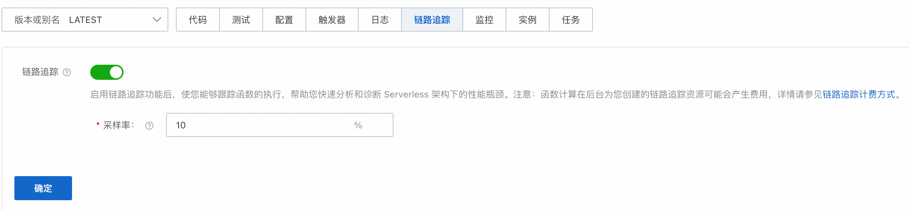
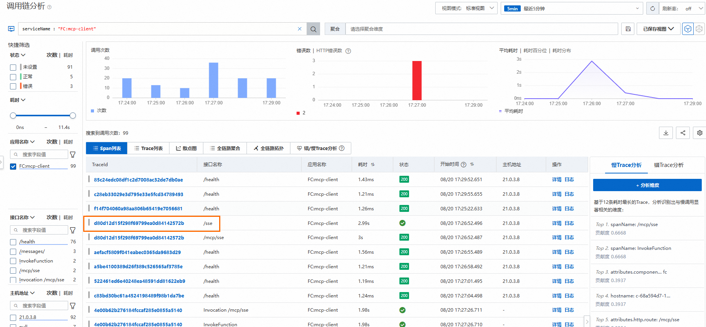
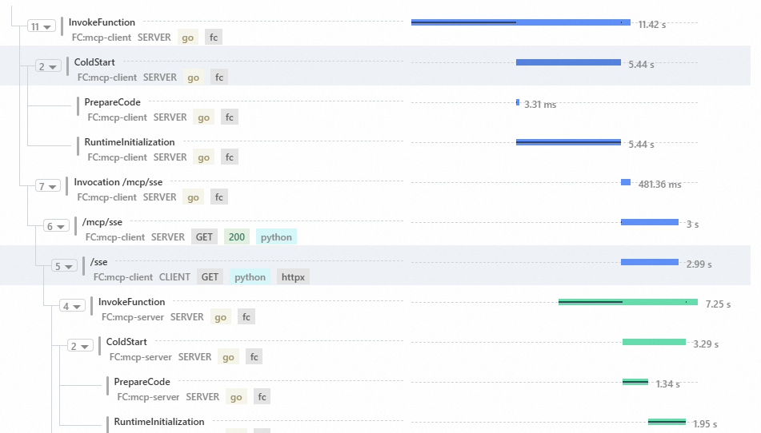
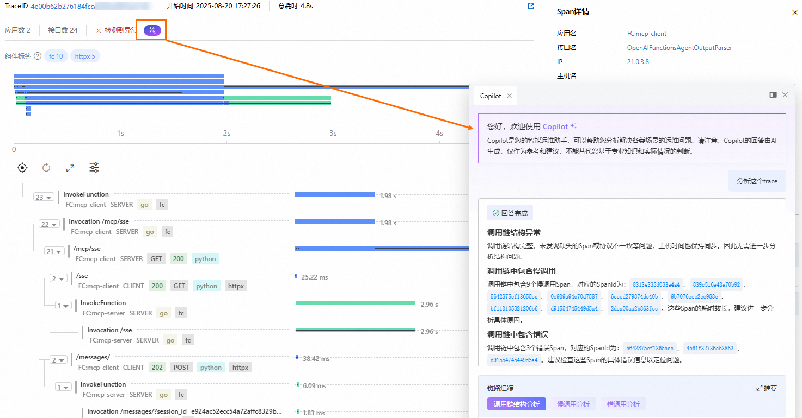
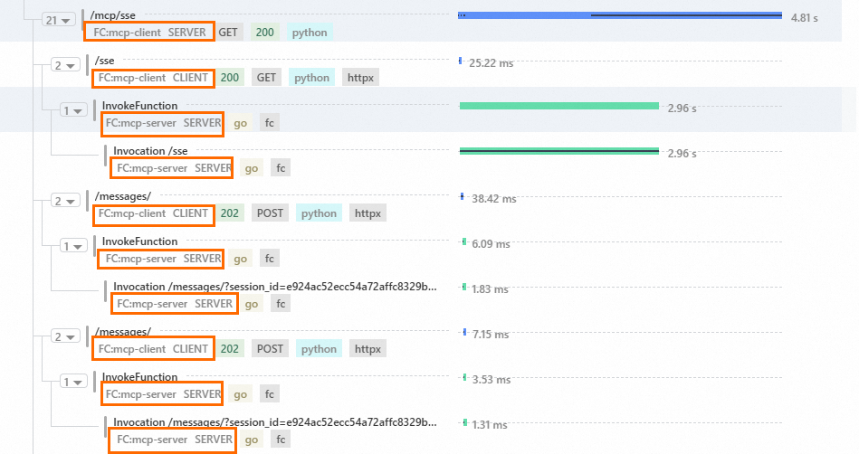

# 配置链路追踪

函数计算支持集成阿里云可观测链路 OpenTelemetry 版。该服务基于业界标准的 OpenTelemetry 标准的W3C 协议，帮助用户轻松洞察和诊断分布式应用中的性能瓶颈，显著提升 Serverless 架构下的开发与运维效率。本文将详细介绍如何为您的函数开启链路追踪以及查看函数调用链信息，实现端到端的请求监控与性能分析。

## **背景信息**

传统Serverless 架构下，传统日志方式已难以满足调用链追踪与性能分析的需求，存在以下痛点：

- 冷启动耗时难定位：依赖日志拼凑，无法区分系统与业务耗时
- 跨服务调用不连贯：上下文断裂，无法还原完整链路
- 缺乏可视化分析：难以精准识别性能瓶颈

为提升系统可观测性与运维效率，函数计算升级与可观测链路 OpenTelemetry 版的全链路观测能力，通过W3C Header透传实现全链路追踪，并支持 Span 分段，实现调用路径可视化与性能问题快速定位。

## **功能优势**

- **支持全链路透明化**
  
  支持FC系统级Span透传，同时支持业务自定义Span与系统Span的自动拼接，形成端到端 Trace 视图，暴露潜在性能瓶颈（如冷启动耗时、资源争抢）。
- **支持跨环境互通**
  
  兼容 traceparent、tracestate、baggage 等 Header，确保 FC 函数与下游服务，例如数据库、消息队列等上下文无损传递。
  
  支持跨函数、跨云服务、跨云厂商的 Trace 上下文透传，无缝集成已有 OpenTelemetry 生态工具链。
- **支持动态成本控制**
  
  支持通过函数配置调整采样率，从1%低负载采样到100%故障排查采样，平衡数据量与资源开销。

## **计费说明**

函数计算本身不会为开启链路追踪而产生额外费用，但阿里云可观测链路 OpenTelemetry 版将根据您的追踪数据上报量进行独立计费。

## **前提条件**

- 已[创建函数](https://help.aliyun.com/zh/functioncompute/fc/user-guide/function-instance-1/)并为其[开启日志功能](https://help.aliyun.com/zh/functioncompute/fc/configure-the-logging-feature#b4b4ed6522r86)。
- 已开通阿里云链路追踪，若未开通，请使用阿里云账号登录[阿里云链路追踪服务](https://trace.console.aliyun.com/#/overview/cn-zhangjiakou?from=now-5m&to=now&refresh=off)控制台进行开通。

## **启用链路追踪**

1. 登录[函数计算控制台](https://fcnext.console.aliyun.com)，在左侧导航栏，选择**函数管理**>**函数列表**。
2. 在顶部菜单栏，选择地域，然后在**函数列表**页面，单击目标函数。
3. 在**函数详情**页面中，选择**链路追踪**页签，启用**链路追踪**开关并配置**采样率**，单击**确定**。
  
  

## **查看函数调用链信息**

1. 在**函数详情**页面，选择**代码**页签，确认代码无误后单击**测试函数**。
2. 选择**链路追踪**页签，查看详细的调用链分析。
  
  以MCP客户端调用高德天气查询MCP 服务端场景为例，您可以清晰查看冷启动过程、SSE 连接、Message 通信及 Agent 调用等完整的调用链路信息。
  
  如下图所示，在调用链分析页面，单击目标TraceId。
  
  
  
  在右侧弹出的面板，查看冷启动时长。如果 PrepareCode 时间比预期时间长，需要精简代码包。
  
  
  
  如果有异常，单击对应TraceId即可在右侧面板查看异常信息，并利用AI 运维助手分析 Trace。
  
  
  
  当函数计算作为分布式链路中的一端时，链路追踪可以串联上下游服务，看到请求在各个步骤的延时。串联 mcp-client 和 mcp-server 端。
  
  
