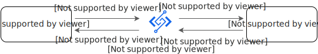

# HTTP触发器调用函数

HTTP触发器提供了函数专用的HTTP和HTTPS地址，您可以直接通过HTTP触发器提供的URL调用函数。本文将介绍内置运行时中使用HTTP触发器调用函数的方法。关于自定义运行时HTTP触发器调用函数的相关内容，请参见[Web函数](https://help.aliyun.com/zh/functioncompute/fc/web-functions)。

## **注意事项**

在函数计算3.0版中，自定义运行时和自定义镜像运行环境的HTTP触发器行为与函数计算2.0版一致，但内置运行时函数的HTTP触发器与函数计算2.0版有较大的差异，详情请参见[调用函数流程](#f9dcfdf04enm3)。

## **调用函数流程**



对于内置运行时函数，当客户端调用函数URL时，函数计算会将请求映射到事件对象`event`，再将`event`传递给函数。函数执行结束后，返回的响应将映射到一个HTTP响应，函数计算会通过函数URL将HTTP响应发送回客户端。

## **请求结构体**

### 请求结构体格式

请求结构体格式如下：

```
{ "version": "v1", "rawPath": "/example", "body": "Hello FC!", "isBase64Encoded": false, "headers": { "header1": "value1", "header2": "value1,value2" }, "queryParameters": { "parameter1": "value1", "parameter2": "value1,value2" }, "requestContext": { "accountId": "123456*********", "domainName": "<http-trigger-id>.<region-id>.fcapp.run", "domainPrefix": "<http-trigger-id>", "http": { "method": "GET", "path": "/example", "protocol": "HTTP/1.1", "sourceIp": "11.11.11.**", "userAgent": "PostmanRuntime/7.32.3" }, "requestId": "1-64f6cd87-*************", "time": "2023-09-05T06:41:11Z", "timeEpoch": "1693896071895" } }
```

请求结构体参数说明如下：

| **参数** | **说明** | **示例** |
| --- | --- | --- |
| version | 此事件的有效负载格式版本。目前版本为v1。 | v1 |
| rawPath | 请求路径。例如，如果请求URL为`https://{url-id}.{region}.fcapp.run/example`，则原始路径值为`/example`。rawPath是经过URL编码后，如果要获取URL解码后的path，请使用参数`requestContext.http.path`。 | /example |
| body | 请求的正文。如果请求的内容类型为二进制，则正文为Base64编码。 | Hello FC! |
| isBase64Encoded | 如果正文为二进制，并且为Base64编码，则为true，否则为false。 | false |
| headers | 该参数为请求头的列表。以键值对的形式显示，当一个键存在多个值时，值之间使用逗号分隔。<br>当使用HTTP触发器调用内置运行时，FC3.0将HTTP请求转换成HTTP触发器的Event格式，将HTTP请求Header的键进行规范化，Header的键的首字母变为大写，详情参见[Header键的首字母为什么变成了大写？](https://help.aliyun.com/zh/functioncompute/fc/why-does-the-first-letter-of-header-key-become-uppercase-when-using-http-trigger-call)。 | {"Header1": "value1", "Header2": "value1,value2"} |
| queryParameters | 请求的查询参数。例如，如果请求URL为`https://{url-id}.{region}.fcapp.run/example?key1=value1`，则queryParameters值是一个JSON对象，其键为key1，值为value1。当一个键存在多个值时，值之间会使用逗号分隔，比如`{"key1": "value1", "key2": "value2,value3"}`。 | {<br>"parameter1": "value1",<br>"parameter2": "value1,value2"<br>} |
| requestContext | 一个包含有关请求的附加信息的对象，例如requestId、请求的时间以及通过授权的调用者身份。 |  |
| requestContext.accountId | 函数拥有者的阿里云账户ID。 | 123456********* |
| requestContext.domainName | 函数HTTP触发器的域名。 | <http-trigger-id>.<region-id>.fcapp.run |
| requestContext.domainPrefix | 函数HTTP触发器的域前缀。 | <http-trigger-id> |
| requestContext.http | 包含有关HTTP请求的详细信息。 |  |
| requestContext.http.method | 此请求中使用的HTTP方法。有效值包括GET、POST、PUT、HEAD、OPTIONS、PATCH和DELETE。 | GET |
| requestContext.http.path | 请求路径。例如，如果请求URL为`https://{url-id}.{region}.fcapp.run/example?name=Jane`，则路径值为`/example`。 | /example |
| requestContext.http.protocol | 请求的协议。 | HTTP/1.1 |
| requestContext.http.sourceIp | 发出请求的即时TCP连接的源IP地址。该IP地址是直接建立连接的对端IP地址（RemoteAddr），即直接连接到服务器的客户端地址或最后一个代理的IP地址。<br>- 如果请求没有经过任何代理转发，RemoteAddr将是客户端的IP地址。<br>- 如果请求经过代理转发，RemoteAddr将是最后一个代理的IP地址。<br>**<br>**说明**<br>您可以通过HTTP请求头X-Forwarded-For获取客户端的原始IP地址，详情请参见[HTTP触发器调用内置运行时函数时，如何获取客户端原始IP地址？](https://help.aliyun.com/zh/functioncompute/fc/how-to-get-the-original-ip-address-of-the-client-when-the-http-trigger-calls-the-built-in-runtime-function)。 | 11.11.XX.XX |
| requestContext.http.userAgent | 用户代理请求标头值。 | PostmanRuntime/7.32.3 |
| requestContext.requestId | 调用请求的ID。可以使用此ID跟踪与函数相关的调用日志。 | 1-64f6cd87-************* |
| requestContext.time | 请求的时间戳。 | 2023-09-05T06:41:11Z |
| requestContext.timeEpoch | 请求的时间戳，用Unix时间表示。 | 1693896071895 |

### **函数计算HTTP请求映射逻辑**

函数计算会将HTTP请求映射成Event事件对象传给请求处理程序（Handler），映射逻辑如下：

- HTTP请求头映射为`event`结构中的`headers`。
- HTTP请求参数映射为`queryParameters`。
- HTTP请求的上下文信息映射为`requestContext`。
- POST请求的请求体映射为`body`。

#### **Base64编码机制**

函数计算在将HTTP请求映射到事件对象`event`时，会根据请求头中的`Content-Type`类型判断是否对请求体进行Base64编码：

- 当请求头中的`Content-Type`表示文本类型时，不会对请求体进行Base64编码，`event`结构中的`isBase64Encoded`设置为`false`。
- 否则，会对请求体进行Base64编码，`isBase64Encoded`设置为`true`。

以下为表示文本类型的`Content-Type`取值：

- text/*
- application/json
- application/ld+json
- application/xhtml+xml
- application/xml
- application/atom+xml
- application/javascript

### **请求映射示例**

## GET请求

| **HTTP请求** | **Event事件结构** |
| --- | --- |
| ```<br>GET /?parameter1=value1&parameter2=value2 HTTP/1.1<br>``` | ```<br>{ "version": "v1", "rawPath": "/", "headers": { "Accept": "*/*", "User-Agent": "CurlHttpClient" }, "queryParameters": { "parameter1": "value1", "parameter2": "value2" }, "body": "", "isBase64Encoded": true, "requestContext": { "accountId": "1327************", "domainName": "example.cn-hangzhou.fcapp.run", "domainPrefix": "example", "requestId": "1-67aee50c-********-************", "time": "2025-02-14T06:39:08Z", "timeEpoch": "1739515148145", "http": { "method": "GET", "path": "/", "protocol": "HTTP/1.1", "sourceIp": "40.XX.XX.XX", "userAgent": "CurlHttpClient" } } }<br>``` |

**

**说明**

您可以在命令行使用以下命令，发送上述HTTP请求。请将`https://example.cn-hangzhou.fcapp.run`替换为您的HTTP触发器公网访问地址。

```
curl -v "https://example.cn-hangzhou.fcapp.run?parameter1=value1&parameter2=value2"
```

## POST请求

| **HTTP请求** | **Event事件结构** |
| --- | --- |
| ```<br>POST / HTTP/1.1 Content-Type: application/json<br>``` | ```<br>{ "version": "v1", "rawPath": "/", "headers": { "Accept": "*/*", "Content-Length": "20", "Content-Type": "application/json", "User-Agent": "curl/8.7.1" }, "queryParameters": {}, "body": "{\"message\": \"Hello\"}", "isBase64Encoded": false, "requestContext": { "accountId": "1327************", "domainName": "example.cn-hangzhou.fcapp.run", "domainPrefix": "example", "requestId": "1-67aee50c-********-************", "time": "2025-02-14T06:39:08Z", "timeEpoch": "1739515148145", "http": { "method": "POST", "path": "/", "protocol": "HTTP/1.1", "sourceIp": "40.XX.XX.XX", "userAgent": "CurlHttpClient" } } }<br>``` |

**

**说明**

- 您可以在命令行使用以下命令，发送上述HTTP请求。请将`https://example.cn-hangzhou.fcapp.run`替换为您的HTTP触发器公网访问地址。
  
  ```
  curl -v -H "Content-Type: application/json" -d '{"message": "Hello"}' "https://example.cn-hangzhou.fcapp.run"
  ```
- 如果您需要发送Base64编码的请求体，只需将请求头中的`Content-Type`设置为`application/x-www-form-urlencoded`。

## **响应结构体**

### **响应结构体格式**

函数的响应结构体格式如下。当您的请求处理程序返回响应结构体时，函数计算会解析响应并将其转换为HTTP响应。

```
{ "statusCode": 200, "headers": { "Content-Type": "application/json", "Custom-Header-1": "Custom Value" }, "isBase64Encoded": false, "body": "{\"message\":\"Hello FC!\"}" }
```

### **函数计算响应解析逻辑**

函数计算会解析响应并构造HTTP Response返回给客户端。

- 如果您的函数返回有效的JSON并且包含`statusCode`字段，函数计算解析逻辑如下：
  
  - `statusCode`：函数返回JSON中的`statusCode`值。
  - `Content-Type`：函数返回JSON中的`Content-Type`值。如果JSON中没有`Content-Type`，`Content-Type`默认为`application/json`。
  - `body`：函数响应，函数返回JSON中的`body`值。
  - `isBase64Encoded`：函数返回JSON中的`isBase64Encoded`值，如果JSON中没有`isBase64Encoded`，则默认为false。
- 如果您的函数返回有效的JSON但是没有包含`statusCode`字段，或者返回的不是有效的JSON，函数计算会做出以下假设，构造响应结构体。
  
  - `statusCode`：默认为200。
  - `Content-Type`：默认为`application/json`。
  - `body`：函数响应，即代码中return的数据。
  - `isBase64Encoded`：默认为false。

函数计算会将函数响应结构体映射成HTTP响应返回给客户端，映射逻辑如下：

- `statusCode`映射为HTTP响应的状态码。
- `headers`映射为HTTP响应头。
- `body`映射为HTTP响应体，如果存在`isBase64Encoded`且为true，则先将`body`进行Base64解码，再映射到HTTP响应体。

### **响应映射示例**

以下示例介绍了函数的输出如何映射到函数响应结构体，以及函数响应结构体如何映射到最终的HTTP响应。当客户端调用函数HTTP触发器时，就可以看到HTTP响应。

## 字符串响应的输出

| **函数输出** | **解析函数输出** | **HTTP响应（客户端看到的内容）** |
| --- | --- | --- |
| `Hello World!` | ```<br>{ "statusCode": 200, "body": "Hello World!", "headers": { "content-type": "application/json" }, "isBase64Encoded": false }<br>``` | ```<br>HTTP/1.1 200 OK Content-Disposition: attachment Content-Length: 12 Content-Type: application/json X-Fc-Request-Id: 1-64f6d6e7-e01edb1cce58240ed59b59d9 Date: Tue, 05 Sep 2023 07:21:11 GMT Hello World!<br>``` |

## JSON响应的输出

| **函数输出** | **解析函数输出** | **HTTP响应（客户端看到的内容）** |
| --- | --- | --- |
| `{"message": "Hello World!"}` | ```<br>{ "statusCode": 200, "body": "{\"message\": \"Hello World!\"}", "headers": { "content-type": "application/json" }, "isBase64Encoded": false }<br>``` | ```<br>HTTP/1.1 200 OK Content-Disposition: attachment Content-Length: 27 Content-Type: application/json X-Fc-Request-Id: 1-64f6d867-7302fc1ac6338b6fd2adb782 Date: Tue, 05 Sep 2023 07:27:35 GMT {"message": "Hello World!"}<br>``` |

## 自定义响应的输出

| **函数输出** | **解析函数输出** | **HTTP响应（客户端看到的内容）** |
| --- | --- | --- |
| ```<br>{ "statusCode": 201, "headers": { "Content-Type": "application/json", "My-Custom-Header": "Custom Value" }, "body": { "message": "Hello, world!" }, "isBase64Encoded": false }<br>``` | ```<br>{ "statusCode": 201, "headers": { "Content-Type": "application/json", "My-Custom-Header": "Custom Value" }, "body": { "message": "Hello, world!" }, "isBase64Encoded": false }<br>``` | ```<br>HTTP/1.1 201 OK Content-Disposition: attachment Content-Length: 27 Content-Type: application/json Custom-Header-1: Custom Value X-Fc-Request-Id: 1-64f6dcb3-e787580749d3ba13b047ce14 Date: Tue, 05 Sep 2023 07:45:55 GMT {"message": "Hello world!"}<br>``` |

### **Base64解码机制**

当函数输出为有效的JSON格式，且JSON中的`isBase64Encoded`字段为`true`时，函数计算会将JSON中的`body`字段进行Base64解码，再将解码后的数据通过HTTP响应体返回给客户端。

如果对`body`字段解码失败，函数计算不会报错，而是直接将原始的`body`字段的值返回给客户端。

### **响应头（HTTP Response Header）**

使用HTTP触发器调用函数时，响应头中会包含函数计算默认添加的响应头`X-Fc-Request-Id`，这是此次请求的唯一标识。除了`X-Fc-Request-Id`，函数计算不会默认添加其他响应头。

您可以在代码中返回自定义的响应头，但不支持`X-Fc-`开头的响应头和以下函数计算保留的响应头：

- connection
- content-length
- date
- keep-alive
- server
- content-disposition

如果您在响应头中设置了这些保留字，函数计算会直接忽略您设置的响应头。

### **错误处理**

当遇到函数错误时，通过API调用会返回具体的错误信息，HTTP返回码为`200`。比如Python的ModuleNotFound错误的响应如下：

```
{ "errorMessage": "Unable to import module 'index'", "errorType": "ImportModuleError", "stackTrace": [ "ModuleNotFoundError: No module named 'not_exist_module'" ] }
```

但使用HTTP 触发器调用时，函数计算会隐藏这些错误信息，直接返回`Internal Server Error`，HTTP返回码为`502`。HTTP响应示例如下：

```
HTTP/1.1 502 Bad Gateway Content-Disposition: attachment Content-Type: application/json X-Fc-Request-Id: 1-64f6df91-fe144d52e4fd27afe3d8dd6f Date: Tue, 05 Sep 2023 07:58:09 GMT Content-Length: 21 Internal Server Error
```

此时，您可以通过请求返回的`X-Fc-Request-Id`在日志中查找具体的报错信息。

## **代码开发**

在FC 3.0内置运行时中，编写代码时，请参考以下运行时的请求处理程序（Handler） 文档。

- [Node.js请求处理程序](https://help.aliyun.com/zh/functioncompute/fc/user-guide/request-handlers#6c107b30676nc)
- [Python请求处理程序](https://help.aliyun.com/zh/functioncompute/fc/user-guide/event-handlers-1-1#57eae7f067uz6)
- [PHP请求处理程序](https://help.aliyun.com/zh/functioncompute/fc/user-guide/handlers-in-a-php-runtime)
- [Java请求处理程序](https://help.aliyun.com/zh/functioncompute/fc/handlers-in-a-java-runtime#4c5b333067xr5)
- [C#请求处理程序](https://help.aliyun.com/zh/functioncompute/fc/user-guide/handlers-in-a-c-runtime)
- [Go请求处理程序](https://help.aliyun.com/zh/functioncompute/fc/handlers-in-a-go-runtime)
