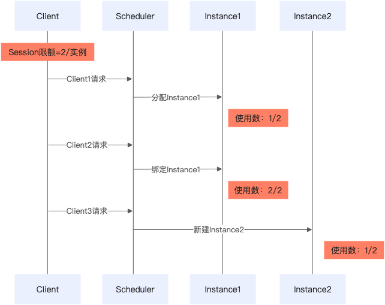
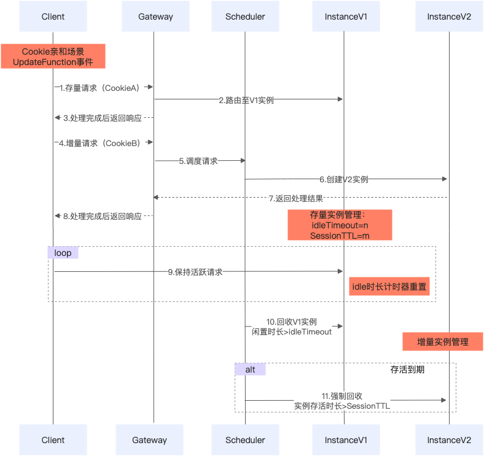

# 会话亲和通用限制及原理说明

**会话亲和（Session Affinity）**是函数计算提供的一种高级路由机制，用于确保属于同一会话的请求能够被持续路由到同一个函数实例上。通过维持状态一致性，该功能特别适用于需要保持上下文、实现长周期任务处理或支持实时交互的应用场景。

## **会话亲和类型**

- **Cookie亲和**：通过HTTP请求中的Cookie字段值识别会话
- **HeaderField亲和**：通过HTTP请求头中的指定字段值识别会话
- **MCP SSE亲和**：通过MCP SSE协议中的SessionId识别会话
- **MCP Streamable HTTP亲和**：通过HTTP响应头`Mcp-Session-Id`字段识别会话

## 通用限制

- 如果您已开启会话隔离，会话亲和功能将自动开启且不可关闭，同时选择适合的亲和类型。
- 如果您已开启请求隔离，会话亲和功能将不可用。
- 异步请求不支持会话能力（包括会话亲和和会话隔离）。
- 如果选择内置运行时，单实例并发度限制为1，此时单实例并发 Session 数也只能限制为1。
- 单实例并发 Session 数不可超出单实例最大并发请求数。

## 各亲和类型独有的限制

### 1. Cookie亲和独有限制

- **仅支持服务端植入 Cookie 模式**：
  客户端首次访问时，函数计算自动在响应中通过`Set-Cookie`Header 植入 Cookie。客户端需解析并保存该 Cookie，并在后续请求中携带。
- **支持 SessionAPI 管理**：
  可通过 SessionAPI 对会话进行生命周期管理（如创建、更新、查询、终止等）。

### 2. HeaderField亲和独有限制

- **会话 ID 来源**：
  
  - 若客户端在预定义 Header 中传入会话 ID，则以该值作为会话标识。
  - 若未传入，服务端将生成全局唯一会话 ID，通过CreateFunction预定义的Header字段，通过响应 Header 返回。
- **Header 字段定义**：
  在创建函数时，于`SessionAffinityConfig`中指定用于传输会话 ID 的 Header 字段名。
- **支持 SessionAPI 管理：**
  可通过 SessionAPI 实现对会话的监控与控制。

### 3. MCP Streamable HTTP亲和独有限制

- **协议版本要求：**
  支持 MCP 协议版本`2025-03-26`和`2025-06-18`。客户端与函数必须遵循对应版本的 Transport 层规范。
- **兼容性说明：**若函数启用了 MCP Streamable HTTP 亲和，则 禁止使用 MCP HTTP with SSE 调用，因会话管理机制不兼容，导致调用失败。
- **访问方式限制：**
  仅支持通过 HTTP 触发器 或 自定义域名 访问。
- **HTTP 触发器配置要求：**
  必须至少支持`GET`、`POST`和`DELETE`方法。
  
  DELETE 方法必要性：
  客户端可通过`DELETE`请求主动结束会话。函数计算将回收该 Session 的资源（包括实例并发配额）。若未启用 DELETE 方法，系统将拒绝请求，导致 Session 无法正常释放。
- **不支持 SessionAPI 管理。**

### 4. MCP SSE亲和独有限制

- **运行时限制：**
  
  - 使用内置运行时 → 不支持 MCP SSE 亲和。
  - 使用 MCP 运行时 → 仅支持 MCP 亲和（含 SSE）。
  - 其他运行时无此限制。
- **客户端要求：**
  必须使用 MCP 官方标准 Client 或 SDK 发起请求，否则无法建立有效亲和连接。
- **会话生命周期：**
  最大生命周期等于函数的最大超时时间。超出后，服务端断开连接；重新连接将生成新会话 ID，不再保证路由至原实例。
- **访问方式限制：**
  仅支持通过 HTTP 触发器 或 自定义域名 访问。
- **请求限制：**
  
  - 首次 SSE 请求暂不支持携带 query 参数。
  - 单实例最大并发数为 200。
- **不支持 SessionAPI 管理。**

## **核心原理**

### 1. 核心流程

**客户端发起请求**→**识别/生成 Session ID**→**绑定到可用实例**→**后续请求路由至该实例**

### 2. 资源模型（统一框架）

- 每个**Session**占用 1 个 “Session 并发配额”
- 每个**请求**（包括 POST、GET、Message）占用 1 个 “请求并发配额”
- 单实例总并发额度：**200**（不可调）
- 多个 Session 共享这 200 个并发额度

公式表达：

```
TotalQuota = Σ(每个 Session 的并发消耗) ≤ 200
```

### 3. 生命周期管理

| 阶段 | 触发条件 | 行为 |
| --- | --- | --- |
| 创建 | 首次请求未携带有效 Session ID | 生成唯一 ID 并建立绑定 |
| 首次请求携带有效SessionID | 服务端将此SessionID和实例建立绑定关系。 |  |
| 活跃 | 接收请求 | 更新最后活跃时间 |
| 空闲超时 | 超过`Session Idle 时长`（默认 1800 秒） | 自动销毁 Session |
| 过期 | 超过`单个 Session 生命周期`（默认 21600 秒） | 自动销毁 Session |
| 手动终止 | 发送 DELETE 请求（MCP Streamable）或断开连接（SSE） | 主动释放资源 |

## **并发管理机制**

### 并发参数说明

| 参数类型 | 含义 | 是否可调 | 限制 | 消耗规则 | 并发回收机制 |
| --- | --- | --- | --- | --- | --- |
| 单实例最大并发度 | 单实例最多同时处理的最大并发请求数 | 不可调 | 200 | 每个请求/长连接占 1 个 | 请求完成异步释放 |
| 单实例并发 Session 数 | 单实例在同一个时间内能同时处理的最大 Session 数 | 可调 | [1,200] | 每个 Session 占 1 个 | 根据亲和类型不同而定 |

### 单会话占用并发资源模型

| 类型 | 公式 | 说明 |
| --- | --- | --- |
| **Cookie / HeaderField 亲和 / MCP Streamable HTTP 亲和** | `TotalQuota(s) = N (N ≥ 1)` | 仅包含同步请求，每条请求占 1 个并发 |
| **MCP SSE 亲和** | `TotalQuota(s) = 1 + N (N ≥ 1)` | 包含 1 个 SSE 长连接 + N 个 Message 请求 |

### 单实例并发Session数配置建议：

1. 安全隔离场景：建议配置1，单个Session独享计算资源，安全可靠。
2. 多租共享场景：可配区间（1，200]，多Session共享单实例资源，提升资源利用率

## 实例调度规则详细说明

### **场景1：Session 和实例绑定规则及扩容机制**



假设函数配置单实例并发 Session 数 = 2

1. Client1 请求 → 分配 Instance1，占用 1 个 Session 配额
2. Client2 请求 → Scheduler 判断 Instance1 仍有 1 个空闲 Session → 成功绑定
3. Client3 请求 → Instance1 已满 → 创建新实例 Instance2 → 绑定成功

**关键点说明**：

- **系统在调度层会尽力优先复用已有实例，但不完全保证**
- **仅当所有实例均满时才会扩容**
- 实现了动态负载均衡与弹性伸缩

### 场景2：单实例下多 Session 共享资源限流机制



假设函数配置单实例并发 Session 数 = 2

1. Client1 请求 → 占用 1 个 Session + 1 个请求并发度
2. Client2 请求 → 占用 1 个 Session + 1 个请求并发度
3. 前两个请求未结束时，两者同时并发再次发送 198 个请求 → 总共消耗 200 个请求并发度
4. 第 199 个请求 → 超出 200 上限 → 返回 `429 Too Many Requests`

**关键点说明：**

- **单实例最大并发度固定为 200，不可调**
- 多个 Session 共享此额度
- 当并发度耗尽时，系统拒绝新请求

## **错误处理机制**

| 场景 | 系统行为 | 状态码 | 客户端应对策略 |
| --- | --- | --- | --- |
| 单实例并发 Session 数耗尽 | 存量实例未超地域最大实例数上限，系统自动扩容新实例绑定 Session 请求 | 200 | - |
| 存量实例达到地域最大实例数上限 | 系统限流拒绝请求 | 429 | 1. 采用退避重试策略<br>2. 通过[配额中心](https://quotas.console.aliyun.com/products?spm=a2c4g.11186623.0.0.77dede53emWrrd)申请提升配额 |
| 单实例并发度配额 200 耗尽 | 系统限流拒绝请求 | 429 | 若 Session 数 >1，评估调小配置 |
| Session 无效或过期 | 系统拒绝请求 | 401 | 重新发起请求生成新 Session |
| HeaderField 值非法 | 系统拒绝请求 | 400 | 检查 header 名称与格式 |
