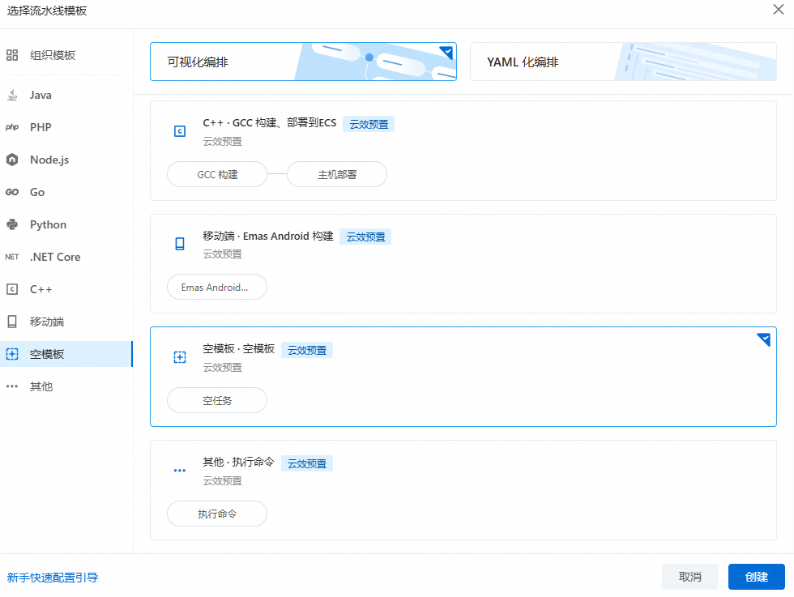
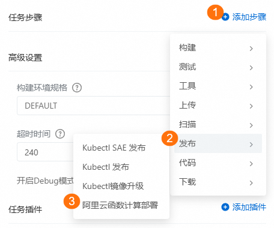
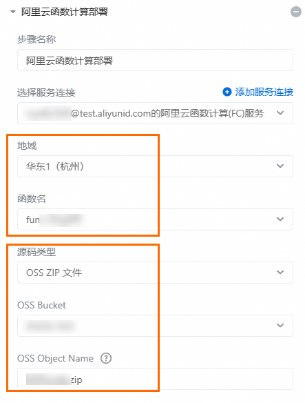
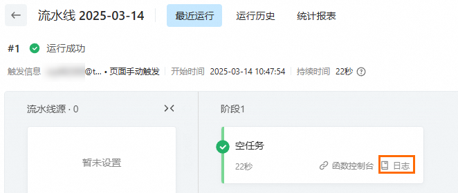

# 使用云效流水线部署函数

函数计算支持对接云效流水线，通过流水线实现函数的自动部署能力。本文以将OSS Bucket中的ZIP格式代码包作为部署源为例，介绍如何通过执行流水线自动部署指定代码到指定函数。

## **前提条件**

- 已创建[OSS Bucket](https://help.aliyun.com/zh/oss/user-guide/create-a-bucket-4#t4355.html)，并[上传代码包ZIP](https://help.aliyun.com/zh/oss/user-guide/upload-objects-to-oss/#t4360.html)到该OSS Bucket。
- 已创建FC[函数](https://help.aliyun.com/zh/functioncompute/fc/user-guide/function-instance-1/)。

## **操作步骤**

### **步骤一：新建流水线**

1. 登录[流水线Flow服务控制台](https://flow.aliyun.com/)，在**我的流水线**页面，单击**新建流水线**。
2. 在弹出的对话框，选择云效预置模板，然后单击**创建**。本文以空模板为例。
  
  

### **步骤二：配置流水线-部署函数计算FC**

1. 单击上一步创建的**空任务**节点，在右侧弹出的**编辑**面板，设置以下参数。
  
  重点要设置的参数如下，如无特殊要求，其余参数请保持默认值。
  
  | **参数名称** | **说明** |
  | --- | --- |
  | 任务名称 | 自定义任务名称，方便管理和维护，例如**通过OSS代码源部署函数计算FC**。 |
  | 构建环境 | 选择指定容器环境。 |
  | 任务步骤 | 依次选择**添加步骤**>**发布**>**阿里云函数计算部署**，然后按照界面提示，选择函数所在地域和函数名称，并选择**OSS ZIP 文件**的方式指定代码包位置。  |
2. 单击右上角的**保存并执行**。

### **步骤三：查看目标流水线任务**

1. 上一步您创建了流水线任务，并执行了流水线任务，任务执行完成后，您可以单击**日志**，查看流水线任务的执行过程和结果。
  
  
2. 后续如果需要更新目标函数代码，在[流水线Flow服务控制台](https://flow.aliyun.com/)的流水线列表，找到目标流水线，然后单击其右侧的执行图标。
  
  
