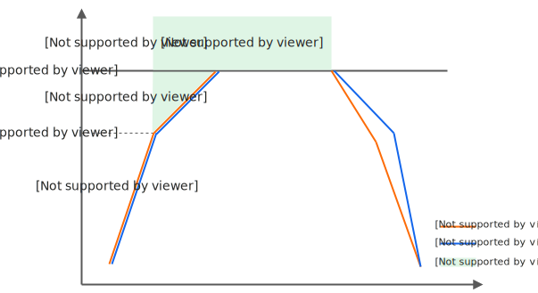
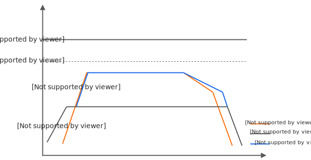
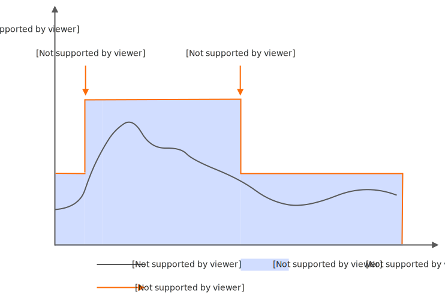
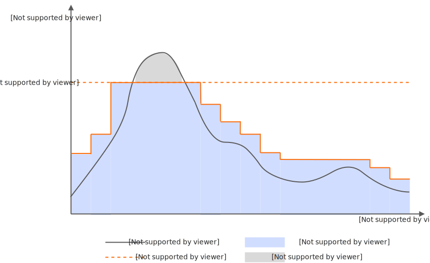
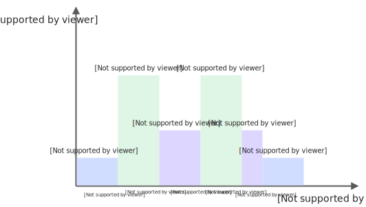

# 实例伸缩限制及弹性策略

设置函数的最小实例数≥1后，可以根据业务情况，并结合实例扩容限制速度配置最小实例数的弹性策略：指定时间段或指定指标利用率达到设定阈值后对最小实例数进行扩缩容，保障性能的同时提高实例利用率。

## **实例伸缩行为**

设置函数的最小实例数≥1后，系统在处理请求时，优先分配请求至基于最小实例数启动的弹性实例，实例不能满足当前负载，系统自动扩容弹性实例作为补充。

随着调用请求量的增加，函数计算会持续创建新的实例，直到有足够的实例处理请求或者达到设置的实例数上限。在实例扩容的过程中，将受到扩容速度限制，具体请参见[各地域实例扩容速度限制](#8e716c8bcfbvl)。

随着函数调用请求增加，设置最小实例数≥1和最小实例数=0两种场景下，实例伸缩行为如下。

### 最小实例数=0

当实例总数或者实例扩容速度超过限制后，函数计算将返回流控错误（`HTTP Status`为`429`）。下图展示在一个调用量快速增长的场景下，函数计算的流控行为。



- 图示中①：在达到突增实例数前，函数计算立即创建实例，这个过程中有冷启动，但没有流控错误。
- 图示中②：达到突增实例数后，实例数的增长受速度限制，部分请求会收到流控错误。
- 图示中③：实例数超过配额限制后，部分请求收到流控错误。

### 最小实例数≥1

当突发的调用量较大时，大量的实例创建会受到流控限制导致请求失败，实例的冷启动也会增加请求延时。为避免这些问题，可以设置最小实例数≥1，提前锁定资源。

与最小实例数=0场景相同的负载的情况下，设置最小实例数≥1后的流控行为如下。



- 图示中①：在最小实例数被用满之前，请求立即被执行，这个过程既没有冷启动，也没有流控错误。
- 图示中②：在最小实例数被用满后，弹性实例达到突增实例数之前，函数计算立即创建实例，这个过程中有冷启动，但没有流控错误。

## **各地域实例扩容速度限制**

| **地域** | **突增实例数** | **实例增长速度** |
| --- | --- | --- |
| 华东1（杭州）、华东2（上海）、华北2（北京）、华北3（张家口）、华南1（深圳） | 300 | 300/分钟 |
| 其他 | 100 | 100/分钟 |

**

**说明**

如果对扩容速度有更高的需求，请加入钉钉用户群（钉钉群号**64970014484**）申请。

## **最小实例数弹性策略**

设置固定的最小实例数虽然能保证性能，但在业务低谷期可能导致资源浪费。为此，函数计算提供了动态弹性策略，允许根据时间或业务指标自动调整最小实例数，从而提高资源利用率。

**

**重要**

- 配置的弹性策略生效期间，将覆盖函数设置的初始**最小实例数**。在没有任何弹性策略生效的时间段内，系统将恢复使用初始配置的**最小实例数**。
- 如果配置了多条弹性策略，系统会计算每条策略触发时的**最小实例数**，并取当前时间有效的弹性策略中最小实例数的最大值作为当前实际的**最小实例数**。

更多信息，请参见[如何计算当前最小实例数？](#62f2f7beb3nay)。

### **定时伸缩**

#### **适用场景**

函数有明显的周期性规律或可预知的流量高峰。当函数调用并发数大于最小实例数并发时，超出的部分系统自动扩容弹性实例。

#### **配置示例**

配置两个定时操作：在函数调用流量到来前，通过第一个定时配置扩容最小实例数；当流量减小后，通过第二个定时配置缩容最小实例数。具体如下图所示。



在使用[PutProvisionConfig](https://help.aliyun.com/zh/functioncompute/fc/developer-reference/api-fc-2023-03-30-putprovisionconfig)API配置定时伸缩的请求参数时可参考以下信息。为函数function_1配置定时伸缩策略，指定时区为Asia/Shanghai，即北京时间，配置的生效区间为2024-08-01 10:00:00至2024-08-30 10:00:00（北京时间），在每天20:00（北京时间）将最小实例数扩容至50，在每天22:00（北京时间）再将最小实例数收缩至10。

```
"scheduledActions": [ { "name": "scale_up_action", "startTime": "2024-08-01T10:00:00", "endTime": "2024-08-30T10:00:00", "target": 50, "scheduleExpression": "cron(0 0 20 * * *)", "timeZone": "Asia/Shanghai" }, { "name": "scale_down_action", "startTime": "2024-08-01T10:00:00", "endTime": "2024-08-30T10:00:00", "target": 10, "scheduleExpression": "cron(0 0 22 * * *)", "timeZone": "Asia/Shanghai" } ]
```

**参数说明如下。**

| **参数** | **说明** |
| --- | --- |
| name | 配置的定时任务名称。 |
| startTime | 配置开始生效的时间，如果未设置时区，默认以UTC时间运行。 |
| endTime | 配置结束生效的时间，如果未设置时区，默认以UTC时间运行。 |
| target | 目标最小实例数。 |
| scheduleExpression | 定时信息，如果未设置时区，默认以UTC时间运行，即北京时间减去8小时。<br>支持以下两种格式：<br>- At expressions - "at(yyyy-mm-ddThh:mm:ss)"：只调度一次。<br>例如，需要北京时间2024年04月01日20:00开始调度，配置时区为Asia/Shanghai，则此参数可以配置为`at(2024-04-01T20:00:00)`。<br>- Cron expressions - "cron(0 0 4 * * *)"：调度多次，使用标准crontab格式。<br>例如，需要北京时间每天20:00点进行调度，配置时区为Asia/Shanghai，则此参数可以配置为`cron(0 0 20 * * *)`。 |
| timeZone | 指定的时区。 |

#### **Cron表达式说明**

**cron(Seconds Minutes Hours Day-of-month Month Day-of-week)字段说明如下。**

| **字段名** | **取值范围** | **允许的特殊字符** |
| --- | --- | --- |
| Seconds | 0～59 | 无 |
| Minutes | 0～59 | , - * / |
| Hours | 0～23 | , - * / |
| Day-of-month | 1～31 | , - * ？/ |
| Month | 1～12或JAN～DEC | , - * / |
| Day-of-week | 1～7或MON～SUN | , - * ? |

**Cron表达式中特殊字符说明如下。**

| **字符名** | **定义** | **示例** |
| --- | --- | --- |
| * | 表示任一，每一。 | 在`Minutes`字段中：0表示每分钟的0秒都执行。 |
| , | 表示列表值。 | 在`Day-of-week`字段中：MON，WED，FRI表示星期一、星期三和星期五。 |
| - | 表示一个范围。 | 在`Hours`字段中：10-12表示UTC时间从10点到12点。 |
| ? | 表示不确定的值。 | 与其他指定值一起使用。例如，如果指定一个特定的日期，无需关注星期几，那么在`Day-of-week`字段中就可以使用。 |
| / | 表示一个值的增加幅度，n/m表示从n开始，每次增加m。 | 在`minute`字段中：3/5表示从3分钟开始，每隔5分钟执行。 |

### **水位伸缩**

#### 适用场景

函数计算系统会周期性地采集关键指标，并结合配置的**最小实例数范围**来自动对最小实例数进行扩缩容，使其更好的贴合资源的真实使用量。此策略适用于函数的流量模式不可预测，但希望资源利用率维持在稳定水平的场景。

#### **关键指标说明**

水位伸缩策略通过追踪以下关键指标来自动调整最小实例数。选择正确的指标对于实现高效的弹性至关重要。

- 实例并发利用率
  
  - 定义：指在采集周期内，所有预置实例（即最小实例数范围内的实例）正在处理的并发请求总数，与这些实例能够承载的最大并发请求总数的比值。
  - 计算公式：`当前总并发请求数 / (当前最小实例数 × 函数单实例并发度）`
  - 适用场景：适用于大多数通用Web服务、API网关等 I/O 密集型或 CPU 密集型业务，其主要瓶颈是请求处理能力。
- 内存利用率
  
  - 定义：指在采集周期内，所有预置实例的内存使用情况。
  - 计算公式：`平均使用内存 / 函数配置内存`。
  - 适用场景：适用于内存密集型业务，如大数据处理、图像转换、深度学习模型预处理等，其性能瓶颈更多在于内存消耗而非请求并发数。
- GPU资源利用率
  
  - 定义：对于GPU实例，可以追踪更细分的GPU资源使用情况，主要包括`GPU使用率`和`GPU显存使用率`。
    
    - `GPU使用率`：反映GPU计算核心的繁忙程度。
    - `GPU显存使用率`：反映GPU显存的占用情况。
  - 适用场景：专用于AI推理、科学计算等需要GPU加速的函数。根据模型对计算资源或显存资源的依赖程度，选择合适的指标进行伸缩。

#### **配置示例**

以采集**实例并发利用****率**指标为例，当流量不断增加时，触发扩容阈值，最小实例数开始扩容，当达到设置的最小实例数范围的上限时停止扩容，超出部分的请求分配至按量弹性实例；当流量不断减小时，触发缩容阈值，最小实例数开始缩容。具体如下图所示。



**

**说明**

- 配置最小实例数的水位伸缩策略时，必须开启实例级别指标功能，否则会报错`400 InstanceMetricsRequired`。关于开启实例级别指标的方法，请参见[配置实例级别指标](https://help.aliyun.com/zh/functioncompute/fc/user-guide/instance-level-metrics#title-jp6-mcs-ovd)。
- 实例并发利用率只统计最小实例数范围内弹性实例的并发情况，不包含按量弹性实例的数据。
- 实例并发利用率为当前**最小实例数**并发请求量与**最小实例数**范围内最大可支持的并发请求量的比值，数值范围为[0,1]。

在使用[PutProvisionConfig](https://help.aliyun.com/zh/functioncompute/fc/developer-reference/api-fc-2023-03-30-putprovisionconfig)API配置水位伸缩的请求参数可参考以下信息。为function_1函数配置水位伸缩策略，指定的时区为Asia/Shanghai，即北京时间，配置的生效区间为2024-08-01 10:00:00至2024-08-30 10:00:00（北京时间），追踪**实例并发利用率**指标ProvisionedConcurrencyUtilization，**实例并发利用率**追踪值为60%，超过60%时开始扩容，扩容上限为100；低于60%时开始缩容，缩容下限为10。

```
"targetTrackingPolicies": [ { "name": "action_1", "startTime": "2024-08-01T10:00:00", "endTime": "2024-08-30T10:00:00", "metricType": "ProvisionedConcurrencyUtilization", "metricTarget": 0.6, "minCapacity": 10, "maxCapacity": 100, "timeZone": "Asia/Shanghai" } ]
```

**参数说明如下。**

| **参数** | **说明** |
| --- | --- |
| name | 配置的指标任务名称。 |
| startTime | 配置水位伸缩开始生效的时间，如果未设置时区，默认以UTC时间运行。 |
| endTime | 配置水位伸缩结束生效的时间，如果未设置时区，默认以UTC时间运行。 |
| metricType | 追踪的指标名称，本文示例为ProvisionedConcurrencyUtilization。 |
| metricTarget | 指标的追踪值，例如设置该值为0.6，表示**实例并发利用率**超过60%时开始扩容，低于60%时开始缩容。 |
| minCapacity | 最小实例数下限。 |
| maxCapacity | 最小实例数上限。 |
| timeZone | 指定时区。 |

#### **扩缩容计算原理**

缩容时会通过缩容系数来实现相对保守的缩容过程，缩容系数取值范围为(0,1]。缩容系数为系统参数，用于减缓缩容速度，防止缩容过快，无需手动设置。扩缩容目标值对计算结果向上取整得到最终结果，计算逻辑如下。

- 扩容目标值=当前最小实例数×（当前指标值/设置的利用率阈值）
- 缩容目标值=当前最小实例数×缩容系数×（1-当前指标值/设置的利用率阈值）

例如，当前指标值为80%，设置的**实例并发利用率**为40%，当前最小实例数为100，经过计算100×（80%/40%）=200。根据计算结果，最小实例数会扩容到200（不能超出设置的[函数配额](https://help.aliyun.com/zh/functioncompute/fc/user-guide/overview-of-configuring-the-maximum-number-of-on-demand-instances)），以保证扩容后利用率阈值维持在40%附近。

### **如何计算当前最小实例数？**

通过以下示例，您将明确当前最小实例数的计算逻辑，即由初始配置的最小实例数与定时伸缩策略中设定的目标最小实例数共同决定。

假设，初始设置的最小实例数为5，并配置了两条定时伸缩策略，指定时区为Asia/Shanghai，即北京时间，配置的生效区间为2025-06-09 10:00:00至2025-06-11 00:00:00（北京时间），在生效区间内，每天10:00（北京时间）将最小实例数扩容至20，每天22:00（北京时间）将最小实例数收缩至10。策略内容如下：

```
{ "defaultTarget": 5, "scheduledActions": [ { "name": "scale_up_action", "startTime": "2025-06-09T10:00:00", "endTime": "2025-06-11T00:00:00", "target": 20, "scheduleExpression": "cron(0 0 10 * * *)", "timeZone": "Asia/Shanghai" }, { "name": "scale_down_action", "startTime": "2025-06-09T10:00:00", "endTime": "2025-06-11T00:00:00", "target": 10, "scheduleExpression": "cron(0 0 22 * * *)", "timeZone": "Asia/Shanghai" } ] }
```

在不同时间段，当前最小实例数的取值如下图所示：



## **最大可响应并发值**

不同的实例并发数，函数实例可响应的最大并发值计算逻辑如下：

- 单实例单并发
  
  最大可响应并发值=函数实例数量
- 单实例多并发
  
  最大可响应并发值=函数实例数量×单实例并发度

关于实例并发度的应用场景、优势、配置及影响，请参见[设置实例并发度](https://help.aliyun.com/zh/functioncompute/user-guide/configure-instance-concurrency)。

## **相关文档**

如果需要限制某个函数的实例上限，请参见[配置函数配额](https://help.aliyun.com/zh/functioncompute/fc/user-guide/overview-of-configuring-the-maximum-number-of-on-demand-instances)。配置后，当此函数处于执行状态的函数实例总数超过限制后，函数计算将返回流控错误。
