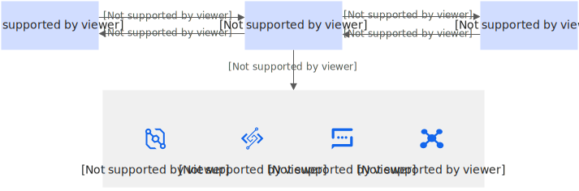

# 异步调用

如果您的函数中存在耗时较长、资源消耗较大或容易出错的逻辑，您可以使用异步调用的方式，让您的程序响应更加迅速，更加可靠地应对突发流量。当您对函数发起异步调用时，无需等待函数响应，相关请求会被持久化保存到函数计算内部队列中，然后被可靠地处理。本文介绍异步调用的应用场景以及常见功能。

## **应用场景**

异步调用适用的场景示例如下：

- 音视频处理
  
  用户使用函数计算处理音视频业务时，涉及处理编码、解码或转码等耗时较长的任务，异步调用这些任务使其在后台运行，前端无需等待，提升用户体验。另外，如果音视频项目较大，需要将其分割成多个任务并行处理或者需要将一个视频转换为多种格式，异步调用多个函数可以轻松实现以上并行处理需求，缩短任务处理时间。
- 数据ETL处理
  
  ETL流程中，从源头提取数据、转换处理和加载到目标系统这三个步骤可能涉及多个独立的操作，例如数据库查询、文件读写或数据清洗等，采用异步调用可以让这些操作并行执行，减少处理时间，提升系统性能。而针对耗时较长的任务，例如处理大规模数据集或复杂的数据转换，异步调用允许这些任务在后台运行，前端无需等待，提升用户体验。
- 开发Web应用
  
  函数计算可以搭配其他云产品快速构建Web应用。用户在表单提交、搜索查询或加载内容较多的情况下，采用异步调用可以避免页面因长时间等待后端响应而出现的卡顿现象，此时用户可以继续与页面的其他部分交互，而不会感受到延迟。高并发场景下，例如大量用户同时访问，异步调用函数又可以分散请求压力，防止服务过载。

## 延迟调用

针对某些场景，您提交一次异步调用后，需要函数计算对其进行延迟触发。您可以通过调用API（SDK）实现延迟调用函数。

在代码中添加HTTP请求头`x-fc-async-delay`，取值范围为(0,3600)，单位为秒。函数计算将从您触发执行开始计算，延迟`x-fc-async-delay`设置的时间后触发函数调用。

## **重试策略**

异步调用机制提供错误处理和重试机制，如果某个步骤失败，可以重新调度该任务而不影响整个流程。当函数异步调用执行失败后，函数计算会自动进行错误重试。

### **重试机制**

对于常见错误，系统默认的重试策略如下表所示。

| **错误类型** | **服务器端行为** | **是否计费** | **解决方案** |
| --- | --- | --- | --- |
| 函数计算的错误类型为`HandledInvocationError`和`UnhandledInvocationError`。 | 默认重试3次，或根据异步设置次数重试。 | 按照调用次数计费。关于计费的详细信息，请参见[计费概述](https://help.aliyun.com/zh/functioncompute/fc/product-overview/billing-overview-of-fc)。 | 请自行排查您的代码。 |
| 函数并发执行超上限。 | 以二进制指数退避方式重试执行5小时。当您的函数执行失败后将在0.5秒后开始重试，后续重试执行的时间间隔将以二进制指数退避方式计算，即重试时间间隔为1秒、2秒、4秒、8秒等持续重试5小时。 | 否 | 单个阿里云账号（主账号）在单个地域内总实例数默认限制为100，实际数值以[配额中心](https://quotas.console.aliyun.com/products?spm=a2c4g.11186623.0.0.77dede53emWrrd)为准，如果您需要提高该限制，请前往[配额中心](https://quotas.console.aliyun.com/products?spm=a2c4g.11186623.0.0.77dede53emWrrd)申请。 |
| 系统内部错误。 | 否 | 请加入钉钉用户群（钉钉群号**64970014484**）咨询。 |  |
| 函数计算资源不足。 | 否 |  |  |

### **配置重试策略**

函数计算支持自定义重试次数和消息最大存活时长。

1. 登录[函数计算控制台](https://fcnext.console.aliyun.com)，在左侧导航栏，选择**函数管理**>**函数列表**。
2. 在顶部菜单栏，选择地域，然后在**函数列表**页面，单击目标函数。
3. 在函数详情页面，选择**任务**页签，单击**任务模式**右侧的**编辑**，然后在**任务模式**面板，设置以下配置项。完成后单击**部署**。
  
  | **配置项** | **解释说明** |
  | --- | --- |
  | **任务模式** | 是否开启异步任务模式，请参见[异步任务](https://help.aliyun.com/zh/functioncompute/fc/user-guide/asynchronous-task)。 |
  | **最大重试次数** | 用于配置异步调用流程中的消息最大重试次数，取值范围为[0,8]。<br>函数计算在默认情况下，对异步触发失败的消息进行3次重试，您可以根据业务需求减少或增加对异步调用的重试。 |
  | **消息最大存活时长** | 用于配置异步调用流程中的消息最大存活时长，取值范围[1,604800]，默认为86400，单位为秒。<br>该时长从触发异步调用时开始计算，如果超过配置的消息最大存活时长，该条消息将被丢弃。未被消费的消息将计入云监控异步调用触发事件（次）指标。关于指标详情，请参见[监控指标](https://help.aliyun.com/zh/functioncompute/fc/user-guide/monitoring-metrics-1)。 |

## **结果回调**

函数计算接收异步调用请求后，将请求持久化后会立即返回响应，无需等待请求执行完成。如您需要保留执行失败且超过最大重试次数被丢弃的请求，或通知下游异步调用结果，可以通过配置结果回调功能实现。配置异步目标服务后，异步调用请求执行完成，函数计算根据执行结果自动回调对应的服务。

### **功能原理**

结果回调流程如下图所示。



### **适用场景**

- 保存丢弃的事件供后续使用
  
  当异步请求执行失败，并且按照指定的策略重试后仍然失败，函数计算将丢弃该请求。如果您配置了失败目标，函数计算将自动把失败请求的上下文信息推送到消息队列 RocketMQ 版等消息服务中，以便后续处理。您也可以将目标服务设置为另一个函数，函数计算将自动把失败请求的上下文信息推送到该函数，执行您自定义的错误处理逻辑。
- 自动通知下游服务执行结果
  
  请求执行成功后，如果您配置了成功目标，函数计算系统会自动将成功请求的上下文信息推送到下游目标服务。例如，您配置了使用函数计算实现自动解压上传到OSS的ZIP文件，解压完成后想要接收消息通知，可采用为目标函数配置异步调用结果回调目标服务。

### **支持的异步调用目标服务**

当您为函数配置了异步调用目标，并且异步调用后的结果符合条件时，函数计算会将请求上下文和数据推送至对应服务。您可以针对不同函数、别名和版本配置不同的目标服务。目前支持的异步调用目标服务如下：

- 轻量消息队列（原 MNS）
- 函数计算
- 事件总线 EventBridge
- 消息队列 RocketMQ 版

**

**说明**

- 仅支持将云消息队列 RocketMQ 版的4.0系列实例配置为目标服务，不支持将5.0系列实例设置为目标服务。
- 关于异步调用目标服务负载的限制，请参见[函数运行资源限制](https://help.aliyun.com/zh/functioncompute/fc/product-overview/limits-of-usage#section-zxo-z1j-3w8)。

异步调用目标服务的配置说明如下：

- 异步调用目标的事件内容
  
  轻量消息队列（原 MNS）、函数计算或消息队列 RocketMQ 版作为函数异步调用目标时，事件内容示例如下。
  
  ```
  { "timestamp": 1660120276975, "requestContext": { "requestId": "xxx", "functionArn": "acs:fc:{regionid}:{accountid}:functions/xxxx", "condition": "FunctionResourceExhausted", "approximateInvokeCount": 3 }, "requestPayload": "", "responseContext": { "statusCode": 200, "functionError": "" }, "responsePayload": "" }
  ```
  
  表 1.参数说明
  
  | **参数** | **说明** |
  | --- | --- |
  | timestamp | 调用时间戳。 |
  | requestContext | 请求上下文。 |
  | requestContext.requestId | 异步调用的请求ID。 |
  | requestContext.functionArn | 异步执行的函数ARN。 |
  | requestContext.condition | 调用错误码。 |
  | requestContext.approximateInvokeCount | 异步调用的执行次数。当该值大于1时，说明函数计算对您的函数进行了重试。 |
  | requestPayload | 请求函数的原始负载。 |
  | responseContext | 返回上下文。 |
  | responseContext.statusCode | 调用函数的返回码（系统）。当该返回码不为200时，说明出现了系统错误。 |
  | responseContext.functionError | 调用错误信息。 |
  | responsePayload | 执行函数返回的原始负载。 |
  
  事件总线 EventBridge作为函数异步调用目标时，事件示例如下。具体信息，请参见[事件概述](https://help.aliyun.com/zh/eventbridge/user-guide/event-overview#concept-1938024)。
  
  ```
  { "datacontenttype": "application/json", "aliyunaccountid": "143xxxx", "data": { "requestContext": { "condition": "", "approximateInvokeCount": 1, "requestId": "0fcb7f0c-xxxx", "functionArn": "acs:fc:{regionid}:{accountid}:functions/xxxx" }, "requestPayload": "", "responsePayload": "", "responseContext": { "functionError": "", "statusCode": 200 }, "timestamp": 1660120276975 }, "subject": "acs:fc:{regionid}:{accountid}:functions/xxxx", "source": "acs:fc", "type": "fc:AsyncInvoke:succeeded", "aliyunpublishtime": "2021-01-03T09:44:31.233Asia/Shanghai", "specversion": "1.0", "aliyuneventbusname": "xxxxxxx", "id": "ecc4865xxxxxx", "time": "2021-01-03T01:44:31Z", "aliyunregionid": "cn-shanghai-vpc", "aliyunpublishaddr": "199.99.xxx.xxx" }
  ```
- 负载限制
  
  支持的异步调用目标服务负载的最大限制如下：
  
  - 轻量消息队列（原 MNS）：64 KB
  - 函数计算：以[函数运行资源限制](https://help.aliyun.com/zh/functioncompute/fc/product-overview/limits-of-usage#section-zxo-z1j-3w8)为准。
  - 事件总线 EventBridge：64 KB
  - 消息队列 RocketMQ 版：4 MB
- 避免循环调用
  
  当您在配置异步执行目标时，请确保不要出现循环调用的情况。例如，您为函数A配置了成功调用时的异步目标为函数B，为函数B配置了成功调用时的异步目标为函数A。当您异步触发函数A并且执行成功后，则可能出现A到B，再到A的循环调用的情况。

### **配置异步调用目标服务**

1. 登录[函数计算控制台](https://fcnext.console.aliyun.com)，在左侧导航栏，选择**函数管理**>**函数列表**。
2. 在顶部菜单栏，选择地域，然后在**函数列表**页面，单击目标函数。
3. 在函数详情页面，选择**任务**页签，单击**任务目标**右侧的**编辑**，然后在**任务目标**面板，设置以下配置项。完成后单击**部署**。
  
  - 配置成功目标
    
    **成功时调用其他服务**选择**启用**，然后配置当函数成功执行后将需要发送结果的目标云服务。参数信息如下：
    
    | **参数** | **说明** |
    | --- | --- |
    | **目标服务** | 函数计算。当目标服务选择的是函数计算时，需配置以下参数信息：<br>- **函数名称**：指定目标函数的名称。<br>- **版本或别名**：指定函数的别名或版本。 |
    | 轻量消息队列（原 MNS）。当目标服务选择的是轻量消息队列（原 MNS）时，需配置以下参数信息：<br>- **目标类型**：按需选择目标类型，取值为：<br>- **队列**：<br>队列模型提供高可靠、高并发的一对一消费模型，即队列中的每一条消息都只能够被某一个消费者消费。<br>- **主题**：<br>主题模型提供一对多的发布订阅模型，支持消息通知。<br>- **队列**：选择轻量消息队列（原 MNS）的队列名称。当目标类型选择的是**队列**时需设置此参数。<br>- **主题**：选择轻量消息队列（原 MNS）的主题名称。当目标类型选择的是**主题**时需设置此参数。 |  |
    | 消息队列 RocketMQ 版，当目标服务选择的是消息队列 RocketMQ 版时，需配置以下参数信息：<br>- **实例**：选择目标实例。<br>- **Topic**：选择目标Topic。 |  |
    | 事件总线 EventBridge。当目标服务选择的是事件总线 EventBridge时，需指定**自定义事件总线**。 |  |
  - 配置失败目标
    
    **失败时调用其他服务**选择**启用**，然后配置当函数执行失败后需要发送消息的目标云服务。配置失败目标的参数，请参见上方配置成功目标参数说明。

### **回调失败的处理**

当函数角色无目标服务访问权限或目标服务不可用时，回调目标服务可能会失败。函数计算提供了相关的指标及日志，您可以根据需要进行相应处理。常见的错误及系统行为如下所示：

| **错误码** | **错误原因** | **系统行为** |
| --- | --- | --- |
| 5xx | 限流或内容错误等。 | 函数计算系统内部按指数退避自动重试。初始重试间隔为500毫秒，最大重试时长为30分钟。 |
| 4xx | 无权限、请求参数不正确（如目标服务的资源已被删除）或请求消息体超过目标服务限额等。 | 返回错误并记录错误信息。 |

**结果回调指标**

当回调目标服务失败后，函数计算会记录相应指标并展示到控制台。您可以登录[函数计算控制台](https://fcnext.console.aliyun.com)，在左侧导航栏选择，然后在**函数名称**列表单击目标函数名称，查看函数维度的指标情况。

| **指标名称** | **描述** |
| --- | --- |
| 目标触发失败（FunctionDestinationErrors） | 函数异步调用配置Destination时，函数执行中触发目标失败的请求数。按1分钟或1小时粒度统计求和。 |
| 目标触发成功（FunctionDestinationSucceed） | 函数异步调用配置Destination时，函数执行中触发目标成功的请求数。按1分钟或1小时粒度统计求和。 |

更多监控指标，请参见[监控指标](https://help.aliyun.com/zh/functioncompute/fc/user-guide/monitoring-metrics-1)。

## **常见问题**

### **如何触发函数的异步调用？**

您可以通过以下方式对函数计算的函数发起一次异步调用。

- 登录[函数计算控制台](https://fcnext.console.aliyun.com/)，找到目标函数，在**测试**页签，勾选**我想通过异步的方式进行调用**，然后单击**测试函数**。
- 调用[调用函数](https://help.aliyun.com/zh/functioncompute/fc/developer-reference/api-fc-2023-03-30-invokefunction)接口，设置参数`x-fc-invocation-type`的值为Async。
- 使用Serverless Devs工具配置异步调用，设置参数`invocation-type`的值为Async，详情请参见[调用函数](https://docs.serverless-devs.com/user-guide/aliyun/fc3/invoke/)。
- 创建支持异步调用的触发器异步触发函数，详情请参见[事件触发](https://help.aliyun.com/zh/functioncompute/fc/user-guide/asynchronous-task#4c017a5d5bz4h)。
- 使用HTTP触发器或者自定义域名调用，设置请求头参数`X-Fc-Invocation-Type`的值为Async，示例如下。
  
  ```
  curl -v -H "X-Fc-Invocation-Type: Async" https://example.cn-shenzhen.fcapp.run/$path
  ```
  
  **
  
  **说明**
  
  - 调用Web函数：以Flask为例，假设您要测试一个路由定义为`@app.route('/test')`的Python函数，请将`$path`替换为`test`。当测试路由定义为`@app.route('/')`的Python函数时，请您直接调用HTTP触发器公网访问地址。
  - 调用事件函数：请您直接调用HTTP触发器公网访问地址。

## **后续操作**

如果您希望获得函数异步请求各个阶段的状态，可通过开启任务模式来实现，具体信息，请参见[异步任务](https://help.aliyun.com/zh/functioncompute/fc/user-guide/asynchronous-task)。
