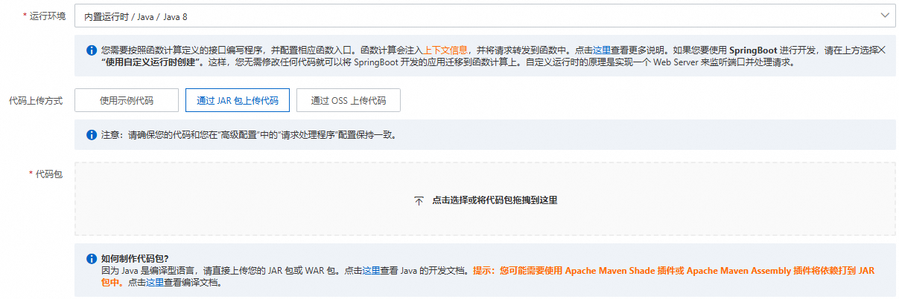
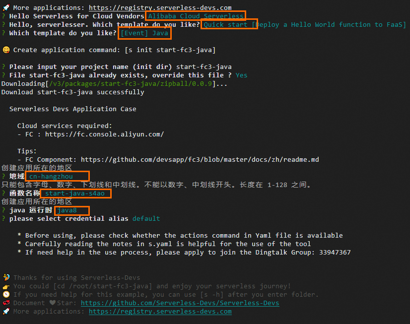

# 编译部署代码包

您可以在本地Java运行环境（Maven或Serverless Devs工具）编译程序，打包为ZIP包或JAR包，然后在函数计算控制台或使用Serverless Devs工具上传代码包，并正确运行您的代码。

## Java运行时依赖库

要创建部署代码包，请将函数代码和依赖库共同编译并打包为ZIP包或JAR包。

函数计算平台为Java运行时提供以下依赖库：

- [com.aliyun:fc-java-core](https://github.com/aliyun/fc-java-libs/tree/master/fc-java-core)：定义了请求处理程序中使用的handler接口和context对象等信息。
- [com.aliyun:fc-java-events](https://github.com/aliyun/fc-java-libs/tree/master/fc-java-events/src/main/java/com/aliyun/fc/runtime/event)：提供了常用的事件源的event类型。

以上依赖库可通过[Maven中央存储库](https://search.maven.org/search?q=g:com.aliyun.fc.runtime)获取。获取以上依赖库后将其添加到您的pom.xml文件中，如下所示：

```
<!-- https://mvnrepository.com/artifact/com.aliyun.fc.runtime/fc-java-core --> <dependency> <groupId>com.aliyun.fc.runtime</groupId> <artifactId>fc-java-core</artifactId> <version>1.4.1</version> </dependency> <!-- https://mvnrepository.com/artifact/com.aliyun.fc.runtime/fc-java-event --> <dependency> <groupId>com.aliyun.fc.runtime</groupId> <artifactId>fc-java-event</artifactId> <version>1.2.0</version> </dependency>
```

**

**说明**

如果依赖包太大，可将依赖打包到层中，以减少代码包体积。具体操作，请参见[创建自定义层](https://help.aliyun.com/zh/functioncompute/fc/user-guide/create-a-custom-layer-1)。

## 使用Maven编译并部署

### **前提条件**

安装Java和Maven。关于Java的详细信息，请参见[官网](https://www.java.com)。关于Maven的详细信息，请参见[Installing Apache Maven](https://maven.apache.org/install.html)。

### **操作步骤**

1. 创建一个Java项目，其中App.java文件路径如下。
  
  ```
  src/main/java/example/App.java
  ```
  
  在App.java文件中输入示例代码。具体示例代码，请参见[请求处理程序（Handler）](https://help.aliyun.com/zh/functioncompute/fc/handlers-in-a-java-runtime)或[上下文](https://help.aliyun.com/zh/functioncompute/fc/user-guide/context-3-1)。
  
  ```
  package example; import com.aliyun.fc.runtime.Context; import com.aliyun.fc.runtime.StreamRequestHandler; import java.io.IOException; import java.io.InputStream; import java.io.OutputStream; public class App implements StreamRequestHandler { @Override public void handleRequest(InputStream inputStream, OutputStream outputStream, Context context) throws IOException { outputStream.write(new String("hello world").getBytes()); } }
  ```
2. 在pom.xml文件中配置`build`，示例如下。
  
  ```
  <build> <plugins> <plugin> <groupId>org.apache.maven.plugins</groupId> <artifactId>maven-shade-plugin</artifactId> <version>3.2.1</version> <executions> <execution> <phase>package</phase> <goals> <goal>shade</goal> </goals> <configuration> <filters> <filter> <artifact>*:*</artifact> <excludes> <exclude>META-INF/*.SF</exclude> <exclude>META-INF/*.DSA</exclude> <exclude>META-INF/*.RSA</exclude> </excludes> </filter> </filters> </configuration> </execution> </executions> </plugin> </plugins> </build>
  ```
  
  **
  
  **说明**
  
  您可以使用[Apache Maven Shade](https://maven.apache.org/plugins/maven-shade-plugin/)插件或[Apache Maven Assembly](https://maven.apache.org/plugins/maven-assembly-plugin/?spm=a2c4g.11186623.0.0.444ac9273B23Cd)插件，以上示例仅以[Apache Maven Shade](https://maven.apache.org/plugins/maven-shade-plugin/)插件为例。
  
  展开查看完整的pom.xml文件示例。
  
  ```
  <project xmlns="http://maven.apache.org/POM/4.0.0" xmlns:xsi="http://www.w3.org/2001/XMLSchema-instance" xsi:schemaLocation="http://maven.apache.org/POM/4.0.0 http://maven.apache.org/maven-v4_0_0.xsd"> <modelVersion>4.0.0</modelVersion> <groupId>example</groupId> <artifactId>HelloFCJava</artifactId> <packaging>jar</packaging> <version>1.0-SNAPSHOT</version> <name>HelloFCJava</name> <dependencies> <dependency> <groupId>junit</groupId> <artifactId>junit</artifactId> <version>3.8.1</version> <scope>test</scope> </dependency> <dependency> <groupId>com.aliyun.fc.runtime</groupId> <artifactId>fc-java-core</artifactId> <version>1.4.1</version> </dependency> </dependencies> <build> <plugins> <plugin> <groupId>org.apache.maven.plugins</groupId> <artifactId>maven-shade-plugin</artifactId> <version>3.2.1</version> <executions> <execution> <phase>package</phase> <goals> <goal>shade</goal> </goals> <configuration> <filters> <filter> <artifact>*:*</artifact> <excludes> <exclude>META-INF/*.SF</exclude> <exclude>META-INF/*.DSA</exclude> <exclude>META-INF/*.RSA</exclude> </excludes> </filter> </filters> </configuration> </execution> </executions> </plugin> </plugins> </build> <properties> <maven.compiler.target>1.8</maven.compiler.target> <maven.compiler.source>1.8</maven.compiler.source> <maven.test.skip>true</maven.test.skip> </properties> </project>
  ```
3. 打开命令行窗口，切换至项目的根目录，然后执行`mvn clean package`命令打包。
  
  示例代码如下。
  
  ```
  [INFO] Scanning for projects... ... .... .... [INFO] --------------------------< example:example >--------------------------- [INFO] Building java-example 1.0-SNAPSHOT [INFO] --------------------------------[ jar ]--------------------------------- ... .... .... [INFO] ------------------------------------------------------------------------ [INFO] BUILD SUCCESS [INFO] ------------------------------------------------------------------------ [INFO] Total time: 11.681 s [INFO] Finished at: 2020-03-26T15:55:05+08:00 [INFO] ------------------------------------------------------------------------
  ```
  
  - 如果显示编译失败，请根据输出的编译错误信息调整代码。
  - 如果编译成功，编译后的JAR包位于项目文件夹内的target目录内，并根据pom.xml内的artifactId、version字段命名为HelloFCJava-1.0-SNAPSHOT.jar。
    
    **
    
    **重要**
    
    针对macOS和Linux操作系统，压缩前请确保代码文件具有可读和可执行权限。
4. 登录[函数计算控制台](https://fcnext.console.aliyun.com)，上传代码包。
  
  
5. 在**函数详情**的**配置**页签，确认**请求处理程序**正确性，您的请求处理程序需配置为`[包名].[类名]::[方法名]`。例如，您的包名为example，类名为App，方法名为handleRequest，则请求处理程序可配置为`example.App::handleRequest`，可以点击**基础配置**区域的**编辑**进行修改。
6. 在**代码**页签，单击**测试函数**进行测试。

## 使用Serverless Devs编译并部署

### **前提条件**

- [快速入门](https://help.aliyun.com/zh/functioncompute/fc/developer-reference/install-serverless-devs-and-docker)
- [配置Serverless Devs](https://help.aliyun.com/zh/functioncompute/fc-3-0/developer-reference/configure-serverless-devs-1)
- [安装JDK](https://www.oracle.com/java/technologies/downloads/)
- [安装Maven](https://maven.apache.org/download.cgi?spm=a2c4g.11186623.0.0.b18b670amqvDNH&file=download.cgi)

### **操作步骤**

1. 执行以下命令，初始化项目。
  
  ```
  s init
  ```
  
  根据界面提示依次选择阿里云厂商、模板、运行时以及部署应用的地域和函数名称等。
  
  
2. 执行以下命令，进入项目目录。
  
  ```
  cd start-fc-event-java8
  ```
  
  代码目录结构如下：
  
  ```
  start-fc-event-java8 ├── src │ └── main │ └── java │ └── example │ └── App.java ├── pom.xml ├── readme └── s.yaml
  ```
3. 执行以下命令，部署项目。
  
  ```
  s deploy
  ```
  
  执行该命令会先执行`pre-deploy`，`pre-deploy`会执行`mvn package`编译打包，然后上传部署代码包。输出示例如下：
  
  ```
  [2022-04-07 12:00:09] [INFO] [S-CORE] - Start the pre-action [2022-04-07 12:00:09] [INFO] [S-CORE] - Action: mvn package [INFO] Scanning for projects... [INFO] [INFO] ------------------------< example:HelloFCJava >------------------------- [INFO] Building HelloFCJava 1.0-SNAPSHOT [INFO] --------------------------------[ jar ]--------------------------------- ...... [INFO] ------------------------------------------------------------------------ [INFO] BUILD SUCCESS [INFO] ------------------------------------------------------------------------ [INFO] Total time: 3.617 s [INFO] Finished at: 2022-04-07T20:00:14+08:00 [INFO] ------------------------------------------------------------------------ [2022-04-07 12:00:14] [INFO] [S-CORE] - End the pre-action ✔ Checking Service, Function (0.64s) ✔ Creating Service, Function (0.71s) Tips for next step ====================== * Display information of the deployed resource: s info * Display metrics: s metrics * Display logs: s logs * Invoke remote function: s invoke * Remove Service: s remove service * Remove Function: s remove function * Remove Trigger: s remove trigger * Remove CustomDomain: s remove domain helloworld: region: cn-hangzhou service: name: hello-world-service function: name: start-fc-event-java8 runtime: java8 handler: example.App::handleRequest memorySize: 128 timeout: 60
  ```
4. 执行`s invoke`命令进行测试。
  
  输出示例如下：
  
  ```
  ➜ start-fc-event-java8 s invoke ========= FC invoke Logs begin ========= FC Initialize Start RequestId: b246c3bf-06bc-49e5-92b8-xxxxxxxx FC Initialize End RequestId: b246c3bf-06bc-49e5-92b8-xxxxxxxx FC Invoke Start RequestId: b246c3bf-06bc-49e5-92b8-xxxxxxxx FC Invoke End RequestId: b246c3bf-06bc-49e5-92b8-xxxxxxxx Duration: 7.27 ms, Billed Duration: 8 ms, Memory Size: 128 MB, Max Memory Used: 65.75 MB ========= FC invoke Logs end ========= FC Invoke Result: hello world End of method: invoke
  ```
