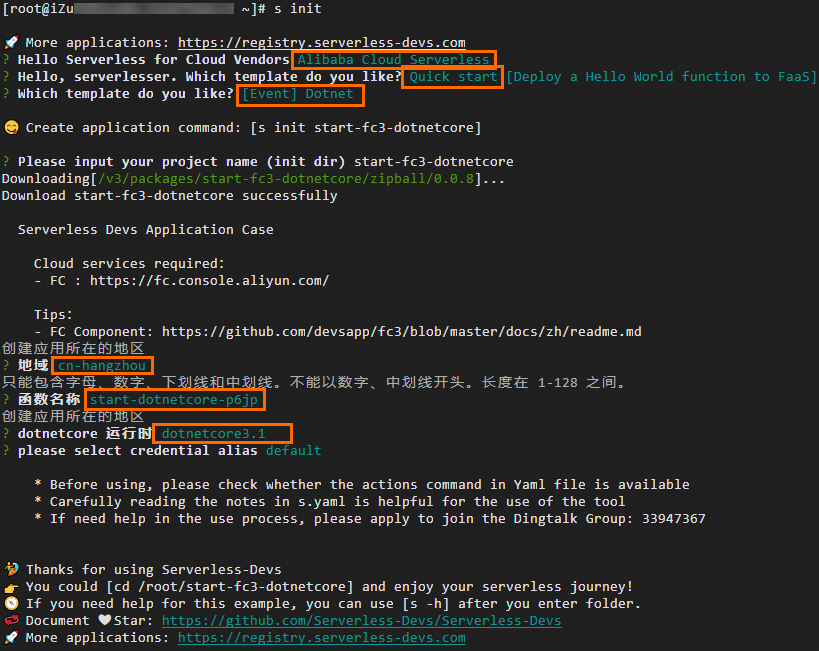

# 编译部署代码包

您可以在本地.NET运行环境编译程序，打包为ZIP包，然后在函数计算控制台或使用Serverless Devs工具上传代码包，并正确运行您的代码。

## C#运行时依赖库

函数计算为C#运行时提供依赖库[Aliyun.Serverless.Core](https://github.com/aliyun/fc-dotnet-libs/tree/master/Aliyun.Serverless.Core)，用于定义请求处理程序接口，Context对象等信息。

您可以通过[Nuget程序包](https://www.nuget.org/packages/)获得以上依赖库，将其添加到代码目录下的<YourProjectName>.csproj文件中。如下所示。

```
<ItemGroup> <PackageReference Include="Aliyun.Serverless.Core" Version="1.0.1" /> <PackageReference Include="Aliyun.Serverless.Core.Http" Version="1.0.3" /> </ItemGroup>
```

## 使用.NET Core CLI工具编译并部署程序

.NET Core部署程序包，需要包含您的函数的已编译程序集以及其所有程序集的依赖项。您可以直接使用.NET Core CLI工具编译程序。使用 .NET Core CLI工具，您可以通过跨平台方式创建基于.NET的函数计算应用程序。具体操作，请参见[.NET](https://dotnet.microsoft.com/zh-cn/download)。

### 步骤一：创建.NET项目

1. 执行以下命令创建.NET项目。
  
  ```
  dotnet new console -o HelloFcApp -f netcoreapp3.1
  ```
  
  参数解析如下。
  
  - new console：推荐使用控制台应用程序模板。
  - -o|--output：项目的输出位置。本文示例中，会创建一个HelloFcApp目录，并将项目内容放置到该目录下。
  - -f|--framework：指定使用的.NET版本。如果运行时版本为.NET Core 3.1，该参数使用*netcoreapp3.1*；如果运行时版本为.NET Core 2.1，该参数使用*netcoreapp2.1*。
  
  创建完成后，项目目录结构如下所示。
  
  ```
  HelloFcApp ├── HelloFcApp.csproj ├── Program.cs └── obj
  ```
2. 在项目目录下，根据实际情况修改文件的参数配置。
  
  - HelloFcApp.csproj文件
    
    .NET工程的配置文件，记录了项目的目标框架、程序集的依赖库等信息。您需要在该文件中添加函数计算提供的依赖库，示例如下。
    
    ```
    <Project Sdk="Microsoft.NET.Sdk"> <PropertyGroup> <OutputType>Exe</OutputType> <TargetFramework>netcoreapp3.1</TargetFramework> </PropertyGroup> <ItemGroup> <PackageReference Include="Aliyun.Serverless.Core" Version="1.0.1" /> <PackageReference Include="Aliyun.Serverless.Core.Http" Version="1.0.3" /> </ItemGroup> </Project>
    ```
  - Program.cs文件
    
    您的请求处理程序代码，具体设置可参考[请求处理程序（Handler）](https://help.aliyun.com/zh/functioncompute/fc/user-guide/handlers-in-a-c-runtime)。本文以使用Stream类型的事件请求处理程序为例。
    
    ```
    using System.IO; using System.Threading.Tasks; using Aliyun.Serverless.Core; using Microsoft.Extensions.Logging; namespace Example { public class Hello { public async Task<Stream> StreamHandler(Stream input, IFcContext context) { IFcLogger logger = context.Logger; logger.LogInformation("Handle request: {0}", context.RequestId); MemoryStream copy = new MemoryStream(); await input.CopyToAsync(copy); copy.Seek(0, SeekOrigin.Begin); return copy; } static void Main(string[] args){} } }
    ```

### 步骤二：编译.NET项目

1. 执行以下命令，进入项目目录并编译项目，然后将结果输出到target目录下。
  
  ```
  cd HelloFcApp && dotnet publish -c Release -o ./target
  ```
2. 执行以下命令，进入target目录并进行打包。
  
  ```
  cd target && zip -r HelloFcApp.zip *
  ```
  
  打包完成后，ZIP包的结构如下所示。
  
  ```
  HelloFcApp.zip ├── Aliyun.Serverless.Core.dll ├── HelloFcApp.deps.json ├── HelloFcApp.dll ├── HelloFcApp.pdb ├── HelloFcApp.runtimeconfig.json └── Microsoft.Extensions.Logging.Abstractions.dll
  ```
  
  **
  
  **重要**
  
  请确保已将HelloFcApp.dll等文件打包至ZIP文件的根目录。

### 步骤三：部署项目代码并验证

1. 登录[函数计算控制台](https://fcnext.console.aliyun.com)，在左侧导航栏，选择**函数管理**>**函数列表**。
2. 在顶部菜单栏，选择地域，然后在**函数列表**页面，单击**创建函数**。
3. 在**创建函数**页面，选择使用**事件函数**方式，设置函数相关配置项，然后单击**创建**。
  
  主要配置项说明如下，其余配置项选择默认值即可。
  
  - **运行环境**：选择**.NET Core 3.1**。
  - **代码上传方式**：选择**通过 ZIP 包上传代码**，然后上传[步骤2](#step-0ac-g2g-daq)打包的ZIP文件。
  - **请求处理程序**：设置为`HelloFcApp::Example.Hello::StreamHandler`。关于请求处理程序的格式说明，请参见[请求处理程序（Handler）](https://help.aliyun.com/zh/functioncompute/fc/user-guide/handlers-in-a-c-runtime)。
  
  创建完成后，跳转至函数详情页面的**代码**页签。
4. 在函数详情页面的**代码**页签，单击**测试函数**。
  
  执行成功后返回以下结果。
  
  ```
  { "key1": "value1", "key2": "value2", "key3": "value3" }
  ```
  
  您还可以单击**日志输出**页签查看详细日志。

## 使用Serverless Devs编译并部署

### **前提条件**

- [安装Serverless Devs](https://help.aliyun.com/zh/functioncompute/fc/developer-reference/install-serverless-devs-and-docker)
- [配置Serverless Devs](https://help.aliyun.com/zh/functioncompute/fc-3-0/developer-reference/configure-serverless-devs-1)

### **操作步骤**

1. 执行以下命令，初始化项目。
  
  ```
  s init
  ```
  
  根据界面提示依次选择阿里云厂商、模板、运行时以及部署应用的地域和函数名称等。
  
  
2. 执行以下命令，进入项目目录。
  
  ```
  cd start-fc3-dotnetcore
  ```
  
  代码目录结构如下。
  
  ```
  start-fc3-dotnetcore ├── HelloFcApp │ ├── bin │ ├── obj │ ├── target │ ├── HelloWorldApp.csproj │ └── Program.cs ├── readme └── s.yaml
  ```
3. 执行以下命令，部署项目。
  
  ```
  s deploy
  ```
  
  输出示例如下：
  
  ```
  s.yaml: /root/start-fc3-dotnetcore/s.yaml Downloading[/v3/packages/fc3/zipball/0.0.24]... Download fc3 successfully Steps for [deploy] of [hello-world-app] ==================== Microsoft (R) Build Engine version 16.7.3+2f374e28e for .NET Copyright (C) Microsoft Corporation. All rights reserved. Determining projects to restore... Restored /root/start-fc3-dotnetcore/HelloWorldApp/HelloWorldApp.csproj (in 154 ms). HelloWorldApp -> /root/start-fc3-dotnetcore/HelloWorldApp/bin/Release/netcoreapp3.1/HelloWorldApp.dll HelloWorldApp -> /root/start-fc3-dotnetcore/HelloWorldApp/target/ [hello_world] completed (2.66s) Result for [deploy] of [hello-world-app] ==================== region: cn-hangzhou description: hello world by serverless devs functionName: start-dotnetcore-p6jp handler: HelloWorldApp::Example.Hello::StreamHandler internetAccess: true memorySize: 128 role: runtime: dotnetcore3.1 timeout: 10 A complete log of this run can be found in: /root/.s/logs/0327105651
  ```
4. 执行`sudo s invoke`命令进行测试。
  
  输出示例如下：
  
  ```
  Steps for [invoke] of [hello-world-app] ==================== ========= FC invoke Logs begin ========= FunctionCompute dotnetcore3.1 runtime inited. FC Invoke Start RequestId: 1-6603951e-157f3f32-7fe6f248d7d0 hello world! 你好，世界！ FC Invoke End RequestId: 1-6603951e-157f3f32-7fe6f248d7d0 Duration: 117.33 ms, Billed Duration: 118 ms, Memory Size: 128 MB, Max Memory Used: 13.16 MB ========= FC invoke Logs end ========= Invoke instanceId: c-6603951e-15f440b6-2df37e4bf046 Code Checksum: 13273801077182424526 Qualifier: LATEST RequestId: 1-6603951e-157f3f32-7fe6f248d7d0 Invoke Result: hello world! 你好，世界！ ✔ [hello_world] completed (0.72s) A complete log of this run can be found in: /root/.s/logs/0327114013
  ```
