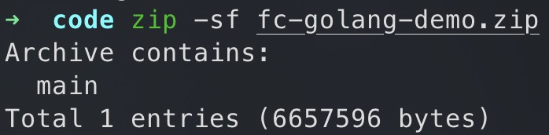
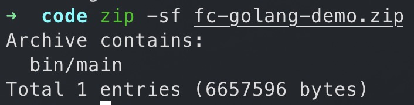

# 编译部署代码包

Go是静态编译型语言，不支持在函数计算控制台在线编辑代码，您需要在本地自行编译程序并打包为.zip文件。本文介绍如何将函数计算官方Go SDK库与您的代码一同打包并上传至函数计算。

## 前提条件

安装[Go](https://go.dev/)语言环境。函数计算已支持Go 1.x版本，推荐使用Go 1.8或以上版本。

## 在Linux或macOS下编译打包

1. 下载函数计算Go SDK库。
  
  ```
  go get github.com/aliyun/fc-runtime-go-sdk/fc
  ```
2. 准备代码文件`main.go`，并在其所在目录下执行如下命令编译文件。
  
  ```
  GOOS=linux go build main.go
  ```
  
  **
  
  **说明**
  
  - `main.go`仅为示例，需替换为您实际的文件名。
  - 编译完成后，该目录下生成与文件同名的二进制文件。
  
  设置`GOOS=linux`，确保编译后的可执行文件与函数计算平台的Go运行系统环境兼容，尤其是在非Linux环境中编译时。
  
  补充说明如下：
  
  - 针对Linux操作系统，建议使用纯静态编译，配置`CGO_ENABLED=0`，确保可执行文件不依赖任何外部依赖库（如libc库），避免出现编译环境和Go运行时环境依赖库的兼容问题。示例如下：
    
    ```
    GOOS=linux CGO_ENABLED=0 go build main.go
    ```
  - 针对M1 macOS（或其他ARM架构的机器），配置`GOARCH=amd64`，实现跨平台编译，示例如下：
    
    ```
    GOOS=linux GOARCH=amd64 go build main.go
    ```
3. 打包上一步生成的二进制文件。
  
  ```
  zip fc-golang-demo.zip main
  ```

## 在Windows下编译打包

1. 准备代码文件`main.go`，并在其所在目录下执行如下命令编译文件。
  
  1. 同时按下**Win**+**R**键打开运行窗口。
  2. 输入cmd，按下**Enter**键，然后在命令提示符窗口执行以下命令。
    
    ```
    set GOOS=linux set GOARCH=amd64 go build -o main main.go
    ```
    
    **
    
    **说明**
    
    - `main.go`仅为示例，需替换为您实际的文件名。
    - 编译完成后，该目录下生成与文件同名的二进制文件。
2. 使用[build-fc-zip](https://github.com/aliyun/fc-runtime-go-sdk/tree/master/cmd/build-fc-zip)工具打包上一步生成的二进制文件。
  
  1. 使用go install方式下载build-fc-zip工具。
    
    ```
    set GOOS=windows set GOARCH=amd64 go install github.com/aliyun/fc-runtime-go-sdk/cmd/build-fc-zip@latest
    ```
    
    使用go install方式下载时，该工具通常会安装在%USERPROFILE%\go\bin目录下。
  2. 在代码所在目录下执行以下命令打包代码。
    
    ```
    %USERPROFILE%\go\bin\build-fc-zip.exe -output main.zip main
    ```

## 创建函数并设置请求处理程序

1. [创建事件函数](https://help.aliyun.com/zh/functioncompute/fc/user-guide/creating-an-event-function)，选择**运行环境**为**Go 1**。
2. 上传代码包并为函数配置请求处理程序。具体操作方式，请参见[编辑函数](https://help.aliyun.com/zh/functioncompute/fc/user-guide/creating-an-event-function#3cc62eed2e86k)。
  
  Go是编译型语言，需要在本地编译后以上传ZIP包的形式上传可执行的二进制文件。在[函数计算控制台](https://fcnext.console.aliyun.com)的**请求处理程序**配置中，Go语言的FC函数**请求处理程序**需要直接设置为`[文件名]`。该文件名是指编译后的二进制文件名称，当函数被调用时，函数计算平台会直接执行该二进制文件。
  
  - 如果编译生成的二进制文件存放在ZIP包的根目录，如下图所示。此时，需要将FC函数**请求处理程序**设置为`main`。
  - 如果编译生成的二进制文件没有放到ZIP包的根目录，而是放到例如bin/目录下，如下图所示。此时，**请求处理程序**需要设置为`bin/main`。
