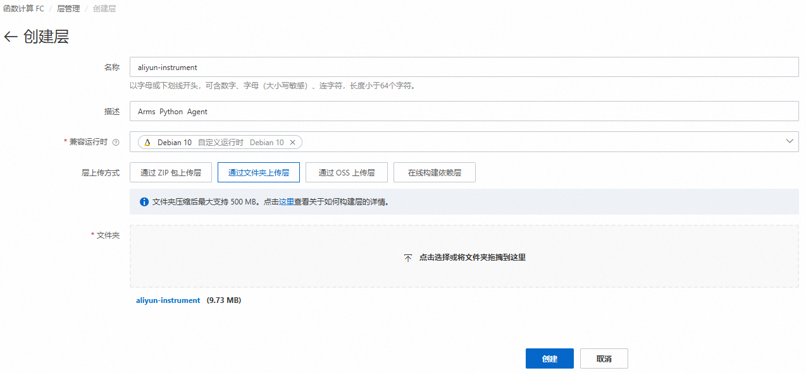
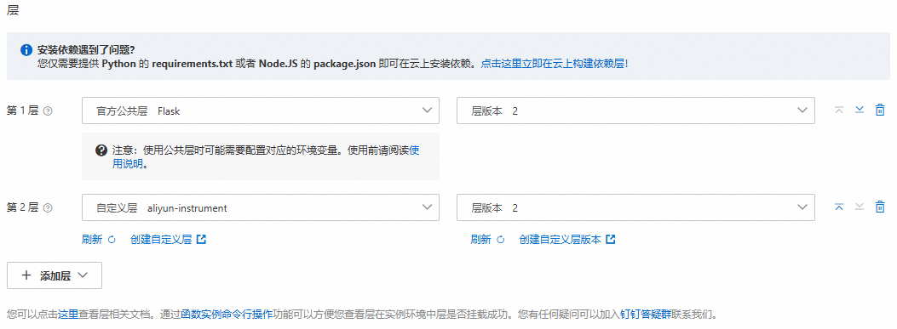
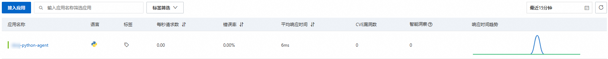

# 自定义运行时支持ARMS Python探针扩展

本文主要介绍使用自定义运行时为Python函数手动安装探针。

## 背景信息

函数计算无缝对接ARMS应用监控平台后，您可以通过ARMS应用监控平台对目标函数进行监控追踪，获取相关信息，为Python函数安装探针后，ARMS即可开始监控Python应用，您可以查看应用拓扑、调用链路、SQL分析等一系列监控数据。更多信息，请参见[什么是应用实时监控服务ARMS？](https://help.aliyun.com/zh/arms/product-overview/what-is-arms#concept-42781-zh)。

## **使用限制**

函数Python版本需与Web函数自定义运行时的Python版本保持一致。

## 步骤一：制作探针层

### 1. 获取Python探针包

#### 1.1. 下载探针包

```
// VPC网络下载指定版本探针 wget http://arms-apm-${regionID}.oss-${regionID}-internal.aliyuncs.com/aliyun-python-agent/${version}/aliyun-python-agent.tar.gz // VPC网络下载最新版本探针 wget http://arms-apm-${regionID}.oss-${regionID}-internal.aliyuncs.com/aliyun-python-agent/aliyun-python-agent.tar.gz // 公网下载指定版本探针 wget http://arms-apm-${regionID}.oss-${regionID}.aliyuncs.com/aliyun-python-agent/${version}/aliyun-python-agent.tar.gz // 公网下载最新版本探针 wget http://arms-apm-${regionID}.oss-${regionID}.aliyuncs.com/aliyun-python-agent/aliyun-python-agent.tar.gz
```

1. 请将${regionID}替换成实际所在的地域，请参考：[开服地域](https://help.aliyun.com/zh/arms/application-monitoring/product-overview/supported-regions-of-applicant-monitoring)。
2. 请将${version}替换成实际期望的版本号，请参考：[探针（Python Agent）版本说明](https://help.aliyun.com/zh/arms/application-monitoring/user-guide/python-agent-version-description)。

公网下载指定版本探针的示例值如下：

```
wget http://arms-apm-cn-hangzhou.oss-cn-hangzhou.aliyuncs.com/aliyun-python-agent/1.5.0/aliyun-python-agent.tar.gz
```

#### 1.2. 解压探针包，并执行pip install

```
## 解压 tar -zxvf aliyun-python-agent.tar.gz ## 构建包 pip3 install target/*.whl -t aliyun-instrument ## 修改./aliyun-instrument/bin目录下aliyun-instrument文件,将首行#!/usr/bin/python3替换为以下内容。 #!/var/fc/lang/python3.10/bin/python3
```

### 2. 在线创建层

1. 登录[函数计算控制台](https://fcnext.console.aliyun.com)，在左侧导航栏，选择**函数管理**>**层管理**。
2. 在顶部菜单栏，选择地域，然后在**层管理**页面，单击**创建层**。
3. 在**创建层**页面，**通过文件夹上传层**上传构建的层。
  
  

**

**说明**

上传aliyun-instrument文件时，需要确保aliyun-instrument为顶级目录，避免压缩和解压时aliyun-instrument包含aliyun-instrument，否则配置环境变量会受到影响。

## 步骤二：在函数中使用自定义层

### 1. 在函数高级配置中添加自定义层

1. 登录[函数计算控制台](https://fcnext.console.aliyun.com)，在左侧导航栏，选择**函数管理**>**函数列表**。
2. 在顶部菜单栏，选择地域，然后在**函数列表**页面，单击目标函数。
3. 在函数详情页面，选择**配置**页签，单击**高级配置**右侧的**编辑**，在**高级配置**面板，选择**+添加层**>**添加自定义层**，选择**自定义层**和**层版本**，最后单击**部署**。



### 2. 添加环境变量

| **变量** | **值** |
| --- | --- |
| **ARMS_APP_NAME** | **FC:{函数名称}** |
| **ARMS_LICENSE_KEY** | [获取LicenseKey](https://help.aliyun.com/zh/arms/application-monitoring/developer-reference/api-arms-2019-08-08-describetracelicensekey-apps) |
| **ARMS_REGION_ID** | **{region}** |
| LD_LIBRARY_PATH | /code:/code/lib:/usr/local/lib:/opt/lib:/opt/php8.1/lib:/opt/php8.0/lib:/opt/php7.2/lib |
| PATH | /code/python/bin:/var/fc/lang/python3.10/bin:/usr/local/bin/apache-maven/bin:/usr/local/bin:/usr/local/sbin:/usr/local/bin:/usr/sbin:/usr/bin:/sbin:/bin:/usr/local/ruby/bin:/opt/bin:/code:/code/bin |
| PYTHONPATH | **/opt:**/opt/python:/code |
| PYTHONUSERBASE | /code/python |

### 3. 修改启动命令

在函数详情页面，选择**配置**页签，单击**基础配置**右侧的**编辑**，修改**启动命令**的值，如下所示。

```
aliyun-instrument python3 app.py
```

如果应用使用uvicorn启动，需要替换为以下指令接入探针。

例如：

```
uvicorn -w 4 -b 0.0.0.0:8000 app:app
```

修改为：

```
aliyun-instrument gunicorn -w 4 -k uvicorn.workers.UvicornWorker -b 0.0.0.0:8000 app:app
```

aliyun-instrument指令负责ARMS Python探针初始化配置及无侵入埋点。如果有使用gevent协程，则需要设置环境变量GEVENT_ENABLE=true。例如程序中有使用：

```
from gevent import monkey monkey.patch_all()
```

需要设置环境变量如下：

```
GEVENT_ENABLE=true
```

## 结果验证

成功执行函数后，约一分钟后，若Python应用出现在[ARMS控制台](https://arms.console.aliyun.com/#/home)的**应用监控 > 应用列表**页面中且有数据上报，则说明接入成功。


