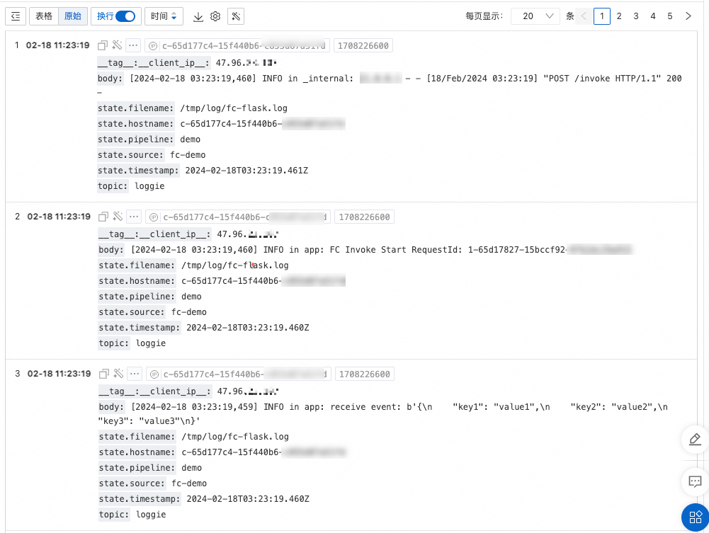

# 自定义运行时支持Loggie Agent日志扩展

Loggie是一个基于Golang的轻量级、高性能的云原生日志采集Agent。您可以在自定义运行时的函数中使用Loggie Agent从文件中采集日志，然后上传到日志服务SLS进行日志的存储和自定义分析。

## 前提条件

已创建日志项目和日志库。具体操作，请参见[管理Project](https://help.aliyun.com/zh/sls/manage-a-project/#section-ahq-ggx-ndb)和[创建基础LogStore](https://help.aliyun.com/zh/sls/manage-a-logstore#section-v52-2jx-ndb)。

**

**重要**

创建的日志项目必须和要创建的函数在相同地域。

## **操作步骤**

### **步骤一：创建函数**

1. 登录[函数计算控制台](https://fcnext.console.aliyun.com)，在左侧导航栏，选择**函数管理**>**函数**。
2. 在顶部菜单栏，选择地域，然后在**函数**页面，单击**创建函数**。
3. 在弹出的对话框，根据提示和实际场景，选择**Web 函数**类型，然后单击**创建Web函数**。
4. 在**创建Web函数**页面，配置以下配置项，其他配置项使用默认值，然后单击**创建**。
  
  更多参数解释，请参见[创建函数](https://help.aliyun.com/zh/functioncompute/fc/user-guide/function-instance-1/)。
  
  - **基础配置**：设置**函数名称**。
  - **弹性策略**：函数实例的规格方案和单实例并发度保持默认值。
  - **函数代码**：选择函数的运行环境和代码相关信息。
    
    | **配置项** | **示例** |
    | --- | --- |
    | **运行环境** | **自定义运行时** |
    | **代码上传方式** | 选择**通过文件夹上传代码**。其中上传的文件夹名称为`code`，`code`目录下的文件为`app.py`。`app.py`的代码示例内容如下。<br>```<br>from flask import Flask from flask import request import logging import os REQUEST_ID_HEADER = 'x-fc-request-id' app = Flask(__name__) format_str = '[%(asctime)s] %(levelname)s in %(module)s: %(message)s' logging.basicConfig(filename='/tmp/log/fc-flask.log', filemode='w', format=format_str, encoding='utf-8', level=logging.DEBUG) @app.route("/invoke", methods = ["POST"]) def hello_world(): rid = request.headers.get(REQUEST_ID_HEADER) logger = logging.getLogger() print("FC Invoke Start RequestId: " + rid) logger.info("FC Invoke Start RequestId: " + rid) data = request.stream.read() print(str(data)) logger.info("receive event: {}".format(str(data))) print("FC Invoke End RequestId: " + rid) logger.info("FC Invoke Start RequestId: " + rid) return "Hello, World!" if __name__ == '__main__': app.run(host='0.0.0.0',port=9000)<br>```<br>**<br>**说明**<br>您可以修改代码中配置的`filename='/tmp/log/fc-flask.log'`为指定的日志类型及日志位置，该配置需要和[步骤二](#2a86ba275f8uj)中的`sources.paths`路径保持一致。 |
    | **启动命令** | `/code/bootstrap`<br>**<br>**说明**<br>bootstrap文件在[步骤二](#2a86ba275f8uj)会创建。 |
    | **监听端口** | 9000 |

### **步骤二：创建bootstrap文件作为启动命令**

1. 函数创建成功后，在**代码**页签使用WebIDE在`code`目录下创建`bootstrap`文件。
  
  `bootstrap`文件示例内容如下。
  
  ```
  #!/bin/bash # 1. 创建pipelines.yml文件 mkdir -p /tmp/log /code/etc cat << EOF > /code/etc/pipelines.yml pipelines: - name: demo sources: - type: file name: fc-demo addonMeta: true fields: topic: "loggie" fieldsUnderRoot: true paths: - "/tmp/log/*.log" sink: type: sls endpoint: ${LOGGIE_SINK_SLS_ENDPOINT} accessKeyId: ${LOGGIE_SINK_SLS_ACCESS_ID} accessKeySecret: ${LOGGIE_SINK_SLS_ACCESS_SECRET} project: ${LOGGIE_SINK_SLS_PROJECT} logstore: ${LOGGIE_SINK_SLS_LOGSTORE} topic: ${LOGGIE_SINK_SLS_TOPIC} EOF # 2. 创建loggie.yml文件 cat << EOF > /code/etc/loggie.yml EOF # 3. 启动Loggie Agent，作为后台进程运行 /opt/bin/loggie -config.system=/code/etc/loggie.yml -config.pipeline=/code/etc/pipelines.yml > /tmp/loggie.log 2>&1 & # 4. 启动应用程序 exec python app.py
  ```
  
  该脚本会执行的操作如下：
  
  1. 创建配置文件pipelines.yml，pipelines.yml为Pipeline配置文件。
    
    - `sources`
      
      用于指定日志的类型和日志所在位置。本示例展示如何采集/tmp/log目录下所有以.log结尾的文件中的日志。
      
      `sources`配置中的[addonMeta](https://loggie-io.github.io/docs/reference/pipelines/source/file/?h=addonmeta#addonmeta)表示添加默认的日志采集state元信息。更多关于`sources`的配置，请参见[Source通用配置](https://loggie-io.github.io/docs/reference/pipelines/source/overview/?h=fieldsunderroot#source)。
    - `sink`
      
      用于指定日志服务相关信息。关于参数的说明，请参见[配置参数说明](https://help.aliyun.com/zh/sls/use-loggie-to-upload-logs#section-8rn-cgw-n0b)。脚本中的变量会在[步骤四](#733a82a63bg0x)设置。
  2. 创建配置文件loggie.yml，loggie.yml为Loggie的系统配置文件。
    
    文件为空，表示为默认配置。本文示例采用默认配置方法，loggie.yml文件必须存在。文件不为空时，其具体参数请参见[Loggie系统配置](https://loggie-io.github.io/docs/reference/#_2)。
  3. 启动Loggie Agent，作为后台进程运行。Loggie Agent运行日志会打印到/tmp/loggie.log。
  4. 启动应用程序。本文示例使用Python运行，请按照实际情况填写。
2. 设置`bootstrap`文件权限为可执行权限。
  
  在WebIDE中选择，执行`chmod 777 bootstrap`命令设置文件权限。
3. 单击**部署代码**，完成代码的部署。

### **步骤三：添加官方公共层**Loggie Agent

1. 单击**配置**页签，找到**高级配置**，单击其右侧**编辑**，在高级配置面板找到**层**区域进行编辑。
2. 在**层**区域，选择**添加层**>**添加官方公共层**，配置Loggie Agent。
  
  关于Loggie Agent公共层的相关信息如下。
  
  | **层名称** | **兼容的运行时** | **层版本** | **ARN** |
  | --- | --- | --- | --- |
  | Loggie Agent | 自定义运行时 | 本文示例使用层版本1。 | acs:fc:{region}:official:layers/Loggie13x/versions/1 |
3. 单击**部署**，完成Loggie Agent层的添加。

### **步骤四：设置环境变量**

1. 在**配置**页签，找到**高级配置**，单击其右侧**编辑**，在**高级配置**面板找到**环境变量**区域进行编辑。
2. 在**环境变量**区域，添加如下环境变量。关于如何配置环境变量，请参见[配置环境变量](https://help.aliyun.com/zh/functioncompute/fc/user-guide/environment-variables)。
  
  - 设置环境变量`FC_EXTENSION_SLS_LOGGIE=true`。
    
    添加该环境变量后，在一次函数调用结束时，不会立刻冻结函数实例，会等待10s再冻结函数实例，以确保Loggie Agent扩展成功上报日志。
    
    **
    
    **重要**
    
    函数计算在调用结束至冻结前的等待时长会产生费用，收费策略与实例调用阶段的计费逻辑相同。具体信息，请参见[产品计费](https://help.aliyun.com/zh/functioncompute/fc/product-overview/billing-fc/)。
  - 设置pipelines.yml文件中的环境变量，包括`LOGGIE_SINK_SLS_ENDPOINT`、`LOGGIE_SINK_SLS_ACCESS_ID`、`LOGGIE_SINK_SLS_ACCESS_SECRET`、`LOGGIE_SINK_SLS_PROJECT`、`LOGGIE_SINK_SLS_LOGSTORE`和`LOGGIE_SINK_SLS_TOPIC`。
    
    | **环境变量** | **说明** |
    | --- | --- |
    | `LOGGIE_SINK_SLS_ENDPOINT` | 日志服务的服务入口。更多信息，请参见[服务入口](https://help.aliyun.com/zh/sls/endpoints#reference-wgx-pwq-zdb)。 |
    | `LOGGIE_SINK_SLS_ACCESS_ID` | 阿里云AccessKey ID。如何获取AccessKey ID，请参见[访问密钥](https://help.aliyun.com/zh/sls/accesskey-pair#reference-rh5-tfy-zdb)。 |
    | `LOGGIE_SINK_SLS_ACCESS_SECRET` | 阿里云AccessKey Secret。如何获取AccessKey Secret，请参见[访问密钥](https://help.aliyun.com/zh/sls/accesskey-pair#reference-rh5-tfy-zdb)。 |
    | `LOGGIE_SINK_SLS_PROJECT` | 目标Logstore所在的Project。 |
    | `LOGGIE_SINK_SLS_LOGSTORE` | 用于存储日志的Logstore。 |
    | `LOGGIE_SINK_SLS_TOPIC` | 日志主题，自定义设置。 |
3. 单击**部署**。函数配置更新后，可以支持将函数执行日志通过Loggie上传到日志服务。

### **步骤四：验证结果**

1. 在**代码**页签，单击**测试函数**，通过控制台调试函数。
  
  配置完成后，首次调试日志可能会有一些延迟，建议多调用几次。
2. 登录[日志服务控制台](https://sls.console.aliyun.com/)，按照pipelines.yml文件中配置的地域、Project和Logstore查询日志。示例如下。
  
  
  
  - `body`：日志信息。
  - `state.*`：日志采集state元信息，其中`hostname`为函数运行所在的实例ID。

## 问题排查

Loggie Agent独立运行在函数实例中，函数计算平台无法感知Loggie Agent是否正常，Loggie Agent运行异常也不会影响函数的正常执行。

如果在日志服务中无法查询到Loggie Agent相关日志时（会有秒级的延时），可参考以下流程进行排查。

### 函数运行正常

如果函数运行正常，在调用后函数实例会存活一段时间（一般是几分钟），可以登录实例查看Loggie Agent的运行状态和日志信息。关于登录实例的具体操作，请参见[实例命令行操作](https://help.aliyun.com/zh/functioncompute/fc/user-guide/instance-command-line-operations)。

- 如果没有日志信息，可以在命令行尝试启动Loggie Agent。
- 如果Loggie有日志信息，根据日志信息排查。
  
  - 确认pipelines.yml文件是否配置正确。
  - 确认是否成功启动SLS sink配置。日志类似`pipeline sink(sink/sls)-0 invoke loop start`。
  - 确认是否获取到日志文件。日志类似`start collect file: /tmp/log/fc-flask.log`。如果没有类似日志，按照pipelines.yml文件配置中的`paths`路径，确认是否有日志文件产生。

**

**说明**

首次接入SLS Logstore可能会有一定延时，如果日志一切正常，可以多次触发调用函数，等待几分钟后再查询日志。

### 函数运行失败

Loggie Agent作为外部扩展，一般不会影响函数的正常运行，可以先将Loggie Agent启动逻辑移除，排查函数运行是否正常。如果出现进程异常退出或者执行超时的报错，可以尝试调大内存或CPU规格。

## 相关文档

- 关于Loggie的更多信息，请参见[Loggie简介](https://loggie-io.github.io/docs/main/)。

- 在本文示例中，Loggie采集到日志后原样上传，没有经过任何加工处理。如果需要对日志数据加工后再上传，例如解析JSON格式、移除DEBUG日志等，可以在pipelines.yml中添加Interceptor配置，具体请参见[Loggie-Interceptor](https://loggie-io.github.io/docs/reference/pipelines/interceptor/overview/)。
