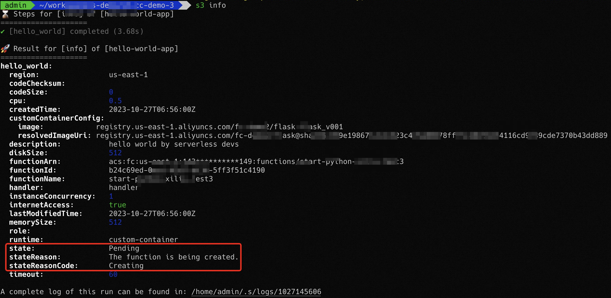
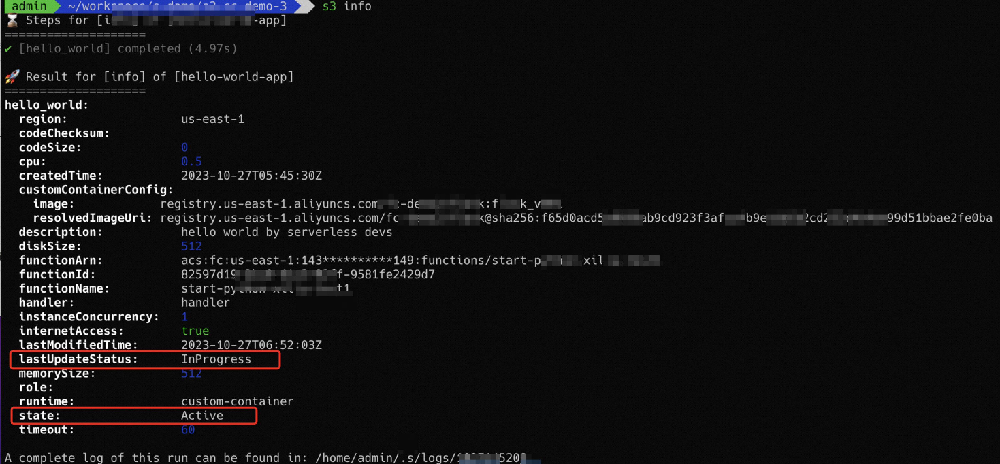
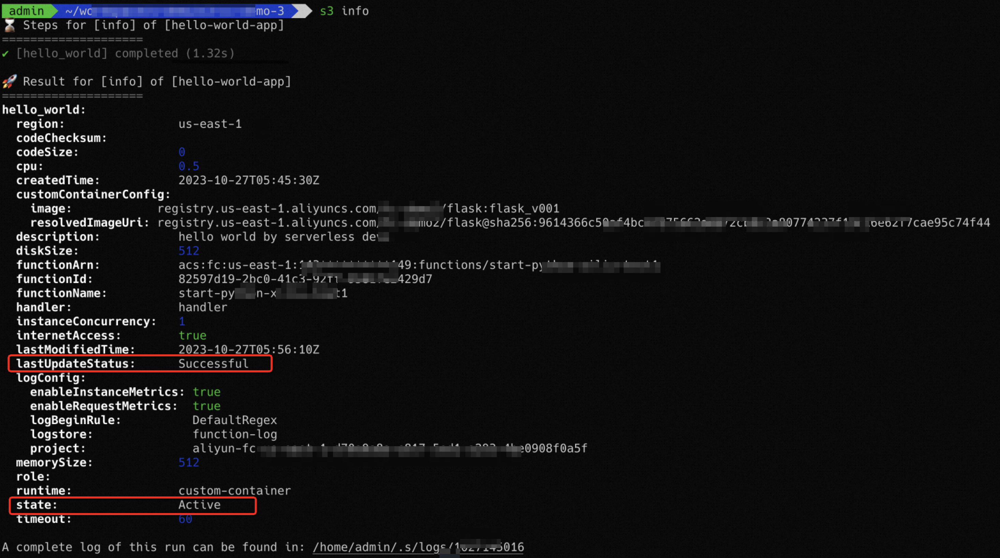

# 自定义镜像函数状态及调用

自定义镜像运行时的函数在运行过程中，需要依赖平台方预留一些资源。为了加速您的函数冷启动速度，会将镜像缓存到函数计算平台，这个缓存过程需要一定的时间，所以对于这类函数，函数计算提供函数状态（State）来表示资源准备处于哪个阶段。本文为您介绍函数的状态及调用说明。

## **函数状态**

为了加速您的函数冷启动的速度，函数计算平台将对您保存在容器镜像服务（ACR）中的镜像缓存到函数计算平台，这个缓存过程是异步的过程。即使创建、更新操作本身会同步返回，资源准备过程也会在后台异步进行。对于这类函数，通过函数状态（State）来表示资源准备处于哪个阶段。

函数计算中的函数，函数状态用于标识函数当前是否可以被调用，对于需要平台侧预留资源的函数，例如自定义镜像运行时的函数，有如下状态：

- Pending（资源准备中）：新建函数时，函数的初始状态为Pending，在Pending过程中，函数计算会尝试为函数的运行所需要的资源进行预留，在该状态下调用将会失败。当镜像准备完成，函数会进入Active状态。
- Active（已激活）：表示函数运行所需的平台侧资源已经准备成功，您的函数在Active下可以正常调用。
- Failed（资源准备失败）：表示平台侧在准备函数运行所需的资源时遇到错误，在函数为Failed状态下的调用请求将会失败。
- Inactive（未激活）：长时间浅休眠（原闲置）的函数，例如数周时间，其使用的函数资源（例如镜像缓存）将被回收，在Inactive状态下的调用将会失败。您可以尝试重新部署函数或者触发函数调用，函数计算将进入Pending状态并尝试重新准备其运行所需的资源。当资源重新准备成功，函数将重新进入Active状态，否则函数将保留Inactive状态。

**

**重要**

函数计算虽然对您的函数做了缓存以加速冷启动速度，但是在调用过程中依然依赖您的原始镜像的存在。如果您的原始镜像不再存在，那么函数将会进入Failed状态，并且无法调用。因此请确保您在函数配置中的镜像在发生任何变化后，及时更新您的函数。

函数计算会同时记录您在创建和更新的配置时刻所选择的镜像版本Tag和Digest。如果您的镜像版本在别的地方被更新为其他的Digest，此函数将会调用失败。因此请确保您在任何函数中使用的镜像不要被覆盖，如果被覆盖为其他的Digest，请及时使用最新的镜像信息重新部署您的函数。

### **更新过程中的函数状态**

函数新建成功后，函数状态的更新动作由LastUpdateStatus字段来表示更新过程的状态。

- InProgress：函数正在更新过程中，平台正在进行资源准备。在此阶段的函数调用将使用更新前的代码版本上。
- Successful：函数的更新过程已经完成。
- Failed：函数更新所需的资源准备失败。后续的函数调用将使用更新前的代码版本上。

## **函数调用**

您可以调用GetFunction API获取函数的状态以及当前配置的镜像所对应的Digest信息。如果您使用SDK或Serverless Devs工具对运行时为自定义镜像的函数进行创建、更新等操作，请确保调用GetFunction接口检查您的函数符合以下状态。

- State为Active：对于新建的函数，您需要等待函数状态为Active后才能调用，否则函数调用将失败。
  
  
- LastUpdateStatus为Successful：对于已有函数的更新操作，您需要等待LastUpdateStatus为Successful，否则调用的为更新前的代码版本。
  
  - 更新过程中，函数状态如下：
    
    
  - 更新完成后，函数状态如下：
    
    
