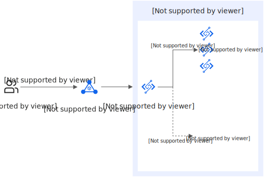

# ALB触发器

函数计算支持将应用型负载均衡 ALB（Application Load Balancer）作为事件源，通过为ALB实例添加函数计算类型的服务器组，实现ALB转发请求到函数计算并调用函数。

## **功能简介**

ALB支持将函数计算添加为后端服务，当接收到访问请求时，ALB会将请求内容转发给函数计算并触发函数调用，函数运行完成后，函数计算将运行结果作为响应返回给请求方。

**

**说明**

应用型负载均衡ALB与函数计算FC之间通过阿里云内部网络进行安全通信。

### **关键特性**

- 无服务器架构支持：ALB添加函数计算作为后端服务，可轻松构建无服务器应用，减少运维成本。
- 自动弹性伸缩：函数计算能够根据流量自动扩展或缩减计算资源，确保应用在高峰期具备足够的计算能力，并在低谷时期节约资源。
- 高可用性和容错性：ALB和函数计算共同提供高可用和容灾恢复能力，确保应用的稳定运行。

### **适用场景**

- 微服务场景：通过ALB丰富的高级路由能力，将请求分配到不同的微服务函数中。函数计算可以动态扩展，处理高并发请求，提高系统的弹性和可靠性。
- 实时数据处理场景：通过ALB将数据处理请求分配给相应的函数，函数计算可以用几行代码和简单的配置对数据进行实时处理。
- 事件驱动场景：ALB接收事件触发请求，将其转发到相应的函数。函数计算处理事件，并将处理结果存储到数据库或发送到其他服务，实现事件驱动的动态处理。
- 图像和视频处理场景：ALB接收上传的图像或视频请求，将其分配到相应的处理函数进行处理。函数计算提供弹性计算资源，可以根据任务自动扩展，确保处理任务的高效完成。

### **使用限制**

- ALB支持添加函数计算作为后端服务的地域，请参见[ALB挂载函数计算支持的地域](https://help.aliyun.com/zh/slb/application-load-balancer/product-overview/supported-regions-and-zones#ff9092c446bjd)。
- ALB实例和函数须属于同一个地域。
- ALB的一个函数计算类型服务器组仅支持添加一个函数作为后端服务器。
- 当函数计算2.0**请求处理程序类型**为**处理事件请求**时，如果使用ALB关联该类型函数，需要配置HTTP触发器。

## **场景示例**

某电子商务企业在阿里云某地域部署了ALB，以处理其平台上的大量用户请求。随着业务的发展和用户量的增加，企业需要一种灵活、高效的方式来处理动态内容生成、用户行为分析和个性化推荐等任务。

为了解决这一需求，企业选择了阿里云的函数计算服务与ALB结合使用，从而实现了对以上任务的高效处理，显著提升了用户体验。



## 前提条件

已[创建ALB实例](https://help.aliyun.com/zh/slb/application-load-balancer/user-guide/create-and-manage-alb-instances#section-p5i-8h3-fka)。

## **操作步骤**

### **步骤一：创建函数**

1. 登录[函数计算控制台](https://fcnext.console.aliyun.com)，在左侧导航栏，选择**函数管理**>**函数列表**。
2. 在顶部菜单栏，选择地域，然后在**函数列表**页面，单击**创建函数**。
3. 在函数详情页的**代码**页签，然后单击**测试函数**。
  
  执行成功后，您可以在**返回结果**区域查看函数运行结果，本示例返回结果为`hello world`。

### **步骤二：创建函数计算类型的服务器组**

1. 在[应用型负载均衡ALB控制台](https://slb.console.aliyun.com/alb)的左侧导航栏选择**服务器组**，在顶部菜单栏选择目标地域，单击**创建服务器组**。
2. 在**创建服务器组**对话框，**服务器组类型**选择**函数计算类型**，然后单击**创建**。
  
  **
  
  **重要**
  
  当开启[ALB健康检查](https://help.aliyun.com/zh/slb/application-load-balancer/user-guide/alb-health-check)时，健康检查探测次数将计为函数计算的请求，函数计算会进行[计费](https://help.aliyun.com/zh/functioncompute/fc/product-overview/billing-overview-of-fc#9a8593eec7ldg)。
  
  在**服务器组名称**中输入名称，例如`fc3.0`。
3. 在**服务器组创建成功**对话框单击**添加后端服务器**。
4. 在**添加后端服务器**面板，选择已创建的函数，然后单击**确定**。
  
  本文**配置方式**为**通过选择资源**，**函数名称**选择已创建的函数，**指定版本**为**LATEST**。如需**通过ARN配置**，需[获取函数ARN](https://help.aliyun.com/zh/functioncompute/fc/user-guide/creating-an-event-function#section-ilq-rae-ceg)。

### **步骤三：配置监听**

1. 在左侧导航栏，选择**应用型负载均衡 ALB**>**实例**，单击实例ID。
2. 单击**监听**页签，然后单击**创建监听**。
3. 在**配置监听**配置向导页面，完成监听协议和端口配置，然后单击**下一步**。
  
  本文使用**HTTP**协议、**80**端口。[HTTP监听其他参数配置](https://help.aliyun.com/zh/slb/add-an-http-listener#task-1960530)可保持默认值或根据实际情况修改。
4. 在**选择服务器组**配置向导，在**选择服务器组**的下拉框选择**函数计算类型**，选择目标服务器组，然后单击**下一步**。
5. 在**配置审核**配置向导，确认配置信息，单击**提交**。

### **步骤四：连通性测试**

完成上述操作后，函数计算和ALB已经建立了连接。您可以打开命令行窗口，执行命令`curl <ALB实例域名>`，测试ALB和函数计算的连通性。

**

**说明**

- 执行下方命令前，请将`alb-n9p0q18eh2pbw****.{region_id}.alb.aliyuncsslb.com`替换为实际ALB实例域名。
- 如果您是在私网环境下访问ALB，请确保当前网络所在的VPC与ALB实例所在的VPC一致。
- 如果您已为ALB实例域名[配置域名解析](https://help.aliyun.com/zh/slb/application-load-balancer/use-cases/specify-a-function-from-function-compute-as-a-backend-server-of-alb#8bf94c9a41t0t)，绑定了自定义域名，请将`alb-n9p0q18eh2pbw****.{region_id}.alb.aliyuncsslb.com`替换为您的自定义域名。

```
curl alb-n9p0q18eh2pbw****.{region_id}.alb.aliyuncsslb.com
```

返回以下结果，表示ALB可以将请求转发至函数计算并调用函数。

```
curl alb-n9p0q18elxxx.alb.aliyuncsslb.com hello world
```

## **更多信息**

- 实际业务场景中，建议您使用自定义域名，[配置CNAME域名解析](https://help.aliyun.com/zh/slb/application-load-balancer/use-cases/specify-a-function-from-function-compute-as-a-backend-server-of-alb#8bf94c9a41t0t)将自定义域名指向ALB实例域名，完成后可以通过自定义域名访问函数。绑定自定义域名之前，请先[注册域名](https://help.aliyun.com/zh/dws/user-guide/how-to-register-a-domain-name)并完成[ICP备案流程](https://help.aliyun.com/zh/icp-filing/basic-icp-service/user-guide/icp-filing-application-overview)。
- [创建服务器组](https://help.aliyun.com/zh/slb/application-load-balancer/user-guide/create-and-manage-a-server-group#section-yjz-1tk-4c8)时，如果启用了健康检查功能，健康检查探测次数将计为函数计算的请求次数，函数计算侧会产生一定的[费用](https://help.aliyun.com/zh/functioncompute/fc/product-overview/billing-overview-of-fc#df116a896awwi)。
