# API网关触发器

函数计算支持API网关作为事件源，即支持将函数计算设置为API的后端服务。当有请求到达后端服务设置为函数计算的API网关时，会触发关联的函数执行一次，函数计算将执行结果返回给API网关。

## 背景信息

API网关触发器与HTTP触发器类似，可应用于搭建Web应用。相较于HTTP触发器，您可以使用API网关进行IP白名单或黑名单设置等高级操作。

API网关支持事件函数和Web函数两种函数类型作为其后端服务，将API网关与函数计算服务对接后，即可通过API形式安全地对外开放函数，并且解决认证、流量控制、数据转换等问题。

## 创建事件函数并对接API网关

### 步骤一：创建事件触发函数

在函数计算3.0控制台创建事件函数，具体操作步骤请参见[创建事件函数](https://help.aliyun.com/zh/functioncompute/fc/user-guide/creating-an-event-function)。

### 步骤二：创建后端服务为函数计算的API

在API网关中定义后端服务，并配置后端服务地址来对接函数计算服务。

1. 登录[API网关控制台](https://apigateway.console.aliyun.com/)，选择地域，在左侧导航栏选择**API 管理**>**后端服务**，单击右上角**创建后端服务**，配置如下信息，单击**确定**。
  
  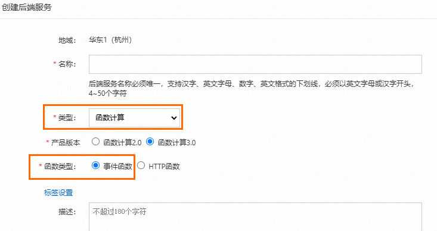
2. 在后端服务页面，单击刚刚创建的后端服务，进入后端服务定义页，选择**线上**页签，在**基本信息**处单击**创建**，选择[步骤一](#80b5ff3f98273)创建的事件函数，然后单击**发布**。
  
  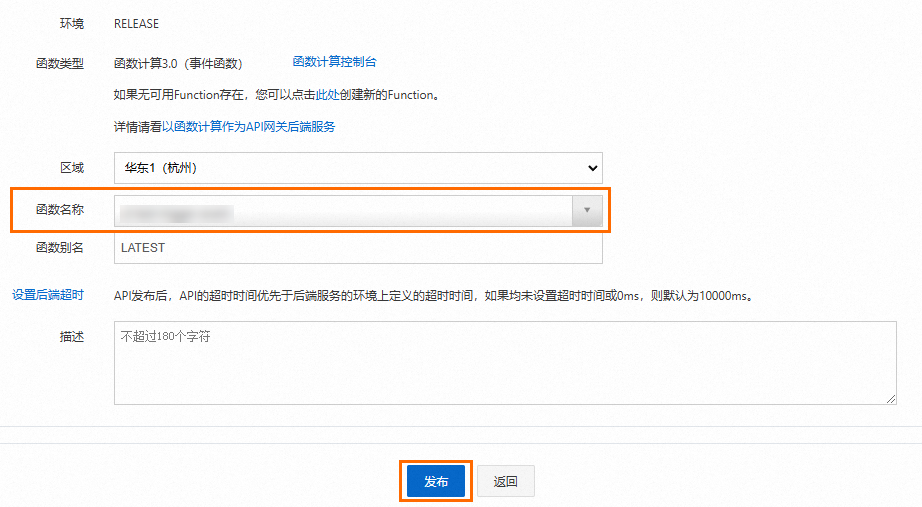
3. 创建分组。
  
  **
  
  **说明**
  
  建议创建与函数相同地域的API分组，如果不是相同地域，API需要通过公网访问您的函数计算服务，这将产生流量费用。若您对数据安全和网络延迟有较高要求，请选择API与函数计算为同一地域。
4. 创建并发布API。
  
  重点配置项设置如下，其余保持默认即可。
  
  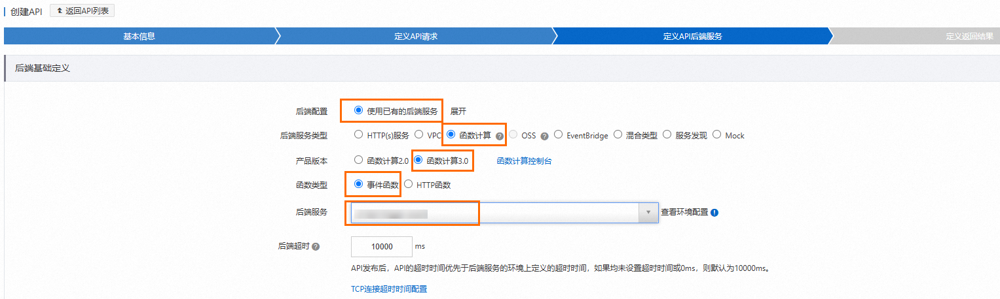
  
  | **配置项** | **取值示例** |
  | --- | --- |
  | **安全认证** | 无认证 |
  | **后端配置** | 使用已有的后端服务 |
  | **后端服务类型** | 函数计算 |
  | **产品版本** | 函数计算3.0 |
  | **函数类型** | 事件函数 |
  | **后端服务** | 选择刚才创建的事件函数后端服务。 |

### **步骤三：编写函数代码**

1. 登录[函数计算控制台](https://fcnext.console.aliyun.com)，在左侧导航栏，选择**函数管理**>**函数列表**。
2. 在顶部菜单栏，选择地域，然后在**函数列表**页面，单击目标函数。
3. 在函数详情页面的**代码**页签，在代码编辑器中编写代码，然后单击**部署代码**。
  
  不同语言的示例代码如下：
  
  ## Node.js
  
  ```
  module.exports.handler = function(event, context, callback) { var event = JSON.parse(event); var content = { path: event.path, method: event.method, headers: event.headers, queryParameters: event.queryParameters, pathParameters: event.pathParameters, body: event.body // 您可以在这里编写您自己的逻辑。 } var response = { isBase64Encoded: false, statusCode: '200', headers: { 'x-custom-header': 'header value' }, body: content }; callback(null, response) };
  ```
  
  ## Python
  
  ```
  # -*- coding: utf-8 -*- import json def handler(event, context): event = json.loads(event) content = { 'path': event['path'], 'method': event['httpMethod'], 'headers': event['headers'], 'queryParameters': event['queryParameters'], 'pathParameters': event['pathParameters'], 'body': event['body'] } # 您可以在这里编写您自己的逻辑。 rep = { "isBase64Encoded": "false", "statusCode": "200", "headers": { "x-custom-header": "no" }, "body": content } return json.dumps(rep)
  ```
  
  ## **PHP**
  
  ```
  <?php function handler($event, $context) { $event = json_decode($event, $assoc = true); $content = [ 'path' => $event['path'], 'method' => $event['httpMethod'], 'headers' => $event['headers'], 'queryParameters' => $event['queryParameters'], 'pathParameters' => $event['pathParameters'], 'body' => $event['body'], ]; $rep = [ "isBase64Encoded" => "false", "statusCode" => "200", "headers" => [ "x-custom-header" => "no", ], "body" => $content, ]; return json_encode($rep); }
  ```
  
  ## **Java**
  
  使用Java编程时，必须要实现一个类，需要实现函数计算预定义的handler，目前有两个预定义的handler可以实现（任选其一即可）。函数计算Java运行环境，请参见[编译部署代码包](https://help.aliyun.com/zh/functioncompute/fc/user-guide/compile-and-deploy-code-packages)。
  
  - （推荐）使用PojoRequestHandler<I, O> handler。
    
    ```
    import com.aliyun.fc.runtime.Context; import com.aliyun.fc.runtime.PojoRequestHandler; import java.util.HashMap; import java.util.Map; public class ApiTriggerDemo implements PojoRequestHandler<ApiRequest, ApiResponse> { public ApiResponse handleRequest(ApiRequest request, Context context) { // 获取API请求信息。 context.getLogger().info(request.toString()); String path = request.getPath(); String httpMethod = request.getHttpMethod(); String body = request.getBody(); context.getLogger().info("path: " + path); context.getLogger().info("httpMethod: " + httpMethod); context.getLogger().info("body: " + body); // 您可以在这里编写您自己的逻辑。 // API返回示例。 Map headers = new HashMap(); boolean isBase64Encoded = false; int statusCode = 200; String returnBody = ""; return new ApiResponse(headers,isBase64Encoded,statusCode,returnBody); } }
    ```
    
    - 两个`POJO`类、`ApiRequest`类和`ApiResponse`类定义如下。
      
      **
      
      **说明**
      
      `POJO`类的`set()`和`get()`方法要写全。
      
      ```
      import java.util.Map; public class ApiRequest { private String path; private String httpMethod; private Map headers; private Map queryParameters; private Map pathParameters; private String body; private boolean isBase64Encoded; @Override public String toString() { return "Request{" + "path='" + path + '\'' + ", httpMethod='" + httpMethod + '\'' + ", headers=" + headers + ", queryParameters=" + queryParameters + ", pathParameters=" + pathParameters + ", body='" + body + '\'' + ", isBase64Encoded=" + isBase64Encoded + '}'; } public String getPath() { return path; } public void setPath(String path) { this.path = path; } public String getHttpMethod() { return httpMethod; } public void setHttpMethod(String httpMethod) { this.httpMethod = httpMethod; } public Map getHeaders() { return headers; } public void setHeaders(Map headers) { this.headers = headers; } public Map getQueryParameters() { return queryParameters; } public void setQueryParameters(Map queryParameters) { this.queryParameters = queryParameters; } public Map getPathParameters() { return pathParameters; } public void setPathParameters(Map pathParameters) { this.pathParameters = pathParameters; } public String getBody() { return body; } public void setBody(String body) { this.body = body; } public boolean getIsBase64Encoded() { return this.isBase64Encoded; } public void setIsBase64Encoded(boolean base64Encoded) { this.isBase64Encoded = base64Encoded; } }
      ```
      
      ```
      import java.util.Map; public class ApiResponse { private Map headers; private boolean isBase64Encoded; private int statusCode; private String body; public ApiResponse(Map headers, boolean isBase64Encoded, int statusCode, String body) { this.headers = headers; this.isBase64Encoded = isBase64Encoded; this.statusCode = statusCode; this.body = body; } public Map getHeaders() { return headers; } public void setHeaders(Map headers) { this.headers = headers; } public boolean getIsBase64Encoded() { return isBase64Encoded; } public void setIsBase64Encoded(boolean base64Encoded) { this.isBase64Encoded = base64Encoded; } public int getStatusCode() { return statusCode; } public void setStatusCode(int statusCode) { this.statusCode = statusCode; } public String getBody() { return body; } public void setBody(String body) { this.body = body; } }
      ```
    - pom.xml文件如下。
      
      ```
      <?xml version="1.0" encoding="UTF-8"?> <project xmlns="http://maven.apache.org/POM/4.0.0" xmlns:xsi="http://www.w3.org/2001/XMLSchema-instance" xsi:schemaLocation="http://maven.apache.org/POM/4.0.0 http://maven.apache.org/xsd/maven-4.0.0.xsd"> <modelVersion>4.0.0</modelVersion> <groupId>apiTrigger</groupId> <artifactId>apiTrigger</artifactId> <version>1.0-SNAPSHOT</version> <build> <plugins> <plugin> <groupId>org.apache.maven.plugins</groupId> <artifactId>maven-compiler-plugin</artifactId> <configuration> <source>1.8</source> <target>1.8</target> </configuration> </plugin> </plugins> </build> <dependencies> <dependency> <groupId>com.aliyun.fc.runtime</groupId> <artifactId>fc-java-core</artifactId> <version>1.0.0</version> </dependency> </dependencies> </project>
      ```
  - 使用StreamRequestHandler handler。
    
    使用该handler，需要将输入的`InputStream`转换为对应的`POJO`类，示例代码如下。
    
    pom.xml文件配置与使用PojoRequestHandler<I, O> handler相同。
    
    ```
    import com.aliyun.fc.runtime.Context; import com.aliyun.fc.runtime.StreamRequestHandler; import com.aliyun.fc.runtime.Context; import com.google.gson.Gson; import java.io.*; import java.util.Base64; import java.util.HashMap; import java.util.Map; public class ApiTriggerDemo2 implements StreamRequestHandler { public void handleRequest(InputStream inputStream, OutputStream outputStream, Context context) { try { // 将InputStream转化成字符串。 BufferedReader bufferedReader = new BufferedReader(new InputStreamReader(inputStream)); StringBuffer stringBuffer = new StringBuffer(); String string = ""; while ((string = bufferedReader.readLine()) != null) { stringBuffer.append(string); } String input = stringBuffer.toString(); context.getLogger().info("inputStream: " + input); Request req = new Gson().fromJson(input, Request.class); context.getLogger().info("input req: "); context.getLogger().info(req.toString()); String bodyReq = req.getBody(); Base64.Decoder decoder = Base64.getDecoder(); context.getLogger().info("body: " + new String(decoder.decode(bodyReq))); // 您可以在这里处理您自己的逻辑。 // 返回结构。 Map headers = new HashMap(); headers.put("x-custom-header", " "); boolean isBase64Encoded = false; int statusCode = 200; Map body = new HashMap(); Response resp = new Response(headers, isBase64Encoded, statusCode, body); String respJson = new Gson().toJson(resp); context.getLogger().info("outputStream: " + respJson); outputStream.write(respJson.getBytes()); } catch (IOException e) { e.printStackTrace(); } finally { try { outputStream.close(); inputStream.close(); } catch (IOException e) { e.printStackTrace(); } } } class Request { private String path; private String httpMethod; private Map headers; private Map queryParameters; private Map pathParameters; private String body; private boolean isBase64Encoded; @Override public String toString() { return "Request{" + "path='" + path + '\'' + ", httpMethod='" + httpMethod + '\'' + ", headers=" + headers + ", queryParameters=" + queryParameters + ", pathParameters=" + pathParameters + ", body='" + body + '\'' + ", isBase64Encoded=" + isBase64Encoded + '}'; } public String getBody() { return body; } } // 函数计算需要以以下JSON格式返回对API网关的响应。 class Response { private Map headers; private boolean isBase64Encoded; private int statusCode; private Map body; public Response(Map headers, boolean isBase64Encoded, int statusCode, Map body) { this.headers = headers; this.isBase64Encoded = isBase64Encoded; this.statusCode = statusCode; this.body = body; } } }
    ```

### 步骤四：配置函数的入口参数

API网关触发函数执行时，API网关的信息以event的形式作为输入参数传给函数，您可以将API网关传入的event信息作为参数，调试函数代码编写是否正确。

1. 在函数详情页面的**代码**页签，单击**测试函数**右侧的图标，从下拉列表中，选择**配置测试参数**。
2. 在**配置测试参数**面板，选择**创建新测试事件**或**编辑已有测试事件**，填写事件名称和事件内容，然后单击确定。
  
  event格式示例如下所示：
  
  ```
  { "path":"api request path", "httpMethod":"request method name", "headers":{all headers,including system headers}, "queryParameters":{query parameters}, "pathParameters":{path parameters}, "body":"string of request payload", "isBase64Encoded":"true|false, indicate if the body is Base64-encode" }
  ```
  
  event参数中不同属性字段的解释如下表所示。
  
  | **参数** | **类型** | **描述** |
  | --- | --- | --- |
  | **path** | String | API请求路径。 |
  | **httpMethod** | String | 请求的方法名称，例如GET、POST、PUT和DELETE等。 |
  | **headers** | Object | 包含所有请求头信息，包括系统头和自定义头。 |
  | **queryParameters** | Object | 查询参数，通常在 URL 的问号后面以键值对的形式出现。 |
  | **pathParameters** | Object | 路径参数，通常是 URL 中的一部分，用于标识特定资源。 |
  | **body** | String | 请求体。 |
  | **isBase64Encoded** | Boolean | 是否对请求体body进行了Base64编码。<br>**<br>**说明**<br>- 如果`isBase64Encoded`的值为`true`，表示API网关传给函数计算的body内容已进行Base64编码。函数计算需要先对body内容进行Base64解码后再处理。<br>- 如果`isBase64Encoded`的值为`false`，表示API网关没有对body内容进行Base64编码，在函数中可以直接获取body内容。 |
3. 单击**测试函数**。

### 步骤五：验证结果

执行完成后，您可以在**函数代码**页签的上方查看执行结果。

函数计算需要将执行的结果按照以下JSON格式返回给API网关，然后由API网关解析。返回格式示例如下：

```
{ "isBase64Encoded":true|false, "statusCode":httpStatusCode, "headers":{response headers}, "body":"..." }
```

### 事件函数对接API网关的格式要求

API网关调用函数计算服务时，会将API的相关数据转换为Map形式传给函数计算服务。函数计算服务处理后，按照Output Format格式返回statusCode、headers、body等相关数据。API网关再将函数计算返回的内容映射到statusCode、headers、body等位置返回给客户端。

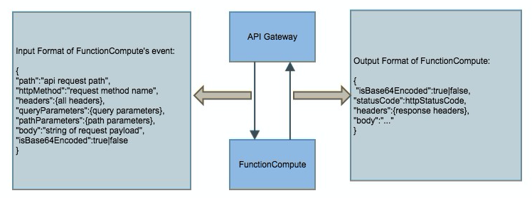

## **创建Web函数并对接API网关**

### 步骤一：创建Web函数

在函数计算3.0控制台中创建一个Web函数，具体操作步骤，请参见[创建Web函数](https://help.aliyun.com/zh/api-gateway/traditional-api-gateway/getting-started/create-an-api-with-function-compute-as-the-backend-service#section-p78-1co-bak)。

默认为创建的Web函数创建一个HTTP触发器，复制内网访问地址供后续使用。

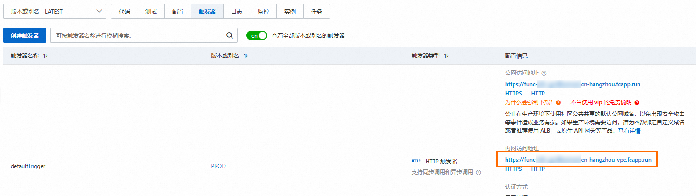

### 步骤二：创建后端服务

在API网关中定义后端服务，并配置后端服务地址来对接函数计算服务。

1. 登录[API网关控制台](https://apigateway.console.aliyun.com/)，选择地域，在左侧导航栏选择**API 管理**>**后端服务**，单击右上角**创建后端服务**，配置如下信息，单击**确定**。
  
  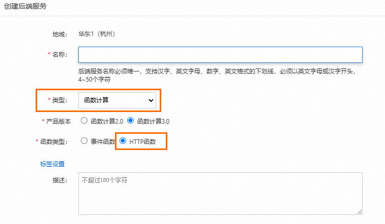
2. 在后端服务页面，单击刚刚创建的后端服务，进入后端服务定义页，选择**线上**页签，在**基本信息**处单击**创建**，填写[步骤一](#520f7dc1fbtbt)创建的Web函数的触发器内网访问地址，然后单击**发布**。
  
  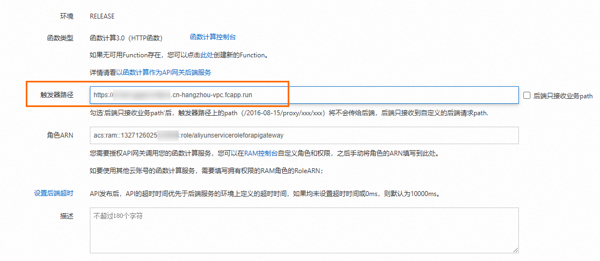

### **步骤三：创建并发布API**

创建API使得外部应用能够按照指定的方式调用内部的Web函数服务，使用API分组组织和管理多个相关的API接口，便于实施统一的安全策略和流量控制措施。

1. 登录[API网关控制台](https://apigateway.console.aliyun.com/)，在左侧导航栏选择**API 管理**>**分组管理**，单击**创建分组**以便对API进行管理。
2. 在**创建分组**弹框页面，选择**实例：**，输入**分组名称**为`FC-Group`，**BasePath**为`/`，单击**确定**。
  
  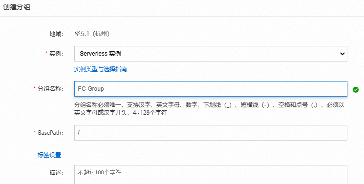
  
  **
  
  **说明**
  
  建议创建与函数相同地域的API分组，如果不是相同地域，API需要通过公网访问您的函数计算服务，这将产生流量费用。若您对数据安全和网络延迟有较高要求，请选择API与函数计算为同一地域。
3. 在分组列表页面，单击目标分组右侧**操作**列的**管理API**，然后单击**创建 API**，配置如下信息，单击**下一步**。
  
  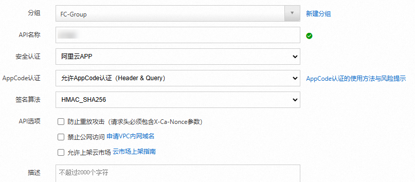
4. 在**定义API请求**配置页签，配置**请求Path**为`/`，其他信息保持默认，单击**下一步**。
5. 在**定义API后端服务**配置页签，如图所示进行配置，单击**下一步**。
  
  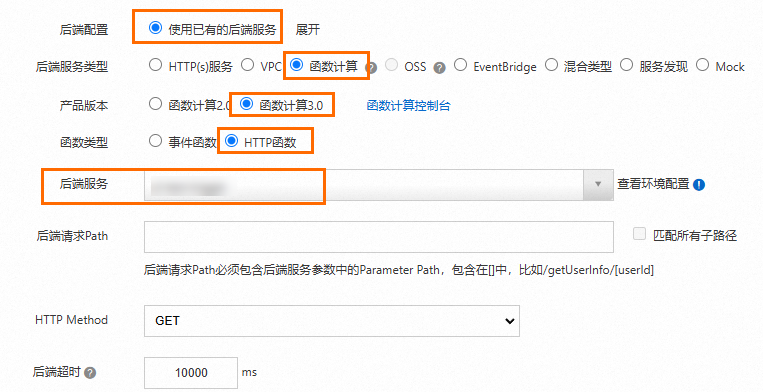
6. 在**定义返回结果**配置页签，保持系统默认配置，单击**创建**，在创建成功之后，在弹出的提示对话框单击**发布**。
7. 在**发布API**对话框，设置以下配置项，然后单击**发布**。
  
  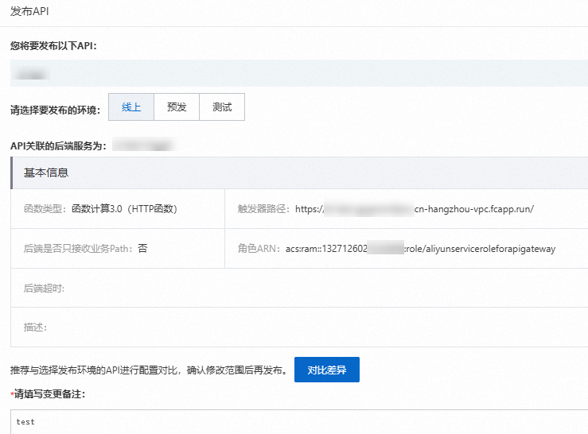

### **步骤四：创建应用和API授权**

应用（APP）是调用API服务时的身份，在[步骤三：创建并发布API](#section-9c8-n27-72d)时，认证方式选择的是**阿里云APP认证**，因此在API发布后，还需要创建APP，并建立APP和API的授权关系，才能够正常访问。

1. 登录[API网关控制台](https://apigateway.console.aliyun.com/)，在左侧导航栏选择**API调用**>**应用管理**。
2. 在**应用与授权**页面，单击右上角**创建APP**。在**创建应用**页面，输入**应用名称：**为`fcApp`，单击**确定**。
3. 单击已创建好的`fcApp`应用名称，进入**应用详情**页面，可以看到阿里云APP下有两种认证方式，`AppKey`和`AppCode`。`AppKey`方式有一组`AppKey`和`AppSecret`，您可以理解为账号密码，调用API的时候需要将`AppKey`作为参数传入，`AppSecret`用于签名计算，网关会校验这对密钥对您进行身份认证。
  
  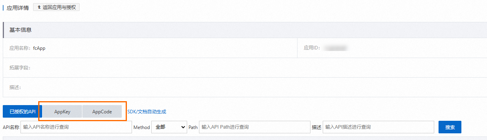
4. 在左侧导航栏选择**API 管理**>**API列表**，在API列表页面，找到已创建好的API，在其**操作**列选择>**授权**。
5. 在授权页面，配置**选择要授权的环境:**为**线上**。搜索之前创建的应用`fcApp`，单击**添加**并**确定**，提示授权成功，即成功授权。
  
  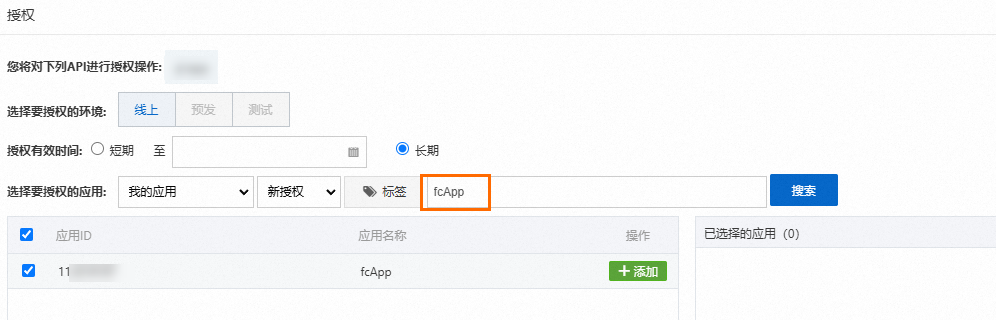

### **步骤五：验证结果**

下面介绍使用APPCode的认证方式在您的业务系统中调用已发布的API，本文以使用Curl命令调用为例。

登录[API网关控制台](https://apigateway.console.aliyun.com/)，在左侧导航栏选择**API调用**>**应用管理**，在**应用与授权**页面找到授权的APP，单击进入获取APPCode。然后按照以下示例调用API。

```
curl -i -X GET "http://fd6f8e2b7bf44ab181a56****-cn-hangzhou.alicloudapi.com" -H "Authorization:APPCODE 7d2b7e4945ce44028ab00***"
```

## 常见问题

**API网关触发函数执行时报502，查看函数日志，函数已经执行成功了，这是怎么回事？**

API网关和函数计算的对接有格式要求，如果函数计算返回给API网关的结果没有按规定的格式返回，那么API网关就认为后端服务不可用。关于API网关和函数计算的对接格式要求，请参见[触发器Event格式](https://help.aliyun.com/zh/functioncompute/fc/user-guide/formats-of-event-for-different-triggers-1#f63be043a3rqg)和[验证结果中函数计算的返回参数格式](#af1a53792fp9n)。

**如何设置返回响应的content-type？**

如图所示，在API设置的时候可以设置返回响应的content-type。详细内容，请参见[通过API网关对接函数计算FC3.0（Web函数）](https://help.aliyun.com/zh/api-gateway/traditional-api-gateway/getting-started/create-an-api-with-function-compute-as-the-backend-service#topic-1867604)。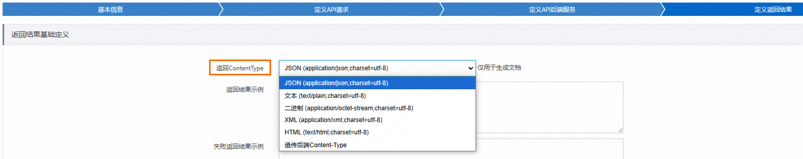

**API网关触发函数计算执行，已经调通的函数，一段时间不调用，再次调用会报503，这是什么原因？**

一段时间不调用后，函数重新调用需要准备执行环境，有冷启动时延，如果在API网关设置的超时时间内没有调用完，API网关会认为后端服务不可用。延长API网关的超时时间即可解决问题。

**为什么函数中接收到API网关传过来的body是经过了Base64编码的？**

API网关对FORM形式的body传输是不进行Base64编码的（使用FORM形式需要在API网关选择入参映射），其他形式body都会进行Base64编码，避免内容传输错误或者丢失。建议您在使用时，先判断event中isBase64是否为true。如果isBase64为true，则body需要在函数中进行解码。关于API网关传给函数计算的event格式，请参见[触发器Event格式](https://help.aliyun.com/zh/functioncompute/fc/user-guide/formats-of-event-for-different-triggers-1#f63be043a3rqg)。
