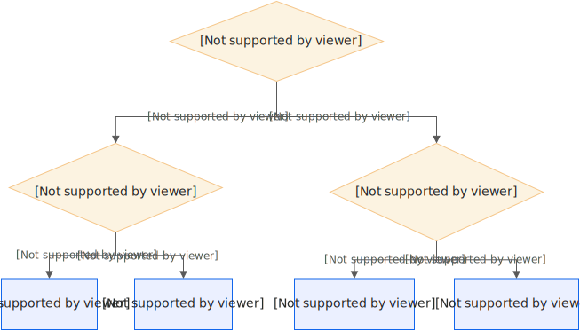

# GPU云产品选型决策指引

传统GPU使用场景存在资源利用率低、使用成本高和弹性能力弱等痛点问题，而Serverless GPU提供了一种更加灵活的方式来利用GPU计算资源，您只需根据自己的实际需求选择合适的GPU型号和计算资源规模即可。本文介绍如何根据您的业务情况选择不同的GPU云产品以及应用场景。

GPU选型指引请参见以下流程图。关于函数计算Serverless GPU的详细应用场景介绍，请参见以下文档：

- [准实时推理场景](https://help.aliyun.com/zh/functioncompute/fc/user-guide/quasi-real-time-inference-scenarios)
- [实时推理场景](https://help.aliyun.com/zh/functioncompute/fc/user-guide/real-time-inference-scenarios-1)
- [离线异步任务场景](https://help.aliyun.com/zh/functioncompute/fc/user-guide/offline-asynchronous-task-scenario)

