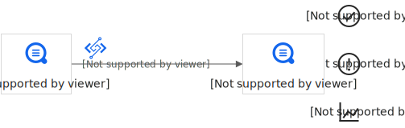
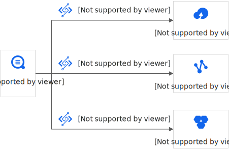
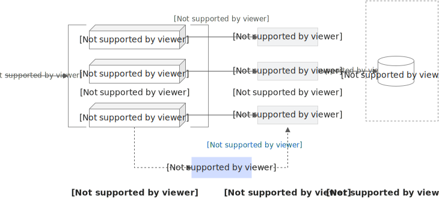

# SLS触发器

通过配置日志服务SLS触发器，您可以实现日志服务SLS与函数计算的集成。SLS触发器能够在新日志产生时自动触发函数执行，从而增量消费日志服务Logstore的数据，并完成自定义加工任务。

## **使用场景**

- 数据清洗、加工场景
  
  通过日志服务，快速完成日志采集、加工、查询、分析。
  
  
- 数据投递场景
  
  为数据的目的端落地提供支撑，构建云上大数据产品间的数据管道。
  
  

## **数据加工函数**

### **函数类型**

- 模板函数
  
  更多信息，请参见[aliyun-log-fc-functions](https://github.com/aliyun/aliyun-log-fc-functions)。
- 自定义函数
  
  函数配置的格式与函数的具体实现有关。更多信息，请参见[ETL函数开发指南](https://help.aliyun.com/zh/sls/create-a-custom-function#undefined)。

### **函数计算触发机制**

日志服务ETL Job对应于函数计算的一个触发器，当创建日志服务ETL Job后，日志服务会根据该ETL Job的配置启动定时器，定时器轮询Logstore中的Shard信息，当发现有新的数据写入时，生成`<shard_id,begin_cursor,end_cursor >`三元组作为函数Event，并触发函数执行。

**

**说明**

当存储系统升级时，即使没有新数据写入，也可能发生Cursor变化，在这种情况下，每个Shard会额外空触发一次。此时，您可以在函数内通过Cursor尝试获取Shard的数据，如果获取不到数据说明是一次空触发，可以在函数内做忽略处理。更多信息，请参见[自定义函数开发指南](https://help.aliyun.com/zh/sls/create-a-custom-function#concept-bbs-14q-zdb)。

日志服务的ETL任务触发机制是时间触发。例如：您设置的ETL Job触发间隔为60秒，Logstore的Shard0一直有数据写入，那么Shard每60秒就会触发一次函数执行（如果Shard没有新的数据写入则不会触发函数执行），函数执行的输入为最近60秒的Cursor区间。在函数内，可以根据Cursor读取Shard0数据进行下一步处理。



## **使用限制**

单个日志项目（Project）关联的SLS触发器数量最大不得超过该Project下已有的Logstore数量的5倍。

**

**说明**

建议每个Logstore配置的SLS触发器数量不超过5个，否则可能会影响数据投递到函数计算的效率。

## 示例场景

您可以配置一个SLS触发器，该触发器将定时获取更新的数据并触发函数执行，增量消费日志服务Logstore中的数据。在函数里完成自定义加工任务（例如数据清洗和加工）以及将数据投递给第三方服务。本示例中只演示如何获取日志数据并打印。

**

**说明**

用于数据加工的函数可以是日志服务提供的模板，也可以是您的自定义函数。

## 前提条件

- 函数计算
  
  - [创建事件函数](https://help.aliyun.com/zh/functioncompute/fc/user-guide/creating-an-event-function)
- 日志服务SLS
  
  - [创建日志项目和日志库](https://help.aliyun.com/zh/sls/resource-management-overview#task-nn1-y2x-ndb)
    
    您需要创建一个Project和两个Logstore。一个Logstore用于存储采集到的日志（函数计算基于增量日志触发，必须确保可以持续采集到日志），另一个Logstore用于存储SLS触发器产生的日志。

**

**重要**

日志项目（Project）所在地域和函数计算服务所在地域必须一致。

## **入口参数说明**

- ### `**event**`
  
  SLS触发器触发后将事件数据传递给运行时，运行时将事件转换为一个JSON对象，并将该对象传递给函数的入口参数`event`。其格式如下所示：
  
  ```
  { "parameter": {}, "source": { "endpoint": "http://cn-hangzhou-intranet.log.aliyuncs.com", "projectName": "fc-test-project", "logstoreName": "fc-test-logstore", "shardId": 0, "beginCursor": "MTUyOTQ4MDIwOTY1NTk3ODQ2Mw==", "endCursor": "MTUyOTQ4MDIwOTY1NTk3ODQ2NA==" }, "jobName": "1f7043ced683de1a4e3d8d70b5a412843d81****", "taskId": "c2691505-38da-4d1b-998a-f1d4bb8c****", "cursorTime": 1529486425 }
  ```
  
  参数说明如下所示：
  
  | **参数** | **说明** |
  | --- | --- |
  | parameter | 您配置触发器时填写的调用参数的值。 |
  | source | 设置函数读取的日志块信息。<br>- endpoint：日志服务Project所属的阿里云地域。<br>- projectName：日志服务Project名称。<br>- logstoreName：函数计算要消费的Logstore名称，当前触发器会定时从该日志库中订阅数据到函数服务进行自定义加工。<br>- shardId：Logstore中一个确定的Shard。<br>- beginCursor：开始消费数据的位置。<br>- endCursor：停止消费数据的位置。<br>**<br>**说明**<br>在函数调试的时候，您可以调用[通过时间查询Cursor](https://help.aliyun.com/zh/sls/developer-reference/api-sls-2020-12-30-getcursor)接口获取beginCursor和endCursor，并按上述示例构建一个函数Event用于测试。 |
  | jobName | 日志服务ETL Job名字，函数配置的SLS触发器对应一个日志服务的ETL Job。<br>此参数由函数计算自动生成，用户无需配置。 |
  | taskId | 对于ETL Job而言，taskId是一个确定性的函数调用标识。<br>此参数由函数计算自动生成，用户无需配置。 |
  | cursorTime | 最后一条日志到达日志服务端的Unix时间戳，单位：秒。 |
- ### `**context**`
  
  当函数计算运行您的函数时，会将上下文对象传递函数的入口参数`context`。该对象包含有关调用、服务、函数和执行环境等信息。
  
  本文通过`context.credentials`获取密钥信息，如需了解更多字段信息，请参见[上下文](https://help.aliyun.com/zh/functioncompute/fc/user-guide/context-1)。

## 步骤一：创建SLS触发器

1. 登录[函数计算控制台](https://fcnext.console.aliyun.com)，在左侧导航栏，选择**函数管理**>**函数**。
2. 在顶部菜单栏，选择地域，然后在**函数**页面，单击目标函数。
3. 在函数详情页面，选择**触发器**页签，单击**创建触发器**，在创建触发器面板，**触发器类型**选择**日志服务 SLS**，设置其他配置项，然后单击**确定**。
  
  | **配置项** | **操作** | **示例** |
  | --- | --- | --- |
  | **名称** | 填写自定义的触发器名称。如果不填，函数计算将自动生成触发器名称。 | log_trigger |
  | **版本或别名** | 默认值为**LATEST**，如果您需要创建其他版本或别名的触发器，需先在函数详情页的右上角切换到该版本或别名。关于版本和别名的简介，请参见[版本管理](https://help.aliyun.com/zh/functioncompute/fc/user-guide/manage-versions)和[别名管理](https://help.aliyun.com/zh/functioncompute/fc/user-guide/manage-aliases)。 | LATEST |
  | **日志项目** | 选择需要消费的日志服务Project。 | aliyun-fc-cn-hangzhou-2238f0df-a742-524f-9f90-976ba457**** |
  | **日志库** | 选择需要消费的Logstore。当前触发器会定时从该日志库中订阅数据到函数服务进行自定义加工。 | function-log |
  | **触发间隔** | 填写日志服务触发函数运行的时间间隔。<br>取值范围：[3,600]，单位：秒。默认值：60。 | 60 |
  | **重试次数** | 填写单次触发允许的最大重试次数。<br>取值范围：[0,100]，默认值：3。<br>**<br>**说明**<br>- 执行成功的情况为status=200并且header中参数`X-Fc-Error-Type`的值不是`UnhandledInvocationError`和`HandledInvocationError`的错误。其他情况表示执行失败，会触发重试。关于参数`X-Fc-Error-Type`请参见[返回数据](https://help.aliyun.com/zh/functioncompute/fc-2-0/developer-reference/api-invokefunction#resultMapping)。<br>- 如果函数执行失败，会一直重试当前请求，直到函数执行成功。首先会按照配置的重试次数进行重试，超过最大重试次数仍然无法成功的，会增加时间间隔进入退避重试。 | 3 |
  | **触发器日志** | 选择已创建的日志库，日志服务触发函数执行过程的日志会记录到该日志库中。 | function-log2 |
  | **调用参数** | 如果您想传入自定义参数，可以在此处配置。该参数将作为event的parameter参数传入函数。该参数取值必须是JSON格式的字符串。<br>默认值为空。 | 无 |
  | **角色名称** | 选择**AliyunLogETLRole**。<br>**<br>**说明**<br>如果您第一次创建该类型的触发器，则需要在单击**确定**后，在弹出的对话框中选择**立即授权**。 | AliyunLogETLRole |
  
  创建完成后，在**触发器名称**列表中显示已创建的触发器。如需对创建的触发器进行修改或删除，具体操作，请参见[触发器管理](https://help.aliyun.com/zh/functioncompute/fc/user-guide/manage-triggers)。

## 步骤二：**配置权限**

1. 在**函数详情**页面，选择**配置**页签，在**高级配置**区域，单击**编辑**，然后在**高级配置**面板，选择**函数角色**。
  
  - 您可以选择使用默认角色**AliyunFCServerlessDevsRole**，此角色默认具有日志服务只读权限。
  - 您也可以自定义一个RAM角色，自定义RAM角色必须满足以下两点要求：
    
    1. 创建RAM角色时，**信任主体**需选择**{key, select,
      RAM {云账号}
      Service {云服务}
      Federated {身份提供商}
      Account {云账号}
      CurrentAccount {当前云账号}
      OtherAccount {其他云账号}
      AllAccounts {所有云账号}
      RAMType {身份类型}
      UserName {用户名称}
      RoleName {角色名称}
      FederatedType {身份提供商类型}
      other { {key} }
      }**，且**受信服务**选择**函数计算**。具体操作，请参见[创建可信实体为阿里云服务的RAM角色](https://help.aliyun.com/zh/ram/user-guide/create-a-ram-role-for-a-trusted-alibaba-cloud-service)。
    2. 请根据函数中具体需求为RAM角色授予必要日志服务权限。更多信息，请参见[RAM自定义授权示例](https://help.aliyun.com/zh/sls/use-custom-policies-to-grant-permissions-to-a-ram-user)。
2. 完成后单击**部署**。

## 步骤三：部署函数并查看打印的日志

1. 在函数详情页面的**代码**页签，在代码编辑器中编写代码，然后单击**部署代码**。
  
  本示例部署一个Python函数，实现以下功能。
  
  - 从`event`中获取`endpoint`、`projectName`、`logstoreName`和`beginCursor`等SLS事件触发相关信息，
  - 从`context`中获取授权信息`accessKeyId`、`accessKey`和`securityToken`。
  - 根据以上获取的信息，初始化SLS客户端。
  - 从源Logstore获取指定游标（Cursor）位置的日志数据。
  
  **
  
  **说明**
  
  以下示例代码可以作为提取大部分逻辑日志的模板。
  
  ```
  """ 本代码样例主要实现以下功能: * 从 event 中解析出 SLS 事件触发相关信息 * 根据以上获取的信息，初始化 SLS 客户端 * 从源 log store 获取实时日志数据 This sample code is mainly doing the following things: * Get SLS processing related information from event * Initiate SLS client * Pull logs from source log store """ #!/usr/bin/env python # -*- coding: utf-8 -*- import logging import json import os from aliyun.log import LogClient logger = logging.getLogger() def handler(event, context): # 可以通过 context.credentials 获取密钥信息 # Access keys can be fetched through context.credentials print("The content in context entity is: ", context) creds = context.credentials access_key_id = creds.access_key_id access_key_secret = creds.access_key_secret security_token = creds.security_token # 解析 event 参数至 object 格式 # parse event in object event_obj = json.loads(event.decode()) print("The content in event entity is: ", event_obj) # 从 event.source 中获取日志项目名称、日志仓库名称、日志服务访问 endpoint、日志起始游标、日志终点游标以及分区 id # Get the name of log project, the name of log store, the endpoint of sls, begin cursor, end cursor and shardId from event.source source = event_obj['source'] log_project = source['projectName'] log_store = source['logstoreName'] endpoint = source['endpoint'] begin_cursor = source['beginCursor'] end_cursor = source['endCursor'] shard_id = source['shardId'] # 初始化 sls 客户端 # Initialize client of sls client = LogClient(endpoint=endpoint, accessKeyId=access_key_id, accessKey=access_key_secret, securityToken=security_token) # 基于日志的游标从源日志库中读取日志，本示例中的游标范围包含了触发本次执行的所有日志内容 # Read data from source logstore within cursor: [begin_cursor, end_cursor) in the example, which contains all the logs trigger the invocation while True: response = client.pull_logs(project_name=log_project, logstore_name=log_store, shard_id=shard_id, cursor=begin_cursor, count=100, end_cursor=end_cursor, compress=False) log_group_cnt = response.get_loggroup_count() if log_group_cnt == 0: break logger.info("get %d log group from %s" % (log_group_cnt, log_store)) logger.info(response.get_loggroup_list()) begin_cursor = response.get_next_cursor() return 'success'
  ```
2. 在**函数详情**页面，选择**日志**>**函数日志**，查看函数运行时，获取最新数据。如果**当前函数尚未启用日志功能****，**请单击**一键启用****。**

至此，您已完成SLS触发器的配置。如果您需在控制台调试代码，请继续完成下面的步骤。

## **（可选）步骤四：使用模拟事件测试函数**

1. 在函数详情页面的**代码**页签，单击**测试函数**右侧的图标，从下拉列表中，选择**配置测试参数**。
2. 在**配置测试参数**面板，选择**创建新测试事件**或**编辑已有测试事件**，填写事件名称和事件内容，然后单击确定。如果是创建新测试事件，建议事件模板选择**日志服务**。测试数据的具体配置请参见[event](#title-fts-u0t-tu0)。
3. 虚拟事件配置完成后，单击**测试函数**。
  
  执行完成后，您可以在**函数代码**页签的上方查看执行结果。

## 常见问题

- ### **在有新日志产生时，SLS触发器未触发函数执行，如何解决？**
  
  您可以从以下两个方面排查。
  
  - 确认函数计算触发器任务配置的Logstore是否有数据增量修改，当Shard数据有变化时会触发函数执行。
  - 查看触发器日志、函数运行日志查看是否有异常。
- ### **为什么SLS触发器触发函数执行的频次有时高于预期？**
  
  每个Shard是单独触发的，您看到的可能是一个Logstore整体触发次数很多，但每个Shard实时触发时间是符合间隔的。
  
  单个Shard的触发间隔和每次处理的数据范围相同（时间区间）。触发间隔在函数执行时分如下两种情况，假设触发间隔为60秒。
  
  - 触发没有延迟：按照设定周期触发，每60秒触发一次，处理的数据范围为`[now -60s, now)`。
    
    **
    
    **说明**
    
    函数触发是分Shard独立进行的， 假设Logstore有10个Shard，在实时处理数据时（触发无延迟），每60秒对应10次函数触发执行。
  - 触发发生延迟（当前处理到的日志服务Shard位置落后于最新写入数据超过10秒）：触发器会进行追赶，可能缩短到2秒触发一次，每次处理的数据范围仍是60秒窗口。
- ### **denied by sts or ram, action: log:GetCursorOrData, resource: ******
  
  如果函数日志中出现以上错误，可能是因为函数未配置权限，或权限策略设置不正确引起。请参见[步骤二：配置权限](#title-nuc-x2q-132)。
