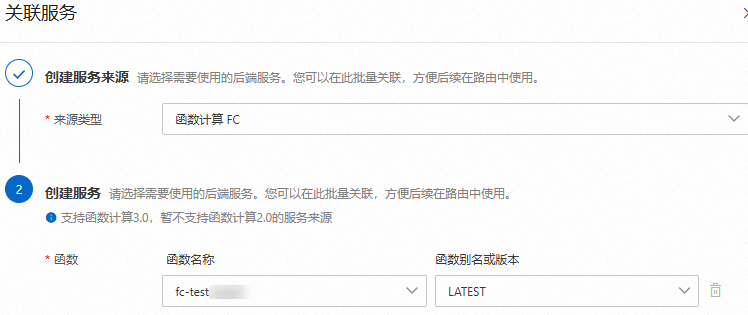
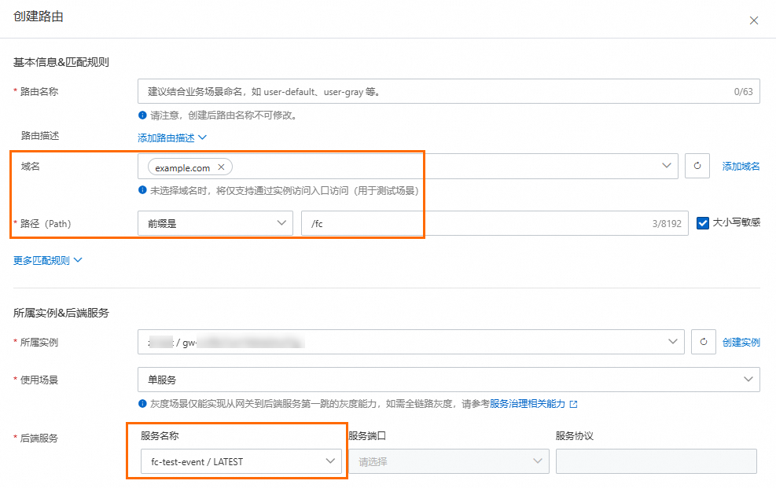

# 云原生API网关触发器

函数计算支持云原生API网关作为事件源，即支持将函数计算设置为API的后端服务。当有请求到达后端服务设置为函数计算的云原生API网关时，会触发函数执行，同时函数计算会将执行结果返回给API网关。

## 背景信息

云原生API网关触发器与[API网关触发器](https://help.aliyun.com/zh/functioncompute/fc/user-guide/configure-an-api-gateway-trigger)类似，函数计算与云原生API网关对接后，可以通过API形式安全地对外开放函数，并解决认证和流量控制等问题。不同的是，云原生API网关对接函数计算时，不再区分事件函数和Web函数，统一基于路由规则进行匹配，并转发请求给函数计算。

**

**说明**

云原生API网关仅支持对接函数计算3.0。

## **创建函数并对接云原生API网关**

### **步骤一：创建函数**

登录[函数计算控制台](https://fcnext.console.aliyun.com/)创建函数，具体操作步骤请参见[创建函数](https://help.aliyun.com/zh/functioncompute/fc/user-guide/function-instance-1/)。

### **步骤二：创建后端服务**

1. [创建网关实例](https://help.aliyun.com/zh/api-gateway/cloud-native-api-gateway/user-guide/create-gateway)。
2. [创建HTTP API](https://help.aliyun.com/zh/api-gateway/cloud-native-api-gateway/user-guide/create-http-api)。
3. [创建服务](https://help.aliyun.com/zh/api-gateway/cloud-native-api-gateway/user-guide/create-service)。
  
  
4. [创建路由](https://help.aliyun.com/zh/api-gateway/cloud-native-api-gateway/user-guide/create-route#DAS)。
  
  重点配置项参考截图，其余配置项保持默认即可。
  
  
  
  | **配置项** | **说明** |
  | --- | --- |
  | **域名** | 支持通过域名管理服务，本文中`example.com`仅为示例，您可以添加并选择自己的域名用于通过域名访问您的服务。 |
  | **路径** | 设置路由路径，不同的路径用于触发不同的函数执行。 |
  | **后端服务** | 选择[步骤三](#b4a5dde374ka2)创建的函数计算3.0函数后端服务。 |
5. [发布路由规则](https://help.aliyun.com/zh/api-gateway/cloud-native-api-gateway/user-guide/manage-routing#49a832fb876vn)。

### **步骤三：结果验证**

1. 获取服务绑定的环境的二级域名。
2. 调用已发布的API进行测试。本文以使用Curl命令调用为例。
  
  ```
  curl -i -X GET env-ct6ovnem1hknd****-cn-hangzhou.alicloudapi.com/fc
  ```
  
  返回示例如下所示。
  
  ```
  HTTP/1.1 200 OK access-control-expose-headers: Date,x-fc-request-id content-disposition: attachment content-length: 11 content-type: application/json x-fc-request-id: 1-674eae6c-15b2172f-7db950e70148 date: Tue, 03 Dec 2024 07:08:28 GMT req-cost-time: 29 req-arrive-time: 1733209708197 resp-start-time: 1733209708226 x-envoy-upstream-service-time: 28 server: istio-envoy hello world
  ```
