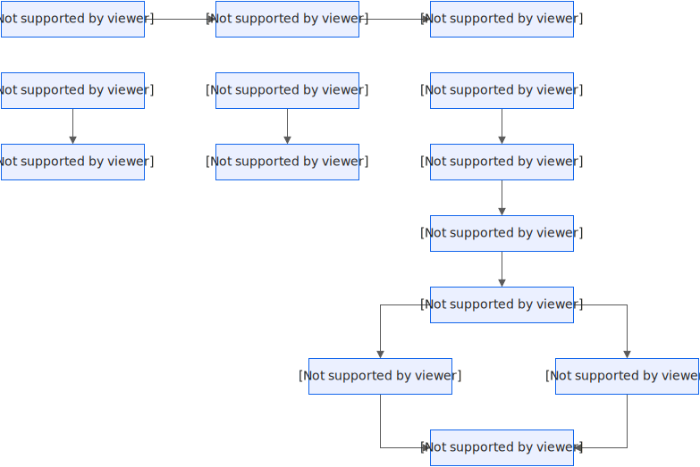

# 使用版本和别名实现灰度发布

您可以为函数发布一个或多个版本，当您发布版本时，会自动生成唯一的版本号，并将当前代码和配置固化为一个不可变更的基准版本。您还可以为函数的版本创建别名，指向该版本。结合函数的版本和别名，您可以轻松实现发布、回滚以及灰度发布等功能。

## 灰度发布流程



## 前提条件

- [创建函数](https://help.aliyun.com/zh/functioncompute/fc/user-guide/function-instance-1/)

## 步骤一：准备函数并测试

当您初次创建一个函数时，该函数的版本号为LATEST。您可以调试LATEST版本下的函数直至版本稳定运行。您可以通过控制台执行LATEST版本下的函数。

1. 登录[函数计算控制台](https://fcnext.console.aliyun.com)，在左侧导航栏，选择**函数管理**>**函数列表**。
2. 在顶部菜单栏，选择地域，然后在**函数列表**页面，单击目标函数。
3. 在函数详情页面，单击**代码**页签。
4. 在代码编辑器中，修改代码为查看函数版本的代码，单击**部署代码**，然后单击**测试函数**。
  
  查看函数版本的代码示例如下。
  
  Node.js
  
  ```
  module.exports.handler = function(eventBuf, context, callback) { var qualifier = context['service']['qualifier'] var versionId = context['service']['versionId'] console.log('Qualifier from context:', qualifier); console.log('VersionId from context: ', versionId); callback(null, qualifier); };
  ```
  
  Python
  
  ```
  # -*- coding: utf-8 -*- def handler(event, context): qualifier = context.service.qualifier versionId = context.service.version_id print('Qualifier from context:' + qualifier) print('VersionId from context:' + versionId) return 'hello world'
  ```
  
  PHP
  
  ```
  <?php function handler($event, $context) { $qualifier = $context["service"]["qualifier"]; $versionId = $context["service"]["versionId"]; print($qualifier); print($versionId); return "hello world"; }
  ```
  
  C#
  
  ```
  using System; using System.IO; using Aliyun.Serverless.Core; using Microsoft.Extensions.Logging; namespace Desktop { class Program { static void Main(string[] args) { Console.WriteLine("Hello World!"); } } class App { public string Handler(Stream input, IFcContext context) { ILogger logger = context.Logger; var qualifier = context.ServiceMeta.Qualifier; var versionId = context.ServiceMeta.VersionId; logger.LogInformation("Qualifier from context: {0}", qualifier); logger.LogInformation("versionId from context: {0}", versionId); return "hello word"; } } }
  ```
  
  执行完成后，可以查看日志输出。从日志输出中，可以看到表示版本信息的字段qualifier的值为LATEST，即本次执行的函数为LATEST版本下的函数。

## 步骤二：发布版本并测试

当LATEST版本的函数稳定时，就可以发布该版本的函数，使用稳定的版本服务线上的请求。具体操作，请参见[发布版本](https://help.aliyun.com/zh/functioncompute/fc/user-guide/manage-versions#section-jdg-qkr-9xv)。

新版本发布后，您可以通过控制台执行新版本下的函数。

1. 登录[函数计算控制台](https://fcnext.console.aliyun.com)，在左侧导航栏，选择**函数管理**>**函数列表**。
2. 在顶部菜单栏，选择地域，然后在**函数列表**页面，单击目标函数。
3. 在函数详情页，选择**版本管理**页签，单击目标版本。
4. 在目标版本下，单击**代码**页签，然后单击**测试函数**。
  
  执行完成后，可以查看执行日志。从日志输出中，可以看到函数执行时的版本信息qualifier为1，解析出的versionId为1，即本次执行的函数为版本1下的函数。

## 步骤三：使用别名切换流量

新版本上线后，您可以创建一个别名，设置别名指向该版本。当该版本更新时，可将别名指向的版本更改为更新的版本。调用方无需关心函数的具体版本，只需要使用正确的别名即可。关于创建别名的具体步骤，请参见[创建别名](https://help.aliyun.com/zh/functioncompute/fc/user-guide/manage-aliases#section-7aw-oca-2pz)。

别名创建完成后，您可以通过控制台验证是否执行了正确版本的函数。

本文以别名**alias1**指向版本**1**为例。

1. 登录[函数计算控制台](https://fcnext.console.aliyun.com)，在左侧导航栏，选择**函数管理**>**函数列表**。
2. 在顶部菜单栏，选择地域，然后在**函数列表**页面，单击目标函数。
3. 在函数详情页，选择**别名管理**页签，单击目标别名。
4. 在目标别名下，单击**测试**页签，然后单击**测试函数**。
  
  执行完成后，可以查看日志输出。从日志输出中，可以看到函数执行时的版本信息qualifier为**alias1**，解析出的versionId为**1**，即本次执行的函数为别名**alias1**下的函数，该别名指向版本**1**。

新版本开发完成后，需要使用灰度版本帮助新版本稳定发布。

**

**说明**

发布新版本时必须保证相对上一次版本发布，函数的配置或代码发生了变更，否则无法发布新版本。

1. 发布新版本**2**。具体操作，请参见[发布版本](https://help.aliyun.com/zh/functioncompute/fc/user-guide/manage-versions#section-jdg-qkr-9xv)。
  
  发布完成后，可在版本列表中查看新发布的版本。
2. 在函数详情页面，选择**别名**页签，单击目标别名右侧**操作**列的**编辑**。
3. 在编辑函数的别名面板，将新版本**2**设置为**灰度版本**，设置**灰度版本权重**，然后单击**确定**。
  
  待灰度版本运行稳定后，可以将线上流量全部切换到新版本**2**。

## 常见问题

### 如何确认被调用的函数的版本？

使用灰度发布功能时，函数计算按照您指定的权重来分配流量。您可以通过以下方式来确定被调用的函数的版本：

- 通过context入参确定
  
  每次函数调用，context入参的参数中会包括qualifier和versionId两个字段。
  
  - qualifier：调用函数时传入的版本信息，可以是版本号，也可以是别名。
  - versionId：函数执行时根据qualifier解析出的具体版本号。
- 通过同步函数调用响应确定
  
  同步函数调用的响应包含x-fc-invocation-function-versionHeader，可以指示已调用的函数版本。

## **相关文档**

关于函数版本的发布和别名的配置细节，请参见[版本管理](https://help.aliyun.com/zh/functioncompute/fc/user-guide/manage-versions)和[别名管理](https://help.aliyun.com/zh/functioncompute/fc/user-guide/manage-aliases)。
