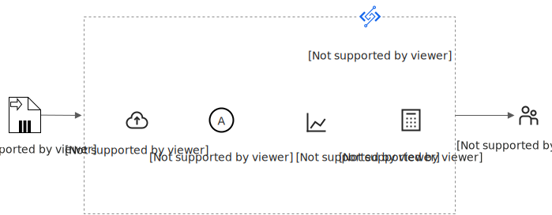
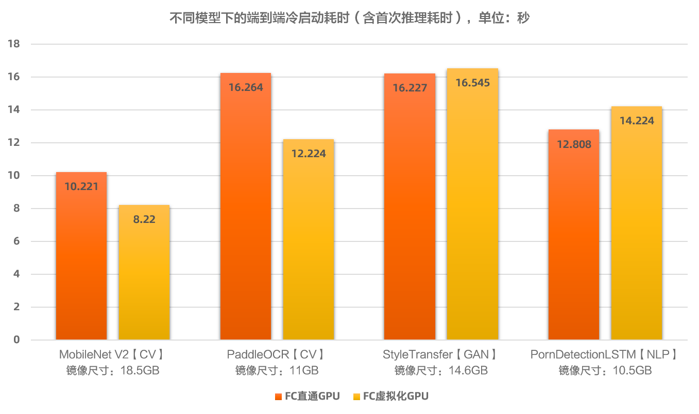
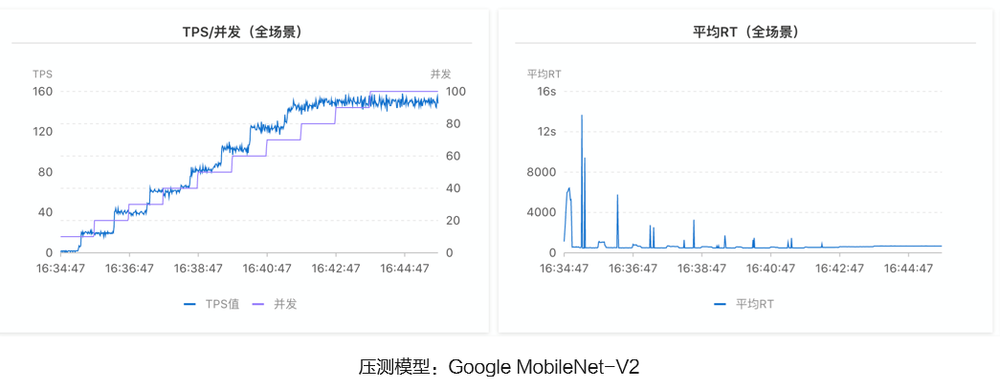

# 准实时推理场景

本文介绍什么是准实时推理场景，以及如何使用GPU按量实例，以及如何基于GPU按量实例构建使用成本较低的准实时推理服务。

## 场景介绍

在准实时推理应用场景中，工作负载具有以下一个或多个特征。

- **调用稀疏**
  
  日均调用几次到几万次，日均GPU实际使用时长远低于8~12小时，GPU存在大量闲置。
- **单次处理耗时长**
  
  准实时推理业务的处理耗时一般在秒级~分钟级。例如，典型的CV任务处于秒级别，典型的视频处理和AIGC场景均处于分钟级别。
- **容忍冷启动**
  
  业务可以容忍GPU冷启动耗时，或者业务流量波形对应的冷启动概率低。

函数计算为准实时推理工作负载提供以下功能优势。

- **原生Serverless使用方式**
  
  函数计算平台默认提供的按量GPU实例使用方式，会自动管理GPU计算资源。当业务流量变化时自动进行资源伸缩，具备业务波谷时的缩0能力、具备业务波峰时的秒级GPU弹性能力。您只需要关注业务迭代本身，当业务部署到函数计算平台后，基础设施将完全由函数计算平台托管。
- **规格最优**
  
  函数计算平台提供的GPU实例规格，允许您根据工作负载选择不同的卡型，独立配置CPU/GPU/MEM/DISK，最小GPU规格为1 GB显存/算力，为您提供最贴合业务的实例规格。
- **成本最优**
  
  函数计算平台提供的按量付费能力，以及秒级别的计费能力，帮助业务在GPU规格最优后，达到成本最优。对于低GPU资源利用率的工作负载，降本幅度可达70%以上。
- **突发流量支撑**
  
  函数计算平台提供充足的GPU资源供给，当业务遭遇突发流量时，函数计算将以秒级弹性供给海量GPU算力资源，避免因GPU算力供给不足、GPU算力弹性滞后导致的业务受损。

## 功能原理

当GPU函数部署完成后，函数计算默认通过按量GPU实例为您服务（与之区别的是预留GPU实例，具体信息，请参见[实例类型和规格](https://help.aliyun.com/zh/functioncompute/fc/product-overview/instance-types-and-specifications#section-chu-ycm-gaa)），提供准实时推理应用场景所需的基础设施执行环境。

您可以发送推理请求至GPU函数的触发器（例如，HTTP触发器收到HTTP请求后触发函数执行），GPU函数将运行在GPU容器中，完成模型推理，并将推理结果放在响应中返回。函数计算将自动编排、弹性伸缩GPU计算资源，以服务您的业务流量，您只需为处理请求时使用的GPU资源付费。

## **容器支持**

函数计算GPU场景下，当前仅支持以自定义镜像进行交付。关于自定义镜像的使用详情，请参见[自定义镜像简介](https://help.aliyun.com/zh/functioncompute/fc-3-0/user-guide/overview-of-customcontainer)。

自定义镜像函数要求在镜像内携带Web Server，以满足执行不同代码路径、通过事件或HTTP触发函数的需求。适用于AI学习推理等多路径请求执行场景。

## GPU实例规格

您可以在推理应用场景下，根据业务需要，特别是算法模型所需要的CPU算力、GPU算力与显存、内存、磁盘，选择不同的GPU卡型与GPU实例规格。关于GPU实例规格的详细信息，请参见[实例规格](https://help.aliyun.com/zh/functioncompute/fc/product-overview/instance-types-and-specifications#section-mfv-5fb-ehw)。

## 部署方式

您可以使用多种方式将您的模型部署在函数计算。

- 通过函数计算控制台部署。具体操作，请参见[在控制台创建函数](https://help.aliyun.com/zh/functioncompute/fc/create-a-custom-container-function-in-a-container-runtime#section-bra-sgh-76g)。
- 通过调用SDK部署。更多信息，请参见[API概览](https://help.aliyun.com/zh/functioncompute/fc/developer-reference/api-fc-2023-03-30-overview)。
- 通过Serverless devs工具部署。更多信息，请参见[Serverless Devs常用命令](https://help.aliyun.com/zh/functioncompute/fc/developer-reference/serverless-devs-commands-1)。

更多部署示例，请参见[start-fc-gpu](https://github.com/devsapp/start-fc-gpu)。

## 并发调用

您的GPU函数在某个地域级别，例如华东1（杭州），支持的最大并发调用数量，取决于GPU函数实例的并发度、以及GPU物理卡的使用上限。

### GPU函数实例并发度

默认情况下，GPU函数实例的并发度为1，即一个GPU函数实例在同一时刻仅能处理一个请求。您可以通过控制台、ServerlessDevs工具调整GPU函数实例的并发度配置。具体操作，请参见[设置实例并发度](https://help.aliyun.com/zh/functioncompute/user-guide/configure-instance-concurrency)。建议根据不同应用场景的需要，选择不同的并发度配置。

- 计算密集型的推理应用：建议GPU函数实例的并发度保持默认值1。
- 支持请求批量聚合的推理应用：建议GPU函数实例的并发度根据能同时聚合的推理请求数量进行设置，以便批量推理。

### GPU物理卡的使用上限

默认情况下，单个阿里云账号地域级别的GPU物理卡上限为30卡，实际数值以[配额中心](https://quotas.console.aliyun.com/products/fc/quotas)为准，如您有更高的物理卡需求，请前往[配额中心](https://quotas.console.aliyun.com/products/fc/quotas)申请。

## 冷启动

当您的GPU函数长时间无业务流量后，所有按量GPU实例将被平台释放。之后的第1个请求会触发冷启动，函数计算平台需要更多的耗时来拉起函数实例服务该请求，这个过程通常包括准备GPU计算资源、拉取容器镜像、启动GPU容器、加载与初始化算法模型、启动推理应用等。更多信息，请参见[函数计算冷启动优化最佳实践](https://help.aliyun.com/zh/functioncompute/fc/use-cases/best-practice-for-reducing-cold-start-latencies)。

AI应用的冷启动依赖您的镜像大小、模型尺寸和初始化耗时。您可以通过监控指标观察冷启动耗时，以及评估冷启动概率。

### 冷启动性能

在函数计算GPU平台上，常见模型的端到端冷启动性能如下。

端到端冷启动耗时（包含冷启动+首次调用处理耗时）：10~30s

### 冷启动概率

函数计算的Serverless GPU中，冷启动耗时为秒级，而k8s平台通常为分钟级。函数计算的冷启动概率随着并发度的上升，成比例下降，冷启动对业务的影响也随之变小。下图为对MobilenetV2模型的压测结果示例。

## 成本评估

**

**重要**

以下计费单价和示例仅供参考，实际费用以商务提供的价格为准。

您在使用函数计算前日均GPU利用率越低，切换至函数计算后GPU降本幅度越大。

计费示例如下。本文以购买T4加速类型的GPU云服务器为例进行对比说明。与函数计算同等GPU规格的GPU云服务器单价约为14元/小时。更多计费详情，请参见[GPU云服务器计费](https://help.aliyun.com/zh/egs/billing-2#concept-2426781)。

### 示例一

假设您的GPU函数一天调用量为3600次，每次为1秒钟，使用4 GB显存规格的GPU实例（模型大小为3 GB左右）。

- 您的日均资源利用率（仅时间维度，不包含显存维度）=3600秒/86400秒=0.041，即4.1%
- 您的云服务器ECS的日均GPU资源费用=14元/小时×24小时=336元
- 您的函数计算的日均GPU资源费用=3600秒×4 GB×0.00011元/GB*秒=1.584元

使用函数计算的GPU后，降本幅度达99%以上。

### 示例二

假设您的GPU函数一天调用量为50000次，每次为1秒钟，使用4 GB显存规格的GPU实例（模型大小为3 GB左右）。

- 您的日均资源利用率（仅时间维度，不包含显存维度）=50000秒/86400秒=0.57，即57%
- 您的云服务器ECS的日均GPU资源费用=14元/小时×24小时=336元
- 您的函数计算的日均GPU资源费用=50000秒×4 GB×0.00011元/GB*秒=22元

使用函数计算的GPU后，降本幅度达90%以上。
