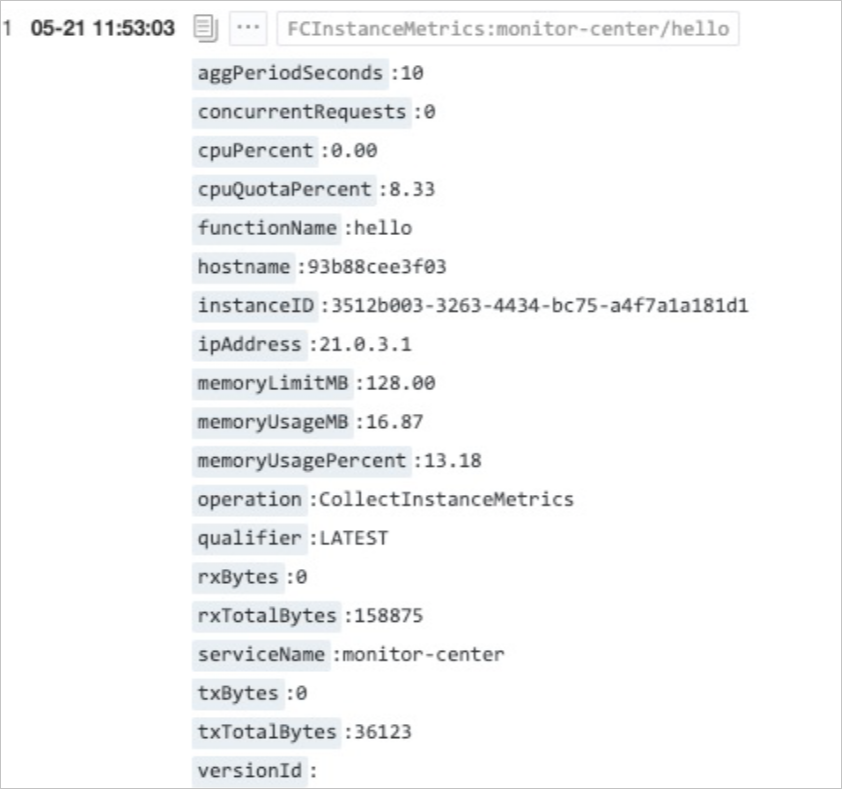

# 实例级别指标

函数计算提供实例级别指标，通过实例级别指标您可以查看vCPU使用情况、内存使用情况、实例网络情况和实例内请求数等核心指标信息。本文介绍实例级别指标的背景信息、定义、指标信息和配置方式。

## 背景信息

函数计算是事件驱动的全托管计算服务，您无需维护计算集群。但在业务代码开发到正常运行的过程中，您可能会存在以下疑问。

- 在CPU密集型场景中，如何查看vCPU的具体使用量。
- 函数执行失败时，如何确认函数执行失败原因，例如代码异常或函数实例性能异常等。

函数计算推出实例级别指标功能，可以帮助您解决以上遇到的问题以及了解函数计算各个实例的健康状态。

## 什么是实例级别指标

实例级别指标是函数实例维度的性能指标，对函数实例进行实时监控和性能数据采集，并进行可视化展示，为您提供函数实例端到端的监控排查路径。

实例级别指标可通过以下维度进行呈现。

- 函数维度或函数Qualifier维度：指以函数维度进行的聚合，例如，函数A同时有两个实例在执行，那么函数维度的vCPU指标就是这两个实例中的vCPU使用最大值。
- 实例维度：具体的某个特定函数实例的指标。

**

**说明**

- Qualifier指调用函数时传入的版本信息。取值既可以是版本号，也可以是别名。
- 实例由函数计算系统动态创建与回收，每个实例只会存在一小段时间，且您无法对实例进行操作。

## 指标信息

开启实例级别指标功能后，系统会收集函数执行的指标信息。您可以通过以下方式查看实例级别指标信息。

- 监控中心：函数计算的监控中心内置了实例级别可视化大盘。您可以在对应的函数详情页，选择**监控**页签，查看可视化大盘中的信息。
  
  - 函数维度实例的指标信息。
  - 实例的指标信息。
- 日志服务：函数计算会将实例指标信息导入到您的日志服务SLS内，您可以通过SLS分析能力创建自定义的可视化大盘。具体信息，请参见[查询与分析快速指引](https://help.aliyun.com/zh/sls/quick-guide-to-query-and-analysis#task-tqc-ddm-gfb)。
  
  每个实例的实例级别指标信息每隔一段时间会记录一次信息，并将该信息记录在日志内。具体形式如下。

实例级别指标会采集以下指标信息。

| **名称** | **描述** | **示例值** |
| --- | --- | --- |
| cpuPercent | vCPU使用率。代表实际使用的vCPU核数，可能会超过100%。 | 120% |
| cpuQuotaPercent | 实例预期的vCPU的最大值。vCPU和内存的比例由用户自主选配，比值（vCPU∶GB）必须设置在1∶1到1∶4之间。 | 50% |
| memoryUsageMB | 实例消耗内存。单位：MB。 | 16.87 |
| memoryLimitMB | 实例内存的上限。单位：MB。 | 1024 |
| rxBytes | 记录日志的时间间隔内，函数实例接收的流量。单位：Byte。 | 158 |
| txBytes | 记录日志的时间间隔内，函数实例发送的流量。单位：Byte。 | 1598 |
| rxTotalBytes | 自函数实例启动开始，函数实例接收的流量。单位：Byte。 | 158875 |
| txTotalBytes | 自函数实例启动开始，函数实例发送的流量。单位：Byte。 | 36123 |
| concurrentRequests | 当前实例的请求数。 | 10 |
| hostname | 函数实例的Hostname。 | 36123 |

**

**说明**

- cpuQuotaPercent是理论值，cpuPercent值有可能超过cpuQuotaPercent值，此时当前函数实例抢占了同宿主机下其他函数实例的资源。
- 函数实例和系统模块通信，会产生少量流量，所以即使函数内没有任何网络访问也会有少量收发流量。
- 函数实例流量仅代表此实例的网络输入输出流量，不区分公网或私网流量，无法根据此监控图推算流量费用。

## 配置实例级别指标

1. 登录[函数计算控制台](https://fcnext.console.aliyun.com)，在左侧导航栏，选择**函数管理**>**函数列表**。
2. 在顶部菜单栏，选择地域，然后在**函数列表**页面，单击目标函数。
3. 在函数配置页面，选择**配置**页签。
4. 找到**高级配置**单击其右侧**编辑**，在**高级配置面板**找到**日志**区域，启用**实例级别指标**，然后单击**部署**。
  
  **
  
  **说明**
  
  如果您在创建函数时未启用日志功能，需在高级配置的日志区域启用日志功能并配置日志项目和日志库等。

## 执行结果

成功开启实例级别指标后，在**监控**页签您可以查看实例级别指标信息，例如vCPU使用情况、内存使用情况、实例网络情况和实例内请求数等核心指标。
