# 实时推理场景

通过本文您可以了解实时推理场景以及如何利用浅休眠（原浅休眠（原闲置））GPU实例构建低延迟、低成本的实时推理服务。

## **应用场景**

### **实时推理应用的工作负载的特点**

在实时推理应用场景中，工作负载具有以下一个或多个特征。

- **低延迟**
  
  单次请求的处理时效性要求高，RT（Response Time）延迟要求严格，90%的长尾延时普遍在百毫秒级别。
- **主链路**
  
  普遍位于业务核心链路，推理成功率要求高，不接受长时间重试。示例如下。
  
  - 开屏广告推荐/首页产品推荐：根据用户的行为喜好，在应用开屏时进行用户行为的推荐，并实时地展现在用户终端上。
  - 实时流程媒体生产：在互动连麦、直播带货、超低延时播放等场景下，音视频流均需要以极低的延迟在端到端之间进行传播，AI视频超分、AI视频识别的实时性需要保证。
- **峰波峰谷**
  
  业务流量具有明显的潮汐特征，普遍与终端用户使用习惯高度相关。
- **资源利用率**
  
  由于GPU资源规划普遍根据业务高峰评估，峰谷时存在较大资源浪费，资源利用率普遍低于30%。

### 函数计算为实时推理工作负载提供的优势

- **浅休眠（原浅休眠（原闲置））GPU实例**
  
  函数计算平台提供了浅休眠（原浅休眠（原闲置））GPU实例，如果您希望消除冷启动延时的影响，满足实时推理业务低延迟响应的要求，可以通过配置浅休眠（原浅休眠（原闲置））GPU实例来实现，详情请参见[实例类型和规格](https://help.aliyun.com/zh/functioncompute/fc/product-overview/instance-types-and-specifications#p-09b-iq1-krh)。使用浅休眠（原浅休眠（原闲置））GPU实例，将带来如下优势：
  
  - **实例快速唤醒**：函数计算平台会根据您的实时负载水平，自动将GPU实例进行冻结。冻结的实例接受请求前，平台会自动将其唤醒。要注意，**唤醒过程会存在2-3秒的延迟。**
  - **兼顾服务质量与服务成本：**浅休眠（原浅休眠（原闲置））GPU实例的计费周期不同于按量GPU实例，浅休眠（原浅休眠（原闲置））GPU实例会在实例浅休眠（原浅休眠（原闲置））与活跃期间以不同的单价进行计费，详情请参见[使用函数计算实时推理场景的成本如何计算？](#p-jds-cp1-p8e)。总体使用成本，相较于按量GPU实例高，相较于长期自建GPU集群低，降本幅度达50%以上。
- **针对推理场景优化的请求调度机制**
  
  函数计算平台提供内置的智能调度机制，可以做到函数下多个GPU实例的负载均衡。您可以通过使用函数计算平台，借助平台侧调度，将业务的推理请求均匀地分发至后端的GPU实例上，以达到综合提升推理集群利用率的目的。

## **浅休眠（原浅休眠（原闲置））GPU实例**

当GPU函数部署完成后，您可以通过启用**浅休眠（原浅休眠（原闲置））GPU实例**提供实时推理应用场景所需的基础设施能力。函数计算平台将根据您的工作负载，在请求达到时，对配置的伸缩指标策略进行预留GPU实例的HPA，请求将优先分配至预留GPU实例进行推理服务，平台完全遮蔽冷启动，业务保持低延迟响应。

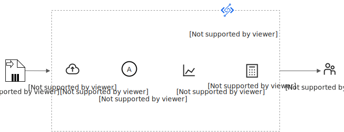

### **浅休眠（原浅休眠（原闲置））GPU实例降本优势**

浅休眠（原浅休眠（原闲置））GPU实例在浅休眠（原浅休眠（原闲置））状态和活跃状态对应**浅休眠（原浅休眠（原闲置））GPU使用单价**和**活跃GPU使用单价**，函数计算会根据实例的状态，自动进行计量统计与计费。

如下图所示，从实例的创建到销毁，经历了T0 - T4四个时间窗口，其中T1和T3时间窗口内实例活跃，其余T0、T2、T4实例均为浅休眠（原浅休眠（原闲置））状态。则该时间段的总价为（**T0、T2、T4 x 浅休眠（原浅休眠（原闲置））GPU使用单价**）**+（T1、T3 x 活跃GPU使用单价）**。关于**浅休眠（原浅休眠（原闲置））GPU使用单价**和**活跃GPU使用单价**，请参见[计费概述](https://help.aliyun.com/zh/functioncompute/fc/product-overview/billing-overview-of-fc#6d28f0007eho6)。

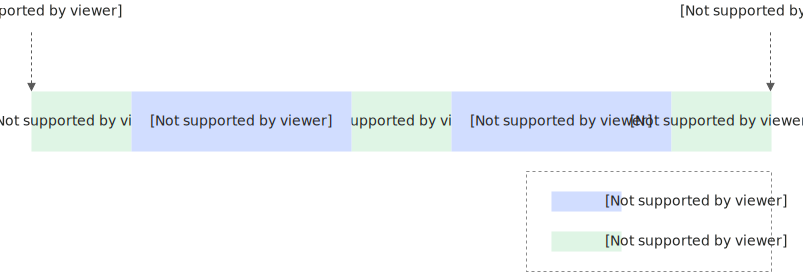

### **浅休眠（原浅休眠（原闲置））GPU实例工作原理**

函数计算平台借助先进的自研技术，实现了GPU实例的**即时冻结**和**恢复机制**。当GPU实例处于非活跃状态时，函数计算平台会自动将其转入**冻结状态**，**并以浅休眠（原浅休眠（原闲置））单价进行计费**，以优化资源利用效率，同时为客户降低成本。一旦有新的计算请求，平台迅速唤醒该实例，无缝执行所需的推理任务，**自动以活跃单价进行计费**。

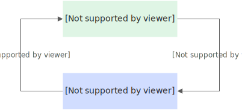

此过程对用户完全透明，不影响使用体验。同时，函数计算确保即便在实例冻结的情况下，推理服务的准确性和可靠性不受影响，为用户提供了一个稳定、经济的计算环境。

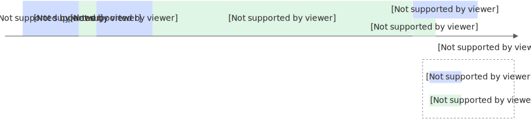

### **浅休眠（原浅休眠（原闲置））GPU实例唤醒延迟**

由于业务负载的不同，以下列举典型推理负载的唤醒时间供参考。

| **推理负载类型** | **浅休眠（原浅休眠（原闲置））GPU实例唤醒时间（秒）** |
| --- | --- |
| OCR/NLP | 0.5 - 1 |
| Stable Diffusion | 2 |
| LLM | 3 |

**

**重要**

由于模型体积各异，存在唤醒延迟差异，请以实际使用为准。

### 浅休眠（原浅休眠（原闲置））GPU实例使用约束

- CUDA版本
  
  推荐使用CUDA 12.2以及更早的版本。
- 镜像权限
  
  推荐在容器镜像中以默认的root用户权限运行。
- 实例登录
  
  浅休眠（原浅休眠（原闲置））GPU实例中，由于GPU冻结等原因，暂不支持登录实例。
- 实例优雅轮转
  
  函数计算平台会根据系统负载对浅休眠（原浅休眠（原闲置））GPU实例进行优雅轮转。为确保服务质量，建议在函数实例中加入模型预热/预推理生命周期回调功能，以便新实例上线后可立即提供推理服务，详情请参见[模型服务预热](#83a42cbc13e1q)。
- 模型预热/预推理
  
  浅休眠（原浅休眠（原闲置））GPU实例中，为保证实例的首次唤醒延迟符合预期，建议您在业务代码中使用`initialize`生命周期回调功能来进行模型预热/预推理，详情请参见[模型服务预热](#83a42cbc13e1q)。
- 预留配置
  
  切换浅休眠（原浅休眠（原闲置））模式开关时会使该函数现有的GPU预留实例优雅下线，预留实例数短暂归零，直到新的预留实例出现。
- 关闭推理框架内置的Metrics Server
  
  为提升浅休眠（原浅休眠（原闲置））GPU的兼容性和性能，建议关闭推理框架（如NVIDIA Triton Inference Server、TorchServe等）内置的Metrics Server。

### 浅休眠（原浅休眠（原闲置））GPU实例规格

浅休眠（原浅休眠（原闲置））GPU实例当前要求**整卡**使用GPU。关于GPU实例规格的详情请参见[实例规格](https://help.aliyun.com/zh/functioncompute/fc-2-0/user-guide/instance-types-and-instance-modes#section-mfv-5fb-ehw)。

## **针对推理场景优化的请求调度机制**

### **调度原理**

函数计算平台采用基于请求负载的智能感知调度，这一策略明显优于传统的轮询调度方法。平台能够实时监测当前GPU实例的任务执行状态，并在检测到空闲时，立即将新的请求分配至该实例。确保了GPU资源的高效利用，无空转现象、无热点现象。保证了GPU实例负载均衡与GPU算力利用率一致。如下图所示，本文以T4卡型为例。

| 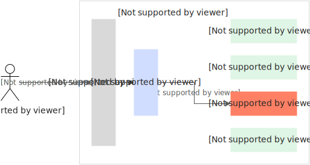 | 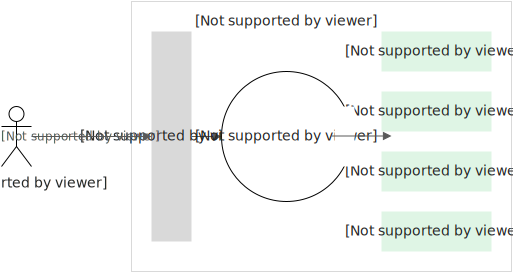 |
| --- | --- |

### **调度效果**

用户无需感知调度逻辑，即可借助函数计算内置的调度逻辑，在多个GPU实例中负载均衡。

| **实例1** | **实例2** | **实例3** |
| --- | --- | --- |
| 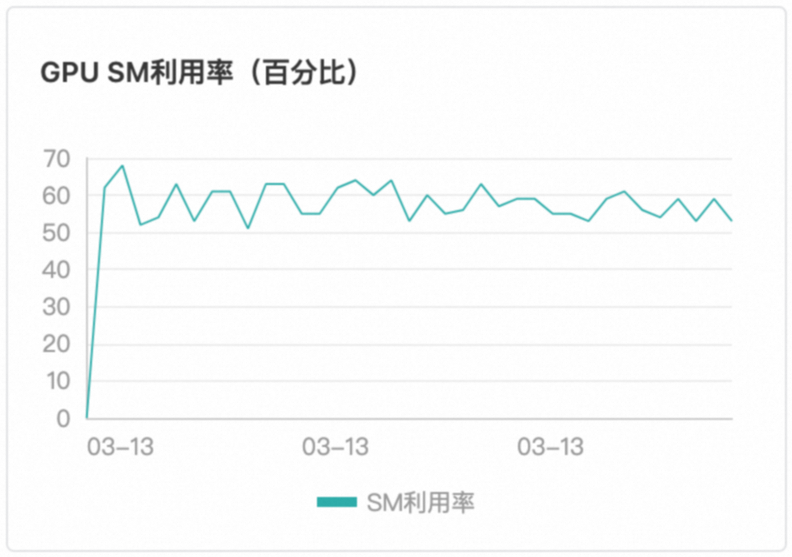 | 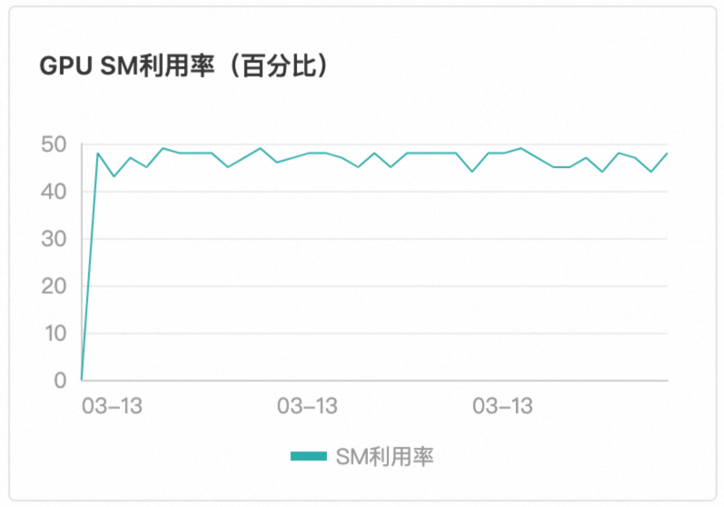 | 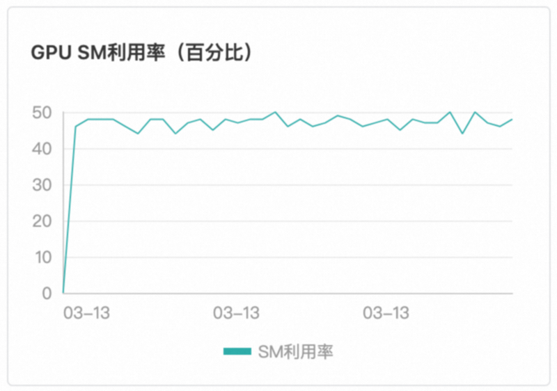 |

## **容器支持**

函数计算GPU场景下，当前仅支持以Custom Container（自定义容器运行环境）进行交付。关于Custom Container的使用详情，请参见[自定义镜像简介](https://help.aliyun.com/zh/functioncompute/fc-3-0/user-guide/overview-of-customcontainer)。

Custom Container函数要求在镜像内携带Web Server，以满足执行不同代码路径、通过事件或HTTP触发函数的需求。适用于AI学习推理等多路径请求执行场景。

## 部署方式

您可以使用多种方式将您的模型部署在函数计算。

- 通过函数计算控制台部署。具体操作，请参见[在控制台创建函数](https://help.aliyun.com/zh/functioncompute/fc/create-a-custom-container-function-in-a-container-runtime#section-bra-sgh-76g)。
- 通过调用SDK部署。更多信息，请参见[API概览](https://help.aliyun.com/zh/functioncompute/fc/developer-reference/api-fc-2023-03-30-overview)。
- 通过Serverless devs工具部署。更多信息，请参见[Serverless Devs常用命令](https://help.aliyun.com/zh/functioncompute/fc/developer-reference/serverless-devs-commands-1)。

更多部署示例，请参见[start-fc-gpu](https://github.com/devsapp/start-fc-gpu)。

## **模型服务预热**

为了解决模型上线后初次请求耗时较长的问题，函数计算为您提供了模型预热的功能。模型预热的目的是使模型上线后即可进入正常的服务状态。

函数计算推荐您配置实例的`initialize`生命周期回调功能来实现模型预热，函数计算会在您的实例启动后自动执行`initialize`里的业务逻辑来进行模型服务预热。更多信息，请参见[函数实例生命周期回调](https://help.aliyun.com/zh/functioncompute/fc/lifecycle-hooks-for-gpu-function)。

1. 在您构建的HTTP Server中添加POST方法的`/initialize`的调用Path，并将模型预热的逻辑放在`/initialize`的Path下。通常可以让模型服务来执行简单的推理来实现预热的效果。
  
  下面是Python语言的示例代码。
  
  ```
  def prewarm_inference(): res = model.inference() @app.route('/initialize', methods=['POST']) def initialize(): request_id = request.headers.get("x-fc-request-id", "") print("FC Initialize Start RequestId: " + request_id) # Prewarm model and perform naive inference task. prewarm_inference() print("FC Initialize End RequestId: " + request_id) return "Function is initialized, request_id: " + request_id + "\n"
  ```
2. 在函数详情页面，选择**配置**>**生命周期**，然后单击**编辑**，配置实例生命周期回调信息。
  
  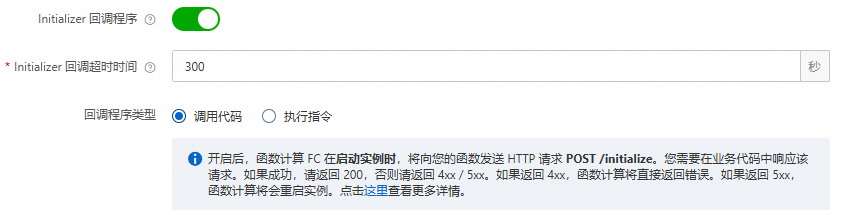

## **配置实时推理的弹性伸缩**

## 通过Serverless Devs工具配置GPU弹性伸缩

### 前提条件

- 在GPU实例所在地域，完成以下操作：
  
  - 创建容器镜像服务的企业版实例或个人版实例，推荐您创建企业版实例。具体操作步骤，请参见[使用企业版实例推送和拉取镜像](https://help.aliyun.com/zh/acr/getting-started/use-a-container-registry-enterprise-edition-instance-to-push-and-pull-images#section-375-stf-4nf)。
  - 创建命名空间镜像仓库。具体操作步骤，请参见[使用企业版实例构建镜像](https://help.aliyun.com/zh/acr/getting-started/build-images-on-container-registry-enterprise-edition-instances#section-m0h-3y9-s89)和[使用企业版实例构建镜像](https://help.aliyun.com/zh/acr/getting-started/build-images-on-container-registry-enterprise-edition-instances#section-7ek-3k0-l1n)。
- [快速入门](https://help.aliyun.com/zh/functioncompute/fc/developer-reference/install-serverless-devs-and-docker)
- [配置Serverless Devs](https://help.aliyun.com/zh/functioncompute/fc-3-0/developer-reference/configure-serverless-devs-1)

### **1.**部署函数

1. 执行以下命令，克隆工程。
  
  ```
  git clone https://github.com/devsapp/start-fc-gpu.git
  ```
2. 执行以下命令，进入项目目录。
  
  ```
  cd /root/start-fc-gpu/fc-http-gpu-inference-paddlehub-nlp-porn-detection-lstm/src/
  ```
  
  项目结构如下所示。
  
  ```
  . ├── hook │ └── index.js └── src ├── code │ ├── Dockerfile │ ├── app.py │ ├── hub_home │ │ ├── conf │ │ ├── modules │ │ └── tmp │ └── test │ └── client.py └── s.yaml
  ```
3. 执行以下命令，通过Docker构建镜像，并向您的镜像仓库进行推送。
  
  ```
  export IMAGE_NAME="registry.cn-shanghai.aliyuncs.com/fc-gpu-demo/paddle-porn-detection:v1" # sudo docker build -f ./code/Dockerfile -t $IMAGE_NAME . # sudo docker push $IMAGE_NAME
  ```
  
  **
  
  **重要**
  
  由于PaddlePaddle框架自身体积较大，首次构建镜像耗时较长，约1个小时，因此，此处为您提供一个VPC地址的公共镜像供您直接使用。使用公共镜像时，无需执行上述docker build和docker push命令。
4. 编辑s.yaml文件。
  
  ```
  edition: 3.0.0 name: container-demo access: default vars: region: cn-shanghai resources: gpu-best-practive: component: fc3 props: region: ${vars.region} description: This is the demo function deployment handler: not-used timeout: 1200 memorySize: 8192 cpu: 2 gpuMemorySize: 8192 diskSize: 512 instanceConcurrency: 1 runtime: custom-container environmentVariables: FCGPU_RUNTIME_SHMSIZE: '8589934592' customContainerConfig: image: >- registry.cn-shanghai.aliyuncs.com/serverless_devs/gpu-console-supervising:paddle-porn-detection port: 9000 internetAccess: true logConfig: enableRequestMetrics: true enableInstanceMetrics: true logBeginRule: DefaultRegex project: z**** logstore: log**** functionName: gpu-porn-detection gpuConfig: gpuMemorySize: 8192 gpuType: fc.gpu.tesla.1 triggers: - triggerName: httpTrigger triggerType: http triggerConfig: authType: anonymous methods: - GET - POST
  ```
5. 执行以下命令，部署函数。
  
  ```
  sudo s deploy --skip-push true -t s.yaml
  ```
  
  执行成功后，在执行输出中返回一个URL地址，格式如`https://gpu-poretection-****.cn-shanghai.fcapp.run`，复制此地址用于后续测试函数。

### **2.测试函数并查看监控结果**

1. 执行Curl命令调用函数，格式如下，其中域名为上一步获取的URL。
  
  ```
  curl https://gpu-poretection-gpu-****.cn-shanghai.fcapp.run/invoke -H "Content-Type: text/plain" --data "Nice to meet you"
  ```
  
  返回以下结果，表示测试通过。
  
  ```
  [{"text": "Nice to meet you", "porn_detection_label": 0, "porn_detection_key": "not_porn", "porn_probs": 0.0, "not_porn_probs": 1.0}]%
  ```
2. 登录[函数计算控制台](https://fcnext.console.aliyun.com)，左侧导航栏选择**函数**，选择地域，找到目标函数，然后在函数详情页，选择**监控**>**实例指标**，查看GPU相关指标的变化。
  
  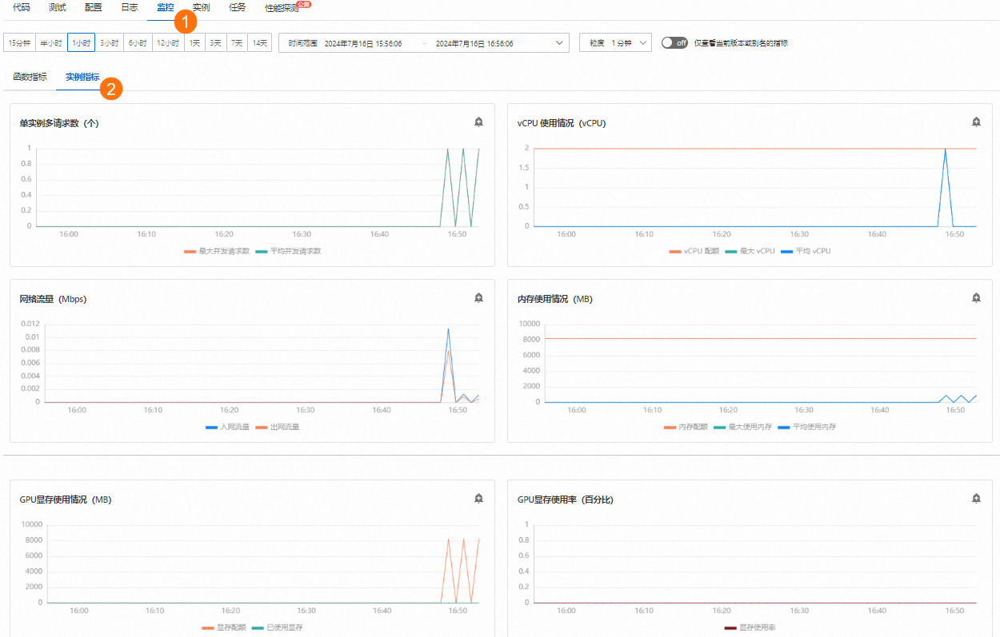

### **3.配置弹性预留策略**

1. 在s.yaml文件所在目录下，创建弹性配置的模板provision.json。
  
  示例如下。该模板使用了实例并发度作为追踪指标，最小实例数为2，最大实例数为30。
  
  ```
  { "targetTrackingPolicies": [ { "name": "scaling-policy-demo", "startTime": "2024-07-01T16:00:00.000Z", "endTime": "2024-07-30T16:00:00.000Z", "metricType": "ProvisionedConcurrencyUtilization", "metricTarget": 0.3, "minCapacity": 2, "maxCapacity": 30 } ] }
  ```
2. 执行以下命令，进行弹性策略的部署。
  
  ```
  sudo s provision put --target 1 --targetTrackingPolicies ./provision.json --qualifier LATEST -t s.yaml -a {access}
  ```
3. 执行`sudo s provision list`进行验证，可以看到如下输出。其中`target`和`current`的数值相等，表示预留实例正确拉起，弹性规则部署正确。
  
  ```
  [2023-05-10 14:49:03] [INFO] [FC] - Getting list provision: gpu-best-practive-service gpu-best-practive: - serviceName: gpu-best-practive-service qualifier: LATEST functionName: gpu-porn-detection resource: 143199913651****#gpu-best-practive-service#LATEST#gpu-porn-detection target: 1 current: 1 scheduledActions: null targetTrackingPolicies: - name: scaling-policy-demo startTime: 2024-07-01T16:00:00.000Z endTime: 2024-07-30T16:00:00.000Z metricType: ProvisionedConcurrencyUtilization metricTarget: 0.3 minCapacity: 2 maxCapacity: 30 currentError: alwaysAllocateCPU: true
  ```
  
  在预留实例拉起成功后，您的模型已成功部署并准备好提供服务。
4. 释放函数预留实例。
  
  1. 执行以下命令关闭弹性规则，将预留实例配置为0。
    
    ```
    sudo s provision put --target 0 --qualifier LATEST -t s.yaml -a {access}
    ```
  2. 执行以下命令确认当前函数的弹性伸缩策略已被关闭。
    
    ```
    s provision list -a {access}
    ```
    
    返回以下执行结果，表示弹性伸缩策略已成功关闭。
    
    ```
    [2023-05-10 14:54:46] [INFO] [FC] - Getting list provision: gpu-best-practive-service End of method: provision
    ```

## 通过控制台配置GPU弹性伸缩

### 前提条件

已创建GPU函数。具体操作，请参见[创建自定义镜像函数](https://help.aliyun.com/zh/functioncompute/fc/create-a-custom-container-function-in-a-container-runtime#title-jv0-83f-lye)。

### 操作步骤

1. 登录[函数计算控制台](https://fcnext.console.aliyun.com)，左侧导航栏选择**函数**，选择地域，找到目标函数，开启目标函数的实例级别指标。
  
  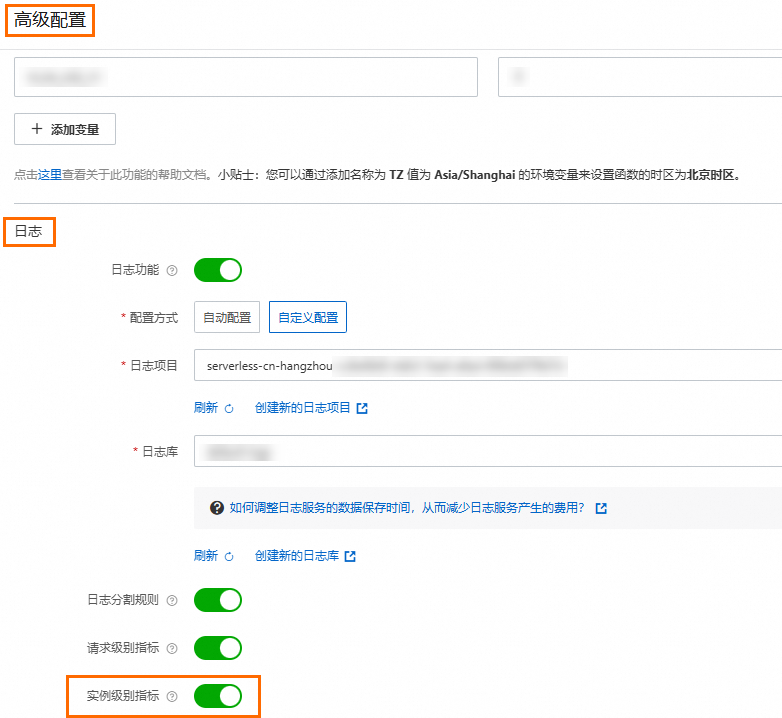
2. 在函数详情页面，选择**配置**>**触发器**，获取HTTP触发器的URL用于后续测试函数。
  
  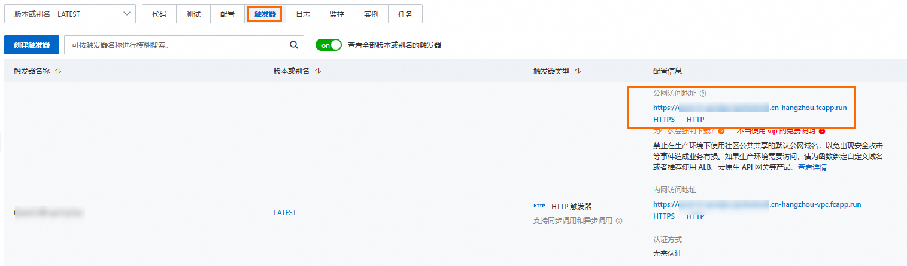
3. 执行Curl命令测试函数，然后在函数详情页面，选择**监控**>**实例指标**，查看GPU相关指标的变化。
  
  ```
  curl https://gpu-poretection****.cn-shanghai.fcapp.run/invoke -H "Content-Type: text/plain" --data "Nice to meet you"
  ```
4. 在函数详情页面，选择**配置**>**预留实例**，然后单击**创建预留实例数策略**开始配置弹性预留策略。
  
  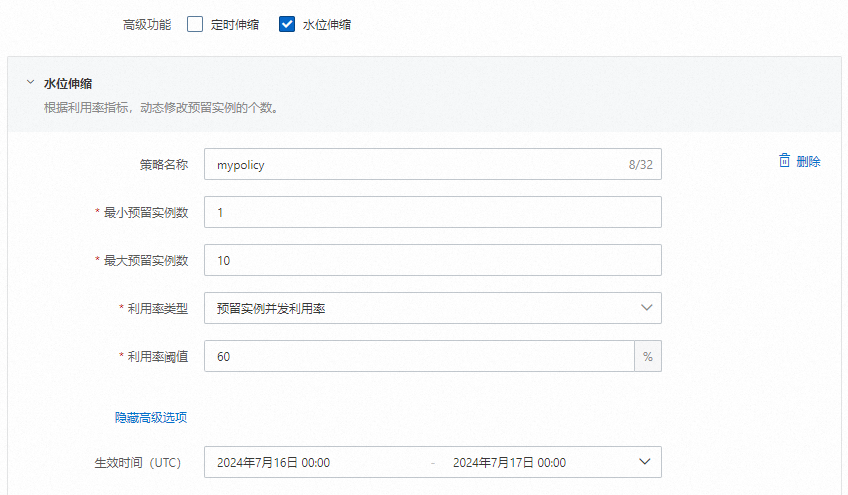
  
  设置完成后，您可以在目标函数的详情页，选择**监控**>**函数指标**，查看**函数预留实例数**的变化。

**

**重要**

后续如果没有使用预留模式GPU实例的需求，请及时删除添加的预留实例。

## 常见问题

### 使用函数计算实时推理场景的成本如何计算？

关于函数计算的计费详情，请参见[计费概述](https://help.aliyun.com/zh/functioncompute/fc/product-overview/billing-overview-of-fc)。预留模式区别于按量模式，请注意您的账单详情。

### 为什么我配置了弹性伸缩策略，还是可以看到性能毛刺？

可以考虑使用更为激进的弹性伸缩策略，提前弹出节点来规避突发请求带来的性能挤兑。

### 为什么我所追踪的指标已经上涨超过所配置的弹性策略水位，但是没有看到实例数增长？

函数计算统计的指标是分钟级别，水位需要上涨并维持一段时间后，才会触发扩容机制。
