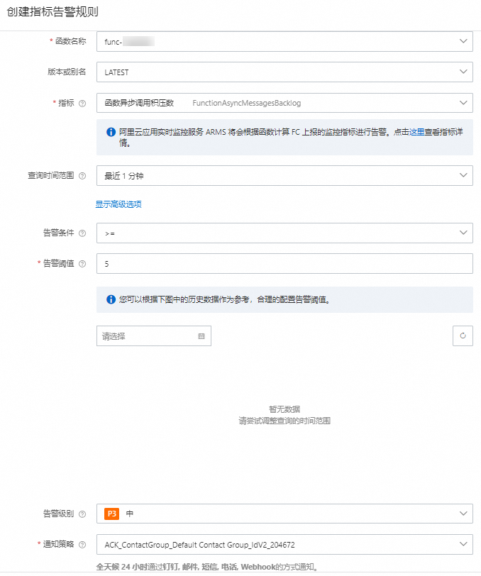

# 异步任务

当您对函数发起异步调用时，如果需要追踪并保存异步调用各个阶段的状态，实现更丰富的任务控制和可观测能力，可以选择开启任务模式处理异步请求。本文介绍异步任务的背景信息、使用限制和常用功能。

## 背景信息

开启异步任务后，您可以实现以下功能：

- 每次函数调用将详细记录调用过程中的状态转换信息，例如排队等待处理中（Enqueued）、调用执行成功（Succeeded）和调用执行失败（Failed）等。
- 拥有函数请求生命周期管理能力，可以主动终止执行中的异步任务。

异步任务会保存状态信息，因此，函数的调用和执行会有一定的额外延迟，该延迟不会产生额外的费用。关于函数计算计费的详细信息，请参见[计费概述](https://help.aliyun.com/zh/functioncompute/fc/product-overview/billing-overview-of-fc)。

## 使用限制

- 场景限制
  
  异步任务虽然功能更丰富，但相应的系统开销更大。以下场景建议您关闭任务模式：
  
  - 您对请求处理链路延时非常敏感，需要平均延时在百毫秒以下。
  - 您需要每秒数千甚至更高的速率发起异步调用。
- 地域限制
  
  异步任务支持华东1（杭州）、华东2（上海）、华北1（青岛）、华北2（北京）、华北3（张家口）、华北6（乌兰察布）、华南1（深圳）、西南1（成都）、中国香港、新加坡、英国（伦敦）、美国（硅谷）、美国（弗吉尼亚）、德国（法兰克福）、马来西亚（吉隆坡）、印度尼西亚（雅加达）、泰国（曼谷）、日本（东京）和韩国（首尔）地域。
- 时效限制
  
  仅支持查询7天内的任务状态信息。

## 异步任务与Jobs功能对比

如果您需要执行异步任务，您可以使用函数计算异步任务功能，也可以使用Kubernetes的Jobs功能来实现。函数计算异步任务提供开箱即用的更高效、更可控并且更易于观测的异步任务执行平台。以下是详细功能对比。

| **对比项** | **函数计算异步任务** | **Kubernetes的Jobs功能** |
| --- | --- | --- |
| 适用场景 | 适用于任务执行时长数十毫秒的实时任务和任务执行时长数十小时的离线任务。 | 适用于任务提交速度要求不高，任务负载比较固定，任务实时性要求不高的离线任务。 |
| 任务可观测能力 | 支持。提供日志、任务排队数等指标和任务链路耗时、任务状态查询等丰富的可观测能力。 | 需自行整合开源软件来实现。 |
| 任务实例自动扩缩容 | 支持。根据任务排队数和实例资源使用率自动扩缩容。 | 需通过任务队列自行实现扩缩容和实例负载均衡，复杂度较高。 |
| 任务实例伸缩速度 | 毫秒级。 | 分钟级。 |
| 任务实例资源利用率 | 用户只需要选择合适的实例规格，实例自动伸缩，按实际处理任务的时长计量，资源利用率高。 | 需在Jobs提交时确定实例的规格和数目。实例难以自动伸缩和负载均衡，资源利用率低。 |
| 任务提交速度 | 单个用户支持每秒提交数万条任务。 | 整个集群每秒最多启动数百条Jobs。 |
| 任务定时或延时提交 | 支持。 | 支持任务定时提交，不支持任务延时提交。 |
| 任务去重 | 支持。 | 不支持。 |
| 终止指定任务 | 支持。 | 有限支持。通过终止任务实例间接实现。 |
| 任务流控 | 支持。可在用户或任务处理函数等不同粒度进行流控。 | 不支持。 |
| 任务结果自动回调 | 支持。 | 不支持。 |
| 开发运维成本 | 只需要实现任务的处理逻辑。 | 需维护K8s集群。 |

## **任务管理**

### **异步任务的状态**

针对每一次任务调用，函数计算均会记录任务的状态变更过程，并提供实时的状态查询能力。您可以通过SDK或函数计算控制台查看任务的具体状态。目前任务有如下几种状态：

| **执行状态** | **说明** |
| --- | --- |
| 已入队 | 异步消息已入队，等待处理。 |
| 已处理 | 异步消息已出队，等待触发。 |
| 执行中 | 调用执行中，您的实例已经开始运行任务代码。 |
| 执行成功 | 调用执行成功。 |
| 执行失败 | 调用执行失败。 |
| 已停止 | 您已手动停止该次任务调用。任务已成功终止。 |
| 停止中 | 您手动停止了该次任务，任务尝试停止中。 |
| 已过期 | 您给异步消息配置了存活有效期，该消息因过期已被丢弃（未触发）。 |
| 无效 | 您的执行因函数或服务被删除等原因处于无效状态（未触发）。 |
| 重试中 | 异步调用因执行错误而进行重试中。当系统准备好重试后，您的任务将会再次变为Running状态。 |

您可以调用[获取异步任务](https://help.aliyun.com/zh/functioncompute/fc/developer-reference/api-fc-2023-03-30-getasynctask)接口获取某次任务执行的详细信息，也可以调用[获取异步任务列表](https://help.aliyun.com/zh/functioncompute/fc/developer-reference/api-fc-2023-03-30-listasynctasks)接口过滤指定状态的任务。

### **管理任务**

## 通过控制台管理任务

### 创建函数的同时开启异步任务

1. 登录[函数计算控制台](https://fcnext.console.aliyun.com)，在左侧导航栏，选择**函数管理**>**函数**。
2. 在顶部菜单栏，选择地域，然后在**函数**页面，单击**创建函数**。
3. 在弹出的对话框，选择**任务函数**，单击**创建{title}**，在**创建{title}**页面，设置函数名称，然后单击**创建**。
  
  关于各配置项的说明，请参见[创建任务函数](https://help.aliyun.com/zh/functioncompute/fc/user-guide/creating-a-task-function)。

函数创建成功后，在函数详情页的**任务**页签，您可以看到任务模式已经默认开启。

### **为已有函数开启异步任务模式**

需要先创建函数，具体操作，请参见[创建函数](https://help.aliyun.com/zh/functioncompute/fc/user-guide/function-instance-1/)。

1. 登录[函数计算控制台](https://fcnext.console.aliyun.com)，在左侧导航栏，选择**函数管理**>**函数**。
2. 在顶部菜单栏，选择地域，然后在**函数**页面，单击目标函数。
3. 在函数详情页面，选择**任务**页签，单击**任务模式**右侧的**编辑**。
4. 在**任务模式**面板，**任务模式**选择**关闭**后单击**部署**。

### 启动或停止任务

1. 登录[函数计算控制台](https://fcnext.console.aliyun.com)，在左侧导航栏，选择**函数管理**>**函数**。
2. 在顶部菜单栏，选择地域，然后在**函数**页面，单击目标函数。
3. 在函数详情页面，选择**任务**页签，单击**提交任务**，在弹出的对话框，选择任务ID生成方式和任务执行时间，然后单击**确定**。
  
  您也可以单击**提交任务**右侧的图标，从下拉列表中选择**配置测试参数**，事件函数将以event的形式，HTTP函数将以HTTP参数的形式输入参数传递给函数，模拟提交任务。
  
  您可以在下方任务列表查看**任务状态**、**任务 ID**、**实例 ID**或者登录实例等。

## 调用API（SDK）管理任务

### 配置任务模式

调用[设置函数异步配置](https://help.aliyun.com/zh/functioncompute/fc/developer-reference/api-fc-2023-03-30-putasyncinvokeconfig)接口，配置异步调用模式为任务模式。将asyncTask配置为如下内容，完成该配置后，该函数的所有异步调用将变为任务模式。

```
{ "asyncTask": true }
```

**

**说明**

您配置异步调用模式为任务模式后，仍然可以使用同步方式调用函数，但异步任务模式只针对异步调用生效。

### 通过异步调用触发函数

您可以通过调用[调用函数](https://help.aliyun.com/zh/functioncompute/fc/developer-reference/api-fc-2023-03-30-invokefunction)接口，x-fc-invocation-type参数选择Async，触发一次异步调用来启动任务模式。您可以在调用时添加HTTP请求头x-fc-async-task-id来为本次调用设置任务ID，更多信息，请参见[任务防重复提交](#c63cfeeddd3q3)。

### 查看任务

您提交任务后，如需查询某次执行的状态或执行记录等信息，您可以调用[获取异步任务](https://help.aliyun.com/zh/functioncompute/fc/developer-reference/api-fc-2023-03-30-getasynctask)接口进行查询。

如果您需要根据关键字或条件查询符合条件的任务执行列表，您可以调用[获取异步任务列表](https://help.aliyun.com/zh/functioncompute/fc/developer-reference/api-fc-2023-03-30-listasynctasks)接口来实现。

### 停止任务

您提交任务后，可根据需要停止任务。您可以调用[停止异步任务](https://help.aliyun.com/zh/functioncompute/fc/developer-reference/api-fc-2023-03-30-stopasynctask)接口执行停止任务操作。停止任务时需要提供TaskID，此ID为您提交任务时设置的TaskID，也可以是调用[获取异步任务列表](https://help.aliyun.com/zh/functioncompute/fc/developer-reference/api-fc-2023-03-30-listasynctasks)接口查询运行中任务时，获取的ID。

## **事件触发**

您可以通过创建支持异步调用的触发器来触发异步任务，支持异步调用的触发器列表如下。

- [HTTP触发器](https://help.aliyun.com/zh/functioncompute/fc/http-triggers-1/)
- [定时触发器](https://help.aliyun.com/zh/functioncompute/fc/user-guide/time-triggers)
- [OSS触发器](https://help.aliyun.com/zh/functioncompute/fc/oss-triggers-1/)
- [MNS主题触发器](https://help.aliyun.com/zh/functioncompute/fc-2-0/overview-18#concept-2259991)
- 通过事件总线EventBridge实现的触发器，包括以下几种：
  
  - [轻量消息队列（原 MNS）队列触发器](https://help.aliyun.com/zh/functioncompute/fc-2-0/user-guide/mns-queue-triggers#task-1999574)
  - [RocketMQ触发器](https://help.aliyun.com/zh/functioncompute/fc-2-0/user-guide/apsaramq-for-rocketmq-triggers#task-1999570)
  - [RabbitMQ触发器](https://help.aliyun.com/zh/functioncompute/fc-2-0/user-guide/apsaramq-for-rocketmq-triggers-1#task-2045124)
  - [Kafka触发器](https://help.aliyun.com/zh/functioncompute/fc-2-0/user-guide/apsaramq-for-kafka-trigger#task-2533588)
  - [MQTT触发器](https://help.aliyun.com/zh/functioncompute/fc-2-0/user-guide/message-queue-for-mqtt-triggers)
  - [DTS触发器](https://help.aliyun.com/zh/functioncompute/fc-2-0/user-guide/dts-triggers#task-2304606)
  
  **
  
  **重要**
  
  请确保HTTP和通过事件总线EventBridge实现的触发器的**调用方式**为**异步调用**。

## **任务防重复提交**

为了避免任务重复执行，函数计算支持为每次提交的任务设定全局唯一的ID，当异步接口提交失败时，例如异步调用提交任务接口超时，您可以通过提交相同ID的任务进行重试。关于重试方式的介绍，请参见[重试策略](https://help.aliyun.com/zh/functioncompute/fc/user-guide/asynchronous-invocation#9f0bf6ad34yni)。

函数计算提供TaskID这一任务概念，该ID全局唯一。建议您在每次提交任务时指定该ID，并在出现超时等情况下进行重试。函数计算会对您重复提交的任务进行校验，当有相同ID进入系统时，该次请求将认为是重复提交而被拒绝，并返回错误`409`。

**

**说明**

函数计算还提供了RequestID这一概念，如果您设置了RequestID但未设置TaskID，系统将自动设置TaskID为RequestID。使用异步任务时，建议您设置TaskID，无需设置RequestID。

### **设置TaskID**

您可以在[函数计算控制台](https://fcnext.console.aliyun.com/)、使用Serverless Devs或调用API提交一次任务执行。如果需要设置TaskID，请在触发函数执行时设置参数x-fc-async-task-id。

触发任务执行时设置TaskID的示例代码请参见[示例代码](https://next.api.aliyun.com/api/FC/2023-03-30/InvokeFunction?tab=DEMO&lang=GO&params={%22functionName%22:%22function%22,%22x-fc-async-task-id%22:%22123%22})。

## **任务监控**

您可以使用函数计算提供的任务监控指标实时获取异步任务的状态、及时发现错误和超时等异常信息。

### **前提条件**

已创建函数，详情请参见[创建函数](https://help.aliyun.com/zh/functioncompute/fc/user-guide/function-instance-1/)。

### **操作步骤**

1. 登录[函数计算控制台](https://fcnext.console.aliyun.com)，在左侧导航栏，选择**函数管理**>**函数**。
2. 在顶部菜单栏，选择地域，然后在**函数**页面，单击目标函数。
3. 在目标函数的详情页面，选择**监控**页签，查看异步调用相关指标和异步任务实例级别的资源使用情况。关于监控指标的详细介绍，请参见[监控指标](https://help.aliyun.com/zh/functioncompute/fc/user-guide/monitoring-metrics-1)。
  
  - 单击**函数指标**页签，查看异步调用相关指标信息，如**异步调用处理情况（个）**、**异步消息处理延时（毫秒）**、**异步调用触发事件（次）**和**异步请求积压数（个）**等。
  - 单击**实例指标**页签，查看异步任务实例级别的资源使用情况。
    
    **
    
    **说明**
    
    开通实例级别指标前，需先开通日志功能。具体操作，请参见[配置日志功能](https://help.aliyun.com/zh/functioncompute/fc/configure-the-logging-feature)。
4. 为指标设定告警规则。
  
  如果您想监控某个指标，如内存使用情况、vCPU使用情况等，可以单击指标右上角的，跳转到**创建指标告警规则**面板，根据界面提示设置告警条件和阈值，然后单击**确定**。
  
  关于告警规则的设置，请参见下图。下图中参数设置值表示当函数异步调用积压数大于等于5条时，将全天候通过钉钉、邮件、电话和Webhook的方式上报中级告警到联系人。
  
  

## **任务编排**

结合云工作流，函数的异步调用可以应用于大规模复杂场景的任务流程。您可以使用[传递（Pass）](https://help.aliyun.com/zh/document_detail/2412526.html)、[迭代（Map）](https://help.aliyun.com/zh/document_detail/2412671.html)和[并行（Parallel）](https://help.aliyun.com/zh/document_detail/2412619.html)等方式来编排函数计算异步任务，云工作流会按照设定好的步骤可靠地协调任务执行，跟踪每个任务的状态转换，并在必要时执行您定义的重试逻辑，以确保任务顺利完成。更多信息，请参见[集成函数计算](https://help.aliyun.com/zh/document_detail/2400200.html)。

### **前提条件**

- 创建异步任务。具体操作，请参见[任务管理](#5dd5cba1a3g8w)。
- 授予函数计算访问Serverless 工作流的权限。具体操作，请参见[使用函数角色授予函数计算访问其他云服务的权限](https://help.aliyun.com/zh/functioncompute/fc/grant-function-compute-permissions-to-access-other-alibaba-cloud-services)。

### **操作步骤**

1. 登录[云工作流控制台](https://fnf.console.aliyun.com)，然后在顶部菜单栏，选择地域。
2. 在左侧导航栏，选择**工作流列表**，然后在**工作流列表**页面，单击**创建工作流**。
3. 在**创建工作流**对话框，选择创建工作流的方式，然后选择要创建的工作流的模式。
  
  云工作流支持创建标准和快速两种模式的工作流，关于两种模式的更多信息，请参见[标准工作流和快速工作流](https://help.aliyun.com/zh/document_detail/2504569.html)。更多操作，请参见[基于空白画布创建工作流](https://help.aliyun.com/zh/document_detail/2399888.html)。
4. 编辑上一步创建的工作流。
  
  1. 编辑流程。
    
    您可以选择**CloudFlow Studio**编辑或**YAML**编辑两种方式，本文以**YAML**编辑方式为例进行介绍。
    
    在流程详情页面右上角，单击**YAML**，在左侧代码编辑框内输入流程定义语言，然后单击**保存**。
    
    示例如下。
    
    ```
    Type: StateMachine Name: MyFlow SpecVersion: v1 StartAt: InvokeFunction States: - Type: Task Name: InvokeFunction Action: FC:InvokeFunction TaskMode: RequestComplete Parameters: invocationType: Async resourceArn: acs:fc:us-west-1:103435468****:functions/func-i1****/LATEST End: true
    ```
  2. 配置流程角色。
    
    在流程详情页面右上角，单击**工作流配置**，选择**执行角色**，然后单击**保存**。
    
    **
    
    **说明**
    
    请确保为流程配置的角色已被授予AliyunFCInvocationAccess权限策略。
5. 在流程详情页面，您可以单击右上角的**执行**触发工作流任务进行测试。
