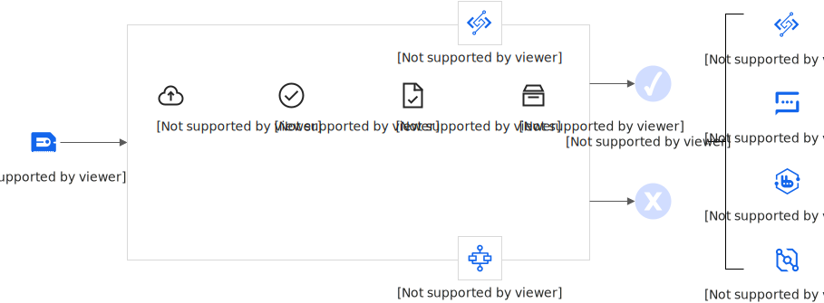

# 离线异步任务场景

本文介绍什么是GPU离线异步任务场景以及如何使用函数计算GPU异步调用、异步任务服务离线AI推理、AI训练和GPU加速场景，以及如何基于自定义镜像满足离线GPU应用场景。

## 场景介绍

在离线异步应用场景中，工作负载具有以下一个或多个特征。

- **执行时间长**
  
  业务的处理耗时一般在分钟~小时级，Response Time不敏感。
- **提交后立即返回**
  
  在触发调用后立即得到返回，从而不会因为长时处理阻塞业务主逻辑的执行。
- **实时感知任务状态**
  
  离线GPU任务需要具备查看执行中的状态，以及中途主动取消执行的能力。
- **并行处理**
  
  离线GPU任务需要处理大量数据，对GPU资源供给要求高，并行运行加快处理速度。
- **数据源集成**
  
  离线GPU任务对数据源的需求多种多样，处理过程中需要与多种存储产品（例如对象存储OSS）和多种消息产品（例如消息队列）进行频繁交互。更多信息，请参见[触发器简介](https://help.aliyun.com/zh/functioncompute/fc/user-guide/trigger-overview)。

函数计算为离线异步应用类工作负载提供以下功能优势。

- **业务架构简化**
  
  对于耗时长、资源消耗大或者容易出错的逻辑，从主流程中剥离出来异步处理，提高系统响应速度、资源利用率和可用性。
- **异步任务的最短路径**
  
  企业能够以较小的代价，基于函数计算的异步GPU处理能力，建设面向AI业务的异步处理平台。
- **充足的GPU资源供给**
  
  函数计算平台提供充足的GPU资源供给，当业务遭遇大规模离线任务时，函数计算将以秒级弹性供给海量GPU算力资源，避免因GPU算力供给不足、GPU算力弹性滞后导致的业务受损，适合忙闲流量分明（长时空闲、短时繁忙）、忙闲流量不可预知的离线业务。
- **数据源集成**
  
  函数计算支持多种数据源触发方式，例如对象存储OSS、消息队列等，帮助业务简化数据源交互处理逻辑。

## 功能原理

当GPU函数部署完成后，您可以选择通过异步调用或异步任务触发离线GPU任务的提交。函数计算默认使用弹性实例为您服务（与之区别的是[快照功能](https://help.aliyun.com/zh/functioncompute/snapshots-introduction)），提供离线异步应用场景所需的基础设施能力。

函数计算平台接收到多个异步提交的离线GPU任务后，将自动弹出多个弹性GPU实例并行处理，通过海量GPU算力资源的充分供给保证大量离线GPU任务的并行运行，以最大程度减少排队耗时。当离线GPU任务总数超出单个阿里云账号地域级别的GPU资源处理能力上限后，离线GPU任务将进行排队。对于离线GPU任务的排队数量、处理中数量、处理完成数量可方便的进行观测，对于无须继续运行的离线GPU任务可以任意取消。当离线GPU任务运行完成，根据其执行成功与否，可触发回调不同的下游云产品联动。

## **容器支持**

函数计算GPU场景下，当前仅支持以自定义镜像进行交付。关于自定义镜像的使用详情，请参见[自定义镜像简介](https://help.aliyun.com/zh/functioncompute/fc-3-0/user-guide/overview-of-customcontainer)。

自定义镜像函数要求在镜像内携带Web Server，以满足执行不同代码路径、通过事件或HTTP触发函数的需求。适用于AI学习推理等多路径请求执行场景。

## 部署方式

您可以使用多种方式将您的模型部署在函数计算。

- 通过函数计算控制台部署。具体操作，请参见[在控制台创建函数](https://help.aliyun.com/zh/functioncompute/fc/create-a-custom-container-function-in-a-container-runtime#section-bra-sgh-76g)。
- 通过调用SDK部署。更多信息，请参见[API概览](https://help.aliyun.com/zh/functioncompute/fc/developer-reference/api-fc-2023-03-30-overview)。
- 通过Serverless devs工具部署。更多信息，请参见[Serverless Devs常用命令](https://help.aliyun.com/zh/functioncompute/fc/developer-reference/serverless-devs-commands-1)。

更多部署示例，请参见[start-fc-gpu](https://github.com/devsapp/start-fc-gpu)。

## 异步模式

离线应用场景由于执行时间长，须由异步调用方式进行触发，触发后可立即得到请求返回。由于普通的异步调用并不携带执行状态，所以需要将异步触发设置为异步任务。异步任务支持随时查询每个请求的执行状态，并且在必要情况下可以主动取消正在执行的请求。关于异步调用和异步任务的更多信息，请参见[异步调用](https://help.aliyun.com/zh/functioncompute/overview-34)和[异步任务](https://help.aliyun.com/zh/functioncompute/overview-25)。

## 并发调用

您的GPU函数在某个地域级别，例如华东1（杭州），支持的最大并发调用数量，取决于GPU函数实例的并发度以及GPU物理卡的使用上限。

### GPU函数实例并发度

默认情况下，GPU实例的并发度为1，即一个GPU函数实例在同一时刻仅能处理一个请求或离线GPU任务。您可以通过控制台、ServerlessDevs工具调整GPU函数实例的并发度配置。具体操作，请参见[设置实例并发度](https://help.aliyun.com/zh/functioncompute/user-guide/configure-instance-concurrency)。建议不同的应用场景，选择不同的并发度配置。对于计算密集型的离线GPU任务，建议GPU函数实例的并发度保持默认值1。

### GPU物理卡的使用上限

默认情况下，单个阿里云账号地域级别的GPU物理卡上限为30卡，实际数值以[配额中心](https://quotas.console.aliyun.com/products/fc/quotas)为准，如您有更高的物理卡需求，请前往[配额中心](https://quotas.console.aliyun.com/products/fc/quotas)申请。

GPU实例规格与实例并发度的关系如下所示：

Ada系列整卡显存为48GB，Tesla系列整卡显存为16GB，仅支持整卡显存，则单卡同时承载1个GPU容器，由于各地域的GPU卡数配额默认最大为30，地域级别最多可同时承载30个GPU容器。

- 当GPU函数实例并发度为1时，该函数在地域级别的推理并发度为30。
- 当GPU函数实例并发度为5时，该函数在地域级别的推理并发度为150。

## 运行时长

函数计算GPU支持最长86400秒（24小时）的运行时间。搭配异步任务模式，可自由运行或取消正在运行的请求，适合长耗时的AI推理、AI训练、音视频处理和三维重建等场景。
