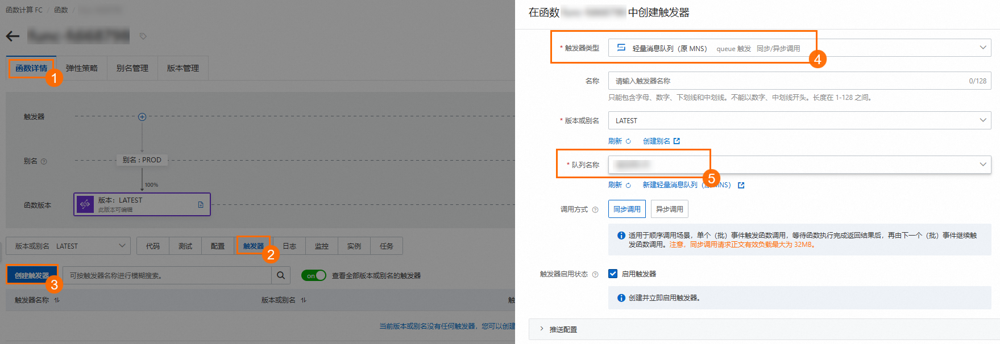

# 轻量消息队列（原 MNS）队列触发器

轻量消息队列（原 MNS）的队列（Queue）作为事件源通过事件总线EventBridge与函数计算集成后，通轻量消息队列（原 MNS）队列触发器能够触发关联函数执行，通过函数可以对发布到轻量消息队列（原 MNS）队列中的消息进行自定义处理。本文介绍如何在函数计算控制台创建轻量消息队列（原 MNS）队列触发器、配置函数入口参数和编写代码并测试。

## 功能简介

您在函数计算的控制台提交触发器创建请求之后，函数计算会根据触发器的配置信息，自动在事件总线EventBridge侧创建[事件流](https://help.aliyun.com/zh/eventbridge/user-guide/event-stream-overview#concept-2091067)资源。

创建完成后，您可以在函数计算控制台查看触发器信息，同时也可以在事件总线EventBridge控制台查看自动创建的资源信息。当源轻量消息队列（原 MNS）队列中有消息入队时，将会触发函数计算执行。执行时会根据您的攒批配置，将一个或多个消息事件以批的形式推送到函数中进行处理，适合端到端的流式数据处理场景。

## 注意事项

- 作为触发源的轻量消息队列（原 MNS）队列必须和函数计算的函数所在的地域相同。
- 创建的事件流数量超过上限后，将无法再创建轻量消息队列（原 MNS）队列触发器。

在单个阿里云账号单个地域维度下，关于创建触发器涉及的资源数量的限制，请参见[使用限制](https://help.aliyun.com/zh/eventbridge/product-overview/limits#concept-337381)。

## 前提条件

- 事件总线EventBridge
  
  - [开通事件总线EventBridge并授权](https://help.aliyun.com/zh/eventbridge/getting-started/activate-eventbridge-and-grant-permissions-to-a-ram-user#task-1947668)
- 函数计算
  
  - [创建事件函数](https://help.aliyun.com/zh/functioncompute/fc/user-guide/creating-an-event-function#title-iir-ezf-dlf)
- 轻量消息队列（原 MNS）
  
  - [开通轻量消息队列（原 MNS）并授权](https://help.aliyun.com/zh/mns/getting-started/activate-message-service-and-grant-permissions#task234)
  - [创建队列](https://help.aliyun.com/zh/mns/get-started-with-queue-based-message-services-create-a-queue/#task106)

## 步骤一：创建触发器

当您已经创建好轻量消息队列（原 MNS）的队列，您需要登录[函数计算控制台](https://fcnext.console.aliyun.com)，进入目标函数，选择**触发器**页签，单击**创建触发器**，根据以下操作完成创建。



上图中的配置项如下所示。

**调用方式**：

- **同步调用**：适用于顺序调用场景。单个（批）事件触发函数调用，等待函数执行完成返回结果后，再由下一个（批）事件继续触发函数调用。同步调用请求正文有效负载最大为32 MB。更多信息，请参见[同步调用](https://help.aliyun.com/zh/functioncompute/fc/user-guide/synchronous-invocations)。
- **异步调用**：可以快速消费事件。单个（批）事件触发函数调用，函数计算会立刻返回响应，再由下一个（批）事件继续触发函数调用。该过程中函数会异步执行。异步调用请求正文有效负载最大为128 KB。更多信息，请参见[异步调用](https://help.aliyun.com/zh/functioncompute/fc/user-guide/asynchronous-invocation)。

关于推送配置、重试和死信等高级配置项说明，请参见[触发器高级功能](https://help.aliyun.com/zh/functioncompute/fc/user-guide/advanced-features-of-triggers)。

创建完成后，在**触发器名称**列表中显示已创建的触发器。如需对创建的触发器进行修改或删除，具体操作，请参见[触发器管理](https://help.aliyun.com/zh/functioncompute/fc/user-guide/manage-triggers)。

## 步骤二：（可选）配置函数入口参数

轻量消息队列（原 MNS）事件源会以`event`的形式作为输入参数传递给函数，您可以使用代码解析event参数，并对event进行处理。您可以手动将`event`传给函数模拟触发事件，测试函数代码是否正确。

1. 在函数详情页面的**代码**页签，单击**测试函数**右侧的图标，从下拉列表中，选择**配置测试参数**。
2. 在**配置测试参数**面板，选择**创建新测试事件**或**编辑已有测试事件**，填写事件名称和事件内容，然后单击确定。
  
  `event`格式如下所示。
  
  ```
  [ { "id":"c2g71017-6f65-fhcf-a814-a396fc8d****", "source":"MNS-Function-mnstrigger", "specversion":"1.0", "type":"mns:Queue:SendMessage", "datacontenttype":"application/json; charset=utf-8", "subject":"acs:mns:cn-hangzhou:164901546557****:queues/zeus", "time":"2021-04-08T06:28:17.093Z", "aliyunaccountid":"164901546557****", "aliyunpublishtime":"2021-10-15T07:06:34.028Z", "aliyunoriginalaccountid":"164901546557****", "aliyuneventbusname":"MNS-Function-mnstrigger", "aliyunregionid":"cn-chengdu", "aliyunpublishaddr":"42.120.XX.XX", "data":{ "requestId":"606EA3074344430D4C81****", "messageId":"C6DB60D1574661357FA227277445****", "messageBody":"TEST" } }, { "id":"d2g71017-6f65-fhcf-a814-a396fc8d****", "source":"MNS-Function-mnstrigger", "specversion":"1.0", "type":"mns:Queue:SendMessage", "datacontenttype":"application/json; charset=utf-8", "subject":"acs:mns:cn-hangzhou:164901546557****:queues/zeus", "time":"2021-04-08T06:28:17.093Z", "aliyunaccountid":"164901546557****", "aliyunpublishtime":"2021-10-15T07:06:34.028Z", "aliyunoriginalaccountid":"164901546557****", "aliyuneventbusname":"MNS-Function-mnstrigger", "aliyunregionid":"cn-chengdu", "aliyunpublishaddr":"42.120.XX.XX", "data":{ "requestId":"606EA3074344430D4C81****", "messageId":"C6DB60D1574661357FA227277445****", "messageBody":"TEST" } } ]
  ```
  
  data字段包含的参数解释如下表所示。关于CloudEvents规范中定义的参数解释，请参见[事件概述](https://help.aliyun.com/zh/eventbridge/user-guide/event-overview#concept-1938024)。
  
  | **参数** | **类型** | **示例值** | **描述** |
  | --- | --- | --- | --- |
  | requestId | String | 606EA3074344430D4C81**** | 请求ID。每个请求的ID取值唯一。 |
  | messageId | String | C6DB60D1574661357FA227277445**** | 消息ID。每条消息的ID取值唯一。 |
  | messageBody | String | TEST | 消息内容。 |

## 步骤三：编写函数代码并测试

完成触发器创建后，您可以开始编写并测试函数代码，以验证代码的正确性。在实际操作过程中，当轻量消息队列（原 MNS）自定义事件源产生的事件通过事件总线EventBridge投递到函数计算时，触发器会自动触发函数的执行。

1. 在函数详情页面的**代码**页签，在代码编辑器中编写代码，然后单击**部署代码**。
  
  本文以Node.js函数代码为例。
  
  ```
  'use strict'; /* To enable the initializer feature please implement the initializer function as below： exports.initializer = (context, callback) => { console.log('initializing'); callback(null, ''); }; */ exports.handler = (event, context, callback) => { console.log("event: %s", event); //解析event参数，对event进行处理。 callback(null, 'return result'); }
  ```
2. 测试函数。
  
  方式一：如果您是配置函数入口参数`event`模拟事件源，单击**测试函数**。
  
  方式二：登录[轻量消息队列（原 MNS）控制台](https://mns.console.aliyun.com/?spm=a2c4g.11186623.0.0.3bc45d44N2Wv7Q)，选择您创建的目标队列，单击**发送消息**。

1. 执行完成后，在实时日志查看结果。
