# 0代码全新体验一键部署Qwen3

Qwen3 正式发布并全部开源8款**混合推理模型**。凭借其卓越的性能和广泛的应用场景，迅速在全球范围内获得了极高的关注度和广泛的用户基础，本篇文档将以通义千问3-8B模型为例演示部署流程，欢迎您进行体验。

此次开源包括**两款MoE模型**：Qwen3-235B-A22B（2350多亿总参数、 220多亿激活参数）和Qwen3-30B-A3B（300亿总参数、30亿激活参数），**六个Dense模型**：Qwen3-32B、Qwen3-14B、Qwen3-8B、Qwen3-4B、Qwen3-1.7B和Qwen3-0.6B。这些模型在代码、数学、通用能力等基准测试中表现出极具竞争力的结果。

Qwen3 支持思考模式和非思考模式两种模式，适用于不同类型的问题，支持119种语言和方言。

**依托于阿里云函数计算FC算力，Serverless+ AI开发平台FunctionAI现已提供模型服务、应用模板两种部署方式辅助您部署Qwen3系列模型。**完成模型部署后，您即可与模型进行对话体验。

## 支持的模型列表

部署方式说明：

- vLLM：大模型加速推理框架，优化内存利用率和吞吐量，适合高并发场景。
- SGLang：支持复杂的LLM Programs，如多轮对话、规划、工具调用和结构化输出等，并通过协同设计前端语言和后端运行时，提升多GPU节点的灵活性和性能。

| **模型** | **部署方式** | **最低配置** |
| --- | --- | --- |
| 通义千问3-0.6B | vLLM/SGLang/Ollama | GPU 进阶型 |
| 通义千问3-0.6B-FP8 | vLLM/SGLang/Ollama | GPU 进阶型 |
| 通义千问3-1.7B | vLLM/SGLang/Ollama | GPU 进阶型 |
| 通义千问3-1.7B-FP8 | vLLM/SGLang/Ollama | GPU 进阶型 |
| 通义千问3-4B | vLLM/SGLang/Ollama | GPU 进阶型 |
| 通义千问3-4B-FP8 | vLLM/SGLang/Ollama | GPU 进阶型 |
| 通义千问3-8B | vLLM/SGLang/Ollama | GPU 性能型 |
| 通义千问3-8B-FP8 | vLLM/SGLang/Ollama | GPU 性能型 |
| 通义千问3-14B | vLLM/SGLang/Ollama | GPU 性能型 |
| 通义千问3-14B-FP8 | vLLM/SGLang/Ollama | GPU 性能型 |

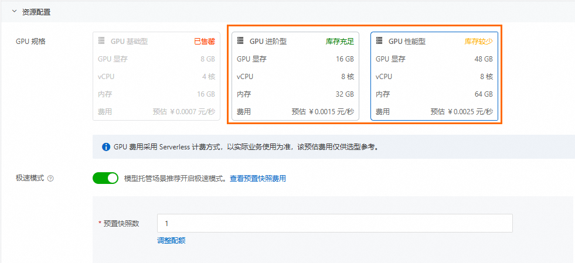

## 计费说明

本教程所涉及的模型服务其本质是在函数计算中创建的GPU函数，函数运行使用的资源按照函数规格乘以执行时长进行计量，如果无请求调用，则只收取**极速模式**下预置的快照费用。建议您领取函数计算的[试用额度](https://common-buy.aliyun.com/package?spm=a2c4g.11186623.0.0.117a7c77brgZf7&planCode=package_fcfreecu_cn)抵扣资源消耗，超出试用额度的部分将自动转为按量计费，更多计费详情，请参见[计费概述](https://help.aliyun.com/zh/functioncompute/fc/product-overview/billing-overview-of-fc)。

**

**重要**

本项目部署完成，会预置一个启动快照，即使您在不使用的情况下，也会存在快照费用，请您根据需求情况及时[删除项目](#b0597b5bd8zox)，以免产生预期外的费用。

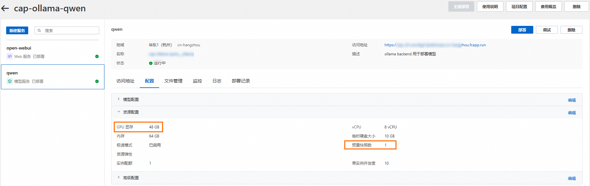

## 应用模板部署

### 1. 创建项目

登录[函数计算3.0控制台](https://fcnext.console.aliyun.com/)，在左侧导航栏单击**Function AI**，在**Funciton AI**页面导航栏，选择**项目**，然后单击**创建项目**，选择**基于模板创建**。

**

**说明**

当左上角显示函数计算FC 3.0时，表示当前控制台为3.0控制台。

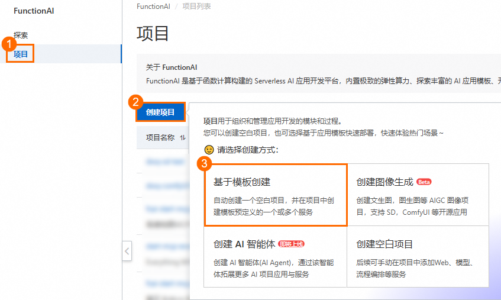

### 2. 基于模板部署项目

1. 在搜索栏输入`Qwen3`进行搜索，单击**基于 Qwen3 构建AI 聊天助手**，进入**模板详情**页，单击**立即部署**。
  
  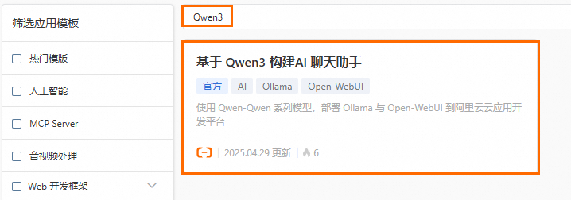
  
  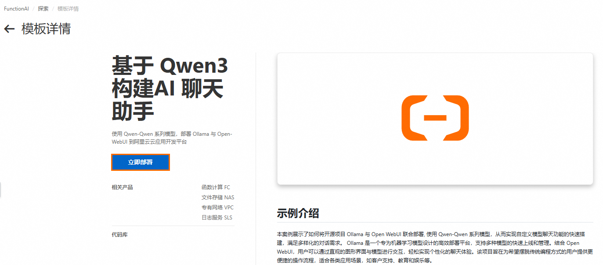
2. 选择**地域**，单击**部署项目**，在**项目资源预览**对话框中，您可以看到相关的计费项，详情请见[计费说明](https://help.aliyun.com/zh/functioncompute/what-is-a-serverless-development-platform#c6d676070dsid)。单击确认部署，部署过程大约持续 10 分钟左右，状态显示**已部署**表示部署成功。
  
  **
  
  **说明**
  
  如果您在测试调用的过程中遇到部署异常或模型拉取失败，可能是当前地域的GPU显卡资源不足，建议您更换地域进行重试。
  
  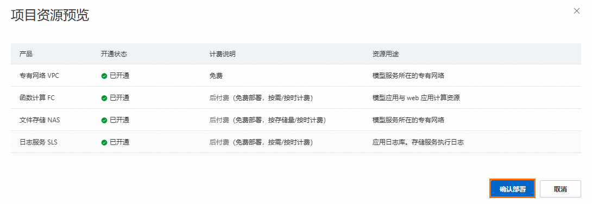
  
  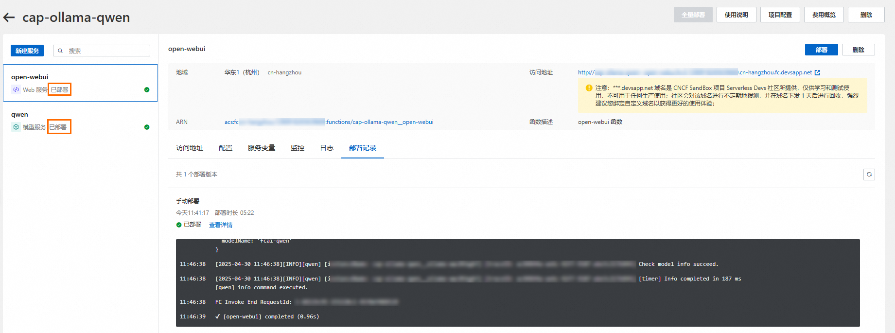

### 3. 验证应用

部署完毕后，点击**Open-WebUI**服务，单击自定义域名的**公网访问地址**进行访问。

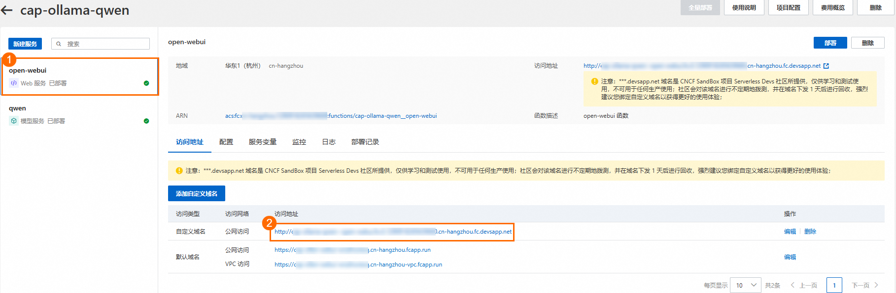

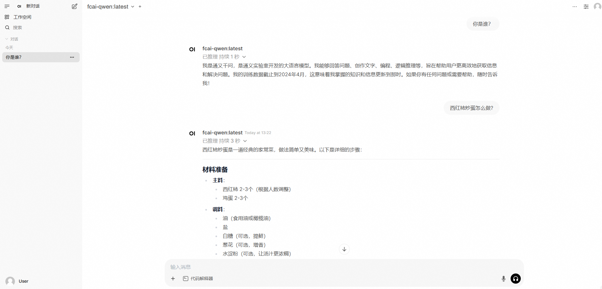

## 删除项目

1. **进入项目详情**>**点击删除**，会进入到删除确认对话框。
  
  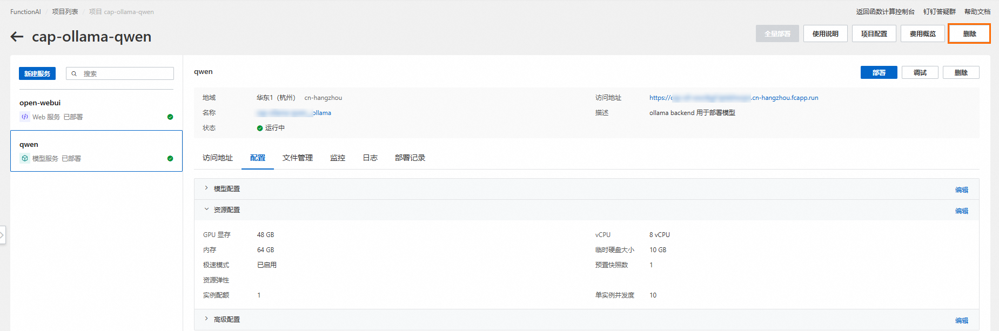
2. 您可以看到要删除的资源。默认情况下，`Function AI`会删除项目下的所有服务。如果您希望保留资源，可以**取消勾选**指定的服务，删除项目时只会删除**勾选**的服务。
  
  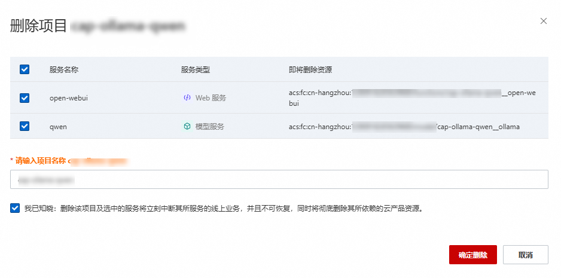
3. 勾选**我已知晓：删除该项目及选中的服务将立刻中断其所服务的线上业务，并且不可恢复，同时将彻底删除其所依赖的云产品资源**，然后单击**确定删除**。
