# 0代码，2种方式，一键部署DeepSeek系列模型

DeepSeek凭借其卓越的性能和广泛的应用场景，迅速在全球范围内获得了极高的关注度和广泛的用户基础。DeepSeek-R1-Distill是使用DeepSeek-R1生成的样本对开源模型进行蒸馏得到的小模型，拥有更小参数规模，推理成本更低，基准测试同样表现出色。Function AI提供**模型服务、应用模板**两种部署方式辅助您部署DeepSeek R1系列模型。完成模型部署后，您可以与模型进行对话体验，或以API形式进行调用，接入AI应用中。

## 支持的模型列表

部署方式说明：

Ollama：轻量级推理框架，专注于量化模型部署及各种开源LLM部署。

Transformer：由Hugging Face提供的模型推理框架，支持 PyTorch、TensorFlow 等主流深度学习框架的模型部署。

| **模型** | **部署方式** | **最低配置** |
| --- | --- | --- |
| DeepSeek-R1-Distill-Qwen-1.5B | Transformer | Tesla 16GB |
| DeepSeek-R1-Distill-Qwen-7B | Transformer | Tesla 16GB |
| DeepSeek-R1-Distill-Llama-8B | Transformer | Tesla 16GB |
| DeepSeek-R1-Distill-Qwen-14B | Transformer | Ada 48GB |
| DeepSeek-R1-Distill-Qwen-32B | Transformer | Ada 48GB |
| DeepSeek-R1-Distill-Qwen-1.5B-GGUF | Ollama | Tesla 8GB |
| DeepSeek-R1-Distill-Qwen-7B-GGUF | Ollama | Tesla 16GB |
| DeepSeek-R1-Distill-Llama-8B-GGUF | Ollama | Tesla 16GB |
| DeepSeek-R1-Distill-Qwen-14B-GGUF | Ollama | Ada 48GB |
| DeepSeek-R1-Distill-Qwen-32B-GGUF | Ollama | Ada 48GB |

## 前置准备

本教程所涉及的模型服务其本质是在函数计算中创建的GPU函数，函数运行使用的资源按照函数规格乘以执行时长进行计量，如果无请求调用，则只收取浅休眠（原闲置）预留模式下预置的快照费用，`Function AI`中的**极速模式**等同于函数计算的**浅休眠（原闲置）预留模式**。建议您领取函数计算的[试用额度](https://common-buy.aliyun.com/package?spm=a2c4g.11186623.0.0.117a7c77brgZf7&planCode=package_fcfreecu_cn)抵扣资源消耗，超出试用额度的部分将自动转为按量计费，更多计费详情，请参见[计费概述](https://help.aliyun.com/zh/functioncompute/fc/product-overview/billing-overview-of-fc)。

## **部署说明**

本文通过应用模板和模型服务两种方式部署DeepSeeK服务，这两种方式支持的模型列表的是相同的，您可以通过以下任一方式部署DeepSeek蒸馏模型至函数计算。

[方式一：应用模板部署](#7141bdf5d3g68)：基于`Function AI`的模板进行一键部署，部署方式简单快捷。但是由于基于模板进行部署，初次部署使用模板默认提供的DeepSeek-R1-Distill-Qwen-7B模型，导致无法自选模型。部署完成后，可在基础配置中更改模型。

[方式二：模型服务部署](#YbFr3)：在部署的时候可以灵活选择模型，但是操作步骤相对较多，使用API形式进行模型调用，接入线上业务应用。

## 方式一：应用模板部署

### 1. 创建项目

登录[函数计算控制台](https://fcnext.console.aliyun.com/)，在左侧导航栏单击**Function AI**，在**FuncitonAI**页面导航栏，选择**项目**，然后单击**创建项目**，选择**基于模板创建**。

### 2. 部署模板

1. 在搜索栏输入`DeepSeek`进行搜索，单击**基于 DeepSeek-R1 构建AI 聊天助手**，进入**模板详情**页，单击**立即部署**。
  
  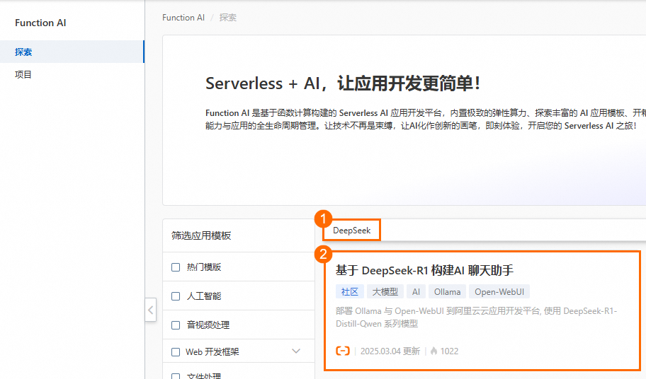
  
  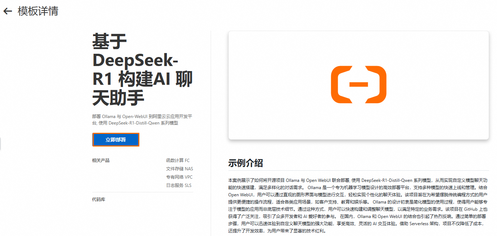
2. 选择**地域**，单击**部署项目**，在**项目资源预览**对话框中，您可以看到相关的计费项，详情请见[计费涉及的产品](https://help.aliyun.com/zh/cap/product-overview/billing-overview#title-z1y-ai5-gmw)。单击确认部署，部署过程大约持续 10 分钟左右，状态显示**已部署**表示部署成功。
  
  **
  
  **说明**
  
  - 选择地域时，一般是就近选择地域信息，如果已经开启了NAS文件系统，选择手动配置模型存储时，请选择和文件系统相同的地域。
  - 如果您在测试调用的过程中遇到部署异常或模型拉取失败，可能是当前地域的GPU显卡资源不足，建议您更换地域进行重试。
  
  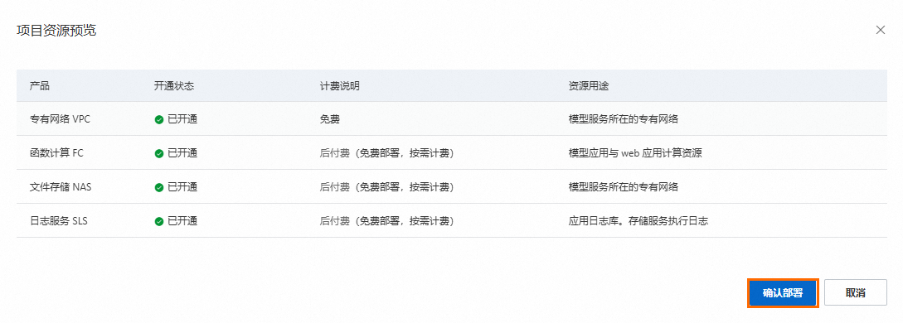
  
  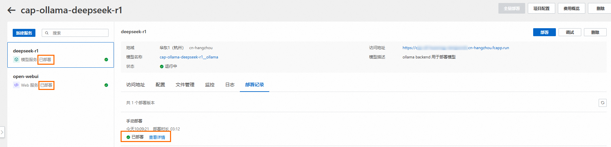

### 3. 验证应用

部署完毕后，点击**Open-WebUI**服务，在访问地址内找到**公网访问**单击访问。

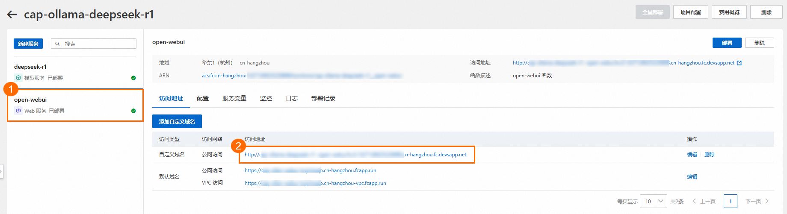

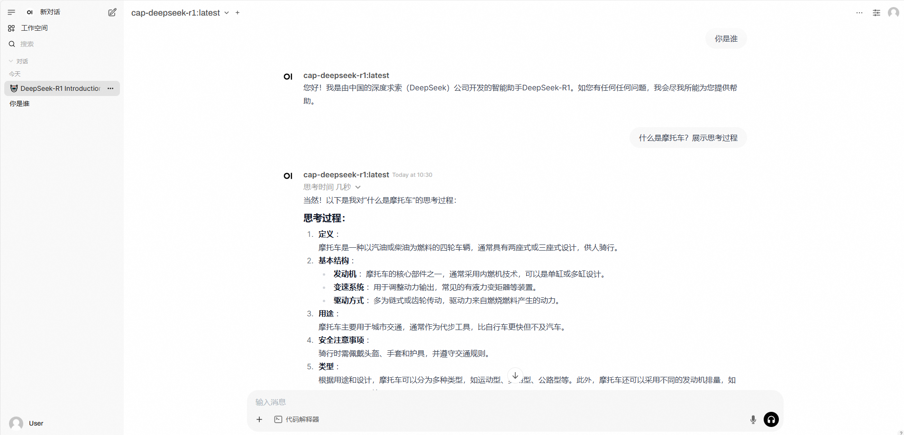

## 方式二：模型服务部署

本文将以`DeepSeek-R1-Distill-Qwen-7B-GGUF`模型为例演示部署流程。使用API形式进行模型调用，接入线上业务应用。

### 1. 创建空白项目

1. 登录[函数计算控制台](https://fcnext.console.aliyun.com/)，在左侧导航栏单击**Function AI**，在**FuncitonAI**页面导航栏，选择**项目**，然后单击**创建项目**。
2. 选择**创建空白项目**，在弹出的对话框，填写**项目名称**和**项目描述**，然后单击**创建**。
3. 在项目详情页面，单击左上角的**新建服务**，选择**模型服务**，进入服务配置页面。

### 2. 部署模型服务

1. 选择模型DeepSeek-R1-Distill-Qwen-7B-GGUF。
  
  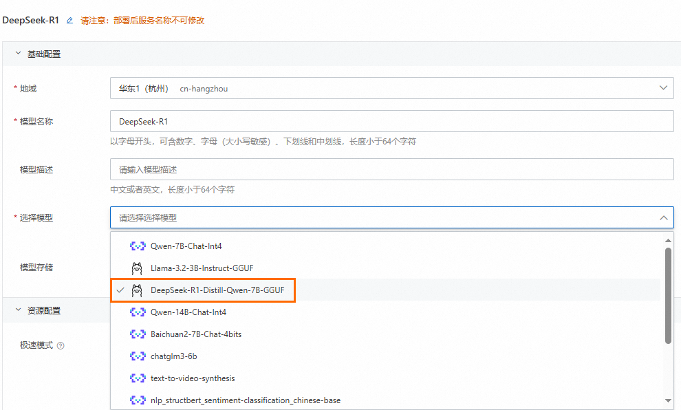
2. 单击**资源配置**，DeepSeek-R1-Distill-Qwen-7B-GGUF推荐使用Tesla系列，可直接使用默认配置。您可以根据业务诉求填写需要的卡型及规格信息。
  
  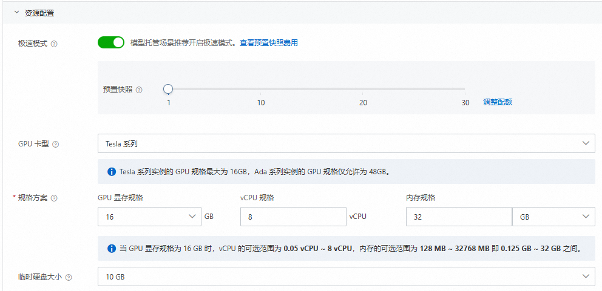
3. 单击**预览并部署**，在**服务资源预览**对话框中，您可以看到相关的计费项，详情请见[计费涉及的产品](https://help.aliyun.com/zh/cap/product-overview/billing-overview#title-z1y-ai5-gmw)。单击**确认部署**，该阶段需下载模型，预计等待10分钟左右即可完成。
  
  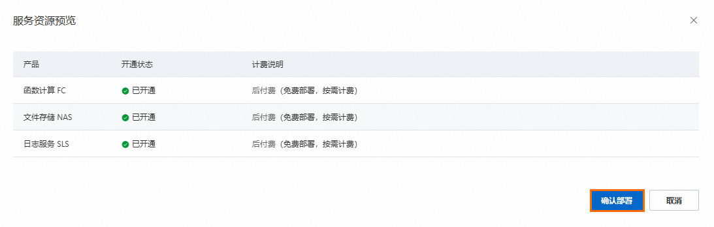
  
  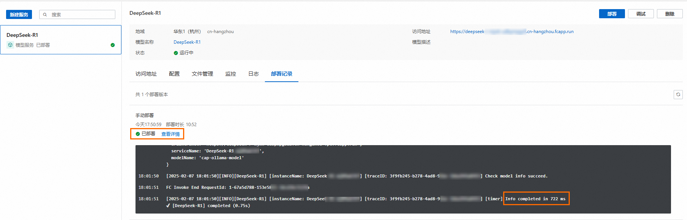

### 3. 尝试更多模型部署

1. 如果您希望部署更多模型，但是支持列表中没有，您可以选择**更多模型来源**。
  
  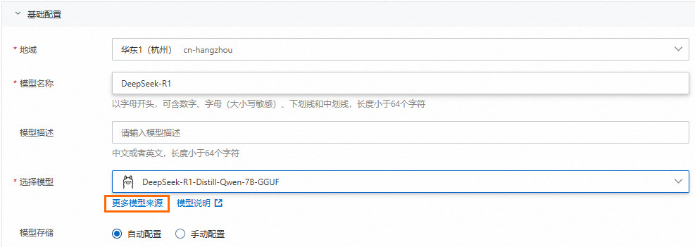
2. 您可以选择更多模型，支持的模型列表请参见[支持的模型列表](#DK2XU)，假设您选择**DeepSeek-R1-Distill-Qwen-7B-GGUF**模型，其参考信息如下。
  
  | **配置名称** | **值** |
  | --- | --- |
  | ModelScope ID | lmstudio-community/DeepSeek-R1-Distill-Qwen-7B-GGUF |
  | 执行框架 | Ollama |
  | 模型加载方式 | 单文件加载 |
  | GGUF 文件 | DeepSeek-R1-Distill-Qwen-7B-Q4_K_M.gguf |
  
  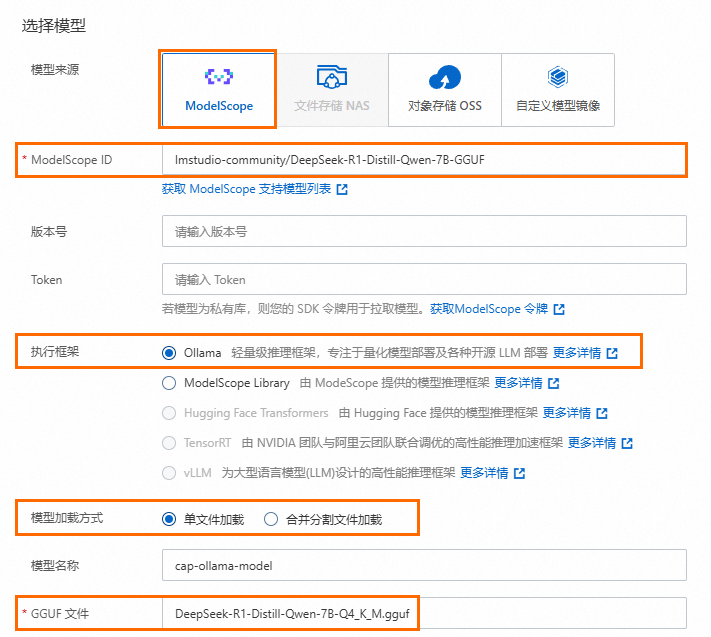
3. 您可以登录[ModelScope官网](https://modelscope.cn/models)获取相关模型 ID、GGUF文件。以[DeepSeek 14B](https://www.modelscope.cn/models/lmstudio-community/DeepSeek-R1-Distill-Qwen-14B-GGUF)为例，如希望部署14B模型可将配置改为以下参数。
  
  | **配置名称** | **值** |
  | --- | --- |
  | ModelScope ID | lmstudio-community/DeepSeek-R1-Distill-Qwen-14B-GGUF |
  | GGUF 文件 | DeepSeek-R1-Distill-Qwen-14B-Q4_K_M.gguf |
  
  在下图中，其中①表示为ModelScope ID的值，②表示为GGUF 文件，列表为不同的量化精度型文件，根据需求任选其一即可。
  
  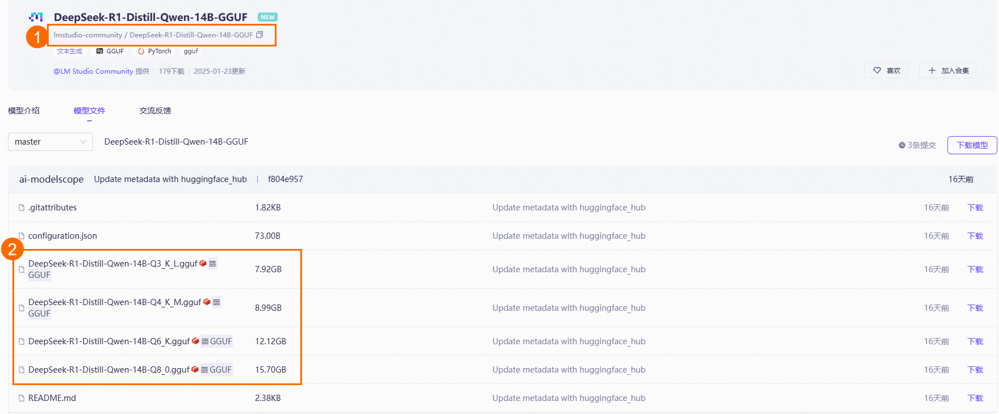
  
  更多ollama参数配置如params，template 等，可参考[DeepSeek ollama library](https://ollama.com/library/deepseek-r1:14b)。14B及以上模型需在资源配置中使用Ada系列显卡，并且使用全卡预留48G显存。

### 4. 验证模型服务

单击**调试**，即可测试和验证相关模型调用。

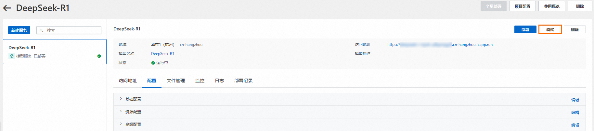

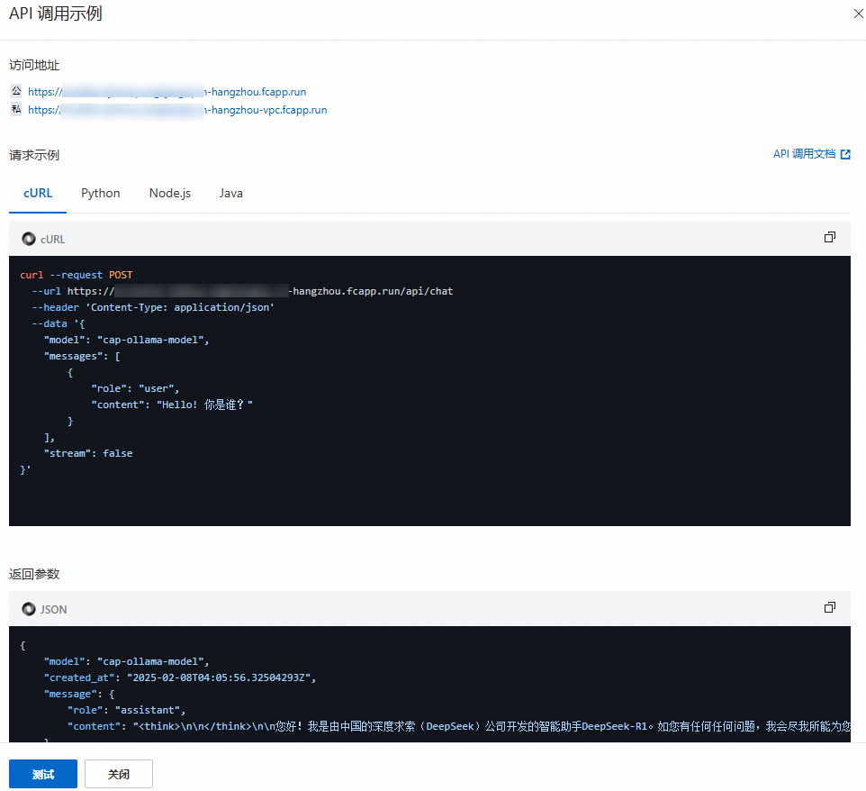

在本地命令行窗口中验证模型调用。

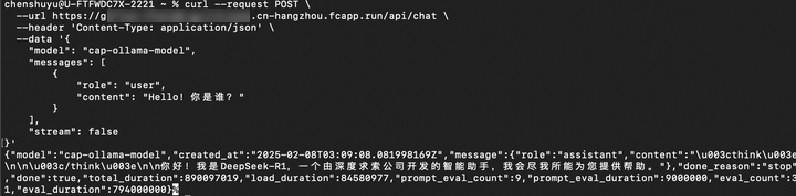

### 5. 第三方平台 API 调用

您可以选择在[Chatbox](https://web.chatboxai.app/)等其他第三方平台中验证和应用模型调用，以下以Chatbox为例。

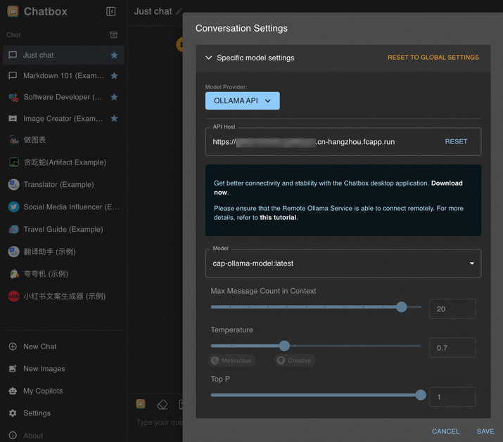

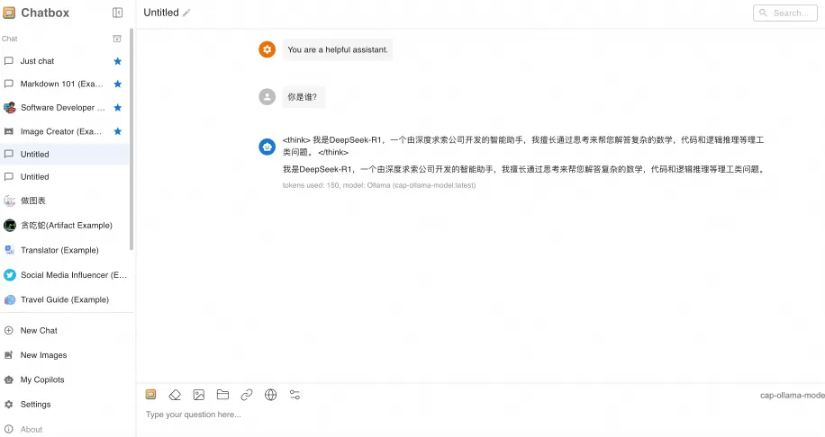

## 删除项目

您可以使用以下步骤删除应用，以降低产生的费用。

1. **进入项目详情**>**点击删除**，会进入到删除确认对话框。
  
  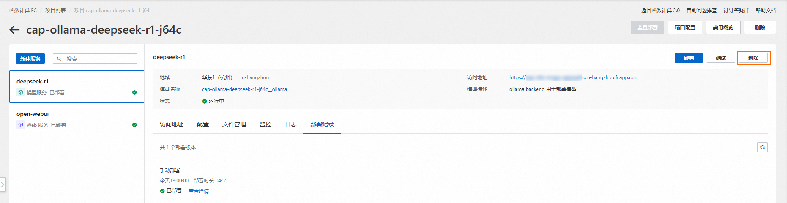
2. 您可以看到要删除的资源。默认情况下，`Function AI`会删除项目下的所有服务。如果您希望保留资源，可以**取消勾选**指定的服务，删除项目时只会删除**勾选**的服务。
  
  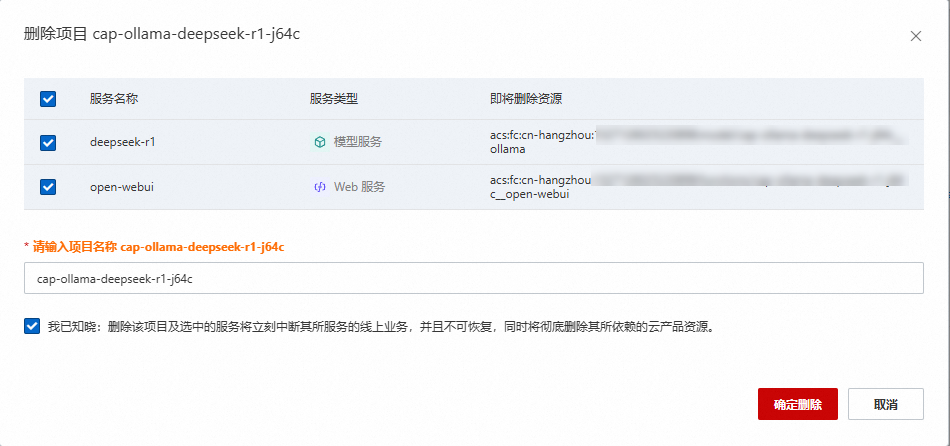
3. 勾选**我已知晓：删除该项目及选中的服务将立刻中断其所服务的线上业务，并且不可恢复，同时将彻底删除其所依赖的云产品资源**，然后单击**确定删除**。
